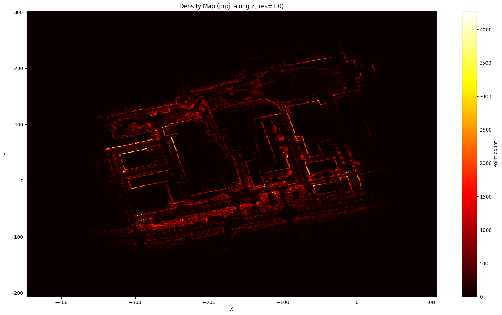
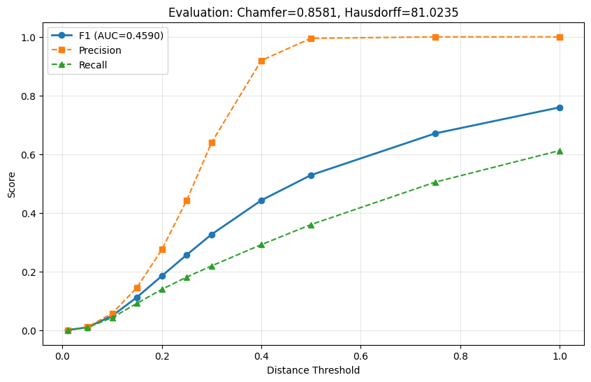
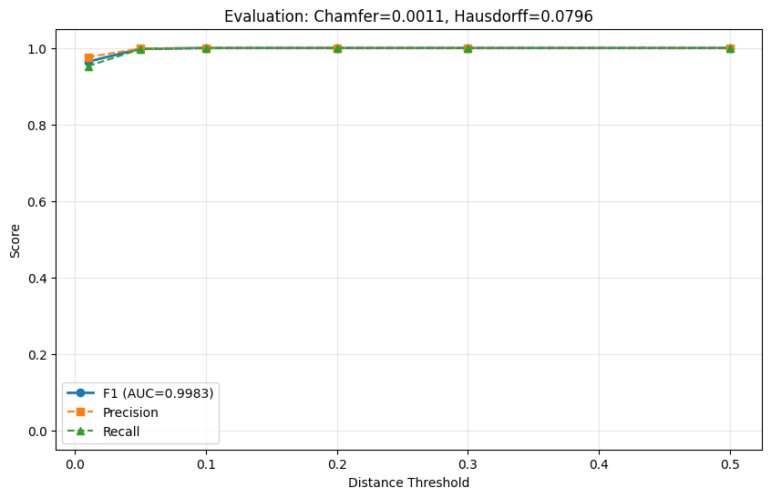
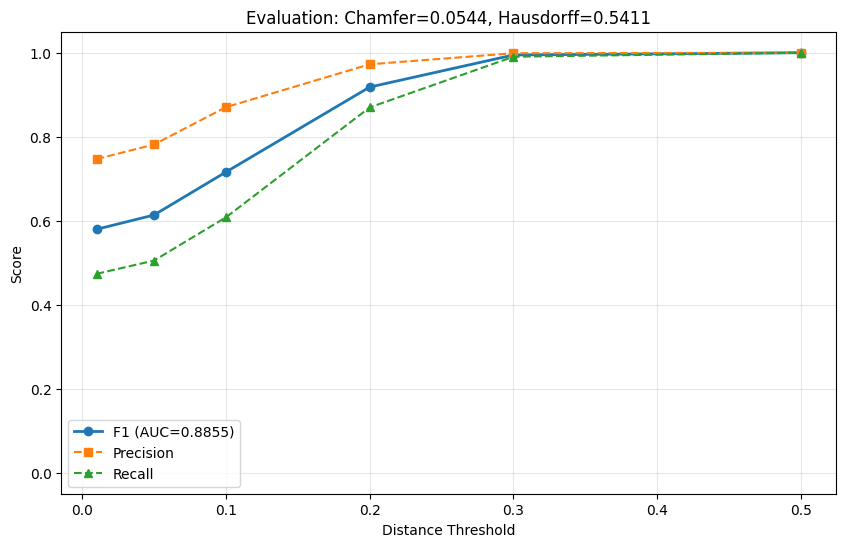

# CloudAnalyzer

[](https://github.com/rsasaki0109/CloudAnalyzer/actions/workflows/test.yml)
[](https://www.python.org/downloads/)
[](LICENSE)

**Localization / Mapping / Perception の後処理で、点群や軌跡を壊していないか数値で出す。**

CloudAnalyzer は、点群処理ライブラリやビューアそのものを置き換えるツールではない。
狙っているのは、**map の後処理、trajectory の評価、perception 系 3D 出力の回帰検知**を、
CLI と browser viewer で一気通貫に回せる **3Dデータ QA / Benchmark / Operations レイヤ** になること。

```bash
$ ca downsample map.pcd -o down.pcd -v 0.2 --evaluate

Original:     1784475 pts
Downsampled:  1597449 pts
Reduction:    10.5%
Saved:        down.pcd
  Chamfer=0.0083  AUC=0.9852
  Best F1=1.0000 @ d=0.20
```

`--evaluate` 1つ付けるだけで、加工前後の品質変化が即座にわかる。

## まず何に使うか

- **Mapping の後処理 QA**
  ボクセルダウンサンプリング、外れ値除去、分割、圧縮復元後の map を baseline と比較し、`AUC / Chamfer / Hausdorff / heatmap` で壊れ方を見る。
- **Localization / SLAM の run evaluation**
  推定 trajectory と GT trajectory を `ATE / RPE / drift / coverage` で評価し、`ca web` 上で map heatmap と trajectory timeline をまとめて inspect する。
- **Perception / 3D生成パイプラインの regression check**
  再構成点群、深度由来点群、学習モデル出力、Gaussian Splatting 系の幾何結果を、artifact 単位・run 単位で benchmark する。

要するに CloudAnalyzer は、**3Dデータを作るツール**というより、
**3Dデータを作ったあとに品質を確かめるツール**です。

| Density Map | F1 Evaluation Curve |
|---|---|
|  |  |

## 他ツールとの違い

|  | CloudCompare | PCL | Open3D (Python) | **CloudAnalyzer** |
|---|---|---|---|---|
| 品質評価 (F1/AUC) | - | - | スクリプト必要 | **`--evaluate` で即時** |
| Trajectory QA (ATE/RPE/drift) | 限定的 | - | スクリプト必要 | **CLI + report で一括** |
| CLI | 限定的 | なし | なし | **24コマンド** |
| CI/自動化 | 不可 | C++で実装 | スクリプト必要 | **JSON出力 + 品質ゲート** |
| 加工 + 評価 | 別操作 | 別プログラム | 別スクリプト | **1コマンド** |
| ブラウザ inspection | 不可 | 不可 | 不可 | **`ca web` / `ca web-export`** |

## 目指す位置づけ

CloudAnalyzer が狙うのは、低レベルAPIの数で勝つことではなく、
**Localization / Mapping / Perception の実務で「出力をどう検証するか」を一段上のレイヤで標準化すること**。

| ツール群 | 主な役割 | CloudAnalyzer が足す価値 |
|---|---|---|
| PCL / Open3D | 点群処理アルゴリズム、I/O、レジストレーション | **map 後処理の QA、比較、回帰検知** |
| CloudCompare / Potree | GUI可視化、目視確認、共有 | **CLI自動化、定量評価、browser inspection** |
| SLAM / LIO 系 | 軌跡推定、地図生成 | **trajectory QA、run 単位評価、drift 比較** |
| Perception / PyTorch 系 | 学習・推論・研究実験 | **3D出力の geometry benchmark、artifact 比較** |
| Gaussian Splatting / 3D再構成系 | 3D表現、再構成、新規ビュー合成 | **表現横断の誤差比較、品質可視化** |

つまり CloudAnalyzer は、`PCL/Open3D` の代替ライブラリというより、
`mapping stack / localization stack / perception stack` の上で動く **出力検証基盤** を目指している。

## Install

```bash
cd cloudanalyzer && pip install -e .
```

## Public Demo

CloudAnalyzer can now export the `ca web` viewer as a static bundle for GitHub Pages.

```bash
# export a static viewer
ca web-export map.pcd map_ref.pcd --heatmap -o docs/demo/local

# rebuild the public Stanford Bunny demo bundle used by Pages
python scripts/build_public_demo.py --output docs/demo/stanford-bunny
```

The repository also includes `docs/index.html` plus a Pages workflow that rebuilds a public demo from the Stanford Bunny source data on each deploy. The demo source mesh is public Stanford data, while the reference cloud and trajectories are generated only to exercise CloudAnalyzer's browser inspection UI.

## Core: 加工したら即評価

CloudAnalyzerの核心。**すべての加工コマンドに `--evaluate` を付けられる。**

```bash
# ダウンサンプリング → 品質を即確認
ca downsample map.pcd -o down.pcd -v 0.2 --evaluate --plot quality.png

# フィルタ → 品質を即確認
ca filter noisy.pcd -o clean.pcd --evaluate

# サンプリング → 品質を即確認
ca sample map.pcd -o sampled.pcd -n 100000 --evaluate

# パイプライン: フィルタ → 間引き → 評価 を1コマンドで
ca pipeline noisy.pcd reference.pcd -o production.pcd -v 0.2
```

## 評価指標

| 指標 | 意味 |
|---|---|
| **Precision** | 加工後の点が元データのどれだけ近くにあるか |
| **Recall** | 元データの点が加工後にどれだけカバーされているか |
| **F1 Score** | Precision と Recall の調和平均 |
| **Chamfer Distance** | 双方向の平均最近傍距離 |
| **Hausdorff Distance** | 最悪ケースの距離 |
| **AUC** | 複数閾値でのF1カーブの面積（総合スコア） |

### 品質判定の目安

| AUC (F1) | 判定 | 用途 |
|---|---|---|
| > 0.99 | 優秀 | 高精度ローカリゼーション用 |
| 0.95 - 0.99 | 良好 | ナビゲーション用 |
| 0.90 - 0.95 | 許容 | 粗い経路計画用 |
| < 0.90 | 要確認 | 品質劣化の可能性 |

### ボクセルサイズ別の品質比較

| Voxel | Points | Chamfer | AUC | 判定 |
|---|---|---|---|---|
| 0.1m | 97% | 0.0011 | 0.998 | 優秀 |
| 0.2m | 90% | 0.0083 | 0.985 | 良好 |
| 0.5m | 63% | 0.0544 | 0.886 | 要確認 |

| Voxel 0.1m (AUC=0.998) | Voxel 0.5m (AUC=0.886) |
|---|---|
|  |  |

## CI/自動化

`cloudanalyzer.yaml` を置くと、mapping / localization / perception の QA を 1 コマンドにまとめられる。

```yaml
version: 1
defaults:
  report_dir: qa/reports
  json_dir: qa/results
checks:
  - id: mapping-postprocess
    kind: artifact
    source: outputs/map.pcd
    reference: baselines/map_ref.pcd
    gate:
      min_auc: 0.95
      max_chamfer: 0.02
  - id: localization-run
    kind: trajectory
    estimated: outputs/traj.csv
    reference: baselines/traj_ref.csv
    alignment: rigid
    gate:
      max_ate: 0.5
      max_rpe: 0.2
      max_drift: 1.0
      min_coverage: 0.9
```

```bash
ca check cloudanalyzer.yaml
```

完全な例は [docs/examples/cloudanalyzer.yaml](docs/examples/cloudanalyzer.yaml)。

```bash
# AUC を取得してスクリプトで判定
AUC=$(ca evaluate new.pcd ref.pcd --format-json | jq -r '.auc')
[ $(echo "$AUC < 0.9" | bc -l) -eq 1 ] && echo "FAIL" && exit 1

# ディレクトリ内の全ファイルを一括評価
ca batch results/ --evaluate reference.pcd --format-json | jq '.[] | {path, auc, chamfer_distance}'

# 共有用の Markdown / HTML レポートを出力
ca batch results/ --evaluate reference.pcd --report batch_report.md
ca batch results/ --evaluate reference.pcd --report batch_report.html
# レポートには inspection command を含み、HTML 版は Copy ボタンと count badge 付き summary rows / quick actions / failed-first / recommended-first を含む sort / pass / failed / pareto / recommended controls 付き

# Cloudini などの圧縮 artifact と一緒に品質 vs サイズを評価
ca batch decoded/ --evaluate reference.pcd \
  --compressed-dir compressed/ --baseline-dir original/ \
  --report cloudini_report.html
# report は Quality vs Size scatter plot / Pareto candidates / Recommended point / clickable summary rows / quick actions / failed-first / recommended-first sort preset / HTML filters を出力する

# trajectory quality gate
ca traj-evaluate estimated.csv reference.csv \
  --max-time-delta 0.05 --max-ate 0.5 --max-rpe 0.2 --max-drift 1.0 --min-coverage 0.9 \
  --report trajectory_report.html
# CSV(timestamp,x,y,z) と TUM(timestamp x y z qx qy qz qw) をサポート
# report は trajectory overlay / error timeline PNG を sibling 出力する

# 初期位置オフセットを吸収して軌跡形状だけ評価
ca traj-evaluate estimated.csv reference.csv --align-origin

# 回転 + 平行移動を剛体合わせして評価
ca traj-evaluate estimated.csv reference.csv --align-rigid

# trajectory batch benchmark
ca traj-batch runs/ --reference-dir gt/ \
  --max-time-delta 0.05 --max-ate 0.5 --max-rpe 0.2 --max-drift 1.0 --min-coverage 0.9 \
  --report traj_batch.html
# HTML report は pass / failed / low coverage filter と ATE/RPE/coverage sort を持つ
# low coverage の基準は --min-coverage を指定するとその値に追従する

# map + trajectory を 1 run 単位で統合評価
ca run-evaluate map.pcd map_ref.pcd traj.csv traj_ref.csv \
  --min-auc 0.95 --max-chamfer 0.02 \
  --max-ate 0.5 --max-rpe 0.2 --max-drift 1.0 --min-coverage 0.9 \
  --report run_report.html
# map F1 curve と trajectory overlay/error timeline をまとめて出す
# inspection command には `ca web ... --trajectory ... --trajectory-reference ...` の run viewer も含む

# map + trajectory の複数 run を一括 benchmark
ca run-batch maps/ \
  --map-reference-dir map_refs/ \
  --trajectory-dir trajs/ \
  --trajectory-reference-dir traj_refs/ \
  --min-auc 0.95 --max-chamfer 0.02 \
  --max-ate 0.5 --max-rpe 0.2 --max-drift 1.0 --min-coverage 0.9 \
  --report run_batch.html
# relative path / stem で map と trajectory を対応付ける
# HTML report は pass / failed / map issue / trajectory issue filter と
# map AUC / Chamfer / trajectory ATE / drift / coverage sort を持つ
# report と JSON の inspection command には per-run の `ca web ...` run viewer と `ca run-evaluate ...` drill-down の両方を含む
# quality gate summary は overall fail だけでなく map fail / trajectory fail 件数も分けて出す

# Quality gate: 1件でも fail すると exit code 1
ca batch results/ --evaluate reference.pcd --min-auc 0.95 --max-chamfer 0.02

# config-driven quality gate
ca check cloudanalyzer.yaml

# GitHub Actions で品質ゲート
gh workflow run quality-gate.yml \
  -f source=new.pcd -f reference=ref.pcd -f auc_threshold=0.9
```

## 全コマンド一覧

### 評価

```bash
ca evaluate src.pcd ref.pcd --plot f1.png   # F1/Chamfer/Hausdorff/AUC
ca compare src.pcd tgt.pcd --register gicp  # レジストレーション付き比較
ca diff a.pcd b.pcd --threshold 0.1         # クイック距離統計
ca pipeline in.pcd ref.pcd -o out.pcd       # filter→downsample→evaluate
ca check cloudanalyzer.yaml                 # config-driven unified QA
ca traj-evaluate est.csv gt.csv --max-ate 0.5 --max-drift 1.0 --min-coverage 0.9  # ATE/RPE/drift + coverage gate
ca traj-evaluate est.csv gt.csv --align-origin  # 初期平行移動を吸収
ca traj-evaluate est.csv gt.csv --align-rigid  # 剛体合わせ
ca traj-batch runs/ --reference-dir gt/ --max-drift 1.0 --min-coverage 0.9  # trajectory benchmark
ca run-evaluate map.pcd map_ref.pcd traj.csv traj_ref.csv --report run.html  # map + trajectory integrated QA
ca run-batch maps/ --map-reference-dir map_refs/ --trajectory-dir trajs/ --trajectory-reference-dir traj_refs/ --report run_batch.html  # combined batch QA
```

### 加工 (すべて `--evaluate` 対応)

```bash
ca downsample cloud.pcd -o d.pcd -v 0.2 -e  # ボクセルダウンサンプリング
ca filter cloud.pcd -o f.pcd -e              # 外れ値除去
ca sample cloud.pcd -o s.pcd -n 10000 -e     # ランダムサンプリング
ca merge a.pcd b.pcd -o m.pcd                # 結合
ca align s1.pcd s2.pcd -o a.pcd              # レジストレーション+結合
ca split map.pcd -o tiles/ -g 100            # グリッド分割
ca crop cloud.pcd -o c.pcd --x-min 0 ...     # BBox切り出し
ca convert in.pcd out.ply                     # フォーマット変換
ca normals cloud.pcd -o n.ply                 # 法線推定
```

### 分析

```bash
ca info cloud.pcd                   # 基本情報
ca stats cloud.pcd                  # 密度・点間距離統計
ca batch /path/to/dir/ -r           # ディレクトリ一括
ca batch results/ --evaluate ref.pcd  # 全ファイルをリファレンスと比較
ca batch results/ --evaluate ref.pcd --report batch.html  # 共有用レポート
ca batch results/ --evaluate ref.pcd --min-auc 0.95 --max-chamfer 0.02  # quality gate
ca traj-evaluate est.csv gt.csv --report traj.html  # trajectory quality report
ca traj-batch runs/ --reference-dir gt/ --report traj_batch.html  # trajectory batch report
ca run-evaluate map.pcd map_ref.pcd traj.csv traj_ref.csv --report run.html  # combined run report
ca run-batch maps/ --map-reference-dir map_refs/ --trajectory-dir trajs/ --trajectory-reference-dir traj_refs/ --report run_batch.html  # combined batch report
```

### 可視化

```bash
ca web cloud.pcd                    # ブラウザ3D表示
ca web src.pcd ref.pcd --heatmap    # 距離ヒートマップ + overlay + しきい値フィルタ
ca web map.pcd map_ref.pcd --heatmap --trajectory traj.csv --trajectory-reference traj_ref.csv  # map + trajectory run viewer
# paired trajectory があると worst ATE pose と worst RPE segment もブラウザで追える
# marker / segment をクリックすると timestamp と error summary をその場で見られる
# click 時は camera もその箇所へ寄り、Reset View で全景に戻せる
# trajectory error timeline も同じ viewer 内に出て、point click で 3D selection と同期する
ca view cloud.pcd                   # デスクトップ3D表示
ca density-map cloud.pcd -o d.png   # 密度ヒートマップ
ca heatmap3d src.pcd ref.pcd -o h.png  # 3D距離ヒートマップ
```

## Python API

```python
from ca.evaluate import evaluate, plot_f1_curve
from ca.pipeline import run_pipeline
from ca.plot import plot_multi_f1

# 評価
result = evaluate("down.pcd", "original.pcd")
print(f"AUC: {result['auc']:.4f}")  # -> 0.9852

# 複数条件の比較プロット
results = [evaluate(f"v{v}.pcd", "ref.pcd") for v in [0.1, 0.2, 0.5]]
plot_multi_f1(results, ["0.1m", "0.2m", "0.5m"], "comparison.png")
```

## Docs

- [Vision](VISION.md)
- [Experiments](docs/experiments.md)
- [Decisions](docs/decisions.md)
- [Interfaces](docs/interfaces.md)
- [Cloudini Benchmark Tutorial](docs/tutorial-cloudini-benchmark.md)
- [Map Quality Gate Tutorial](docs/tutorial-map-quality-gate.md)
- [Unified Run Quality Gate Tutorial](docs/tutorial-run-quality-gate.md)
- [Command Reference](docs/commands/)
- [Architecture](docs/architecture.md)
- [CI / Quality Gate](docs/ci.md)

## Experimental Development

CloudAnalyzer は、先に完全な抽象を固定するのではなく、比較可能な具体実装を複数並べてから最小 interface だけを core に残す。

```bash
cd cloudanalyzer
python3 -m ca.experiments.process_docs --write-docs
```

現在は `ca web` の 3 slice をこの流れで管理している。

- display 用点群縮約: stable 側は `ca.core.web_sampling`、discardable な実装群は `ca.experiments.web_sampling`
- trajectory overlay 縮約: stable 側は `ca.core.web_trajectory_sampling`、discardable な実装群は `ca.experiments.web_trajectory_sampling`
- progressive loading: stable 側は `ca.core.web_progressive_loading`、discardable な実装群は `ca.experiments.web_progressive_loading`

`docs/experiments.md` / `docs/decisions.md` / `docs/interfaces.md` は `ca.experiments.process_docs` からまとめて再生成する。

## License

MIT
