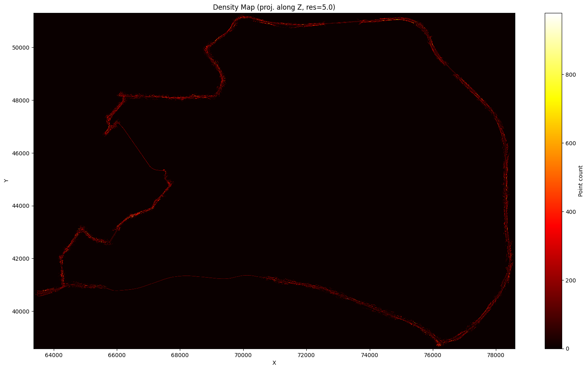

# CloudAnalyzer

AI-friendly CLI tool for point cloud analysis and evaluation.

## Features

- **22 commands** for analysis, processing, evaluation, and visualization
- **F1 / Chamfer / Hausdorff / AUC** evaluation metrics with plot output
- **ICP / GICP** registration
- **Pipeline**: filter → downsample → evaluate in one command
- Supports `.pcd`, `.ply`, `.las` formats
- JSON output for automation, `--format-json` for piping
- CI quality gate workflow
- 153 tests, mypy, GitHub Actions CI

## Gallery

### Density Map

`ca density-map` — Point density heatmap projected onto a 2D plane

| UTsukuba 2022 (14.6M pts) | Istanbul Route3 (18.7M pts) |
|---|---|
|  |  |

### F1 Evaluation Curve

`ca evaluate --plot` — Precision / Recall / F1 over distance thresholds

| Voxel 0.1m (AUC=0.998) | Voxel 0.5m (AUC=0.886) |
|---|---|
|  |  |

### Feature Comparison

`ca evaluate` — Corner vs Surface feature comparison (Istanbul tunnel)


## Install

```bash
cd cloudanalyzer
pip install -e .
```

## Quick Start

```bash
# Point cloud info
ca info cloud.pcd

# Evaluate quality (F1, Chamfer, Hausdorff)
ca evaluate estimated.pcd reference.pcd --plot f1_curve.png

# Full pipeline: filter → downsample → evaluate
ca pipeline noisy.pcd reference.pcd -o clean.pcd -v 0.2

# Compare with registration
ca compare source.pcd target.pcd --register gicp --snapshot diff.png

# Quick diff
ca diff a.pcd b.pcd --threshold 0.05
```

## Commands

### Analysis & Evaluation

| Command | Description |
|---|---|
| `ca compare` | Compare two point clouds with ICP/GICP registration |
| `ca diff` | Quick distance stats (no registration) |
| `ca evaluate` | F1, Chamfer, Hausdorff, AUC evaluation |
| `ca info` | Point cloud metadata (points, BBox, centroid) |
| `ca stats` | Detailed statistics (density, spacing distribution) |
| `ca batch` | Run info on all files in a directory |

### Processing

| Command | Description |
|---|---|
| `ca downsample` | Voxel grid downsampling |
| `ca sample` | Random point sampling |
| `ca filter` | Statistical outlier removal |
| `ca merge` | Merge multiple point clouds |
| `ca align` | Sequential registration + merge |
| `ca split` | Split into grid tiles |
| `ca convert` | Format conversion (pcd/ply/las) |
| `ca normals` | Normal estimation |
| `ca crop` | Bounding box crop |
| `ca pipeline` | filter → downsample → evaluate in one step |

### Visualization

| Command | Description |
|---|---|
| `ca view` | Interactive 3D viewer |
| `ca density-map` | 2D density heatmap image |
| `ca heatmap3d` | 3D distance heatmap snapshot |

## Evaluation Example

```bash
# Downsample and evaluate quality loss
ca downsample map.pcd -o map_v02.pcd -v 0.2
ca evaluate map_v02.pcd map.pcd --plot f1.png
```

Output:
```
Source: 1597449 pts | Target: 1784475 pts

Chamfer Distance:  0.0083
Hausdorff Distance: 0.1809
AUC (F1):          0.9852

F1 Scores:
  d=0.05  P=0.9471  R=0.8833  F1=0.9141
  d=0.10  P=0.9971  R=0.9899  F1=0.9935
  d=0.20  P=1.0000  R=1.0000  F1=1.0000
```

## Global Options

```bash
ca --verbose ...    # Debug output (stderr)
ca --quiet ...      # Suppress non-error output
```

## Output Options

- `--output-json <path>` — Dump result as JSON file
- `--format-json` — Print JSON to stdout for piping
- `--plot <path>` — F1 curve plot (evaluate only)

```bash
ca info cloud.pcd --format-json | jq '.num_points'
ca evaluate a.pcd b.pcd --format-json | jq '.auc'
```

## Python API

```python
from ca.evaluate import evaluate, plot_f1_curve
from ca.pipeline import run_pipeline
from ca.info import get_info

result = evaluate("estimated.pcd", "reference.pcd")
print(f"AUC: {result['auc']:.4f}")
plot_f1_curve(result, "f1_curve.png")
```

## Docker

```bash
docker build -t ca .
docker run ca info cloud.pcd
```

## License

MIT
