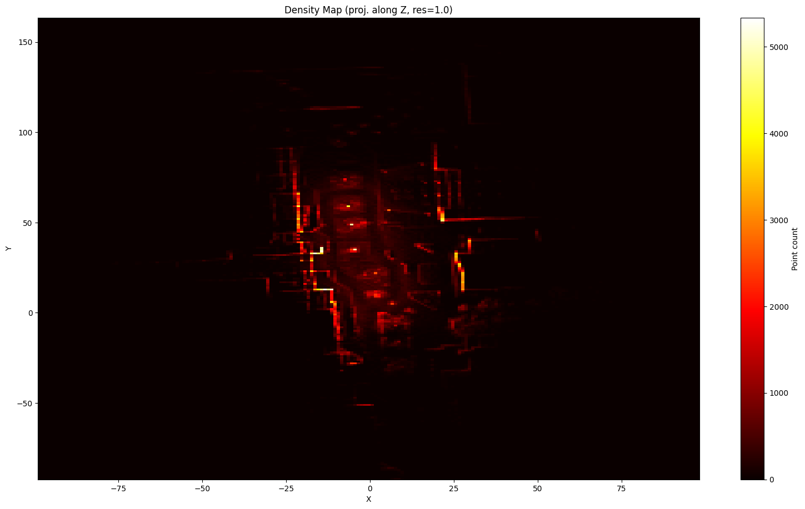
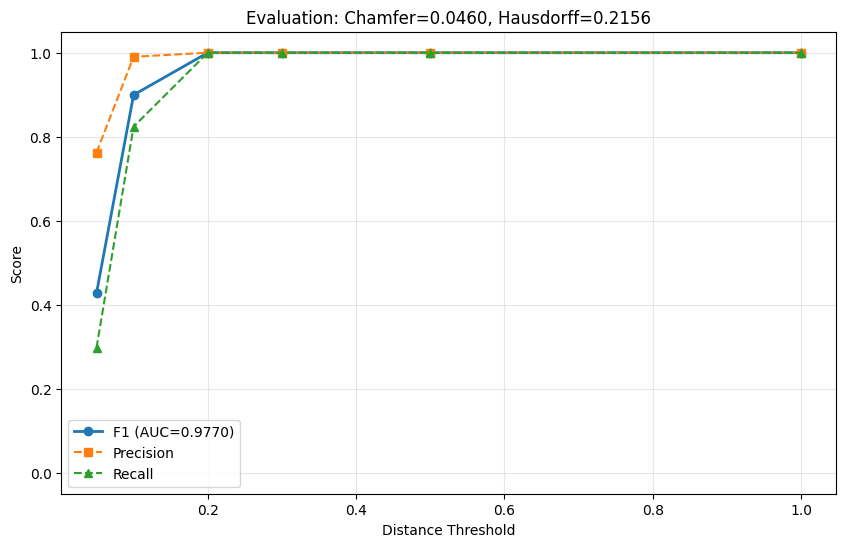
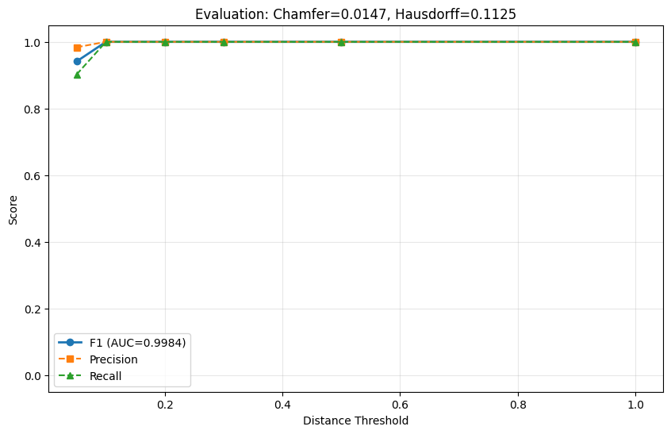
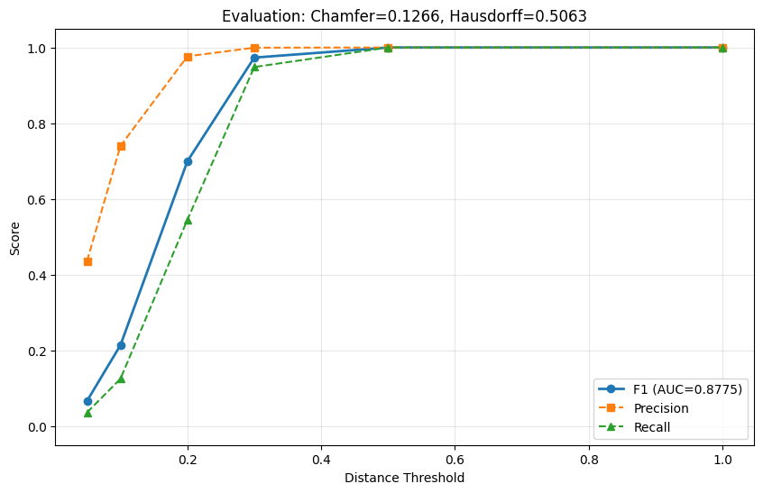

# CloudAnalyzer

[](https://github.com/rsasaki0109/CloudAnalyzer/actions/workflows/test.yml)
[](https://www.python.org/downloads/)
[](LICENSE)

**Quantify whether post-processing breaks your point clouds or trajectories in localization, mapping, and perception pipelines.**

CloudAnalyzer is not trying to replace point cloud processing libraries or viewers.
Its target is a higher-level **3D data QA / benchmark / operations layer** that lets you run
**map post-processing QA, trajectory evaluation, and regression checks for perception-oriented 3D outputs**
end-to-end from a CLI and browser viewer.

```bash
$ ca downsample map.pcd -o down.pcd -v 0.2 --evaluate

Original:     1784475 pts
Downsampled:  1597449 pts
Reduction:    10.5%
Saved:        down.pcd
  Chamfer=0.0083  AUC=0.9852
  Best F1=1.0000 @ d=0.20
```

Adding just one flag, `--evaluate`, tells you immediately how much quality changed before and after processing.

## What It Is For

- **Mapping post-processing QA**
  Compare voxel downsampling, outlier removal, splitting, or compressed-and-restored maps against a baseline with `AUC / Chamfer / Hausdorff / heatmap`.
- **Localization / SLAM run evaluation**
  Evaluate estimated trajectories against ground truth with `ATE / RPE / drift / lateral / longitudinal / coverage`, then inspect map heatmaps and trajectory timelines together in `ca web`.
- **Perception / ground segmentation QA**
  Evaluate ground segmentation with voxel-based precision / recall / F1 / IoU and wire the result into config-driven CI gates.
- **Regression checks for 3D generation pipelines**
  Benchmark reconstructed point clouds, depth-derived clouds, model outputs, and geometry from Gaussian Splatting-style pipelines per artifact or per run.

In short, CloudAnalyzer is less a tool for **creating** 3D data and more a tool for **verifying the quality of 3D data after it has been created**.

| Density Map | F1 Evaluation Curve |
|---|---|
|  |  |

The figures above are generated from the public sample global map published by
AISL at Toyohashi University of Technology and bundled in
[`koide3/hdl_localization`](https://github.com/koide3/hdl_localization); see
[Public Data Used In This README](#public-data-used-in-this-readme) for the exact source and links.

## How It Differs From Other Tools

|  | CloudCompare | PCL | Open3D (Python) | **CloudAnalyzer** |
|---|---|---|---|---|
| Quality evaluation (F1/AUC) | - | - | Requires scripting | **Immediate with `--evaluate`** |
| Trajectory QA (ATE/RPE/drift) | Limited | - | Requires scripting | **Batchable via CLI + report** |
| CLI | Limited | None | None | **31 subcommands** |
| CI / automation | Not practical | Custom C++ needed | Requires scripting | **JSON output + quality gates** |
| Processing + evaluation | Separate steps | Separate program | Separate scripts | **One command** |
| Browser inspection | No | No | No | **`ca web` / `ca web-export`** |

## Where It Fits

CloudAnalyzer is not trying to win on raw low-level API surface area.
The goal is to standardize **how outputs are verified in real localization / mapping / perception workflows**.

| Tool family | Primary role | What CloudAnalyzer adds |
|---|---|---|
| PCL / Open3D | Point cloud algorithms, I/O, registration | **Map post-processing QA, comparison, regression detection** |
| CloudCompare / Potree | GUI visualization, visual inspection, sharing | **CLI automation, quantitative evaluation, browser inspection** |
| SLAM / LIO stacks | Trajectory estimation, map generation | **Trajectory QA, run-level evaluation, drift comparison** |
| Perception / PyTorch stacks | Training, inference, research experiments | **Geometry benchmarks for 3D outputs, artifact comparison** |
| Gaussian Splatting / 3D reconstruction | 3D representation, reconstruction, novel view synthesis | **Cross-representation error comparison and quality visualization** |

So CloudAnalyzer is less a replacement for `PCL/Open3D` and more an **output verification foundation**
that sits on top of a `mapping stack / localization stack / perception stack`.

## Install

```bash
pip install cloudanalyzer

# or install the current checkout
cd cloudanalyzer && pip install -e .
```

## Public Data Used In This README

- `docs/images/density_hdl_localization_map.png`,
  `docs/images/f1_hdl_localization_v0_2.png`,
  `docs/images/f1_hdl_localization_v0_1.png`, and
  `docs/images/f1_hdl_localization_v0_5.png` are generated from the sample global
  map [`data/map.pcd`](https://github.com/koide3/hdl_localization/blob/master/data/map.pcd)
  published by AISL at Toyohashi University of Technology and bundled in the public repository
  [`koide3/hdl_localization`](https://github.com/koide3/hdl_localization).
- That repository is distributed under the
  [BSD-2-Clause license](https://github.com/koide3/hdl_localization/blob/master/LICENSE).
- The same README also links a public example outdoor rosbag from AISL at Toyohashi University of Technology,
  [`hdl_400.bag.tar.gz`](http://www.aisl.cs.tut.ac.jp/databases/hdl_graph_slam/hdl_400.bag.tar.gz),
  used with the localization demo.
- Exact regeneration commands and file-level attribution are documented in
  [docs/images/ATTRIBUTION.md](docs/images/ATTRIBUTION.md).

## Public Demo

**Live**: https://rsasaki0109.github.io/CloudAnalyzer/

| Demo | Description |
|---|---|
| [hdl_localization Map Viewer](https://rsasaki0109.github.io/CloudAnalyzer/demo/hdl-localization-map/index.html) | Static 3D viewer exported by `ca web-export`, using the public AISL / Toyohashi `hdl_localization` sample map with heatmap, trajectory, and point inspection support |
| [Perception Batch Report](https://rsasaki0109.github.io/CloudAnalyzer/demo/perception/index.html) | Static `ca batch` report comparing non-deep and deep candidate artifacts on the same public RELLIS-3D LiDAR frame |

```bash
# export a static viewer
ca web-export map.pcd map_ref.pcd --heatmap -o docs/demo/local

# rebuild demos locally
python scripts/build_public_demo.py --output docs/demo/hdl-localization-map
python scripts/build_perception_demo.py --output docs/demo/perception
```

The map viewer is generated from the public `hdl_localization` sample map published by
AISL at Toyohashi University of Technology. The perception report is generated from the
public RELLIS-3D "Ouster LiDAR with Annotation Examples" bundle and compares a deterministic
non-deep proxy artifact with a higher-fidelity deep proxy artifact against the same reference
frame. The generated report is checked into `docs/demo/perception` so GitHub Pages does not
depend on third-party Google Drive downloads at publish time.

## Referenced OSS

CloudAnalyzer builds on, interoperates with, or is positioned alongside the following OSS:

- [Open3D](https://www.open3d.org/) for point cloud I/O, geometry operations, and visualization primitives.
- [PCL](https://pointclouds.org/) as the classic C++ point cloud processing ecosystem CloudAnalyzer complements.
- [CloudCompare](https://www.cloudcompare.org/) as the baseline for manual inspection and map-to-map comparison workflows.
- [koide3/hdl_localization](https://github.com/koide3/hdl_localization) as a representative LiDAR map localization stack; its Toyohashi University of Technology AISL sample global map is used for the README figures above.
- [koide3/ndt_omp](https://github.com/koide3/ndt_omp) and [SMRT-AIST/fast_gicp](https://github.com/SMRT-AIST/fast_gicp) as fast registration packages commonly used with `hdl_localization`.
- [unmannedlab/RELLIS-3D](https://github.com/unmannedlab/RELLIS-3D) for public off-road LiDAR perception data and the label ontology used by the perception demo.
- [HKUDS/CLI-Anything](https://github.com/HKUDS/CLI-Anything) for agent-facing CLI integration.

## Core Idea: Process, Then Evaluate Immediately

This is the core design of CloudAnalyzer. **Every processing command can be paired with `--evaluate`.**

```bash
# Downsample, then check quality immediately
ca downsample map.pcd -o down.pcd -v 0.2 --evaluate --plot quality.png

# Filter, then check quality immediately
ca filter noisy.pcd -o clean.pcd --evaluate

# Sample, then check quality immediately
ca sample map.pcd -o sampled.pcd -n 100000 --evaluate

# Pipeline: filter -> downsample -> evaluate in one command
ca pipeline noisy.pcd reference.pcd -o production.pcd -v 0.2
```

## Metrics

| Metric | Meaning |
|---|---|
| **Precision** | How close processed points stay to the original data |
| **Recall** | How much of the original data is still covered after processing |
| **F1 Score** | Harmonic mean of precision and recall |
| **Chamfer Distance** | Mean bidirectional nearest-neighbor distance |
| **Hausdorff Distance** | Worst-case distance |
| **AUC** | Area under the F1 curve across thresholds |

### Practical Quality Guide

| AUC (F1) | Interpretation | Typical use |
|---|---|---|
| > 0.99 | Excellent | High-precision localization |
| 0.95 - 0.99 | Good | Navigation |
| 0.90 - 0.95 | Acceptable | Coarse path planning |
| < 0.90 | Needs review | Possible quality degradation |

### Example Quality by Voxel Size

| Voxel | Kept points | Chamfer | AUC | Interpretation |
|---|---|---|---|---|
| 0.1m | 67.5% (1,382,329) | 0.0147 | 0.9984 | Excellent |
| 0.2m | 31.2% (638,902) | 0.0460 | 0.9770 | Good |
| 0.5m | 7.2% (147,397) | 0.1266 | 0.8775 | Needs review |

| Voxel 0.1m (AUC=0.9984) | Voxel 0.5m (AUC=0.8775) |
|---|---|
|  |  |

## CI / Automation

Place `cloudanalyzer.yaml` in your repo to unify mapping / localization / perception QA behind one command.

To emit a starter config:

```bash
ca init-check --profile integrated
```

```yaml
version: 1
defaults:
  report_dir: qa/reports
  json_dir: qa/results
checks:
  - id: mapping-postprocess
    kind: artifact
    source: outputs/map.pcd
    reference: baselines/map_ref.pcd
    gate:
      min_auc: 0.95
      max_chamfer: 0.02
  - id: localization-run
    kind: trajectory
    estimated: outputs/traj.csv
    reference: baselines/traj_ref.csv
    alignment: rigid
    gate:
      max_ate: 0.5
      max_rpe: 0.2
      max_drift: 1.0
      min_coverage: 0.9
```

```bash
ca check cloudanalyzer.yaml
```

See the complete example at [docs/examples/cloudanalyzer.yaml](docs/examples/cloudanalyzer.yaml).
Ground segmentation can also be integrated with `kind: ground`:

```yaml
  - id: ground-seg
    kind: ground
    estimated_ground: outputs/ground.pcd
    estimated_nonground: outputs/nonground.pcd
    reference_ground: baselines/ground_ref.pcd
    reference_nonground: baselines/nonground_ref.pcd
    gate:
      min_f1: 0.9
      min_iou: 0.8
```

When multiple gated checks fail, `ca check` also emits triage output to help prioritize inspection.

### Baseline Management

If you are unsure whether a baseline should be updated, use a history directory:

```bash
# Save a QA summary into history with rotation
ca baseline-save qa/summary.json --history-dir qa/history/ --keep 10

# Discover history automatically and decide promote / keep / reject
ca baseline-decision qa/current-summary.json --history-dir qa/history/

# List saved baselines
ca baseline-list --history-dir qa/history/
```

### GitHub Actions

Use reusable workflows to run QA and baseline decisions in separate jobs:

```yaml
jobs:
  qa:
    uses: rsasaki0109/CloudAnalyzer/.github/workflows/config-quality-gate.yml@main
    with:
      config_path: cloudanalyzer.yaml

  baseline:
    uses: rsasaki0109/CloudAnalyzer/.github/workflows/baseline-gate.yml@main
    with:
      config_path: cloudanalyzer.yaml
      history_dir: qa/history
```

For external use, pin a tag or commit SHA instead of `@main`.

```bash
# Read AUC and gate it in a shell script
AUC=$(ca evaluate new.pcd ref.pcd --format-json | jq -r '.auc')
[ $(echo "$AUC < 0.9" | bc -l) -eq 1 ] && echo "FAIL" && exit 1

# Evaluate every file in a directory
ca batch results/ --evaluate reference.pcd --format-json | jq '.[] | {path, auc, chamfer_distance}'

# Emit Markdown / HTML reports for sharing
ca batch results/ --evaluate reference.pcd --report batch_report.md
ca batch results/ --evaluate reference.pcd --report batch_report.html
# Reports include inspection commands; the HTML version also adds Copy buttons,
# count badges, quick actions, failed-first / recommended-first sort presets,
# and pass / failed / pareto / recommended filters.

# Evaluate quality vs size together with compressed artifacts such as Cloudini output
ca batch decoded/ --evaluate reference.pcd \
  --compressed-dir compressed/ --baseline-dir original/ \
  --report cloudini_report.html
# The report includes a Quality vs Size scatter plot, Pareto candidates,
# a recommended point, clickable summary rows, quick actions,
# failed-first / recommended-first sort presets, and HTML filters.

# Trajectory quality gate
ca traj-evaluate estimated.csv reference.csv \
  --max-time-delta 0.05 --max-ate 0.5 --max-rpe 0.2 --max-drift 1.0 --min-coverage 0.9 \
  --report trajectory_report.html
# Supports CSV(timestamp,x,y,z) and TUM(timestamp x y z qx qy qz qw)
# The report also writes sibling trajectory overlay and error timeline PNGs.

# Ignore initial translation offset and evaluate trajectory shape only
ca traj-evaluate estimated.csv reference.csv --align-origin

# Fit a rigid transform before evaluation
ca traj-evaluate estimated.csv reference.csv --align-rigid

# Trajectory batch benchmark
ca traj-batch runs/ --reference-dir gt/ \
  --max-time-delta 0.05 --max-ate 0.5 --max-rpe 0.2 --max-drift 1.0 --min-coverage 0.9 \
  --report traj_batch.html
# The HTML report adds pass / failed / low-coverage filters and ATE / RPE / coverage sorting.
# The low-coverage threshold follows --min-coverage when provided.

# Integrated map + trajectory QA for one run
ca run-evaluate map.pcd map_ref.pcd traj.csv traj_ref.csv \
  --min-auc 0.95 --max-chamfer 0.02 \
  --max-ate 0.5 --max-rpe 0.2 --max-drift 1.0 --min-coverage 0.9 \
  --report run_report.html
# Emits a map F1 curve together with trajectory overlays and error timelines.
# Inspection commands also include a `ca web ... --trajectory ... --trajectory-reference ...` run viewer.

# Combined benchmark across multiple map + trajectory runs
ca run-batch maps/ \
  --map-reference-dir map_refs/ \
  --trajectory-dir trajs/ \
  --trajectory-reference-dir traj_refs/ \
  --min-auc 0.95 --max-chamfer 0.02 \
  --max-ate 0.5 --max-rpe 0.2 --max-drift 1.0 --min-coverage 0.9 \
  --report run_batch.html
# Map and trajectory files are matched by relative path / stem.
# The HTML report adds pass / failed / map issue / trajectory issue filters,
# plus sorting by map AUC / Chamfer and trajectory ATE / drift / coverage.
# Report and JSON inspection commands include both per-run `ca web ...` viewers
# and `ca run-evaluate ...` drill-down commands.
# The quality gate summary separates overall failures from map failures and trajectory failures.

# Quality gate: exit with code 1 if any file fails
ca batch results/ --evaluate reference.pcd --min-auc 0.95 --max-chamfer 0.02

# Config-driven quality gate
ca check cloudanalyzer.yaml

# Baseline promotion decision from QA summaries
ca baseline-decision qa/current-summary.json --history qa/baseline-summary.json

# Trigger the GitHub Actions quality gate
gh workflow run quality-gate.yml \
  -f source=new.pcd -f reference=ref.pcd -f auc_threshold=0.9
```

## Command Overview

### Evaluation

```bash
ca evaluate src.pcd ref.pcd --plot f1.png   # F1 / Chamfer / Hausdorff / AUC
ca compare src.pcd tgt.pcd --register gicp  # Compare with registration
ca diff a.pcd b.pcd --threshold 0.1         # Quick distance statistics
ca pipeline in.pcd ref.pcd -o out.pcd       # filter -> downsample -> evaluate
ca check cloudanalyzer.yaml                 # Config-driven unified QA
ca init-check --profile integrated          # Generate a starter config
ca baseline-decision qa/current.json --history-dir qa/history/  # promote / keep / reject
ca baseline-save qa/summary.json --history-dir qa/history/      # save a baseline into history
ca baseline-list --history-dir qa/history/                      # list saved baselines
ca traj-evaluate est.csv gt.csv --max-ate 0.5 --max-drift 1.0 --min-coverage 0.9  # ATE / RPE / drift + coverage gate
ca traj-evaluate est.csv gt.csv --align-origin  # absorb initial translation offset
ca traj-evaluate est.csv gt.csv --align-rigid   # rigid alignment before scoring
ca traj-batch runs/ --reference-dir gt/ --max-drift 1.0 --min-coverage 0.9  # trajectory benchmark
ca run-evaluate map.pcd map_ref.pcd traj.csv traj_ref.csv --report run.html  # integrated map + trajectory QA
ca run-batch maps/ --map-reference-dir map_refs/ --trajectory-dir trajs/ --trajectory-reference-dir traj_refs/ --report run_batch.html  # combined batch QA
ca ground-evaluate est_ground.pcd est_nonground.pcd ref_ground.pcd ref_nonground.pcd --min-f1 0.9 --report ground.html  # ground segmentation QA
```

### Processing (all support `--evaluate`)

```bash
ca downsample cloud.pcd -o d.pcd -v 0.2 -e  # voxel downsampling
ca filter cloud.pcd -o f.pcd -e              # outlier removal
ca sample cloud.pcd -o s.pcd -n 10000 -e     # random sampling
ca merge a.pcd b.pcd -o m.pcd                # merge clouds
ca align s1.pcd s2.pcd -o a.pcd              # register + merge
ca split map.pcd -o tiles/ -g 100            # grid split
ca crop cloud.pcd -o c.pcd --x-min 0 ...     # bounding-box crop
ca convert in.pcd out.ply                     # format conversion
ca normals cloud.pcd -o n.ply                 # normal estimation
```

### Analysis

```bash
ca info cloud.pcd                   # basic metadata
ca stats cloud.pcd                  # density and spacing statistics
ca batch /path/to/dir/ -r           # run over a directory
ca batch results/ --evaluate ref.pcd  # compare all files to a reference
ca batch results/ --evaluate ref.pcd --report batch.html  # report for sharing
ca batch results/ --evaluate ref.pcd --min-auc 0.95 --max-chamfer 0.02  # quality gate
ca traj-evaluate est.csv gt.csv --report traj.html  # trajectory quality report
ca traj-batch runs/ --reference-dir gt/ --report traj_batch.html  # trajectory batch report
ca run-evaluate map.pcd map_ref.pcd traj.csv traj_ref.csv --report run.html  # combined run report
ca run-batch maps/ --map-reference-dir map_refs/ --trajectory-dir trajs/ --trajectory-reference-dir traj_refs/ --report run_batch.html  # combined batch report
```

### Visualization

```bash
ca web cloud.pcd                    # browser-based 3D viewer
ca web src.pcd ref.pcd --heatmap    # distance heatmap + overlay + threshold filter
ca web map.pcd map_ref.pcd --heatmap --trajectory traj.csv --trajectory-reference traj_ref.csv  # map + trajectory run viewer
# With paired trajectories, the browser also highlights the worst ATE pose and worst RPE segment.
# Clicking a marker or segment shows the timestamp and error summary in-place.
# The camera also moves toward the selected location, and Reset View returns to the full scene.
# The trajectory error timeline is displayed in the same viewer and stays synced with 3D selections.
ca view cloud.pcd                   # desktop 3D viewer
ca density-map cloud.pcd -o d.png   # density heatmap
ca heatmap3d src.pcd ref.pcd -o h.png  # 3D distance heatmap
```

## Python API

```python
from ca.evaluate import evaluate, plot_f1_curve
from ca.pipeline import run_pipeline
from ca.plot import plot_multi_f1

# Evaluate one result
result = evaluate("down.pcd", "original.pcd")
print(f"AUC: {result['auc']:.4f}")  # -> 0.9852

# Plot multiple operating points together
results = [evaluate(f"v{v}.pcd", "ref.pcd") for v in [0.1, 0.2, 0.5]]
plot_multi_f1(results, ["0.1m", "0.2m", "0.5m"], "comparison.png")
```

## Docs

- [Vision](VISION.md)
- [Experiments](docs/experiments.md)
- [Decisions](docs/decisions.md)
- [Interfaces](docs/interfaces.md)
- [Cloudini Benchmark Tutorial](docs/tutorial-cloudini-benchmark.md)
- [Map Quality Gate Tutorial](docs/tutorial-map-quality-gate.md)
- [Unified Run Quality Gate Tutorial](docs/tutorial-run-quality-gate.md)
- [Public Benchmark Packs](benchmarks/public/README.md)
- [Command Reference](docs/commands/)
- [Architecture](docs/architecture.md)
- [CI / Quality Gate](docs/ci.md)

## Experimental Development

CloudAnalyzer does not lock in a final abstraction first.
Instead, it compares multiple concrete implementations, then keeps only the minimal interface in `core`.

```bash
cd cloudanalyzer
python3 -m ca.experiments.process_docs --write-docs
```

At the moment, seven experiment slices follow that process:

| Slice | Core | Experiments |
|---|---|---|
| Point cloud reduction | `ca.core.web_sampling` | `ca.experiments.web_sampling` |
| Trajectory reduction | `ca.core.web_trajectory_sampling` | `ca.experiments.web_trajectory_sampling` |
| Progressive loading | `ca.core.web_progressive_loading` | `ca.experiments.web_progressive_loading` |
| Config scaffolding | `ca.core.check_scaffolding` | `ca.experiments.check_scaffolding` |
| Regression triage | `ca.core.check_triage` | `ca.experiments.check_triage` |
| Baseline evolution | `ca.core.check_baseline_evolution` | `ca.experiments.check_baseline_evolution` |
| Ground evaluation | `ca.core.ground_evaluate` | `ca.experiments.ground_evaluate` |

`docs/experiments.md`, `docs/decisions.md`, and `docs/interfaces.md` are regenerated together from `ca.experiments.process_docs`.

## License

MIT
