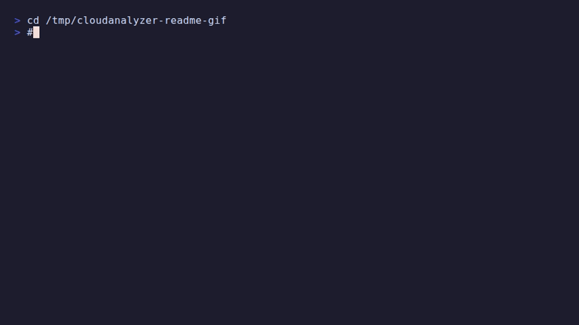

# CloudAnalyzer

[](https://github.com/rsasaki0109/CloudAnalyzer/actions/workflows/test.yml)
[](https://github.com/rsasaki0109/CloudAnalyzer/actions/workflows/self-qa.yml)
[](https://www.python.org/downloads/)
[](LICENSE)

**Turn SLAM, mapping, perception, and reconstruction outputs into CI-grade QA evidence.**

CloudAnalyzer takes candidate artifacts such as maps, trajectories, rendered images,
and reconstruction point clouds, then produces the evidence you need to make a
release decision:

```text
inputs:   dataset suite + baseline/reference + candidate outputs
outputs:  metrics JSON + HTML report + pass/fail gate + leaderboard-ready result
```

The first-class workflow is a benchmark gate: freeze the reference data and gate once,
then swap in each candidate SLAM / LIO / reconstruction output and let CloudAnalyzer
produce deterministic metrics, report files, and CI exit codes.

▶ **Try the public browser demo**: https://rsasaki0109.github.io/CloudAnalyzer/

▶ **Try in your browser — no install**: [compare two point clouds](https://rsasaki0109.github.io/CloudAnalyzer/demo/compare/)

▶ **Live SLAM Leaderboard**: https://rsasaki0109.github.io/CloudAnalyzer/leaderboard/

▶ **3DGS rendered evaluation demo**: https://rsasaki0109.github.io/CloudAnalyzer/demo/3dgs/

## Golden Path: SLAM Benchmark Smoke

Clone the repository, install the package, and run the bundled synthetic SLAM suite:

```bash
cd CloudAnalyzer
pip install -e ./cloudanalyzer

ca benchmark info benchmarks/slam/synthetic-figure8/suite.yaml
ca benchmark eval benchmarks/slam/synthetic-figure8/suite.yaml \
  --map benchmarks/slam/synthetic-figure8/sample_outputs/map_pass.pcd \
  --trajectory benchmarks/slam/synthetic-figure8/sample_outputs/trajectory_pass.tum \
  --out qa/synthetic-figure8
```

That command checks a candidate map + trajectory against the suite's frozen
reference map, reference trajectory, and gate, then writes
`metrics.json`, `summary.md`, `report.html`, `manifest.lock.yaml`, and
`provenance.json`. Replace the two `sample_outputs` paths with your own SLAM
output paths to use the same gate in CI.

The same clone-after-install path is enforced by
[`.github/workflows/slam-benchmark-smoke.yml`](.github/workflows/slam-benchmark-smoke.yml).

For the full "raw scans -> SLAM driver -> benchmark report" loop, install the
SLAM extra and see [the SLAM benchmark tutorial](docs/tutorial-slam-benchmark.md):

```bash
pip install -e './cloudanalyzer[slam]'
ca slam-run benchmarks/slam/synthetic-figure8/scans qa/kiss-icp --driver kiss-icp
ca benchmark eval benchmarks/slam/synthetic-figure8/suite.yaml \
  --map qa/kiss-icp/map.ply --trajectory qa/kiss-icp/trajectory.tum \
  --out qa/kiss-icp-benchmark
```

## Quick Point Cloud QA

For a single before/after artifact comparison, you can still run one command:

```bash
uvx cloudanalyzer evaluate before.pcd after.pcd
```

CloudAnalyzer is not trying to replace point cloud processing libraries or viewers.
Its target is a higher-level **3D data QA / benchmark / operations layer** that lets you run
**map post-processing QA, trajectory evaluation, and regression checks for perception-oriented 3D outputs**
end-to-end from a CLI and browser viewer.

```bash
$ ca downsample map.pcd -o down.pcd -v 0.2 --evaluate

Original:     1784475 pts
Downsampled:  1597449 pts
Reduction:    10.5%
Saved:        down.pcd
  Chamfer=0.0083  AUC=0.9852
  Best F1=1.0000 @ d=0.20
```

Adding just one flag, `--evaluate`, tells you immediately how much quality changed before and after processing.

<!-- README demo GIF: regenerate with `scripts/build_readme_gif.sh` (requires vhs). -->


## What It Is For

- **Mapping post-processing QA**
  Compare voxel downsampling, outlier removal, splitting, or compressed-and-restored maps against a baseline with `AUC / Chamfer / Hausdorff / heatmap`.
- **Localization / SLAM run evaluation**
  Evaluate estimated trajectories against ground truth with `ATE / RPE / drift / lateral / longitudinal / coverage`, then inspect map heatmaps and trajectory timelines together in `ca web`.
- **Manual loop-closure QA**
  Compare before/after loop-closure maps, trajectories, and posegraph session artifacts with `loop-closure-report` or config-driven `kind: loop_closure` gates.
- **Perception QA**
  Evaluate ground segmentation, 3D object detection, and 3D multi-object tracking with task-specific metrics and wire the result into config-driven CI gates.
- **Regression checks for 3D generation pipelines**
  Benchmark reconstructed point clouds, depth-derived clouds, model outputs, and geometry from Gaussian Splatting-style pipelines per artifact or per run.

In short, CloudAnalyzer is less a tool for **creating** 3D data and more a tool for **verifying the quality of 3D data after it has been created**.

| Density Map | F1 Evaluation Curve |
|---|---|
|  |  |

The figures above are generated from the public sample global map published by
AISL at Toyohashi University of Technology and bundled in
[`koide3/hdl_localization`](https://github.com/koide3/hdl_localization); see
[Public Data Used In This README](#public-data-used-in-this-readme) for the exact source and links.

## How It Differs From Other Tools

|  | CloudCompare | PCL | Open3D (Python) | **CloudAnalyzer** |
|---|---|---|---|---|
| Quality evaluation (F1/AUC) | - | - | Requires scripting | **Immediate with `--evaluate`** |
| Trajectory QA (ATE/RPE/drift) | Limited | - | Requires scripting | **Batchable via CLI + report** |
| CLI | Limited | None | None | **53 subcommands** |
| CI / automation | Not practical | Custom C++ needed | Requires scripting | **JSON output + quality gates** |
| Processing + evaluation | Separate steps | Separate program | Separate scripts | **One command** |
| Browser inspection | No | No | No | **`ca web` / `ca web-export`** |

## Where It Fits

CloudAnalyzer is not trying to win on raw low-level API surface area.
The goal is to standardize **how outputs are verified in real localization / mapping / perception workflows**.

| Tool family | Primary role | What CloudAnalyzer adds |
|---|---|---|
| PCL / Open3D | Point cloud algorithms, I/O, registration | **Map post-processing QA, comparison, regression detection** |
| CloudCompare / Potree | GUI visualization, visual inspection, sharing | **CLI automation, quantitative evaluation, browser inspection** |
| SLAM / LIO stacks | Trajectory estimation, map generation | **Trajectory QA, run-level evaluation, drift comparison** |
| Perception / PyTorch stacks | Training, inference, research experiments | **Geometry benchmarks for 3D outputs, artifact comparison** |
| Gaussian Splatting / 3D reconstruction | 3D representation, reconstruction, novel view synthesis | **Cross-representation error comparison and quality visualization** |

So CloudAnalyzer is less a replacement for `PCL/Open3D` and more an **output verification foundation**
that sits on top of a `mapping stack / localization stack / perception stack`.

## Install

```bash
# no install — try a command immediately (Open3D is fetched on first run; may take a while)
uvx cloudanalyzer evaluate before.pcd after.pcd

# persistent install
pip install cloudanalyzer

# ROS / MCAP / bag input (optional)
pip install "cloudanalyzer[ros]"

# or install the current checkout
cd cloudanalyzer && pip install -e .
```

## Public Data Used In This README

- `docs/images/density_hdl_localization_map.png`,
  `docs/images/f1_hdl_localization_v0_2.png`,
  `docs/images/f1_hdl_localization_v0_1.png`, and
  `docs/images/f1_hdl_localization_v0_5.png` are generated from the sample global
  map [`data/map.pcd`](https://github.com/koide3/hdl_localization/blob/master/data/map.pcd)
  published by AISL at Toyohashi University of Technology and bundled in the public repository
  [`koide3/hdl_localization`](https://github.com/koide3/hdl_localization).
- That repository is distributed under the
  [BSD-2-Clause license](https://github.com/koide3/hdl_localization/blob/master/LICENSE).
- The same README also links a public example outdoor rosbag from AISL at Toyohashi University of Technology,
  [`hdl_400.bag.tar.gz`](http://www.aisl.cs.tut.ac.jp/databases/hdl_graph_slam/hdl_400.bag.tar.gz),
  used with the localization demo.
- Exact regeneration commands and file-level attribution are documented in
  [docs/images/ATTRIBUTION.md](docs/images/ATTRIBUTION.md).

## Public Demo

**Live**: https://rsasaki0109.github.io/CloudAnalyzer/

| Demo | Description |
|---|---|
| [hdl_localization Map Viewer](https://rsasaki0109.github.io/CloudAnalyzer/demo/hdl-localization-map/index.html) | Static 3D viewer exported by `ca web-export`, using the public AISL / Toyohashi `hdl_localization` sample map with heatmap, synthetic demo trajectories, and point inspection support |
| [Perception Batch Report](https://rsasaki0109.github.io/CloudAnalyzer/demo/perception/index.html) | Static `ca batch` report comparing a geometry-first non-deep baseline and a higher-fidelity deep baseline on the same public RELLIS-3D LiDAR frame |

```bash
# export a static viewer
ca web-export map.pcd map_ref.pcd --heatmap -o docs/demo/local

# rebuild demos locally
python scripts/build_public_demo.py --output docs/demo/hdl-localization-map
python scripts/build_perception_demo.py --output docs/demo/perception
```

The map viewer is generated from the public `hdl_localization` sample map published by
AISL at Toyohashi University of Technology. The perception report is generated from the
public RELLIS-3D "Ouster LiDAR with Annotation Examples" bundle and compares a geometry-first
non-deep baseline artifact with a higher-fidelity deep baseline artifact against the same
reference frame. A minimal public reproducibility seed is checked into
`demo_assets/public/rellis3d-frame-000001`, and CI verifies that the checked-in report stays
in sync with `scripts/build_perception_demo.py`.

License note: the Python package remains MIT, but the checked-in RELLIS-derived demo assets under
`docs/demo/perception` and `demo_assets/public/rellis3d-frame-000001` continue to follow the
upstream CC BY-NC-SA 3.0 terms documented in their attribution files.

## Referenced OSS

CloudAnalyzer builds on, interoperates with, or is positioned alongside the following OSS:

- [Open3D](https://www.open3d.org/) for point cloud I/O, geometry operations, and visualization primitives.
- [PCL](https://pointclouds.org/) as the classic C++ point cloud processing ecosystem CloudAnalyzer complements.
- [CloudCompare](https://www.cloudcompare.org/) as the baseline for manual inspection and map-to-map comparison workflows.
- [koide3/hdl_localization](https://github.com/koide3/hdl_localization) as a representative LiDAR map localization stack; its Toyohashi University of Technology AISL sample global map is used for the README figures above.
- [koide3/ndt_omp](https://github.com/koide3/ndt_omp) and [SMRT-AIST/fast_gicp](https://github.com/SMRT-AIST/fast_gicp) as fast registration packages commonly used with `hdl_localization`.
- [unmannedlab/RELLIS-3D](https://github.com/unmannedlab/RELLIS-3D) for public off-road LiDAR perception data and the label ontology used by the perception demo.
- [HKUDS/CLI-Anything](https://github.com/HKUDS/CLI-Anything) for agent-facing CLI integration.

## Core Idea: Process, Then Evaluate Immediately

This is the core design of CloudAnalyzer. **Every processing command can be paired with `--evaluate`.**

```bash
# Downsample, then check quality immediately
ca downsample map.pcd -o down.pcd -v 0.2 --evaluate --plot quality.png

# Filter, then check quality immediately
ca filter noisy.pcd -o clean.pcd --evaluate

# Sample, then check quality immediately
ca sample map.pcd -o sampled.pcd -n 100000 --evaluate

# Pipeline: filter -> downsample -> evaluate in one command
ca pipeline noisy.pcd reference.pcd -o production.pcd -v 0.2
```

## Which Evaluation Command Does What

The CLI exposes several evaluation entry points. They look related but answer different questions and should be used in different situations.

| Command | Question it answers | Typical input | When to reach for it |
|---|---|---|---|
| `ca evaluate` | "Did post-processing degrade the artifact compared to its source?" | Two artifacts of the same kind (post-processed vs. original / baseline) | Voxel downsampling, filtering, sampling, compression round-trips |
| `ca map-evaluate` | "How well does the reconstructed map match a survey / GT map?" | Estimated map + reference map (MapEval-style accuracy/completeness@t) | SLAM map quality vs. survey scan, before/after loop closure maps |
| `ca run-evaluate` | "Is this SLAM run acceptable end-to-end (map + trajectory)?" | Map pair + trajectory pair | Per-run regression gate for a localization / mapping pipeline |
| `ca slam-run` | "Drive a LiDAR SLAM on raw scans and (optionally) score the result." | Directory of `.bin`/`.pcd`/`.ply` sweeps (or a frames-list `.txt`) + optional reference map / trajectory | KISS-ICP odometry runner (default) plus experimental `--driver kiss-slam` (pose-graph + loop closures) and `--driver small-gicp` (scan-to-map VGICP); `--evaluate` pipes the result into `ca run-evaluate`; install with `pip install 'cloudanalyzer[slam]'`. Third-party drivers can register via the `cloudanalyzer.slam_run_drivers` entry-point — see [plugins/cloudanalyzer-driver-example](plugins/cloudanalyzer-driver-example/) for a worked, pip-installable template. |
| `ca check` | "Run all configured gates and report pass/fail with triage." | `cloudanalyzer.yaml` | CI / pre-merge gate orchestration; chains `evaluate`, `map-evaluate`, `traj-evaluate`, `loop-closure-report`, `ground-evaluate`, etc. |
| `ca benchmark eval` | "Does this SLAM run pass the frozen reference + gate of a published benchmark?" | Benchmark suite manifest + user map + user trajectory | Wraps `run-evaluate` against a suite's fixed reference and gate; use it as the one-command SLAM regression check |
| `ca geometry-evaluate` | "Does this Gaussian Splat / mesh / depth-derived cloud match a reference scan geometrically?" | Source artifact (3DGS PLY, mesh PLY, point cloud, ...) + reference point cloud | Normalizes the source through a representation adapter (3DGS opacity filter, voxel downsample, etc.) and runs the same Chamfer/AUC/F1 metrics as `ca evaluate` |
| `ca image-evaluate` | "Do these rendered images match the reference photometrically?" | Directory of rendered images + directory of reference images (paired by filename) | PSNR + SSIM (+ optional LPIPS with `cloudanalyzer[gs]`) per pair plus aggregate stats |
| `ca rendered-evaluate` | "Does this 3DGS reconstruction match reference views and scan geometry?" | 3DGS PLY + camera poses + reference image dir (+ optional reference scan) | gsplat render → photometric metrics → optional geometry QA; combined HTML report |

Rule of thumb: `ca evaluate` is for **preservation QA** between two snapshots of the same artifact, `ca map-evaluate` is for **map-quality QA** against a reference map, `ca run-evaluate` is for **SLAM-run QA**, `ca benchmark eval` is the same SLAM-run QA but against a **frozen suite** so you can swap in your own pipeline, and `ca check` is the **gate orchestrator** that ties them together for CI.

### SLAM Benchmark Suites

`ca benchmark` points any SLAM pipeline's map + trajectory at a frozen suite (reference + gate) for a one-command regression check. A tiny synthetic suite ships in `benchmarks/slam/synthetic-figure8/`:

```bash
ca benchmark info benchmarks/slam/synthetic-figure8/suite.yaml
ca benchmark eval benchmarks/slam/synthetic-figure8/suite.yaml \
  --map outputs/my_slam_map.pcd --trajectory outputs/my_slam_trajectory.tum \
  --report qa/run_report.html
```

The synthetic suite also ships raw per-frame scans under `scans/`, so you can run the full "scans → SLAM → benchmark" loop from a clean checkout with `pip install 'cloudanalyzer[slam]'`:

```bash
ca slam-run benchmarks/slam/synthetic-figure8/scans /tmp/run --driver kiss-icp --max-range 25
ca benchmark eval benchmarks/slam/synthetic-figure8/suite.yaml \
  --map /tmp/run/map.ply --trajectory /tmp/run/trajectory.tum --sequence default
```

`ca benchmark init` builds a custom suite from your own reference map + trajectory. Newer College / KITTI Odometry wrappers live under `scripts/prepare_*_mini.py`. Full workflow and `--gate` overrides: **[docs/commands/benchmark.md](docs/commands/benchmark.md)**.

A **[live SLAM leaderboard](https://rsasaki0109.github.io/CloudAnalyzer/leaderboard/)** publishes frozen `kiss-icp` / `kiss-slam` / `small-gicp` snapshots on the bundled `synthetic-figure8` / `synthetic-oval` suites plus **KITTI Odometry mini** (`kitti-mini`, locally prepared). Regenerate with `pip install 'cloudanalyzer[slam]'` then `python scripts/build_leaderboard.py --include-optional`. Newer College rows follow the same `--include-optional` path once you run `scripts/prepare_leaderboard_newer_college.py`.

### Cross-Representation Geometry QA

`ca geometry-evaluate` runs the same Chamfer / AUC / F1 metrics as `ca evaluate`, but first normalizes the source artifact through a *representation adapter* so non-point-cloud inputs (3D Gaussian Splatting PLYs, triangle meshes) can be scored against a reference scan:

```bash
ca geometry-evaluate scene.ply reference.pcd --opacity-threshold 0.5
ca geometry-evaluate reconstruction.obj reference.pcd --mesh-samples 500000
```

`--representation` accepts `auto` (default), `point-cloud`, `gaussian-points`, or `mesh`. Output is the `ca evaluate` shape plus a `representation` block, so it flows into `ca report-pr-comment` as-is. Adapter details and the synthetic demo: **[docs/commands/geometry-evaluate.md](docs/commands/geometry-evaluate.md)**.

For full 3DGS QA that includes **rendered views**, use `ca rendered-evaluate` (requires `pip install "cloudanalyzer[gs]"`):

```bash
ca rendered-evaluate scene.ply references/ \
  --cameras transforms.json \
  --reference-pointcloud reference.pcd \
  --metrics psnr,ssim,lpips --report rendered-report.html
```

Bundled demo: `benchmarks/3dgs/synthetic-room/`. Details: **[docs/commands/rendered-evaluate.md](docs/commands/rendered-evaluate.md)** · **[live demo](https://rsasaki0109.github.io/CloudAnalyzer/demo/3dgs/)**.

Wire into CI with `kind: rendered` in `cloudanalyzer.yaml` — see [ci.md](docs/ci.md).

## Metrics

| Metric | Meaning |
|---|---|
| **Precision** | How close processed points stay to the original data |
| **Recall** | How much of the original data is still covered after processing |
| **F1 Score** | Harmonic mean of precision and recall |
| **Chamfer Distance** | Mean bidirectional nearest-neighbor distance |
| **Hausdorff Distance** | Worst-case distance |
| **AUC** | Area under the F1 curve across thresholds |

### Practical Quality Guide

| AUC (F1) | Interpretation | Typical use |
|---|---|---|
| > 0.99 | Excellent | High-precision localization |
| 0.95 - 0.99 | Good | Navigation |
| 0.90 - 0.95 | Acceptable | Coarse path planning |
| < 0.90 | Needs review | Possible quality degradation |

### Example Quality by Voxel Size

| Voxel | Kept points | Chamfer | AUC | Interpretation |
|---|---|---|---|---|
| 0.1m | 67.5% (1,382,329) | 0.0147 | 0.9984 | Excellent |
| 0.2m | 31.2% (638,902) | 0.0460 | 0.9770 | Good |
| 0.5m | 7.2% (147,397) | 0.1266 | 0.8775 | Needs review |

| Voxel 0.1m (AUC=0.9984) | Voxel 0.5m (AUC=0.8775) |
|---|---|
|  |  |

## CI / Automation

Place `cloudanalyzer.yaml` in your repo to unify mapping, localization, loop-closure, and perception QA behind one command.

```bash
ca init-check --profile integrated   # emit a starter config
ca check cloudanalyzer.yaml          # run all configured gates
ca check --warn-only cloudanalyzer.yaml
ca check --strict cloudanalyzer.yaml
```

A minimal `cloudanalyzer.yaml`:

```yaml
version: 1
defaults:
  report_dir: qa/reports
  json_dir: qa/results
checks:
  - id: mapping-postprocess
    kind: artifact
    source: outputs/map.pcd
    reference: baselines/map_ref.pcd
    gate:
      min_auc: 0.95
      max_chamfer: 0.02
  - id: localization-run
    kind: trajectory
    estimated: outputs/traj.csv
    reference: baselines/traj_ref.csv
    alignment: rigid
    gate:
      max_ate: 0.5
      max_rpe: 0.2
      max_drift: 1.0
      min_coverage: 0.9
```

Supported check kinds: `artifact`, `trajectory`, `loop_closure`, `ground`, `detection`, `tracking`, `image`, `map`, `run`, `benchmark`. Full schema and worked examples: **[docs/ci.md](docs/ci.md)** and **[docs/examples/cloudanalyzer.yaml](docs/examples/cloudanalyzer.yaml)**.

Gate severity defaults to `fail`. Use `severity: warn` or `severity:
soft_fail` for visible but non-blocking regressions; `--strict` promotes those
outcomes to release blockers, and every `ca check` JSON includes
`gate_summary`.

### PR Comments

`ca report-pr-comment` turns any CloudAnalyzer summary JSON (`ca check`, `ca run-evaluate`, `ca benchmark eval`) into a Markdown blob that drops cleanly into a GitHub PR comment.

```bash
ca check cloudanalyzer.yaml          # writes qa/summary.json via summary_output_json:
ca report-pr-comment qa/summary.json \
  --baseline qa/baseline-summary.json --output qa/pr-comment.md
```

The output mirrors the existing `ca check` triage so the worst regression appears first, with `↑/↓` deltas against the baseline. Output shape and Markdown layout: **[docs/commands/report-pr-comment.md](docs/commands/report-pr-comment.md)**.

### Baseline Management

```bash
ca baseline-save qa/summary.json --history-dir qa/history/ --keep 10
ca baseline-decision qa/current-summary.json --history-dir qa/history/
ca baseline-list --history-dir qa/history/
```

### QA Bundles (artifact retention)

`ca bundle pack` freezes one QA run — summary JSON, the per-check reports it points at, and an optional baseline — into a single `qa_bundle.zip` with a metadata header (project, commit, PR, notes). Reopenable without the original CI workspace.

```bash
ca bundle pack qa/summary.json --output qa/bundle.zip \
  --baseline qa/baseline-summary.json --project my-pipeline \
  --commit "$GITHUB_SHA" --note dataset=newer-college-mini
ca bundle show qa/bundle.zip
ca bundle unpack qa/bundle.zip --output qa/restored/
ca bundle diff qa/baseline.zip qa/bundle.zip --output qa/diff.md
ca history --from-dir qa/archive/ --output qa/history.md   # trend across many bundles
```

Bundle layout, `ca history` trend gate, and dashboard-friendly JSON shape: **[docs/commands/bundle.md](docs/commands/bundle.md)** / **[docs/commands/history.md](docs/commands/history.md)**.

### GitHub Actions

**Marketplace Action (recommended).** Three lines — `ca check`, PR comment, and gate failure in one step:

```yaml
permissions:
  contents: read
  pull-requests: write

jobs:
  qa:
    runs-on: ubuntu-latest
    steps:
      - uses: actions/checkout@v6

      - uses: rsasaki0109/cloudanalyzer-action@v1
        with:
          config: cloudanalyzer.yaml
```

Optional baseline comparison: `baseline: qa/baseline-summary.json`, `project: my-pipeline`. Full inputs/outputs: **[cloudanalyzer-action](https://github.com/rsasaki0109/cloudanalyzer-action)**.

**Reusable workflows (advanced).** Compose QA, baseline decisions, and PR comments separately when you need artifact chaining or custom job layout:

```yaml
jobs:
  qa:
    uses: rsasaki0109/CloudAnalyzer/.github/workflows/config-quality-gate.yml@main
    with:
      config_path: cloudanalyzer.yaml

  pr-comment:
    needs: qa
    if: ${{ github.event_name == 'pull_request' }}
    permissions:
      pull-requests: write
      contents: read
    uses: rsasaki0109/CloudAnalyzer/.github/workflows/pr-comment.yml@main
    with:
      summary_path: qa/summary.json
```

For external use, pin a tag or commit SHA instead of `@main`. Both summary-from-repo and summary-from-artifact patterns, plus inline `ca report-pr-comment` usage: **[docs/ci.md](docs/ci.md)**. `.github/workflows/self-qa.yml` dogfoods `cloudanalyzer-action@v1`.

## Command Overview

Full per-command reference lives under **[docs/commands/](docs/commands/)**. Quick map:

| Group | Commands | Reference |
|---|---|---|
| Single-artifact QA | `evaluate`, `compare`, `diff`, `pipeline`, `scan-match-debug` | [evaluate.md](docs/commands/evaluate.md), [compare.md](docs/commands/compare.md) |
| Map / SLAM run QA | `map-evaluate`, `run-evaluate`, `run-batch`, `loop-closure-report`, `posegraph-validate` | [analysis.md](docs/commands/analysis.md) |
| Trajectory QA | `traj-evaluate`, `traj-batch` | [analysis.md](docs/commands/analysis.md) |
| Perception QA | `ground-evaluate`, `detection-evaluate`, `tracking-evaluate` | [analysis.md](docs/commands/analysis.md) |
| Cross-representation | `geometry-evaluate`, `image-evaluate`, `rendered-evaluate` | [geometry-evaluate.md](docs/commands/geometry-evaluate.md), [image-evaluate.md](docs/commands/image-evaluate.md), [rendered-evaluate.md](docs/commands/rendered-evaluate.md) |
| Benchmark suites | `benchmark info`, `benchmark init`, `benchmark eval` | [benchmark.md](docs/commands/benchmark.md) |
| Config-driven gate | `check`, `init-check`, `baseline-save/list/decision` | [ci.md](docs/ci.md) |
| Bundles & history | `bundle pack/show/unpack/diff`, `history` | [bundle.md](docs/commands/bundle.md), [history.md](docs/commands/history.md) |
| PR comment | `report-pr-comment` | [report-pr-comment.md](docs/commands/report-pr-comment.md) |
| Processing (all `--evaluate`-able) | `downsample`, `filter`, `sample`, `merge`, `align`, `split`, `crop`, `convert`, `normals`, `mme` | [processing.md](docs/commands/processing.md) |
| Visualization | `web`, `web-export`, `view`, `density-map`, `heatmap3d` | [visualization.md](docs/commands/visualization.md) |
| Info | `info`, `stats`, `batch` | [analysis.md](docs/commands/analysis.md) |
| ROS bag input | `info`, `traj-evaluate`, `slam-run` on `.bag`/`.mcap` | [bag-ingest.md](docs/commands/bag-ingest.md) |

Common patterns:

```bash
# Read AUC and gate it in shell
AUC=$(ca evaluate new.pcd ref.pcd --format-json | jq -r '.auc')

# Trajectory quality gate with a sharable HTML report
ca traj-evaluate estimated.csv reference.csv \
  --max-ate 0.5 --max-rpe 0.2 --max-drift 1.0 --min-coverage 0.9 \
  --report trajectory_report.html

# Integrated map + trajectory QA for one SLAM run
ca run-evaluate map.pcd map_ref.pcd traj.csv traj_ref.csv \
  --min-auc 0.95 --max-chamfer 0.02 \
  --max-ate 0.5 --max-rpe 0.2 --max-drift 1.0 --min-coverage 0.9 \
  --report run_report.html

# Browser viewer with map heatmap + paired trajectories
ca web map.pcd map_ref.pcd --heatmap \
  --trajectory traj.csv --trajectory-reference traj_ref.csv
```

## Python API

```python
from ca.evaluate import evaluate, plot_f1_curve
from ca.pipeline import run_pipeline
from ca.plot import plot_multi_f1

# Evaluate one result
result = evaluate("down.pcd", "original.pcd")
print(f"AUC: {result['auc']:.4f}")  # -> 0.9852

# Plot multiple operating points together
results = [evaluate(f"v{v}.pcd", "ref.pcd") for v in [0.1, 0.2, 0.5]]
plot_multi_f1(results, ["0.1m", "0.2m", "0.5m"], "comparison.png")
```

## Docs

- [Vision](VISION.md)
- [Architecture](docs/architecture.md)
- [Command Reference](docs/commands/)
- [CI / Quality Gate](docs/ci.md)
- [Experiments](docs/experiments.md) · [Decisions](docs/decisions.md) · [Interfaces](docs/interfaces.md)
- [Cloudini Benchmark Tutorial](docs/tutorial-cloudini-benchmark.md)
- [SLAM Benchmark Golden Path](docs/tutorial-slam-benchmark.md)
- [Map Quality Gate Tutorial](docs/tutorial-map-quality-gate.md)
- [Unified Run Quality Gate Tutorial](docs/tutorial-run-quality-gate.md)
- [Public Benchmark Packs](benchmarks/public/README.md)

## Experimental Development

CloudAnalyzer does not lock in a final abstraction first.
Instead, it compares multiple concrete implementations, then keeps only the minimal interface in `core`.

```bash
cd cloudanalyzer
python3 -m ca.experiments.process_docs --write-docs
```

At the moment, eight experiment slices follow that process:

| Slice | Core | Experiments |
|---|---|---|
| Point cloud reduction | `ca.core.web_sampling` | `ca.experiments.web_sampling` |
| Trajectory reduction | `ca.core.web_trajectory_sampling` | `ca.experiments.web_trajectory_sampling` |
| Progressive loading | `ca.core.web_progressive_loading` | `ca.experiments.web_progressive_loading` |
| Config scaffolding | `ca.core.check_scaffolding` | `ca.experiments.check_scaffolding` |
| Regression triage | `ca.core.check_triage` | `ca.experiments.check_triage` |
| Baseline evolution | `ca.core.check_baseline_evolution` | `ca.experiments.check_baseline_evolution` |
| Ground evaluation | `ca.core.ground_evaluate` | `ca.experiments.ground_evaluate` |
| Map evaluation | CLI / experimental boundary | `ca.experiments.map_evaluate` |

`docs/experiments.md`, `docs/decisions.md`, and `docs/interfaces.md` are regenerated together from `ca.experiments.process_docs`.

## License

MIT
