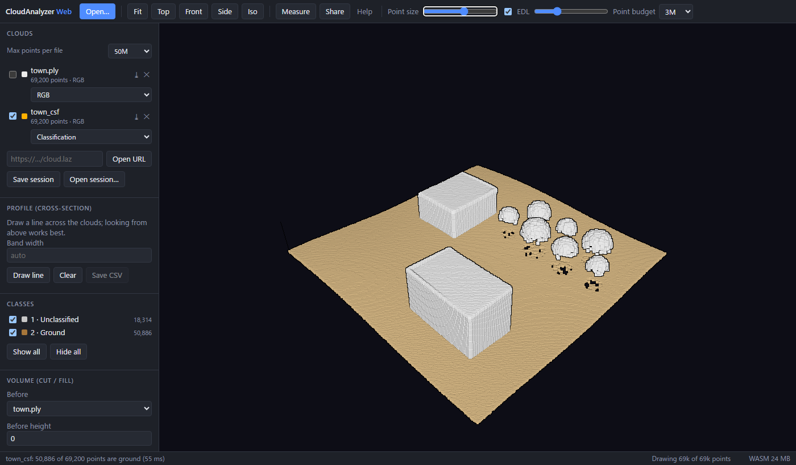

# CloudAnalyzer

Point cloud viewer and analyzer that runs in your browser.
Rust + WebAssembly. Your files stay on your machine.

**[Open the viewer](https://rsasaki0109.github.io/CloudAnalyzer/app/)** ·
[Guide](https://rsasaki0109.github.io/CloudAnalyzer/guide.html) ·
[Demos](#try-it)

<p align="center">
  <a href="https://rsasaki0109.github.io/CloudAnalyzer/app/?demo=ground">
    
  </a>
</p>

## Features

- **Open** PLY, PCD, LAS/LAZ, XYZ and OBJ/STL meshes, including tens of millions of points,
  and COPC files straight from a URL (only the levels you need are downloaded).
- **Compare**: cloud-to-cloud and cloud-to-mesh distance, M3C2 change detection, cut/fill volume.
- **Process**: ICP alignment, subsampling, outlier removal, ground extraction (CSF), normals, merge/split.
- **Inspect**: clipping box, cross-section profiles, picking, measuring and labels; save the view as a PNG.
- **Share**: links and session files that restore the view; export PLY/CSV for CloudCompare.
- Works on phones and tablets.

## Try it

| Demo | What it shows |
|---|---|
| [Two LiDAR scans](https://rsasaki0109.github.io/CloudAnalyzer/app/?demo=c2c) | Cloud-to-cloud distance |
| [Stockpile](https://rsasaki0109.github.io/CloudAnalyzer/app/?demo=volume) | Cut / fill volume |
| [Town](https://rsasaki0109.github.io/CloudAnalyzer/app/?demo=ground) | Ground extraction |
| [Landslide](https://rsasaki0109.github.io/CloudAnalyzer/app/?demo=m3c2) | M3C2 change detection |

## What's inside

| Path | |
|---|---|
| [`web/`](web/) | The browser app (TypeScript, three.js) |
| [`rust/`](rust/) | The Rust core, its WebAssembly bindings and Python bindings (`cloudanalyzer_core`) |
| [`cloudanalyzer/`](cloudanalyzer/) | `ca`, a Python CLI for SLAM and point-cloud quality gates in CI (`pip install cloudanalyzer`) |

## Develop

```sh
cd web
npm install
npm run wasm   # build the Rust core to WebAssembly
npm run dev    # http://localhost:5173
```

Tests: `cargo test` in `rust/`, `npx playwright test` in `web/`.

## License

[MIT](LICENSE). Sample data keeps its upstream terms; see [attribution](web/public/samples/ATTRIBUTION.md).
