# CloudAnalyzer

[](https://github.com/rsasaki0109/CloudAnalyzer/actions/workflows/test.yml)
[](https://github.com/rsasaki0109/CloudAnalyzer/actions/workflows/self-qa.yml)
[](https://www.python.org/downloads/)
[](LICENSE)

**Point clouds, measured.** CloudAnalyzer is two tools on one Rust core:

- a **point cloud viewer and analyzer that runs in your browser**, CloudCompare-style, with nothing to install
  (your files stay on your machine), and
- **`ca`, a CLI that turns SLAM, LiDAR, perception and 3DGS outputs into CI-grade QA evidence**: metrics, reports
  and pass / fail gates.

<p align="center">
  <a href="https://rsasaki0109.github.io/CloudAnalyzer/app/?demo=c2c">
    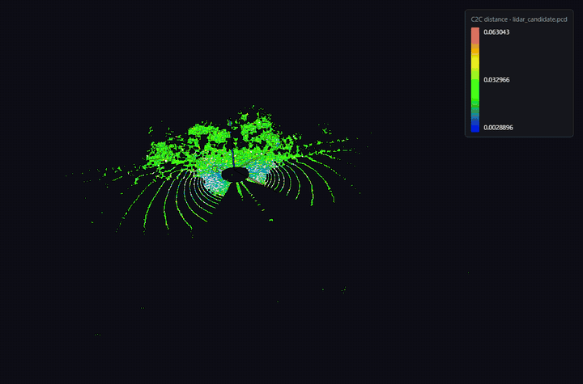
  </a>
</p>

<p align="center">
  <b><a href="https://rsasaki0109.github.io/CloudAnalyzer/app/">Open the viewer</a></b> ·
  <a href="https://rsasaki0109.github.io/CloudAnalyzer/guide.html">Guide</a> ·
  <a href="#try-it">Demos</a> ·
  <a href="#cli-slam-and-3d-perception-qa-in-ci">CLI</a> ·
  <a href="docs/commands/">Docs</a>
</p>

## In the browser

<table>
  <tr>
    <td width="33%"><a href="https://rsasaki0109.github.io/CloudAnalyzer/app/?demo=c2c">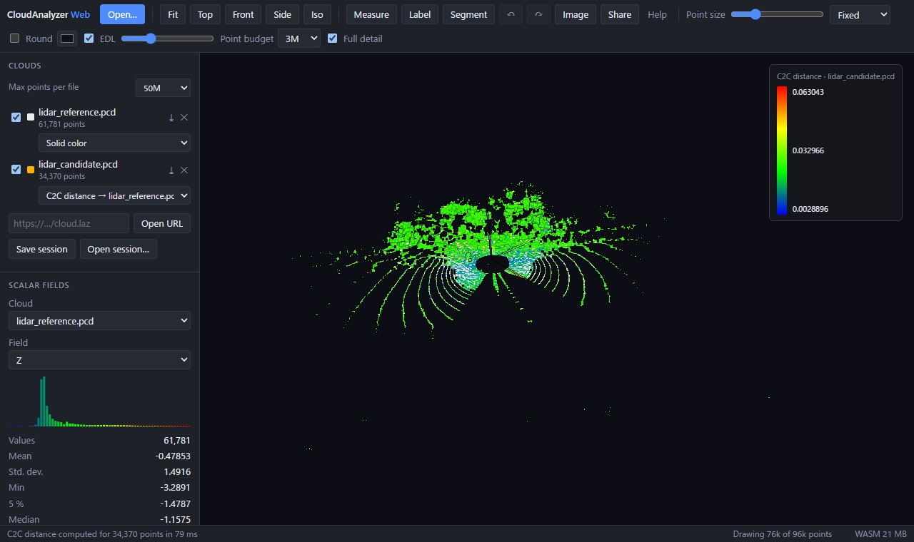</a><br><b>C2C / C2M distance</b> between two LiDAR scans</td>
    <td width="33%"><a href="https://rsasaki0109.github.io/CloudAnalyzer/app/?demo=m3c2">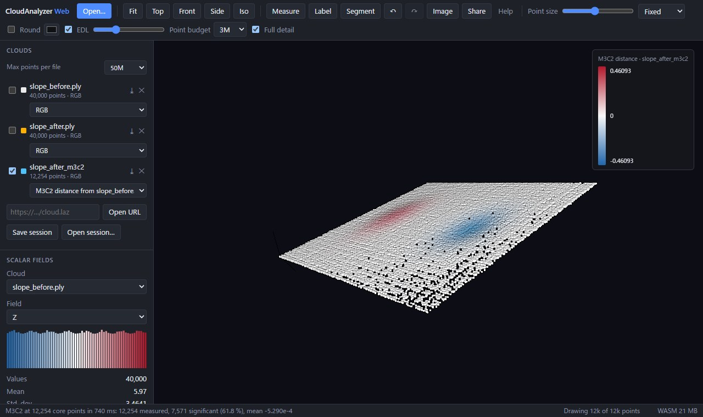</a><br><b>M3C2</b> change detection on a slope</td>
    <td width="33%"><a href="https://rsasaki0109.github.io/CloudAnalyzer/app/?demo=volume">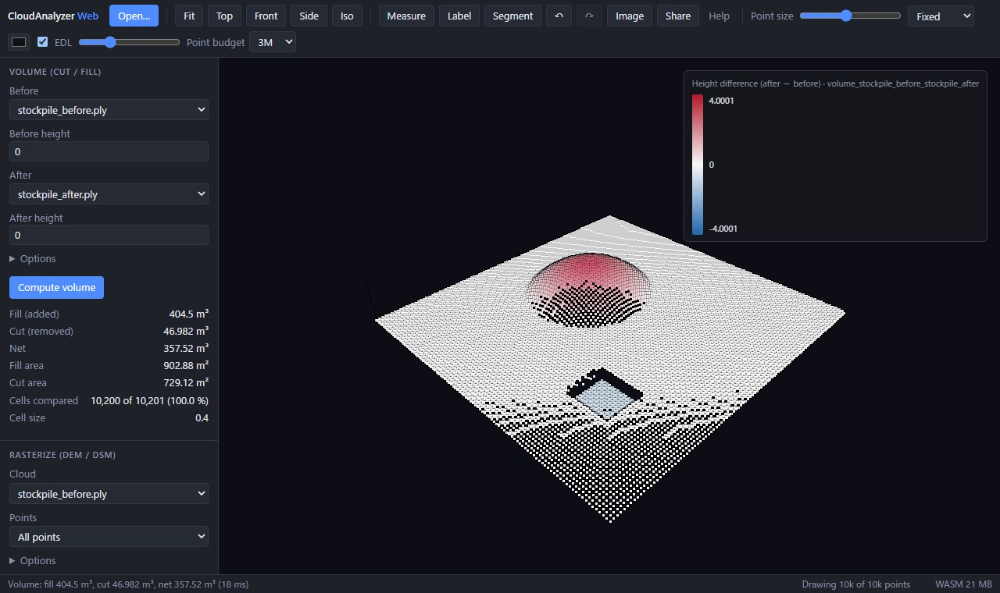</a><br><b>Cut / fill volume</b> of a stockpile</td>
  </tr>
  <tr>
    <td><a href="https://rsasaki0109.github.io/CloudAnalyzer/app/?demo=ground">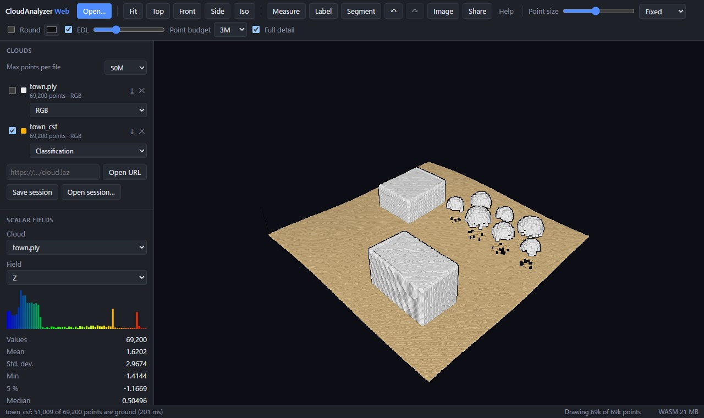</a><br><b>Ground extraction</b> with the Cloth Simulation Filter</td>
    <td>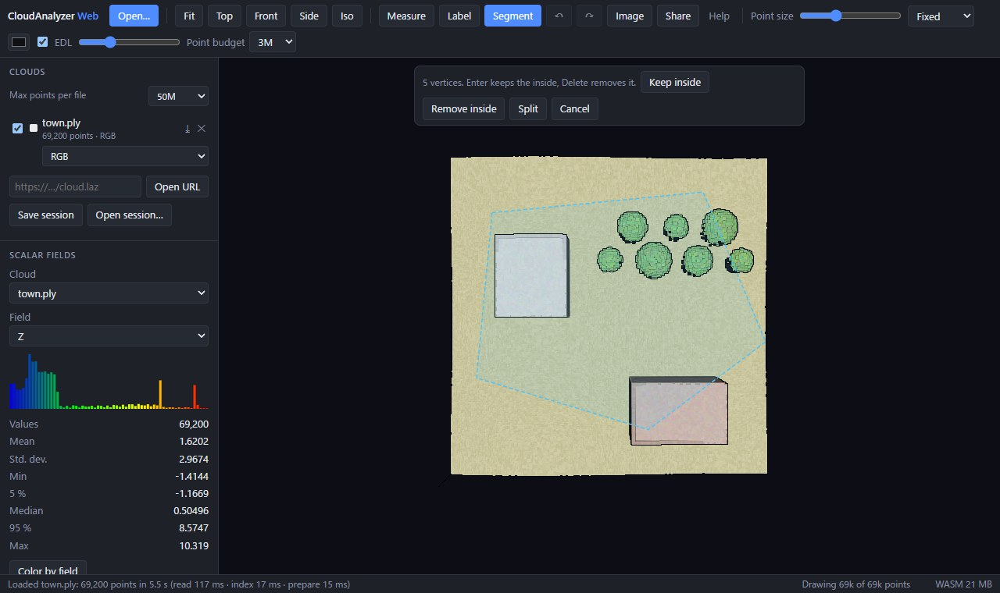<br><b>Lasso segmentation</b>, with undo / redo for every step</td>
    <td>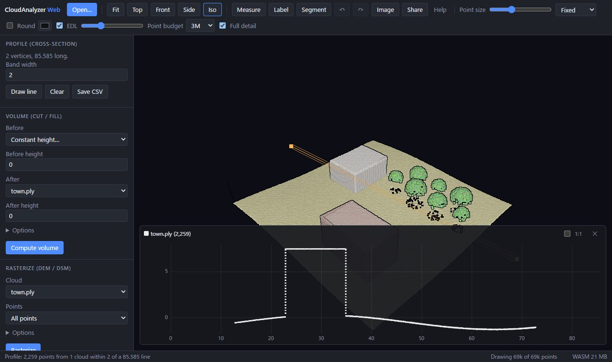<br><b>Cross-section profiles</b> along a polyline</td>
  </tr>
  <tr>
    <td>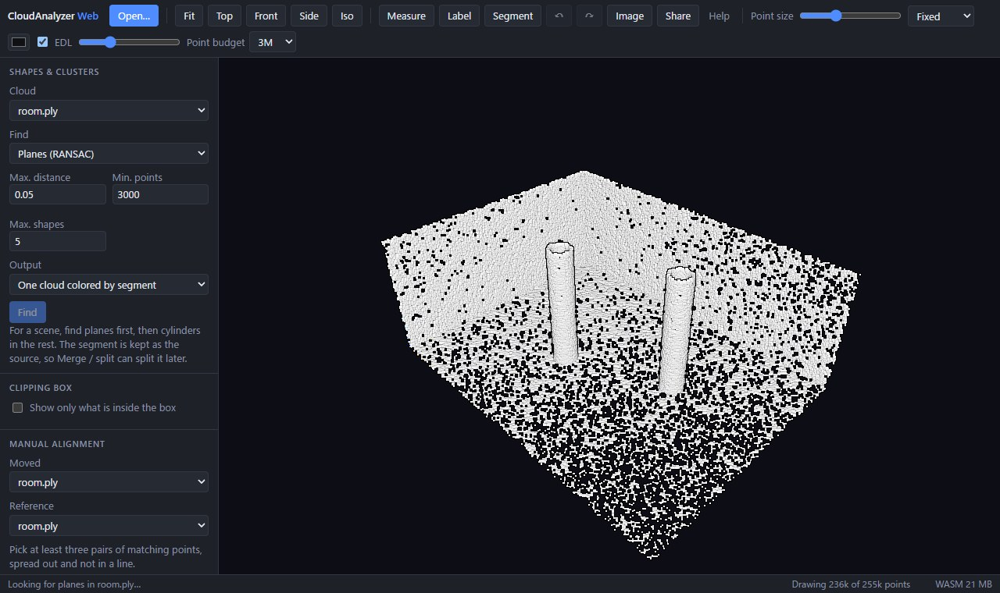<br><b>RANSAC shapes</b> (planes, cylinders, spheres) and clustering</td>
    <td>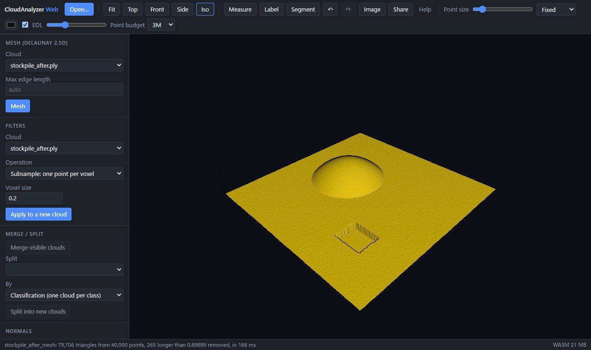<br><b>2.5D Delaunay meshing</b>, saved as PLY / OBJ</td>
    <td>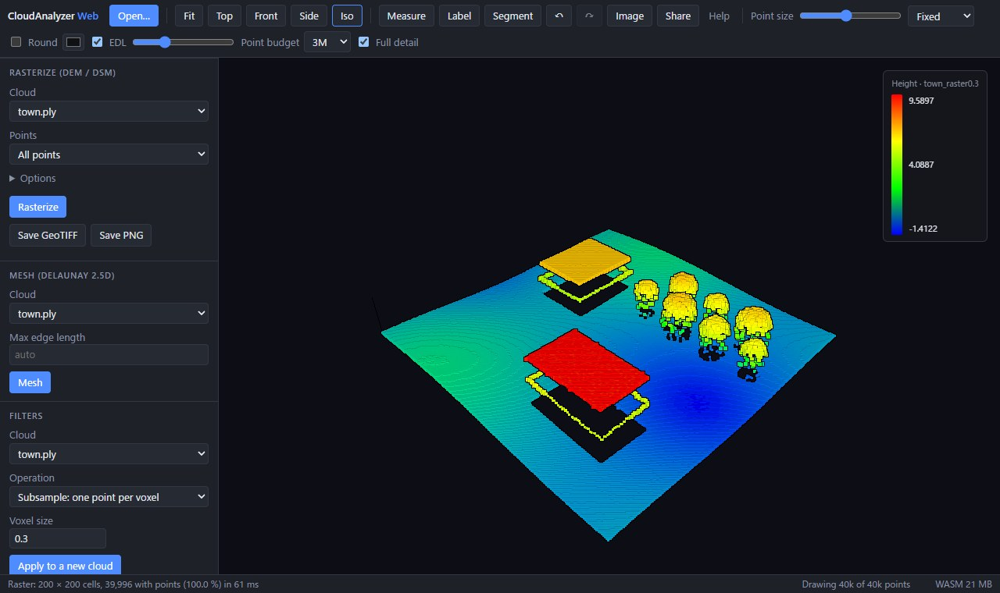<br><b>Rasterize</b> to a DEM / DSM, saved as GeoTIFF</td>
  </tr>
  <tr>
    <td>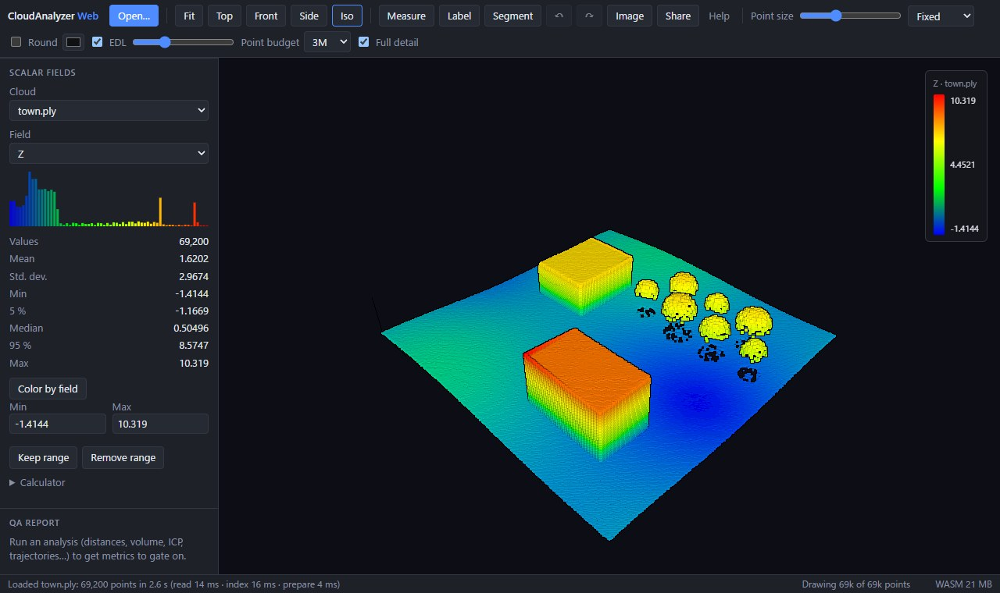<br><b>Scalar fields</b>: histograms, range filters, a calculator</td>
    <td>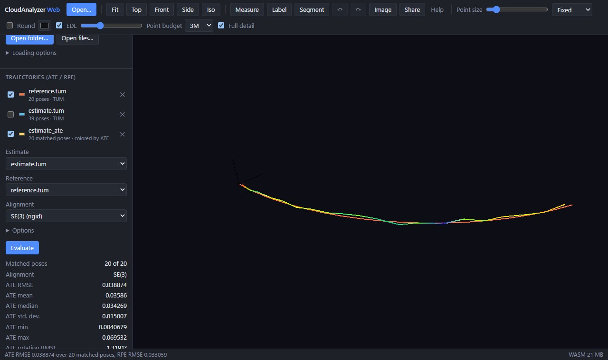<br><b>Trajectory ATE / RPE</b>, same numbers as the CLI</td>
    <td>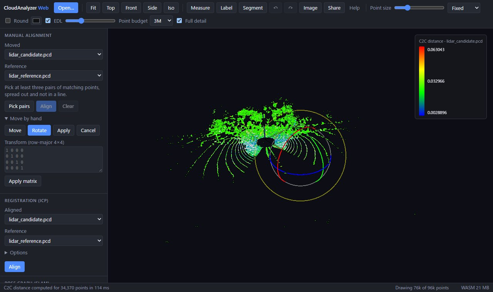<br><b>Alignment</b>: point pairs, a gizmo, ICP</td>
  </tr>
</table>

<p align="center">
  <a href="https://rsasaki0109.github.io/CloudAnalyzer/app/?demo=posegraph">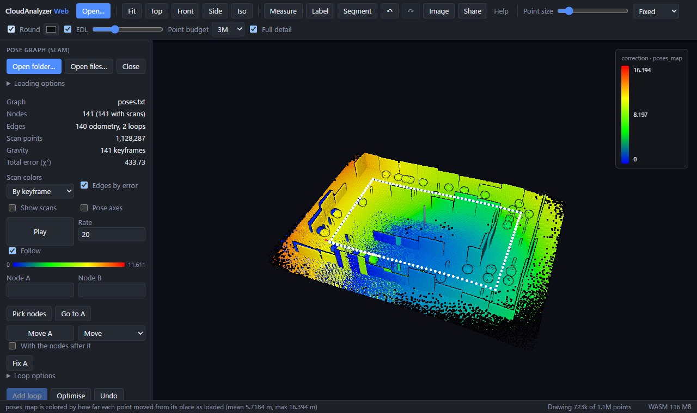</a><br>
  <b>SLAM pose graph</b> (like interactive_slam): close loops with ICP by hand or automatically, tie keyframes to IMU gravity,
  and see how far the correction moved every point of the map
</p>

<p align="center">
  <a href="https://rsasaki0109.github.io/CloudAnalyzer/app/?demo=posegraph-drive">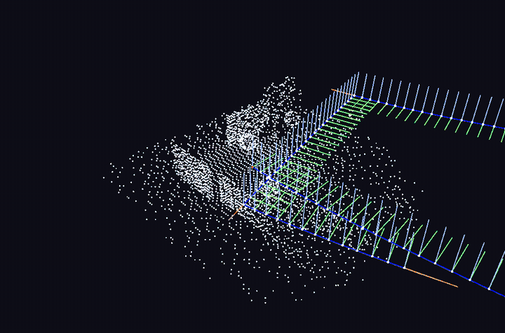</a>
  <a href="https://rsasaki0109.github.io/CloudAnalyzer/app/?demo=posegraph-drive">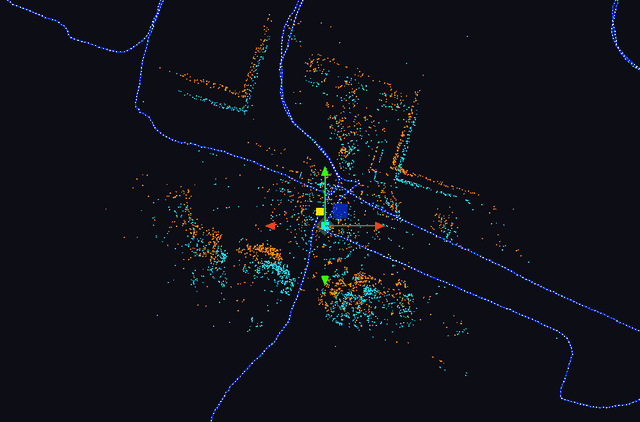</a><br>
  <b>LiDAR odometry, replayed</b>: scans build up along the drive (height colors, pose axes) ·
  <b>A loop closed by hand</b>: pick two keyframes, ICP registers them, and the drifted lap glides into place
</p>

<p align="center">
  <a href="https://rsasaki0109.github.io/CloudAnalyzer/app/?demo=posegraph-drive">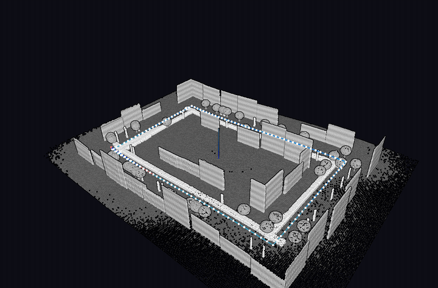</a><br>
  <b>Dynamic objects removed</b>: points other scans saw through (passing cars) leave the map, as a red cloud of their own
  (F1 0.67 on SemanticKITTI 07, keeping 99.9 % of the static points)
</p>

<p align="center">
  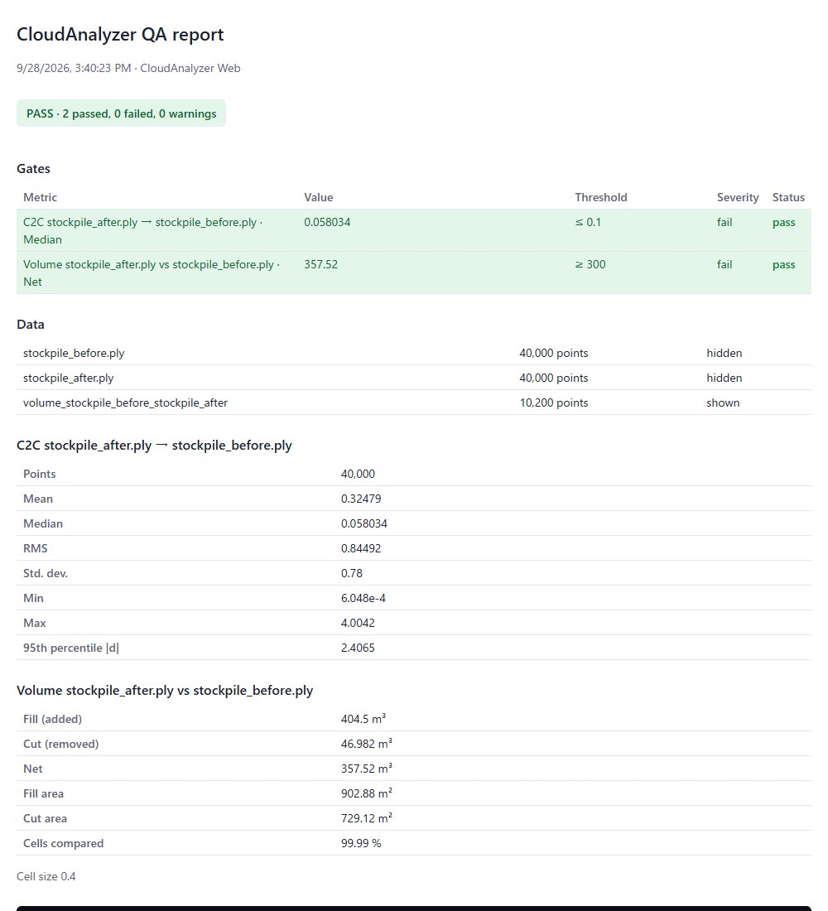<br>
  <b>QA report</b>: pass / fail gates on any result, as HTML or JSON in the <code>ca check</code> gate format
</p>

### Features

- **Open** PLY, PCD, LAS/LAZ, E57 (all scans, posed), XYZ and OBJ/STL meshes, including tens of millions of points,
  Gaussian Splatting output (3DGS PLY, `.splat`) as points with color, opacity and size,
  and COPC files straight from a URL (only the levels you need are downloaded).
  LAS/LAZ files larger than memory (hundreds of millions of points) open thinned and show every point of the
  file where you zoom in, read from the file on demand without converting it.
  Georeferenced coordinates (UTM, ECEF) stay exact to the millimetre.
- **Compare**: cloud-to-cloud and cloud-to-mesh distance, M3C2 change detection, cut/fill volume,
  map quality against a ground-truth map (accuracy, completeness, Chamfer, AWD / SCS as in MapEval),
  trajectory ATE / RPE (TUM, KITTI, CSV; SE(3) / Sim(3) alignment, same numbers as the Python CLI).
- **Process**: ICP and manual alignment (point pairs, gizmo, matrix), subsampling (voxel, minimum distance, octree level, random), outlier removal, ground extraction (CSF), normals, merge/split,
  rasterize to a DEM / DSM (GeoTIFF or colored PNG), RANSAC shape detection (planes, cylinders, spheres)
  and Euclidean clustering, mesh a cloud (2.5D Delaunay).
- **Fix SLAM maps** (like interactive_slam): open a g2o pose graph or a TUM / KITTI trajectory with its scans,
  close loops between two picked keyframes with ICP, optimise the graph and export the poses and the map.
- **Scalar fields**: color by any per-point value, histograms, range filters and a field calculator.
- **Inspect**: clipping box, lasso segmentation with undo/redo, cross-section profiles, picking, measuring and labels; save the view as a PNG.
- **Report**: pass / fail gates on any result, saved as an HTML QA report or JSON in the `ca check` gate format.
- **Share**: links and session files that restore the view; export PLY, LAS/LAZ (distances as extra bytes), E57 or CSV,
  and meshes as PLY or OBJ.
- Checked against CloudCompare in CI; works on phones and tablets.

### Try it

| Demo | What it shows |
|---|---|
| [Two LiDAR scans](https://rsasaki0109.github.io/CloudAnalyzer/app/?demo=c2c) | Cloud-to-cloud distance |
| [Stockpile](https://rsasaki0109.github.io/CloudAnalyzer/app/?demo=volume) | Cut / fill volume |
| [Town](https://rsasaki0109.github.io/CloudAnalyzer/app/?demo=ground) | Ground extraction |
| [Landslide](https://rsasaki0109.github.io/CloudAnalyzer/app/?demo=m3c2) | M3C2 change detection |

Or drop your own files on the [viewer](https://rsasaki0109.github.io/CloudAnalyzer/app/), or open one from a URL with
`?url=https://…/cloud.laz`.

## CLI: SLAM and 3D perception QA in CI

**Catch SLAM and 3D perception regressions before they ship.** `ca` turns SLAM, LiDAR, point-cloud, perception and
3DGS outputs into metrics, reports and pass/fail gates.

<!-- Regenerate with `scripts/build_readme_gif.sh` (requires vhs and `ca`). -->
<p align="center">
  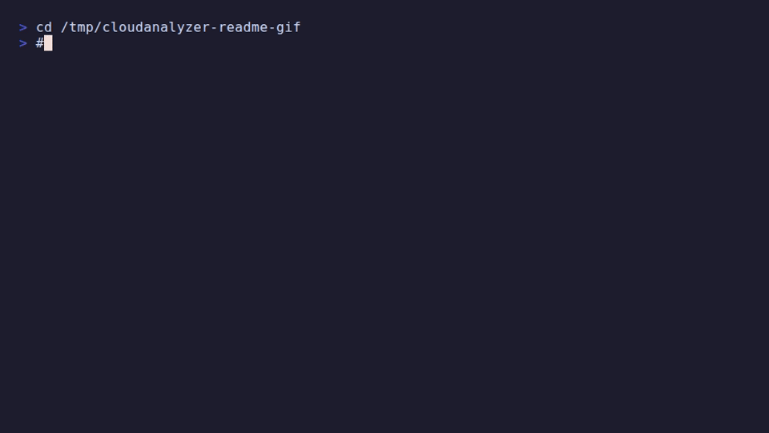
</p>

<p align="center">
  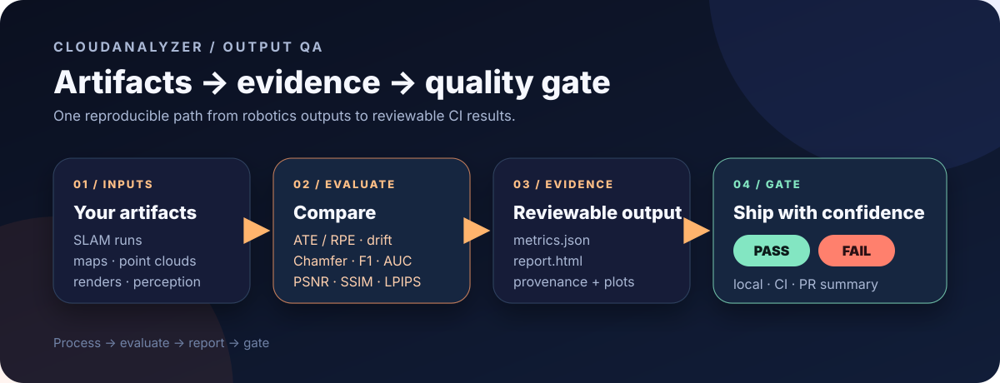
</p>

### Why teams use it

- Compare candidate maps, trajectories, point clouds, and renders with a frozen reference.
- Export metrics JSON, an HTML report, and a deterministic CI gate.
- Keep provenance so every result can be reviewed and reproduced.

> **Checked-in proof:** `PASS` · Map AUC `1.0000` · Chamfer `0.0145 m` ·
> Trajectory ATE RMSE `0.0016 m` · [open the report](docs/leaderboard/runs/kiss-slam__synthetic-oval/report.html)

### Examples

<p align="center">
  <a href="https://rsasaki0109.github.io/CloudAnalyzer/demo/perception/">
    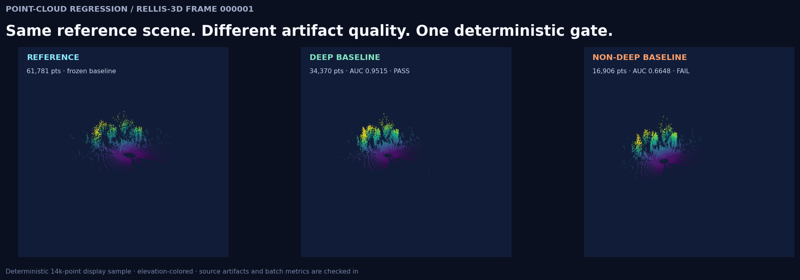
  </a>
</p>

<table>
  <tr>
    <td width="50%"><a href="https://rsasaki0109.github.io/CloudAnalyzer/demo/perception/">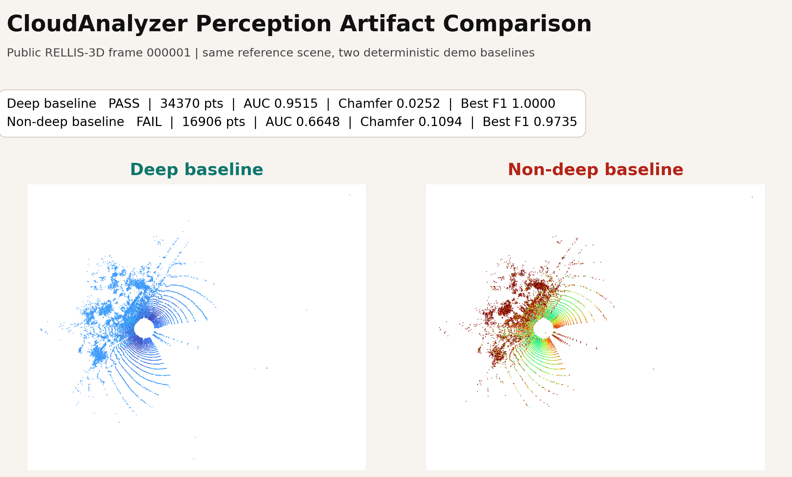</a></td>
    <td width="50%"><a href="https://rsasaki0109.github.io/CloudAnalyzer/demo/compare/">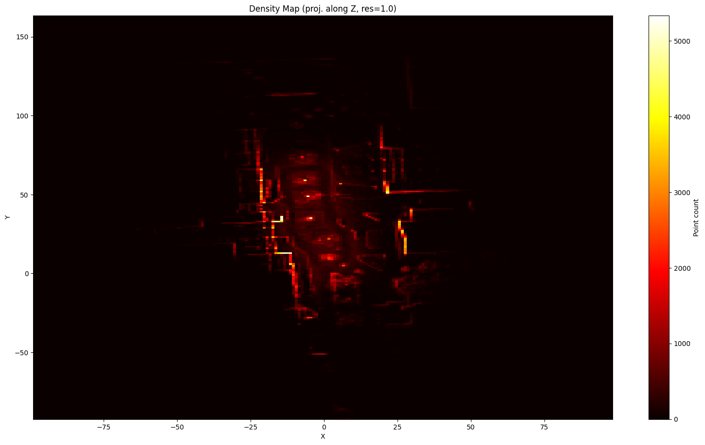</a></td>
  </tr>
  <tr>
    <td width="50%"><a href="docs/commands/geometry-evaluate.md">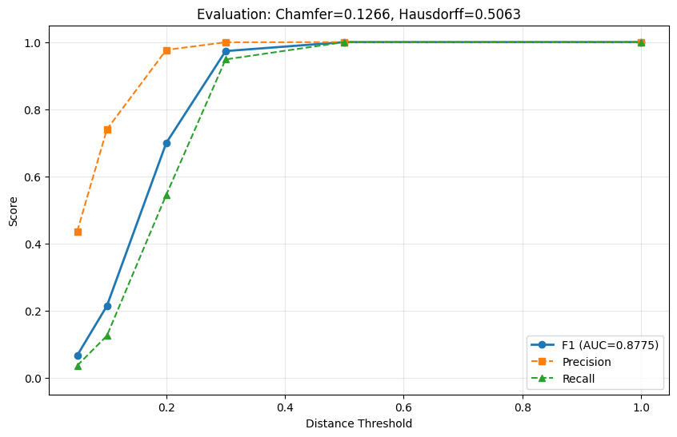</a></td>
    <td width="50%"><a href="https://rsasaki0109.github.io/CloudAnalyzer/demo/3dgs/">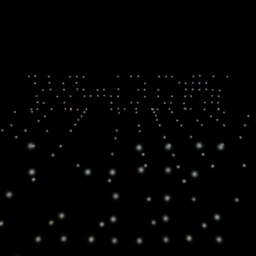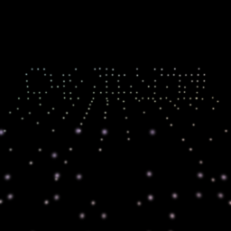</a></td>
  </tr>
</table>

### Quick start

```bash
pip install cloudanalyzer
ca evaluate candidate.pcd reference.pcd
```

From this repository:

```bash
pip install -e ./cloudanalyzer
```

### Golden path: SLAM benchmark

The bundled synthetic Figure-8 suite checks a map and trajectory against frozen
references:

```text
inputs:   dataset suite + baseline/reference + candidate outputs
outputs:  metrics JSON + HTML report + pass/fail gate + leaderboard-ready result
```

```bash
ca benchmark info benchmarks/slam/synthetic-figure8/suite.yaml
ca benchmark eval benchmarks/slam/synthetic-figure8/suite.yaml \
  --map benchmarks/slam/synthetic-figure8/sample_outputs/map_pass.pcd \
  --trajectory benchmarks/slam/synthetic-figure8/sample_outputs/trajectory_pass.tum \
  --out qa/synthetic-figure8
```

The same path runs in the [SLAM benchmark smoke workflow](.github/workflows/slam-benchmark-smoke.yml)
and is explained in the [SLAM tutorial](docs/tutorial-slam-benchmark.md).

### Live demos

- [Demo hub](https://rsasaki0109.github.io/CloudAnalyzer/)
- [Web viewer](https://rsasaki0109.github.io/CloudAnalyzer/app/)
- [Point-cloud comparison](https://rsasaki0109.github.io/CloudAnalyzer/demo/compare/)
- [SLAM leaderboard](https://rsasaki0109.github.io/CloudAnalyzer/leaderboard/)
- [3DGS evaluation](https://rsasaki0109.github.io/CloudAnalyzer/demo/3dgs/)
- [Perception report](https://rsasaki0109.github.io/CloudAnalyzer/demo/perception/)

### Docs

- [Command reference](docs/commands/)
- [CI and quality gates](docs/ci.md)
- [Map quality-gate tutorial](docs/tutorial-map-quality-gate.md)
- [Unified run quality-gate tutorial](docs/tutorial-run-quality-gate.md)
- [Public benchmark packs](benchmarks/public/README.md)
- [Architecture](docs/architecture.md)

## What's inside

| Path | |
|---|---|
| [`web/`](web/) | The browser app (TypeScript, three.js) |
| [`rust/`](rust/) | The Rust core, its WebAssembly bindings and Python bindings (`cloudanalyzer_core`) |
| [`cloudanalyzer/`](cloudanalyzer/) | `ca`, the Python CLI for SLAM and point-cloud quality gates in CI (`pip install cloudanalyzer`) |

## Develop

```sh
cd web
npm install
npm run wasm   # build the Rust core to WebAssembly
npm run dev    # http://localhost:5173
```

Tests: `cargo test` in `rust/`, `npx playwright test` in `web/`. `npm run media` (after `npm run build`)
re-takes the README screenshots and GIF above.

## License

[MIT](LICENSE). Public demo data, sample data and derived images keep their upstream terms; see the
[image attribution](docs/images/ATTRIBUTION.md) and the [sample attribution](web/public/samples/ATTRIBUTION.md).
