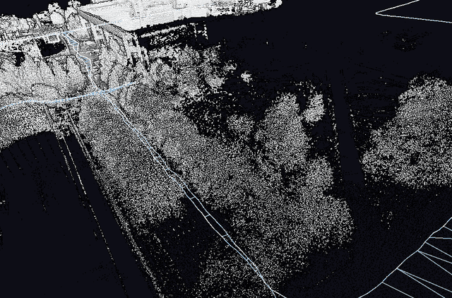

# CloudAnalyzer

[](https://github.com/rsasaki0109/CloudAnalyzer/actions/workflows/test.yml)
[](https://github.com/rsasaki0109/CloudAnalyzer/actions/workflows/self-qa.yml)
[](LICENSE)

**Fix your SLAM map, clean it, measure it. In the browser.**

CloudAnalyzer is a point cloud viewer and analyzer that runs in your browser: open a drive's poses and scans,
close its loops, take out the cars that drove past, and compare the result with last week's map or the ground truth.
Everything runs locally in Rust compiled to WebAssembly, on every core: nothing to install, and your data
never leaves your machine.

<p align="center">
  <a href="scripts/prepare_nclt.py"></a><br>
  A loop closed by hand on a real drive (NCLT, University of Michigan): the same place seen twice a kilometre apart,
  lined up with ICP, and the drive pulled together
</p>

<p align="center">
  <b><a href="https://rsasaki0109.github.io/CloudAnalyzer/app/">Open the app</a></b> ·
  <a href="https://rsasaki0109.github.io/CloudAnalyzer/app/?demo=nclt">A real drive from a ROS bag</a> ·
  <a href="https://rsasaki0109.github.io/CloudAnalyzer/guide.html">Guide</a> ·
  <a href="#proven-on-real-data">Results on KITTI</a> ·
  <a href="#ca-the-ci-command-line">CLI</a>
</p>

## 1. Fix the map

Drop a folder with a trajectory (KITTI, TUM) or a g2o pose graph and one scan per pose, or just a ROS bag
(ROS 1 `.bag`, ROS 2 `.mcap`): LiDAR odometry turns its scans into a pose graph in the browser, and its IMU
levels it.

<p align="center">
  <a href="scripts/fetch_pandaset.py"></a>
  <a href="scripts/prepare_nclt.py"></a><br>
  <b>Replay the drive</b> scan by scan (PandaSet, San Francisco) · <b>See the correction</b>: every point colored by how far it moved
</p>

- **Close loops** between two keyframes you pick, or let it search the whole drive: candidates are found within
  the drift the odometry could have built up, registered with ICP on the worker pool, and kept only when their
  structure (not just the road) overlaps.
- **Level it** with the IMU's gravity (KITTI OXTS or a plain `index ux uy uz` file) or a floor plane.
- **Drag a keyframe** with a gizmo, fix it, undo anything; edges colored by their error show what disagrees.
- **Join sessions**: a second drive through the same streets is attached where they meet and tied in with loops.
- **Export** the graph as g2o, the poses as KITTI / TUM, and the map as a cloud.

## 2. Clean it and see what changed

<p align="center">
  <a href="scripts/fetch_pandaset.py"></a><br>
  A real street (PandaSet scene 019, 80 Pandar64 scans): the traffic's ghost trails turn red and leave the map
</p>

- **Remove dynamic objects**: points that nearby scans saw straight through (passing cars, pedestrians) leave the
  map as a red cloud of their own; parked cars, seen again from every side, stay.
- **Compare sessions or passes** with M3C2 and get the list of changed objects: a car that left, a new container,
  or a whole season:

<p align="center">
  <a href="scripts/prepare_nclt.py"></a><br>
  The same campus trees in June and December 2012 (NCLT), two drives joined in the app:
  full crowns, then bare branches
</p>

- **Score a map against ground truth**: accuracy, completeness, F1, Chamfer, and the Wasserstein distance between
  voxel Gaussians (AWD) and its spread (SCS), which tells a shifted map from a bent one.
- **Ground and terrain**: extract the ground (CSF) and rasterize a DEM of the corrected map.

## 3. Measure any point cloud

The same app is a full point cloud workbench for survey, construction and mapping data.

<table>
  <tr>
    <td width="33%"><a href="https://rsasaki0109.github.io/CloudAnalyzer/app/?demo=c2c"></a><br><b>C2C / C2M distance</b></td>
    <td width="33%"><a href="https://rsasaki0109.github.io/CloudAnalyzer/app/?demo=m3c2"></a><br><b>M3C2</b> change detection</td>
    <td width="33%"><a href="https://rsasaki0109.github.io/CloudAnalyzer/app/?demo=volume"></a><br><b>Cut / fill volume</b></td>
  </tr>
  <tr>
    <td><a href="https://rsasaki0109.github.io/CloudAnalyzer/app/?demo=ground"></a><br><b>Ground extraction</b> (CSF)</td>
    <td><br><b>Cross-sections</b> along a polyline</td>
    <td><br><b>RANSAC shapes</b> and clustering</td>
  </tr>
</table>

Also: ICP and manual alignment, subsampling, outlier removal, normals, 2.5D meshing, DEM / DSM to GeoTIFF,
scalar fields with a calculator, lasso segmentation with undo, trajectory ATE / RPE, and an HTML QA report with
pass / fail gates. See the [guide](https://rsasaki0109.github.io/CloudAnalyzer/guide.html) for all of it.

**Opens** PLY, PCD, LAS / LAZ, E57, XYZ, KITTI `.bin`, OBJ / STL, Gaussian Splatting (3DGS PLY, `.splat`) and
COPC from a URL. LAS / LAZ larger than memory open thinned and fill in where you zoom; UTM and ECEF
coordinates stay exact to the millimetre. **Saves** PLY, LAS / LAZ, E57, CSV and session links.

## Proven on real data

Measured in the app on public datasets, with [KISS-ICP](https://github.com/PRBonn/kiss-icp) odometry as the input:

| KITTI trajectory ATE (RMSE) | Odometry | + loops | + IMU gravity |
|---|---|---|---|
| 00 &nbsp; 4,541 scans, 3.7 km | 22.3 m | 11.1 m | **5.8 m** |
| 07 &nbsp; 1,101 scans | 2.14 m | 1.65 m | **1.16 m** |
| 09 &nbsp; 1,591 scans, 38 m of hills | 16.4 m | 6.2 m | **2.3 m** |

| NCLT 2012-04-29 (Segway on campus, 2,777 keyframes, 3.2 km) | Odometry | + loops |
|---|---|---|
| Trajectory ATE, SE(3)-aligned | 4.83 m | **1.64 m** (168 loops found in 11 s) |

| KITTI map against the ground-truth map | Odometry | + loops + IMU gravity |
|---|---|---|
| 07 &nbsp; F1 at 0.3 m | 0.45 | **0.70** |
| 09 &nbsp; F1 at 0.3 m | 0.16 | **0.42** |

- **Dynamic objects** on SemanticKITTI 07: F1 0.67 against the moving-object labels, 99.9 % of static points kept,
  1,101 scans in 8 s.
- **Across days**: KITTI 00 (Oct 3) joined with 07 (Sep 30) through 202 loops; the buildings agree to a mean of
  2 mm, and the changed objects are the parked cars.
- **Across seasons**: NCLT June 2012 joined with December 2012 through 454 loops; 26 % of where they meet changed
  by more than the level of detection, largest first the trees.

## Try it

| Demo | |
|---|---|
| [Real drive from a ROS bag](https://rsasaki0109.github.io/CloudAnalyzer/app/?demo=nclt) | Once round a block on the NCLT campus, as a ROS 2 bag of scans and IMU (10 MB): odometry, gravity and loops |
| [SLAM loop closure](https://rsasaki0109.github.io/CloudAnalyzer/app/?demo=posegraph) | A drifting drive round a block: loops found, gravity tied, correction shown |
| [SLAM drive](https://rsasaki0109.github.io/CloudAnalyzer/app/?demo=posegraph-drive) | The same drive to fix yourself: replay, close a loop, remove cars |
| [Two LiDAR scans](https://rsasaki0109.github.io/CloudAnalyzer/app/?demo=c2c) | Cloud-to-cloud distance |
| [Landslide](https://rsasaki0109.github.io/CloudAnalyzer/app/?demo=m3c2) | M3C2 change detection |
| [Stockpile](https://rsasaki0109.github.io/CloudAnalyzer/app/?demo=volume) | Cut / fill volume |
| [Town](https://rsasaki0109.github.io/CloudAnalyzer/app/?demo=ground) | Ground extraction |

Or drop your own files on the [app](https://rsasaki0109.github.io/CloudAnalyzer/app/), or open one from a URL with
`?url=https://…/cloud.laz`.

## `ca`: the command line, for CI and AI agents

`ca` runs the same Rust core natively, on all cores and without the browser's memory limit. It turns SLAM, LiDAR,
perception and 3DGS outputs into metrics, HTML reports and pass / fail gates for CI, and it fixes SLAM maps:

```bash
pip install "cloudanalyzer[fast,slam,ros]"
ca posegraph-fix drive.mcap --out fixed/ --remove-dynamic --keyframe-spacing 1   # 1. a recording in, a fixed map out
ca web-view fixed/                                                            # 2. look at it in the web app
ca posegraph-compare june/ december/ --here 1219 --there 850 --out changes/   # 3. what changed between two drives
```

1. From a ROS bag (or a folder of scans, or poses and scans), [`ca posegraph-fix`](docs/commands/posegraph-fix.md)
   makes the odometry with KISS-ICP, closes the loops, levels the map with the bag's IMU (its mounting estimated
   from the drive), leaves out what moved, and writes the fixed poses, g2o and map, with a JSON report.
2. [`ca web-view`](docs/commands/web-view.md) serves the results from your machine and opens them in the app with
   one link, to look at, measure and fix by hand.
3. [`ca posegraph-compare`](docs/commands/posegraph-compare.md) joins two drives through the same places and lists
   the changed objects.

On hdl_graph_slam's recorded drive (`hdl_400.bag`: a Velodyne HDL-32E and a GPS/IMU, 126 s), step 1 finds 8 loops,
estimates the IMU's mounting (its up directions spread 8.6° before, 2.2° after) and leaves out 4.7 % of the points
as dynamic, in about three minutes. [`ca mcp`](docs/commands/mcp.md) gives AI agents the same tools over MCP
(`claude mcp add cloudanalyzer -- ca mcp`), from `slam_odometry` to `view_link`.

For CI, `ca evaluate candidate.pcd reference.pcd` scores a map against a reference; start with the
[SLAM benchmark tutorial](docs/tutorial-slam-benchmark.md), then the
[command reference](docs/commands/), [CI and quality gates](docs/ci.md) and the
[SLAM leaderboard](https://rsasaki0109.github.io/CloudAnalyzer/leaderboard/).

## What's inside

| Path | |
|---|---|
| [`web/`](web/) | The browser app (TypeScript, three.js, a pool of WebAssembly workers) |
| [`rust/`](rust/) | The Rust core: registration, pose graph optimisation, M3C2, visibility, octrees, I/O; WebAssembly and Python bindings |
| [`cloudanalyzer/`](cloudanalyzer/) | `ca`, the Python CLI for quality gates in CI |

## Develop

```sh
cd web
npm install
npm run wasm   # build the Rust core to WebAssembly
npm run dev    # http://localhost:5173
```

Tests: `cargo test` in `rust/`, `npx playwright test` in `web/`. `npm run media` (after `npm run build`)
re-takes the README screenshots and GIFs.

## License

[MIT](LICENSE). Public demo data, sample data and derived images keep their upstream terms; see the
[image attribution](docs/images/ATTRIBUTION.md) and the [sample attribution](web/public/samples/ATTRIBUTION.md).
The pose graph pictures are of real drives: [NCLT](http://robots.engin.umich.edu/nclt/) session 2012-04-29
(University of Michigan, [Open Database License](https://opendatacommons.org/licenses/odbl/1-0/), prepared with
[`scripts/prepare_nclt.py`](scripts/prepare_nclt.py)) and 2012-06-15 / 2012-12-01 for the loops, corrections and seasons,
with the ROS bag demo made from 2012-04-29 by [`scripts/make_nclt_bag.py`](scripts/make_nclt_bag.py); and [PandaSet](https://pandaset.org)
scene 019 (Scale AI and Hesai, [CC BY 4.0](https://creativecommons.org/licenses/by/4.0/), fetched with
[`scripts/fetch_pandaset.py`](scripts/fetch_pandaset.py)) for the odometry and dynamic objects.
KITTI data is not redistributed here.
