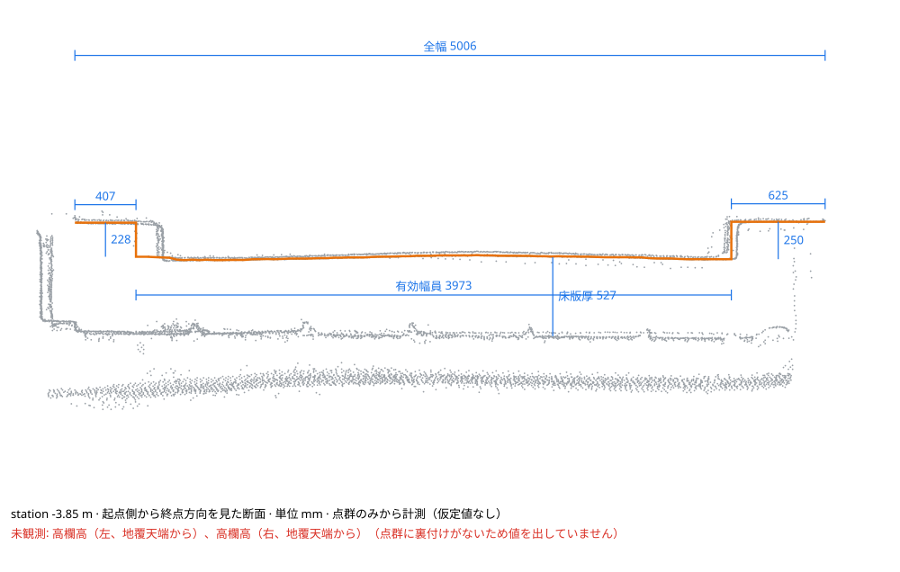
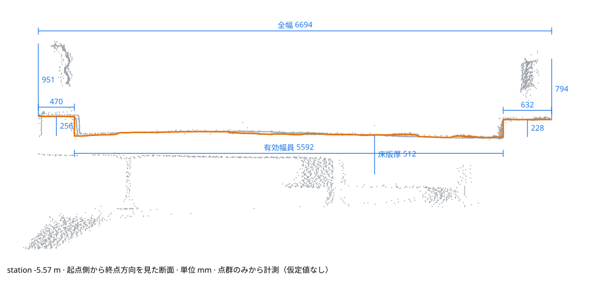
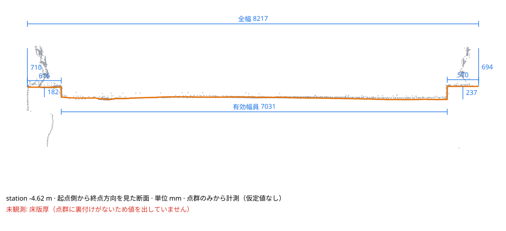

# Bridge sections on three public reinforced-concrete bridges

`ca bridge-sections` cut cross sections every 1 m along three bridges of the
public [Point Cloud Dataset of Reinforced Concrete Bridges Captured with Matterport
Pro3 Scanner in Japan](https://doi.org/10.6084/m9.figshare.28091453.v2)
(Pang-jo Chun, Chao Lin, Tatsuro Yamane, Shiori Kubo, Yu Chen; CC BY 4.0) and
aggregated a member dimension table. The scans are local metres with 1 mm
coordinate resolution; the scanner's stated accuracy is ±20 mm at 10 m.

```bash
ca bridge-sections Bridge_4.las -o bridge_4 --classes 0,1,2,3 --axis-classes 2
```

`--classes 0,1,2,3` keeps the dataset's abutment, girder, deck and parapet labels
and drops class 4 (vegetation, terrain, utilities). `--axis-classes 2` takes the
axis and the skewed deck ends from the deck points. The labels select points
only; every dimension below is measured from geometry. The point clouds are not
committed: each `bridge_sections.json` records the source file's SHA-256.

| Median (p10–p90) | Bridge_2 | Bridge_4 | Bridge_5 |
|---|---:|---:|---:|
| Sections measured | 9 / 9 | 14 / 14 | 14 / 14 |
| Deck length on the centreline (m) | 9.428 | 14.660 | 15.880 |
| Skew (°) | 0.3 | −10.7 | −17.0 |
| Total width (m) | 5.015 (4.970–5.043) | 6.683 (6.646–6.712) | 8.218 (8.098–8.235) |
| Effective width between curbs (m) | 3.870 (3.462–3.985) | 5.585 (5.540–5.624) | 7.030 (6.895–7.037) |
| Crown height (m) | 0.034 | 0.074 | 0.025 |
| Cross slope left / right (%) | −2.3 / 2.3 | −2.7 / 2.5 | −1.5 / 1.0 |
| Curb width left / right (m) | 0.568 / 0.578 | 0.502 / 0.600 | 0.613 / 0.586 |
| Curb height left / right (m) | 0.252 / 0.250 | 0.246 / 0.239 | 0.219 / 0.236 |
| Parapet height left / right (m) | unobserved | 0.953 / 0.924 | 0.701 / 0.675 |
| Visible outer-face depth left / right (m) | ≥ 0.442 / ≥ 0.438 | ≥ 0.283 / ≥ 0.339 | ≥ 0.258 / ≥ 0.284 |
| Slab thickness (m) | 0.498 (0.478–0.550) | 0.302 (0.287–0.331) | unobserved |

The widths are measured independently, yet effective width plus both curb widths
reproduces the total width within 1–11 mm on every bridge. Bridge_5 was scanned
from the deck only: there are no returns beneath it, so its slab thickness is
reported as unobserved instead of an assumed value. Bridge_2 carries no parapet
points, and its parapet heights are unobserved for the same reason. Outer-face
depths are visible extents below the deck top, lower bounds rather than member
depths.

| Bridge_2 | Bridge_4 | Bridge_5 |
|---|---|---|
|  |  |  |

## Limits

- No reference dimensions were available, so these are measurements, not an
  accuracy evaluation. The p10–p90 spread includes real variation along each
  bridge, scanner noise and section placement.
- Slab thickness is the first surface beneath the deck top: on a girder bridge
  it is measured between girders only when the underside was scanned.
- Interior girders, bearings and abutment dimensions are not measured yet.
- A deck that the labels do not separate from overhanging vegetation needs
  `--classes` or cropping; without labels the deck is still the highest long
  smooth surface, but trees above it are not guaranteed to be excluded.
