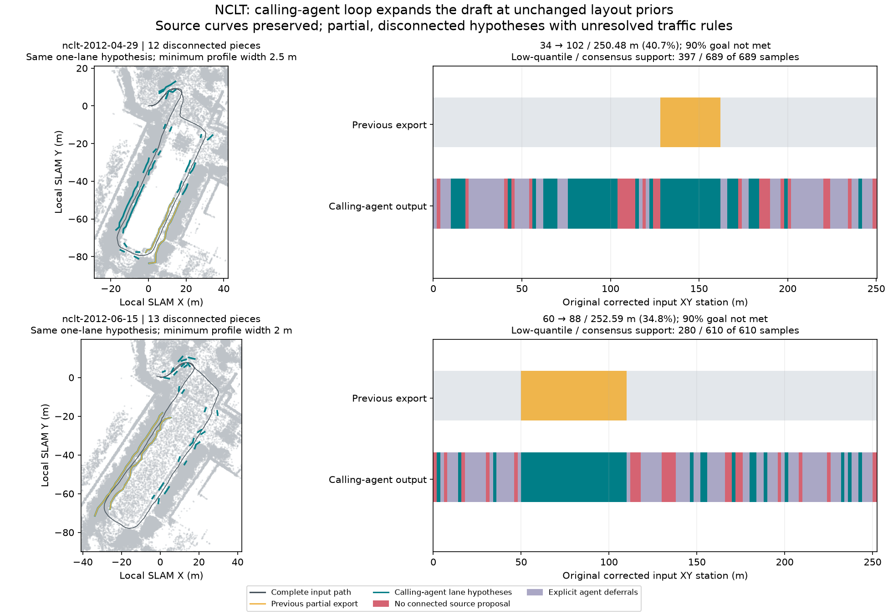

# NCLT: calling-agent MCP loop to both map drafts

On 2026-10-09 JST, the Codex assistant in this development session started two
fresh mapping runs through MCP, inspected every offered corridor, chose source
ranges from those live observations and finished with point-cloud and Lanelet2
draft paths. Startup supplied one layout hypothesis per run, **no corridor IDs
or per-piece lane specifications**. The runner bound the layout automatically.
No additional user choices were requested during candidate review/generation.

The calling assistant made the adoption decisions. CloudAnalyzer has no embedded
LLM, candidate ranking or NCLT-specific adoption rules. The saved IDs are this
run's decision trace, not presets used at startup. A deterministic client paged
and inspected all candidates over MCP; the assistant then read those receipts
and issued the recorded include/defer decisions.

| Result | 2012-04-29 | 2012-06-15 |
| --- | ---: | ---: |
| Point-map points | 683,690 | 645,432 |
| Offered / inspected candidates | 52 / 52 | 77 / 77 |
| Calling-agent inspection actions | 7 | 10 |
| Include/defer decisions | 60 | 83 |
| Runner-bound lane specifications | 12 | 13 |
| Saved disconnected source pieces | 12 | 13 |
| Previous lane hypothesis extent | 34 m (13.57%) | 60 m (23.75%) |
| Current lane hypothesis extent | **102 m (40.72%)** | **88 m (34.84%)** |
| Original corrected input XY station length | 250.48 m | 252.59 m |
| Input extent still without a lane hypothesis | 148.48 m | 164.59 m |
| Low-quantile support / trace samples | 397 / 689 | 280 / 610 |
| Ground-consensus support / trace samples | 689 / 689 | 610 / 610 |
| Native structural errors | 0 | 0 |
| Job's original 90% extent goal met | **No** | **No** |
| Shared HD attempts spent / remaining | 2 / 4 | 2 / 4 |
| Automatic whole-drive selection | None | None |

Every point map, raw source and native binary SHA-256 matches the
[previous lane-export run](../nclt-corridor-lanes/README.md). Both runs retain
the same one-forward-driving-lane hypothesis per piece, one-way use, 40 km/h,
fraction 1 and `source_span_hypothesis` policy. Minimum profile widths remain
2.5 m for April and 2 m for June. Neither width requirements nor the full-input
denominator was reduced. Extra coverage comes from adopting more observed
source intervals; independent accuracy improvement is **not** established.
The total IR lane counts represent separate pieces, not 12/13 parallel lanes.

## Decisions and remaining holds

The subsequent [explicit path-association experiment](../nclt-path-refinement/README.md)
re-extracts from identical point maps, retaining all profiles and thresholds, then
generates 106 / 112 m at the same layout. June's longest exported piece grows
60 → 66 m; the whole-drive network and source-estimator disagreement remain unresolved.

The assistant read path association, supported surface level, profile spans,
edge evidence and competing bands. Included ranges have the recorded path
inside every saved profile and satisfy the unchanged width constraint. Exact
original source curves were preserved. Profiles narrower than the fixed minimum
or outside the path were deferred; gaps were not joined. These observations do
not establish physical road identity, complete width or legal traffic semantics.

April's choices retain observed ranges from candidates 4, 13, 17, 18, 21, 22,
29, 30, 34 and 47. Candidate 17 supplies three separate pieces; narrow intervals
between them remain deferred. Broad/rapidly varying/search-limited candidates
8, 32 and 44 remain unresolved. June retains ranges from 1, 9, 19, 25, 39, 47,
51, 53, 56, 72 and 73; candidates 39 and 73 each supply separate pieces.
Candidate 54's broad/search-limited span remains deferred. Other candidates and
omitted tails have explicit deferral reasons. No physical road absence is
inferred from a deferral, and original source ambiguity remains in the reports.

The agent finished after one draft action per run because the remaining source
observations did not justify another adoption under this hypothesis. Four
attempts remain; they were not spent merely to increase a score. These live
NCLT runs did not require native retry. Functional tests separately cover a
failed narrow band followed by another inspected band at unchanged layout,
stale-action rejection and interruption before/after lane publication without
double-spending attempts.

All four audits are complete, without omitted/malformed lanes or structural
errors. Editable and reopened OSM evidence is identical for each estimator.
Low quantile retains 292 / 330 height-mismatch samples while ground consensus
retains none; neither reports insufficient returns. Both protocols and their
disagreement remain saved. More exported extent does not make the low-quantile
support fraction better, and selecting the better estimator is not accuracy
validation. Inspect layered returns and source levels before choosing how to
interpret the surface. Both maps remain `draft_needs_review`,
`source_quality_passed=false`, unselected and `deployment_ready=false`.

These are 190-second Segway excerpts, thinned to 0.8 m with returns within 1.5 m
of the sensor removed. Jobs use 1 m keyframes, loop closure, recorded IMU gravity
and dynamic-point removal. Point maps remain `generated_unverified`. Road
connectivity between pieces, complete physical width, lane identity, traffic
rules, equipment and georeferencing remain unresolved. Both attempted whole-drive
selection checks still reject the original 90% extent shortfall.

## Inspect and reproduce

Open [April's IR](april/vector_map.json) or [June's IR](june/vector_map.json) over
the corresponding generated point map. Each folder contains Lanelet2 OSM,
local projector metadata, source geometry, fixed layout, decisions, full
four-way source audit and the calling-agent history. The
[verification record](verification.json) contains source/native/map/proposal/
geometry/lane hashes, complete station dispositions, audit totals, startup
inputs and comparison conditions. Histories and evidence normalize paths;
their recorded hashes identify original files before normalization. Large
point maps and proposals remain generated outputs.

For a new autonomous run, register `ca mcp` and ask the agent to use
`start_mapping_run`, inspect the offered source and continue through
`advance_mapping_run` to finish, as described in the
[mapping-run workflow](../../../docs/commands/mapping-run.md). Initial layout
files are provided here; choices must be reconsidered from each fresh report.
Proposal IDs are not persistent road identities. Use a new output directory
and do not replace a binary pinned by a live job.

To replay this result's processing choices explicitly for comparison, start a
new run with the recording and the corresponding `layout.json`, inspect every
candidate referenced by `decisions.json`, issue one draft action with those
decisions and finish with its returned lane attempt ID. This is a **replay**,
not an independent autonomous-agent evaluation. The full MCP action sequence
is in `agent-history.json`. Fresh language-model decisions can differ.

Startup requires one hypothesis object rather than per-piece lane JSON; all
12/13 specifications were bound by the runner. This demonstrates the reduced
configuration pathway and completed calling-agent loop. Operator effort and
wall-clock savings were not independently measured against a human baseline.
The figure displays every eighth saved point for context; proposals and source
audits used the full map. Trace-sample counts are neither unique point counts
nor percentages of road length. No independent ground truth was used.

## Attribution

University of Michigan NCLT; N. Carlevaris-Bianco, A. K. Ushani and R. M. Eustice,
“University of Michigan North Campus long-term vision and lidar dataset”, IJRR
2016. Sources and derived evidence, IR, OSM and figure are offered under
[ODbL 1.0](https://opendatacommons.org/licenses/odbl/1-0/), with database contents
under [DBCL 1.0](https://opendatacommons.org/licenses/dbcl/1-0/). Retain upstream
[sample attribution](../../../web/public/samples/ATTRIBUTION.md). Software remains
under the repository's MIT license.
