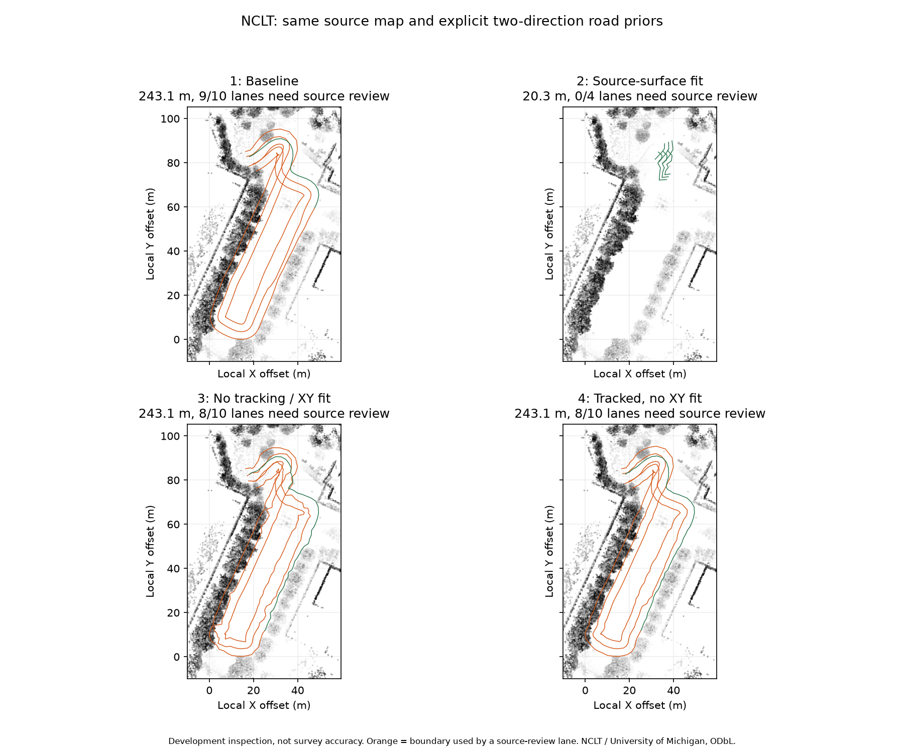
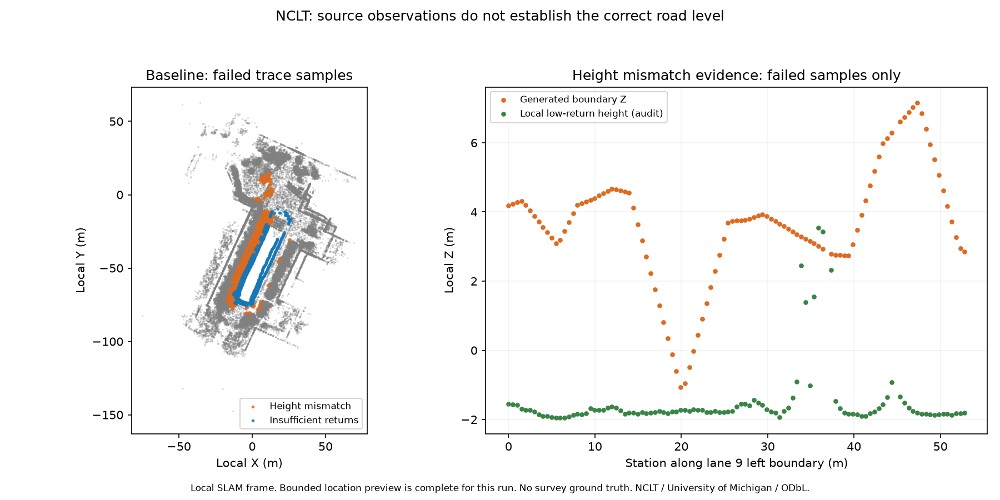
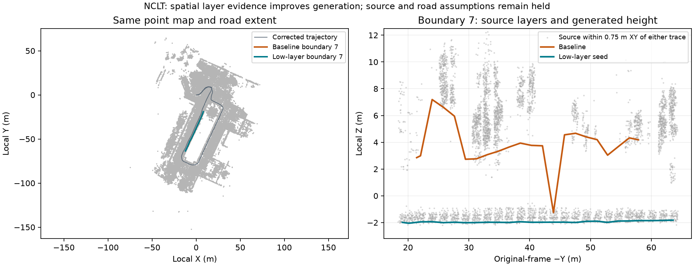

# NCLT: agent-controlled generation of both maps

For the subsequent stage before lane assumptions, see
[lane-free surface proposals on both bundled NCLT recordings](../nclt-corridors/README.md).
It retains 52/77 candidates and local curb hints while leaving complete widths
unresolved; it does not automatically adopt traffic semantics.

On 2026-10-08, the calling agent ran the bundled NCLT recording through
`mapping-start`, read each result, chose four explicit road hypotheses through
`mapping-candidate`, and selected a review draft. The tools contain no LLM or
automatic semantic decision maker. This verifies that the agent can generate
both maps without operating the editor; it does not verify survey accuracy or
complete HD-map semantics.

Input: [`nclt-2012-04-29.mcap`](../../../web/public/samples/nclt-2012-04-29.mcap),
a thinned 190-second excerpt (236 LiDAR frames), SHA-256
`c74ed00c774c8c19fcc2a0e71116f3479c6fa48ea7ade8a46045a9e6d4b6f5e6`.
The point-cloud stage retained 199 keyframes at 1 m spacing, added six loop
constraints, applied IMU gravity and removed 36 dynamic points. It generated a
683,690-point PLY, corrected KITTI trajectory and pose graph. Optimizer
convergence is processing evidence, not an accuracy measurement. The corrected
trajectory used for road generation is 248.92 m; the odometry report's 252.2 m
measures the earlier trajectory.

All trials kept one forward lane, one backward lane, right-hand traffic,
3.5 m nominal width and a 40 km/h speed limit as **unverified hypotheses**.
Source support is the aggregate sampled center/boundary support; the lane review
gate checks individual traces. Neither determines actual lane identity or rules.

| Candidate | Changed fitting options | Generated length | Retained extent | Sample support | Lane sections needing review |
| --- | --- | ---: | ---: | ---: | ---: |
| 1 | Defaults | 243.14 m | 97.68% | 1,728 / 3,147 | 9 / 10 |
| 2 | `fit_source_surface=true` | 20.28 m | 8.15% | 336 / 336 | 0 / 4 |
| 3 | `track_boundaries=false`, `fit_boundaries=false` | 243.14 m | 97.68% | 1,848 / 3,257 | 8 / 10 |
| 4 | `track_boundaries=true`, `fit_boundaries=false` | 243.14 m | 97.68% | 1,748 / 3,169 | 8 / 10 |

Every candidate had complete source audits, zero structural/export errors and
matching summaries for editable IR and saved/reopened Lanelet2 OSM. Candidate 2
deferred 222.86 m of the evaluated road; attempting to select it returned exit 1
because it missed the job's 90% retained-extent goal. Its perfect local support
score cannot satisfy the full-drive request.

Candidate 4 was selected as a review draft: it preserves the extent and traffic
hypotheses, retains tracking and has less angular jitter than candidate 3 in the
visual comparison. This is a recorded tradeoff, not proof that it is more accurate
than candidate 1 or 3. Eight lane sections still need source review.
`source_quality_passed=false` and `deployment_ready=false` remain explicit.
Road equipment, legal semantics and georeferencing remain unresolved. All outputs
share local SLAM metre coordinates; exported OSM reports `lanelet2.no_georeference`.



[`verification.json`](verification.json) records decisions, effective settings,
processing results, quality summaries and artifact hashes. Paths are relative to
the repository (source), Python package (native extension) or generated job.
Large point-cloud and candidate artifacts are generated outputs, not committed
fixtures. Binary hashes identify this run; rebuilds/platforms may differ.

## Follow-up: diagnose and compare anchor hypotheses

`mapping-diagnose` now reads verified saved IR/OSM evidence without rerunning
generation or spending attempts. The original selected draft has 832 height
mismatches and 589 insufficient-return samples. Counts are per oriented
lane/trace, so shared boundaries may be checked twice. These failure types do not
establish whether the root cause is generated Z, wrong XY, another surface level,
missing returns or the assumed road layout. Endpoint holds remain visible even
when aggregate support reaches the threshold.

On 2026-10-09 JST, a new three-attempt job reproduced the same point-map SHA-256
and baseline audit. The agent inspected diagnoses between trials, keeping the
same traffic priors, tracking and 243.14 m extent:

| Trial in new job | Changed option | Supported / sampled | Height mismatches | Insufficient returns | Lane sections needing review |
| --- | --- | ---: | ---: | ---: | ---: |
| 1 | Reproduce earlier candidate 4 | 1,748 / 3,169 | 832 | 589 | 8 / 10 |
| 2 | `physical_anchors_only=true` | 1,742 / 3,160 | 825 | 593 | 8 / 10 |
| 3 | `anchor_width_prior=false` | 1,677 / 3,140 | 909 | 554 | 9 / 10 |

Trial 2 excluded ten point-coverage-edge candidates as anchors for inferred
boundaries but resolved no additional lane section. Trial 3 reduced missing-return
samples while increasing height mismatches and reviewed lanes. Neither establishes
an improvement. The agent retained trial 1, explicitly recording the unsuccessful
hypotheses. All three had complete audits, matching editable/reopened diagnoses
and zero structural/export errors. Source-review and deployment holds remain.
[`diagnosis-verification.json`](diagnosis-verification.json) records the baseline
per-trace evidence, trials, hashes and decision.

To inspect a generated candidate:

```sh
ca mapping-diagnose runs/nclt-agent --candidate 4
```

For another comparison, start a new job with its budget declared up front; do not
extend an exhausted job or overwrite its artifacts. Test fitting choices based
on the returned evidence. Further investigation should locate the affected traces
in the point footprint and compare nearby surface levels before changing height
alone or changing lane semantics.

## Follow-up: locate failures and test seed-ground heights

New mapping jobs save the native bounded location audit for both editable IR and
reopened OSM. Each failed interval identifies lane, oriented curve, reason, stations,
original-frame XYZ and local low-return heights. Missing returns have null source
heights; preview limits are separate from summary sampling limits. Older audits
without locations explicitly remain unavailable rather than becoming empty passes.

On 2026-10-09 JST, a three-attempt NCLT job reproduced the original map and baseline
quality with the new detailed audit. Its 102 intervals contain all 1,421 failed
lane/trace samples, with no preview truncation. Source-minus-trace height residuals
range from -8.97 m to +4.62 m. This is evidence of disagreement, not independent
proof of which surface level or XY position is correct.



The agent tested the experimental local seed-ground estimator while retaining the
same explicit two-direction lane, width, speed and traffic assumptions:

| Trial | Height/fitting hypothesis | Result | Sample support | Reviewed lane sections |
| --- | --- | --- | ---: | ---: |
| 1 | Original tracked baseline, no XY fitting | 243.14 m draft | 1,748 / 3,169 (55.16%) | 8 / 10 |
| 2 | Local low-return seed height, no XY fitting | Failed boundary-direction guard; no output directory | — | — |
| 3 | Local low-return seed height, bounded XY fitting | 243.14 m draft | 1,820 / 3,312 (54.95%) | 12 / 14 |

Trial 3 has a different partition into lane sections, so the raw reviewed-lane
counts are not directly comparable. Its full extent remains 97.68%, but sampled
support did not improve: 945 samples have height mismatches and 547 lack sufficient
returns. The agent retained trial 1 with its unresolved holds. The estimator remains
opt-in and experimental; it is not a NCLT quality improvement. A synthetic elevated
strip test verifies its intended lower-return behavior, and a missing-source test
verifies section deferral. Neither establishes real-scene accuracy.

[`ground-evidence-verification.json`](ground-evidence-verification.json) records
the compact interval evidence, hashes, three trials and choice. Full location
arrays remain in the generated `candidate-NN-quality.json`. A final native build
reproduced identical map/IR/projector hashes and full audits for both exported
candidates, and the same unpublished failure for trial 2.

To repeat this experiment, start a new job with `--max-attempts 3`. Use its three
`road_options` from the verification file in order, inspect/diagnose each result,
and keep the failed trial's evidence. Build/install the current Rust core; new jobs
require `audit_vector_map_quality_details`. Existing jobs remain readable, but
their pinned core cannot be replaced for candidate generation or selection.
The next unresolved question is source-level/XY/road-layout alignment; the observed
local low height alone is insufficient justification for moving a boundary's Z.

## Follow-up: separate low surface layers from overhead density

The NCLT platform is a Segway, not a verified outside-forward-lane car drive.
The sample packer removes points within 1.5 m of the sensor and thins scans to
0.8 m. Neither the trajectory's driving-lane identity nor the two-lane hypotheses
above is established by this input. Those hypotheses were held unchanged here.

Inspecting source columns exposed a distinct estimator failure: around corrected
pose 60, the trajectory Z is -1.96 m, the lowest nearby return is -2.02 m, but
the local 15th percentile is +3.38 m because overhead returns dominate the column.
This does not independently certify the lower layer as a road, but explains why
an all-return quantile can lift generation despite lower source support.

The experimental local seed estimator now chooses the lowest 0.15 m height window
supported by at least three occupied 0.2 m XY cells spanning a triangle of 0.01 m²
within 0.75 m. Each cell contributes its lowest return, and their median supplies
height. Duplicate vertical returns cannot outvote another cell; isolated outliers
and collinear walls cannot establish this support. A coherent lower physical level
can still be wrong. The default generation option remains off.

New jobs retain **both** the original quantile audit and an additional spatial-layer
audit, each with explicit estimator metadata. Sampling, radius, height tolerance,
support thresholds, endpoints and budgets stay unchanged. A selected draft's source
pass requires both saved protocols to pass; disagreement remains visible.

On 2026-10-09 JST, the agent ran a new three-attempt job. The point-map hash matches
all previous runs. Trial 1 exactly reproduces #213's baseline geometry and complete
legacy audits, excluding the additive estimator metadata. All three keep the same
243.14 m generated length, 97.68% retained extent, lane priors and ten lane sections:

| Trial | Generation hypothesis | Legacy support | Spatial-layer support | Review lanes, legacy / layer |
| --- | --- | ---: | ---: | ---: |
| 1 | Reproduced tracked baseline, no boundary XY fit | 1,748 / 3,169 (55.16%) | 1,716 / 3,169 (54.15%) | 8 / 8 |
| 2 | Lowest supported local layer, no boundary XY fit | 1,944 / 2,957 (65.74%) | 2,365 / 2,957 (79.98%) | 8 / 5 |
| 3 | Same layer with bounded boundary XY fit | 1,922 / 2,942 (65.33%) | 2,350 / 2,942 (79.88%) | 9 / 5 |

The last column counts reviewed lanes under each estimator out of ten.
Both estimators check the same geometry within each trial.
Sample totals change because sampling follows 3D arc length: removing large Z
excursions shortens curve length even though generated road extent is unchanged.
These percentages describe source consistency, not surveyed accuracy.

Trial 2's legacy audit has 542 height mismatches and 471 insufficient-return samples;
its layer audit has 96 and 496 respectively. Every IR source audit matches the
reopened OSM source audit, with complete bounded previews and zero structural/export
errors. Reopened OSM additionally retains the expected Local-projector import info.
The earlier quantile-seed/no-XY-fit trial failed the direction guard; this layer
trial exports successfully without weakening that guard.



Boundary 7's generated Z range changes from [-1.24, +7.19] m to [-2.05, -1.82] m.
The right panel shows original-frame points within 0.75 m XY of either displayed
trace, without filtering on candidate height or audit result. It illustrates the
lower-layer hypothesis and the overhead density, not independent truth. The left
panel thins displayed points deterministically to every eighth point; processing
uses the complete pinned cloud.

The agent selected trial 2 for review: it improves **both** source estimators over
the reproduced baseline, retains extent, and has slightly more support/fewer legacy
holds than the fitted trial. Eight legacy and five layer-reviewed lane sections
remain; `source_quality_passed=false` and `deployment_ready=false`. There is no new
claim about point-map accuracy, driving-lane identity, traffic rules, equipment or
georeferencing. The estimator remains experimental until validated beyond this run.

[`ground-consensus-verification.json`](ground-consensus-verification.json) records
the three options, reasons, both protocols, per-trace totals, output/report hashes,
baseline equivalence and selected draft. Full bounded source observations remain
in the generated `candidate-NN-quality.json`. To reproduce, build the current core
(including `audit_vector_map_ground_consensus_details`), start a **new** job with
`--max-attempts 3`, then use this file's `road_options` in order. Diagnose each trial
before the next, and select candidate 2 with the recorded holds. Earlier jobs remain
readable and identify their older protocol; do not replace their pinned binary.

## Reproduce the initial tool sequence

Build/install the current Rust Python core and install `cloudanalyzer`. From the
repository root, create a new output directory:

```sh
ca mapping-start web/public/samples/nclt-2012-04-29.mcap --out runs/nclt-agent --max-attempts 4 --minimum-retained-fraction 0.9
```

Use the `road_options` objects in `verification.json` as four separate JSON files.
Run each trial, reading its reports before deciding the next action:

```sh
ca mapping-candidate runs/nclt-agent --options roads-01.json --reason "Baseline; inspect source support and retained extent"
ca mapping-status runs/nclt-agent
ca mapping-candidate runs/nclt-agent --options roads-02.json --reason "Test source-surface fitting without changing traffic hypotheses"
ca mapping-status runs/nclt-agent
ca mapping-candidate runs/nclt-agent --options roads-03.json --reason "Compare unfitted boundaries at the original extent"
ca mapping-status runs/nclt-agent
ca mapping-candidate runs/nclt-agent --options roads-04.json --reason "Retain tracking while disabling XY fitting"
ca mapping-status runs/nclt-agent
ca mapping-select runs/nclt-agent --candidate 2 --reason "Verify that a short supported fragment cannot meet the full-drive goal"
# Expected exit 1; the job remains unselected.
ca mapping-select runs/nclt-agent --candidate 4 --reason "Retain extent and tracking; eight lane sections and road semantics remain unresolved"
```

These commands reproduce this experiment's explicit choices. For another input,
the calling agent must read evidence and choose hypotheses appropriate to that
input. See the [mapping-job interface](../../../docs/commands/mapping-job.md).

## Attribution and data license

NCLT, University of Michigan: N. Carlevaris-Bianco, A. K. Ushani and R. M. Eustice,
"University of Michigan North Campus long-term vision and lidar dataset", IJRR
2016. See [sample attribution](../../../web/public/samples/ATTRIBUTION.md) and
[upstream NCLT](http://robots.engin.umich.edu/nclt/).
The NCLT-derived evidence and images in this directory are offered under
[ODbL 1.0](https://opendatacommons.org/licenses/odbl/1-0/) with contents under the
[Database Contents License 1.0](https://opendatacommons.org/licenses/dbcl/1-0/).
