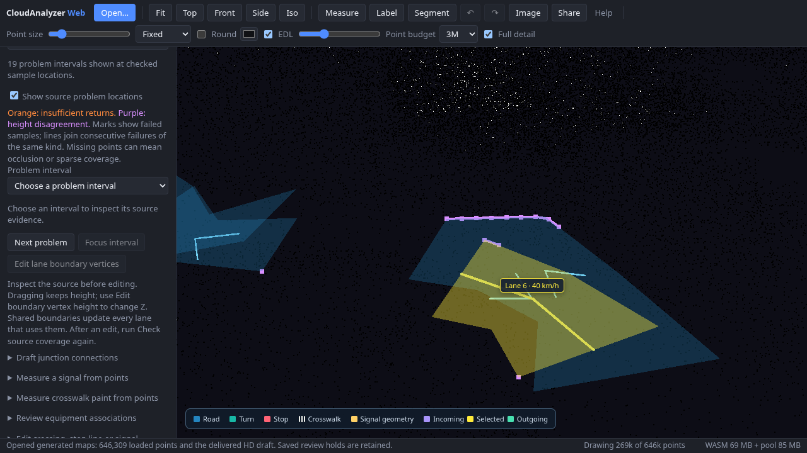

# Browser review of the actual delivered NCLT map pair

CloudAnalyzer Web opens the [portable review ZIP](../nclt-review-bundle/README.md)
directly through **Generated maps → Open generated maps…**. Every ZIP member is
verified before point-cloud parsing or replacing the HD map. All 646,309 point
records load in their original frame together with the adopted editable HD map.

The source-extent display retains **124 / 252.5863381996826 m**, with the requested
90% goal unmet. Saved audits remain snapshots of the exported pair. No point-map
fusion, road generation, estimator query or mapping attempt is performed.

All four protocols are selectable. Both low-quantile formats retain **9 source
review lanes**, **19 displayed problem intervals** and the original 363 failed
height samples. Both saved ground-consensus formats have zero low-support lanes.
Selecting an interval focuses its original failed coordinates over the point
cloud. Switching estimators does not resolve their disagreement or establish
independent accuracy, full road width or traffic permission.



The screenshot is from the NCLT browser test, after switching back to the saved
low-quantile editable-IR audit. Camera/LOD/view budgets affect visible points;
the status bar reports loaded records separately. Solid display coloring is a
view setting; the source bytes and original fields remain available.

Validation with the production build:

- 42 unit tests passed, including stored/deflated ZIPs with ZIP64 local headers,
  full evidence hashes, altered nondisplayed members, unsafe/duplicate/missing
  members, bounded decompression, cancellation and invalid saved locations.
- 12 Chromium tests passed: real NCLT import/review; synthetic import, four-way
  switching/focus, post-edit invalidation, point removal, invalid-ZIP retention
  of the previous cloud/map/review; existing source-location and project tests.
- TypeScript and Vite production build passed.

Browser bounds are 64 MiB total uncompressed, 128 artifact members and a 10 MiB
manifest. Exported ZIP64 local headers are accepted; larger packages use CLI
verification and ordinary individual-file loading. Saved overlays are cleared
and their selector disabled when the map or imported point data changes.

Reproduce after obtaining the original exported ZIP (large data stays outside git):

```sh
cd web
npm ci
npm run build
npx playwright install chromium
CA_REVIEW_NCLT_BUNDLE=/path/to/nclt-hd-preflight-portable-review.zip \
  npx playwright test e2e/mapping-review.spec.ts e2e/mapping-review-nclt.spec.ts \
  e2e/source-coverage-locations.spec.ts e2e/project.spec.ts --workers=2
```

The managed environment blocks the browser CDN download. The recorded run used
the installed Debian Chromium 151.0.7922.173 with the existing SwiftShader flags.
To use an installed browser, set `PW_CHROMIUM_EXECUTABLE_PATH=/usr/bin/chromium`.
The NCLT test skips without `CA_REVIEW_NCLT_BUNDLE`; synthetic tests run in normal CI.

Input attribution and ODbL/DBCL derived-database terms remain in the package and
[sample attribution](../../../web/public/samples/ATTRIBUTION.md). This UI inspection
adds no independent ground truth and does not improve the retained map's extent
or geometric accuracy.
