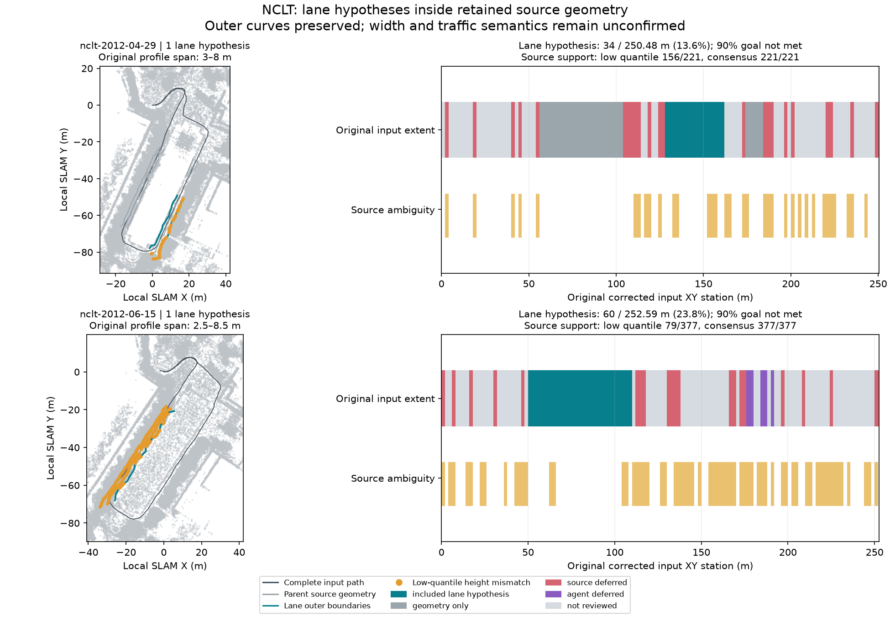

# NCLT: explicit lane hypotheses from adopted source geometry

The subsequent [calling-agent MCP runs](../nclt-agent-run/README.md) retain the
same per-piece hypotheses while inspecting all offered candidates and adopting
additional source intervals; their complete decision traces are saved.

On 2026-10-09 JST, the calling agent ran both bundled NCLT recordings through
raw-log odometry, corrected point-map generation, lane-free corridor proposals,
the [previous include/defer choices](../nclt-geometry/README.md) and explicit
lane-hypothesis export. The resulting IR and Lanelet2 OSM preserve the chosen
outer source curves and survive native OSM reload. This validates an export
interface; it does **not** establish physical lane count or improved accuracy.

The 190-second Segway inputs are thinned to 0.8 m with points within 1.5 m of the
sensor removed. Jobs use 1 m keyframes, loop closure, recorded IMU gravity and
dynamic-point removal. Point maps reproduce the earlier runs' SHA-256 values
exactly, with 683,690/645,432 points; both remain `generated_unverified`.

| Result | 2012-04-29 | 2012-06-15 |
| --- | ---: | ---: |
| Original corrected input XY station length | 250.48 m | 252.59 m |
| Parent geometry proposal IDs | 17, 22, 30 | 25 |
| Parent retained geometry extent | 92 m | 60 m |
| Piece given a lane hypothesis: centre curve / proposal | 4 / 22 | 1 / 25 |
| Original source profile span | 3–8 m | 2.5–8.5 m |
| Two-lane test: each half requires at least 2 m | **Failed** | **Failed** |
| Exported layout: one forward driving-lane hypothesis | 1 | 1 |
| Explicit minimum profile width for exported hypothesis | 2.5 m | 2 m |
| Lane hypothesis input-station extent | 34 m (13.57%) | 60 m (23.75%) |
| Remaining geometry without lane assignment | 58 m | 0 m |
| Total input extent without a lane hypothesis | 216.48 m | 192.59 m |
| Low-quantile source support / trace samples | 156 / 221 | 79 / 377 |
| Ground-consensus source support / trace samples | 221 / 221 | 377 / 377 |
| Native structural errors | 0 | 0 |
| Job's 90% whole-drive extent goal met | **No** | **No** |
| Shared attempts spent / remaining | 3 / 0 | 3 / 0 |
| Selected lane map | None | None |



The plot displays every eighth saved point; proposals and audits used the full
map. Teal curves are source-span layout hypotheses, not established road edges.
Orange samples have height mismatches under the low-quantile estimator. Both
editable and reopened OSM produce identical evidence under each estimator.
Counts are oriented lane/trace samples, not unique cloud points or percentages
of road length. Returning input passes remain separate stations.

## Hypotheses, failures and source holds

The first lane attempt explicitly partitioned the chosen span into two equal
lanes, backward then forward along the original input stations, with a minimum
width of 2 m each. The narrowest profiles would provide only 1.5 m / 1.25 m per
lane, so both attempts failed. Their reasons and consumed attempts remain saved;
no `candidate-02` directory was published and parent geometry hashes stayed
unchanged. The tool did not widen the source or silently reduce lane count.

The calling agent then explicitly requested a separate one-lane hypothesis
covering the whole chosen span, with `one_way=true`, 40 km/h and
`boundary_policy="source_span_hypothesis"`. These are **unverified export-test
assumptions**, not traffic rules inferred from a Segway trajectory. Changing
lane count, fractions and minimum width changes the experiment's scope; the
successful export must not be presented as a quality improvement over the
failed two-lane test or earlier nominal-width lane maps.

April retains 34 m from proposal 22; the other 58 m of adopted geometry remain
`geometry_only`. June retains the 60 m piece from proposal 25. Original outer
XYZ coordinates and vertex counts are identical, allowing reversed storage for
lane orientation. No source smoothing, nominal-width replacement, extrapolation
or joining of disconnected pieces occurred. Virtual boundaries do not claim
observed paint. Minimum width is measured at saved profiles, not a guarantee of
perpendicular clearance between them. Neither recording has complete paired-curb
evidence; complete road width, lane identity, legal use, speed, equipment and
georeferencing remain unresolved.

The two ground estimators disagree: low quantile finds 65 / 298 height-mismatch
samples, while ground consensus finds none. Neither had insufficient-return
samples. This disagreement remains a review hold; the better support score is
not independent ground truth. Inspect layered returns and source levels before
deciding which evidence matches the physical surface. All four audits are
complete, with no omitted/malformed lanes or structural errors.

Complete original station dispositions retain source deferrals, explicit agent
deferrals, unreviewed alternatives and ambiguity. The denominator remains the
full corrected input XY trajectory. Both explicit selection checks reject the
partial hypothesis at the original 90% extent gate, with no selected map and
`deployment_ready=false`.

## Artifacts and reproduction

Open [April's IR](april/vector_map.json) or [June's IR](june/vector_map.json) in
the map editor over the corresponding point map. Each folder also contains the
native Lanelet2 OSM, local projector metadata, full four-way source audit,
`failed-lanes.json` and `lanes.json`. The [verification record](verification.json)
includes frozen source/native/map/proposal/parent/output hashes, processing
reports, failed attempt, lane report, full station dispositions and diagnoses.
Reports in that record have portable paths; their artifact hashes identify the
original job files before path normalization. Large point maps and proposals
remain generated outputs. No independent ground truth was used.

Use a current native extension and **new** job directories; do not replace a
binary pinned by a live job. For April:

```sh
ca mapping-start web/public/samples/nclt-2012-04-29.mcap --out runs/nclt-lanes-april --max-attempts 3
ca mapping-corridors runs/nclt-lanes-april
ca mapping-corridors-inspect runs/nclt-lanes-april --candidate 22
ca mapping-geometry runs/nclt-lanes-april --decisions benchmarks/vector-map/nclt-geometry/april/decisions.json --reason "Retain inspected geometry with unresolved width and traffic rules"
ca mapping-lanes runs/nclt-lanes-april --geometry 1 --specs benchmarks/vector-map/nclt-corridor-lanes/april/failed-lanes.json --boundary-policy source_span_hypothesis --reason "Test explicit minimum widths; preserve failure"
# The preceding command intentionally exits nonzero and consumes attempt 2.
ca mapping-lanes runs/nclt-lanes-april --geometry 1 --specs benchmarks/vector-map/nclt-corridor-lanes/april/lanes.json --boundary-policy source_span_hypothesis --reason "Export a separate unverified one-lane hypothesis"
ca mapping-diagnose runs/nclt-lanes-april --candidate 3
```

For June, use `nclt-2012-06-15.mcap`, a separate job directory and the `june`
decisions/specification files. Inspect the offered candidates before reusing
choices: proposal and curve IDs identify that frozen run, not persistent roads.
See the [lane workflow](../../../docs/commands/mapping-job.md#export-explicit-lane-hypotheses-from-adopted-geometry)
for required assumptions, invalid-input behavior, atomic publishing and audit
scope. Native functional tests also cover two directions, shared virtual dividers
and preservation of an existing selected draft.

## Attribution

University of Michigan NCLT; N. Carlevaris-Bianco, A. K. Ushani and R. M. Eustice,
“University of Michigan North Campus long-term vision and lidar dataset”, IJRR
2016. Sources and derived evidence, IR, OSM and figure are offered under
[ODbL 1.0](https://opendatacommons.org/licenses/odbl/1-0/), with database contents
under [DBCL 1.0](https://opendatacommons.org/licenses/dbcl/1-0/). Retain upstream
[sample attribution](../../../web/public/samples/ATTRIBUTION.md). Software remains
under the repository's MIT license.
