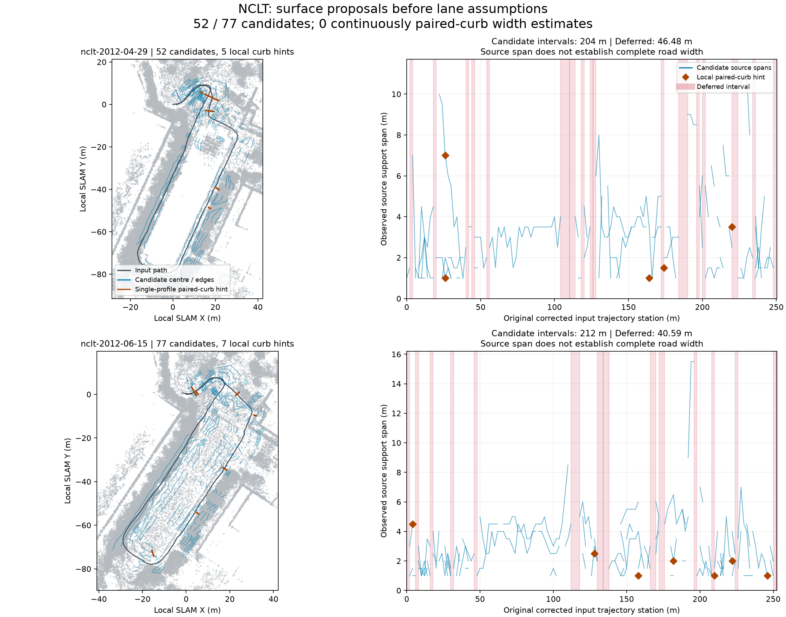

# NCLT: surface proposals without lane assumptions

On 2026-10-09 JST, the calling agent generated point-cloud maps and searched
surface corridors in both bundled NCLT recordings, before supplying lane count,
lane width, speed or traffic direction. The source contains geometry and sparse
curb-like profiles; it does not establish those traffic attributes. The tools
execute and preserve observations; the calling agent supplies decisions.

Both inputs are 190-second Segway recordings, packed at 0.8 m scan thinning with
points within 1.5 m of the sensor removed. Each new job uses 1 m keyframes, loop
closure, recorded IMU gravity and dynamic-point removal. The resulting point maps
contain 683,690 and 645,432 points and remain `generated_unverified`. Processing
convergence is not an independent accuracy measurement.

| Observation | 2012-04-29 | 2012-06-15 |
| --- | ---: | ---: |
| Original corrected input XY station length | 250.48 m | 252.59 m |
| Evaluated / requested profiles | 127 / 127 | 128 / 128 |
| Continuous source-band candidates | 52 | 77 |
| Station union with any connected candidate | 204.00 m | 212.00 m |
| Station union without a connected candidate | 46.48 m | 40.59 m |
| Candidate contains path at both interval endpoints | 142.00 m | 110.00 m |
| Station union with ambiguous band matching | 68.00 m | 128.00 m |
| Individual paired-curb profile hints | 5 | 7 |
| Candidates with paired curbs throughout | **0** | **0** |
| Processing budget reached | No | No |

Candidate and deferred unions partition the full requested input station extent.
Several candidates may overlap at a station; their lengths must not be summed.
Ambiguous intervals can overlap candidate intervals when another band connects
uniquely. These values are not percentages of verified roads or unique road length.
Endpoint path containment does not separately certify intermediate path positions
or full-width interiors. The HD builder's resampled/smoothed April trajectory is
248.92 m, so its extent denominator must not replace the 250.48 m input stations.



The figure displays every eighth saved point for context. Detection used the full
saved map. Blue curves/spans show observed source support, not established road
edges or drivable polygons. Orange pairs/diamonds show individual paired-curb
observations, including competing bands at the same station. Neither recording
has a continuous candidate with paired-curb evidence throughout; **complete
corridor widths remain unresolved**. No detection threshold was relaxed to make
those widths appear complete.

## Detection and retained uncertainty

Profiles use 2 m stations including the exact endpoint, ±8 m lateral reach,
0.5 m bins and ±2 m longitudinal windows. Each bin chooses the lowest spatially
supported layer; isolated returns and collinear wall returns cannot establish
that support. Observed bands must match the source anchor under the path before
becoming proposals. Fourteen April bands and eleven June bands fail this level
guard and remain visible as raw observations. June also has one missing anchor.
A coherent lower physical level can still be wrong.

Only uniquely overlapping bands connect. Branches, gaps and missing anchors are
retained as unresolved station intervals. Each connected interval checks centre
and both edge curves against source support at at most 0.5 m spacing, including
both endpoints. This checks three curves, not the entire corridor interior or
clearance. Repeated traversals remain separate proposals.

Edges distinguish `curb_profile`, `support_gap`, `height_discontinuity` and
`search_limit`. Source spans ending at coverage gaps/search limits do not supply
complete road width. A single paired-curb profile has 0.5 m bin-centre quantization
and can describe a path, drainage feature or another surface; it still requires
review. April's five local spans occur at stations 26 m (two competing bands),
164 m, 174 m and 220 m. June's seven occur at 4 m, 128 m, 158 m, 182 m, 210 m,
222 m and 246 m. Their full XYZ evidence is in the verification file.

[`verification.json`](verification.json) records source/native/map/report hashes,
protocol, full candidate indexes, local curb hints, unresolved intervals and the
longest candidate's geometry for each run. Full profile arrays and point maps are
generated outputs. Source paths are repository-relative, generated artifact paths
are job-relative and extension paths are package-relative. Binary hashes identify
this run; different builds/platforms may differ.

## Agent workflow and compatibility

The proposal stage spends **zero HD attempts**, caches its frozen search options
and verifies inputs/report on reuse. Inspection pages the saved geometry without
native processing. Both actual runs verified all index pages, exact input extent,
candidate/deferred unions and a cached call with an unchanged job manifest.

The agent kept `selected=null` in both jobs. No surface proposal was automatically
adopted as Lanelet2 geometry or lane semantics. A separate April HD attempt, made
only to check compatibility, reproduced [#214's selected review draft](../nclt-agentic-mapping/README.md)
with its unchanged explicit one-forward/one-backward, 3.5 m, right-hand-traffic,
40 km/h hypotheses. Its IR/OSM/projector hashes and all four complete source audits
match that earlier draft exactly. It was not selected; existing source-quality
and deployment holds remain. This proves compatibility, not a new HD-map accuracy
improvement. That separate check spent one of April's two HD attempts; June spent
none.

To reproduce proposals, install/build the current Rust extension and start fresh
jobs. Do not replace a core binary pinned by an existing job:

```sh
ca mapping-start web/public/samples/nclt-2012-04-29.mcap --out runs/nclt-corridors-april --max-attempts 2
ca mapping-corridors runs/nclt-corridors-april
ca mapping-corridors-inspect runs/nclt-corridors-april
ca mapping-corridors-inspect runs/nclt-corridors-april --offset 16
ca mapping-corridors-inspect runs/nclt-corridors-april --candidate 17

ca mapping-start web/public/samples/nclt-2012-06-15.mcap --out runs/nclt-corridors-june --max-attempts 2
ca mapping-corridors runs/nclt-corridors-june
ca mapping-corridors-inspect runs/nclt-corridors-june
```

Use `next_offset` to inspect remaining pages. Each candidate retains
`review_required=true`; both reports retain `road_semantics_inferred=false` and
`deployment_ready=false`. Width continuity, semantic road identity, lane rules,
equipment, georeferencing and independent accuracy remain unresolved. See the
[mapping-job protocol and limits](../../../docs/commands/mapping-job.md#surface-corridors-before-road-semantics).

## Attribution

Source: University of Michigan NCLT, N. Carlevaris-Bianco, A. K. Ushani and
R. M. Eustice, “University of Michigan North Campus long-term vision and lidar
dataset”, IJRR 2016. Dataset and this derived evidence/figure are offered under
[ODbL 1.0](https://opendatacommons.org/licenses/odbl/1-0/), with database contents
under [DBCL 1.0](https://opendatacommons.org/licenses/dbcl/1-0/). Retain upstream
[sample attribution](../../../web/public/samples/ATTRIBUTION.md). Software remains
under the repository's MIT license.
