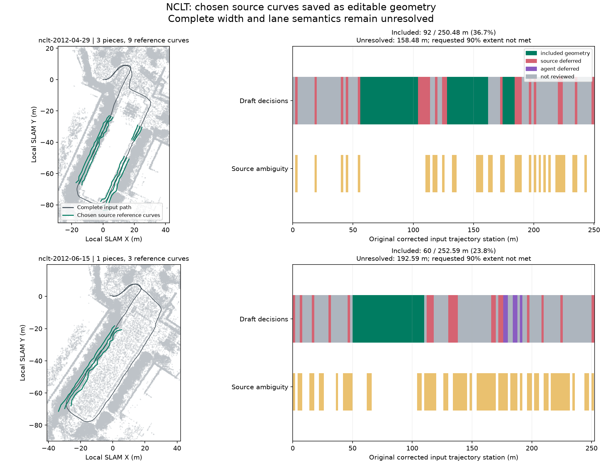

# NCLT: from raw logs to editable source geometry

On 2026-10-09 JST, the calling agent ran both bundled NCLT recordings from raw
MCAP to a point-cloud map, lane-free corridor proposals, explicit include/defer
decisions and an editable `vectormap-ir` geometry draft. No lane count, lane
width, traffic direction or speed hypothesis was needed for this branch.

The inputs are 190-second Segway excerpts, thinned to 0.8 m with points within
1.5 m of the sensor removed. Each new job uses 1 m keyframes, loop closure,
recorded IMU gravity and dynamic-point removal. April/June point maps reproduce
the previous [proposal runs](../nclt-corridors/README.md) SHA-256 values exactly,
with 683,690/645,432 points; they remain `generated_unverified`. Processing
convergence and source support do not establish independent accuracy.

| Result | 2012-04-29 | 2012-06-15 |
| --- | ---: | ---: |
| Original corrected input XY station length | 250.48 m | 252.59 m |
| Available proposal candidates | 52 | 77 |
| Included proposal IDs | 17, 22, 30 | 25 |
| Explicitly deferred proposal IDs | 8 | 27, 28, 49 |
| Included separate geometry pieces | 3 | 1 |
| Saved centre/left/right reference curves | 9 | 3 |
| Included input-station extent | 92.00 m (36.73%) | 60.00 m (23.75%) |
| Remaining unresolved extent | 158.48 m | 192.59 m |
| Job's 90% extent goal met | **No** | **No** |
| Native import/structural errors | 0 | 0 |
| Lanes created | 0 | 0 |
| HD attempts spent / remaining | 1 / 1 | 1 / 1 |



The figure shows every eighth saved point for context; proposal detection used
the full map. Green curves are included source references, not complete road
borders or a certified drivable interior. Every decision interval belongs to
the full original corrected input trajectory. Source ambiguity remains visible,
including beside an included band. Returning passes remain separate pieces.
Neither input has a proposal with paired-curb evidence throughout, and complete
width, lane identity, traffic rules, equipment and georeferencing remain unresolved.

## Decisions and retained context

The calling agent inspected the candidates before issuing the recorded choices.
April candidate 17 supplies a 48 m longer path-associated band (24 of its 25
sections contain the recorded path), candidate 22 supplies 34 m (18/18), and
candidate 30 supplies 10 m (6/6). Their source spans vary from 1.5–4 m, 3–8 m and
2–3 m respectively. That variation was kept; none was converted to an established
road width. Candidate 8 was deferred as a rapidly varying/competing band.

June candidate 25 supplies 60 m with the path inside all 31 profiles; its source
span varies from 2.5–8.5 m. Candidates 27/28 are competing bands alongside that
range; candidate 49 is another band outside the recorded path. They were deferred
for this draft. These are calling-agent review hypotheses, not a tool's default
ranking, proof of road identity or proof that deferred surfaces are absent.
Other candidates remain unreviewed rather than implicitly accepted or rejected.

The report distinguishes no-source-proposal intervals, explicit agent deferrals
and unreviewed alternatives. It records all available/deferred candidate IDs and
source reasons for every interval. Included and unresolved unions sum to the full
requested extent; these partial drafts do **not** meet the 90% whole-drive goal.
No lane map was selected. `source_quality_passed=false` and
`deployment_ready=false` remain explicit despite zero structural errors.

## Editing artifacts and verification

The saved curves have kind `other` and attributes identifying source role,
proposal ID and review hold. They are neither lane markings nor confirmed road
edges. Open [April's IR](april/vector_map.json) or [June's IR](june/vector_map.json)
from the map editor's **Open** control, over the corresponding point map, and
enable virtual lines. The native reader retains all curves/attributes exactly.
Informational `unused_boundary` issues are expected for reference curves without
lanes; keep them instead of applying the suggested removal.

This stage publishes IR plus evidence, **no Lanelet2 OSM**. The current Lanelet2
reader drops standalone unknown ways on reload. Exporting these curves as lanes
would require additional semantics that this input does not establish. Resolve
those hypotheses separately before lane-map export.

[`verification.json`](verification.json) includes source/native/map/proposal/draft
hashes, processing results, decisions, all chosen section geometry, complete
station dispositions and native import/validation issues. Each native-reloaded
curve was compared with its original proposal XYZ values: no joining, smoothing,
width substitution or extrapolation occurred. Inspection preserved the job
manifest and spent no additional attempt. Large raw proposals and point maps
remain generated outputs. Paths are repository-relative for sources, job-relative
for outputs and package-relative for the native extension. Binary hashes identify
this run; rebuilds/platforms may differ.

To reproduce, use a current native extension and new job directories:

```sh
ca mapping-start web/public/samples/nclt-2012-04-29.mcap --out runs/nclt-geometry-april --max-attempts 2
ca mapping-corridors runs/nclt-geometry-april
ca mapping-corridors-inspect runs/nclt-geometry-april --candidate 17
ca mapping-geometry runs/nclt-geometry-april --decisions benchmarks/vector-map/nclt-geometry/april/decisions.json --reason "Retain inspected source references; width and traffic semantics unresolved"
ca mapping-geometry-inspect runs/nclt-geometry-april --candidate 1

ca mapping-start web/public/samples/nclt-2012-06-15.mcap --out runs/nclt-geometry-june --max-attempts 2
ca mapping-corridors runs/nclt-geometry-june
ca mapping-corridors-inspect runs/nclt-geometry-june --candidate 25
ca mapping-geometry runs/nclt-geometry-june --decisions benchmarks/vector-map/nclt-geometry/june/decisions.json --reason "Retain inspected source references; width and traffic semantics unresolved"
ca mapping-geometry-inspect runs/nclt-geometry-june --candidate 1
```

Inspect the offered candidates before reusing those decisions on another run.
Proposal IDs identify that frozen report; they are not persistent physical-road
identities. Do not replace the binary pinned by a live job. See the
[geometry workflow](../../../docs/commands/mapping-job.md#adopt-source-geometry-while-lane-semantics-remain-unresolved)
for range selection, ambiguity, attempt budgets, atomic failures and bounded
inspection previews.

## Attribution

University of Michigan NCLT; N. Carlevaris-Bianco, A. K. Ushani and R. M. Eustice,
“University of Michigan North Campus long-term vision and lidar dataset”, IJRR
2016. Sources and this derived evidence, IR and figure are offered under
[ODbL 1.0](https://opendatacommons.org/licenses/odbl/1-0/), with database contents
under [DBCL 1.0](https://opendatacommons.org/licenses/dbcl/1-0/). Retain upstream
[sample attribution](../../../web/public/samples/ATTRIBUTION.md). Software remains
under the repository's MIT license.
