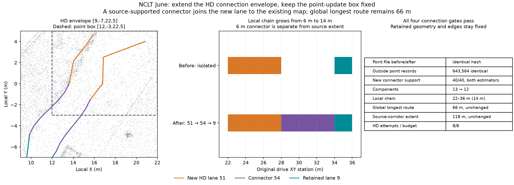

# NCLT: separate point-update and HD connection envelopes

A fresh live MCP June 2012-06-15 run joins the previously isolated 22–28 m
addition to an existing lane, while keeping the point-update box and point files
fixed. The eight-attempt family replays prior baseline/local density/+0.075 m
interior height choices, inspects the default held connector, explicitly previews
a larger **HD-only** envelope and adopts one seen pair after four audits pass.
Choices are informed by earlier runs: this is an integration trial, not a blind
agent benchmark or independent accuracy test.



| Observation | Result |
| --- | --- |
| Point-update box, all heights | [12, -3, 22, 5] m, unchanged |
| Explicit HD connection envelope | [9, -7, 22, 5] m |
| Default 51 → 9 preview | Held outside point-update box |
| Connector XY hull | [9.857, -6.441, 15.595, -0.047] m |
| Explicit HD decision | 51 → new connector 54 → 9 |
| Connector original station interval | 28–34 m |
| New connector support | 40/40, both estimators in IR/reopened OSM |
| Local route after connection | 22–36 m, 14 m |
| Connected components | 13 → 12 |
| Global longest route station span | 66 m, unchanged |
| Source-corridor extent | 118 m, unchanged by connector |
| Source intervals gained/lost versus original root | 6/0 m |
| Point file before/after HD connection | Identical hash and byte count |
| Delivered local point count | 646,309 |
| Outside point records versus original root | 643,564, bit identical |
| Original retained frames | 195, unchanged; no added frames |
| Actual HD attempts / family budget | 8/8 |

The default preview reports the held connector's XY hull. The agent explicitly
chooses an HD envelope containing that hull and the frozen point box. Exact
connector center/boundaries fit the HD envelope; both new sides leave the point
box, using unchanged original outside returns for part of their support. Point
fusion/replacement is not rerun or expanded. Native heading, fixed width, path
containment, ambiguity and topology checks remain in effect. All retained patched
geometry, IDs, metadata and directed edges stay fixed. Only edges 51 → 54 and
54 → 9 are added; no unrelated original-lane link is adopted.

Every new trace and endpoint passes both estimators in editable IR and reopened
OSM at unchanged protocols. Retained sample counts and supported locations do not
regress. Existing root source holds remain visible. The combined source extent
is still 112 + 6 = 118 m: the 6 m connector improves graph reachability but is
**not** counted as recovered source-corridor extent. The agent compares patched
and connected maps with the original root, finishes the child and explicitly
adopts the connected point/HD pair. Height and patch lineage survive the connection.
Full-drive continuity, traffic semantics and the 90% extent goal remain unmet.

## Evidence and verification

`patched/` and `connected/` retain actual IR, OSM, projector, reports and all four
source audits. Saved default/region previews, connection checks, both root
comparisons and compact actual MCP actions record the inspected envelopes and
explicit pair decision. Local update/checks, point report, height checks and
inside-point subsets preserve the point-repair context. `verification.json`
records source/native hashes, unchanged point descriptors, routes and counts.

Packet generation compared full original/candidate/local PLY records including
all attributes and outside relative order; inside local records equal full-fusion
candidate records. It verified original graph/trajectory bytes and retained IDs,
repeated all four native audits for patched/connected maps against the complete
local point map, and checked reopened geometry/semantics/edges. Original root and
patched entities are preserved. Portable paths use `run/`, `repo/`, `native/` and
`env/`; original hashes identify generated files, while `files-sha256.json` hashes
committed portable copies.

With the Python package installed, run from the repository root:

```sh
PYTHONPATH=cloudanalyzer python benchmarks/vector-map/nclt-hd-connection-region/verify_packet.py
```

To compare full point records and repeat native audits:

```sh
PYTHONPATH=cloudanalyzer python benchmarks/vector-map/nclt-hd-connection-region/verify_packet.py --generated-root /path/to/generated-runs
```

That directory must contain `nclt-hd-region-june`. Default checks validate saved
evidence consistency; inside subsets cannot establish full outside equality or
re-audit full maps. Full fusion remains required for the preceding point trial;
no local speedup, independent survey accuracy, legal routing or deployment
readiness is established. See the [height trial](../nclt-hd-height/README.md) for
the preceding isolated addition and unchanged global route.

## Data terms

Derived NCLT maps, subsets, observations and figure retain
[ODbL 1.0](https://opendatacommons.org/licenses/odbl/1-0/) and
[DBCL 1.0](https://opendatacommons.org/licenses/dbcl/1-0/) terms; retain upstream
[sample attribution](../../../web/public/samples/ATTRIBUTION.md).
Verification code is MIT licensed under the repository license.
