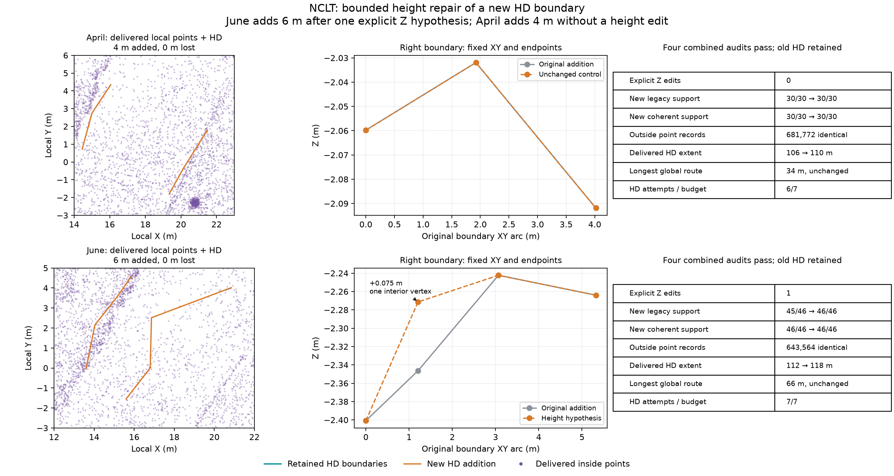

# NCLT bounded height repair on local HD additions

Two fresh live MCP runs test an agent's explicit height hypothesis on a new HD
boundary, while preserving the original point/HD map. Both replay previously
inspected baseline choices, use seven-attempt family budgets and locally reduce
scan/map voxels from 0.4/0.2 m to 0.2/0.1 m. Original frames, corrected poses and
outside ordered point records stay fixed. Boxes, draft intervals and the June
hypothesis are informed by earlier runs: this is an integration trial, not a blind
agent benchmark or independent accuracy evaluation.



| Result | April 2012-04-29 | June 2012-06-15 |
| --- | --- | --- |
| Effective XY box, all heights | [14, -3, 23, 6] m | [12, -3, 22, 5] m |
| Original retained frames | 199, unchanged | 195, unchanged |
| Inside points, before → local candidate | 1,918 → 2,918 | 1,868 → 2,745 |
| Outside records preserved byte for byte | 681,772 | 643,564 |
| New HD station interval | 26–30 m | 22–28 m |
| Offered affected interior vertices | 0 | 2 |
| Explicit height edit | None | Right boundary 2, index 1: +0.075 m |
| New low-quantile support, before → after edit | 30/30 → 30/30 | 45/46 → 46/46 |
| New coherent support, before → after edit | 30/30 → 30/30 | 46/46 → 46/46 |
| Retained HD low-quantile support | 444/758, unchanged | 521/884, unchanged |
| Retained HD coherent support | 758/758, unchanged | 884/884, unchanged |
| Combined HD source extent | 106 → 110 m | 112 → 118 m |
| Source intervals gained / lost | 4 / 0 m | 6 / 0 m |
| Longest global route station span | 34 m, unchanged | 66 m, unchanged |
| Delivered local point count | 684,690 | 646,309 |
| Actual HD attempts / family budget | 6/7 | 7/7 |

April's new lane is already fully supported. `inspect_heights` returns no affected
vertices, so the agent makes no height edit and patches the draft as-is. June
reproduces the new-boundary mismatch that stopped the
[previous density trial](../nclt-local-density/README.md). A low-quantile sample at
approximately (15.043, 3.429, -2.333) m observes -1.997 m, exceeding the unchanged
0.3 m height tolerance. Coherent support already passes. The agent inspects the
two neighboring interior vertices and explicitly tests +0.075 m at the nearer
one, rather than fitting to the full observed discrepancy.

The edit freezes boundary XY/endpoints, all other Z, IDs, metadata, lane semantics,
projection and routes. It preserves the original addition draft and source
curves; it does not rewrite the point map. Derived centerlines and sample locations
can move because native sampling uses 3D arc length. Every trace keeps its sample
count and gains full support under **both estimators in IR and reopened OSM**.
The agent uses the final shared attempt to combine the repaired addition with
the original HD map, preserving every retained entity and directed edge. All four
combined audits pass, with no new retained failure locations. Both runs compare
actual gained/lost source intervals, finish the child and explicitly adopt the
combined point/HD pair. New lanes remain isolated; global longest routes do not
increase and the requested 90% full-drive extent goal remains unmet.

## Evidence and verification

Each scene saves actual original/addition/combined IR, OSM, projector, reports and
four audits; local point preview/checks/audits; inspected source candidate; actual
compact MCP actions; patch checks/preview; comparison; and inside-point subsets.
June also saves the edited addition, height preview, trial geometry, checks and
four height audits. `verification.json` records original artifact/native hashes,
counts, frame IDs, extent and route metrics. Portable copies use `run/`, `repo/`,
`native/` and `env/` instead of machine paths. Original hashes identify generated
files; `files-sha256.json` hashes the committed portable copies.

During packet generation, full generated records were compared byte for byte,
all attributes and relative outside order included. The local candidate's inside
records match full fusion; native rereading matches PLY records. Four native
audits were repeated for retained, original addition, repaired addition and
combined maps against the full local point maps. IR/reopened OSM geometry,
assigned semantics and edges match. Original graph/trajectory bytes and retained
frame IDs are unchanged.

With the Python package installed, run from the repository root:

```sh
PYTHONPATH=cloudanalyzer python benchmarks/vector-map/nclt-hd-height/verify_packet.py
```

To also compare full point records and repeat native audits:

```sh
PYTHONPATH=cloudanalyzer python benchmarks/vector-map/nclt-hd-height/verify_packet.py --generated-root /path/to/generated-runs
```

The directory must contain `nclt-hd-height-april` and `nclt-hd-height-june`.
Default verification checks saved evidence consistency; inside subsets cannot
prove outside equality or re-audit full maps. Full fusion is still generated and
no local speedup is established. The bounded edit is a source-support hypothesis:
no independent survey ground truth, accuracy improvement, traffic semantics or
operational safety is established. Existing source holds remain visible.

## Data terms

Derived NCLT maps, subsets, observations and figure retain
[ODbL 1.0](https://opendatacommons.org/licenses/odbl/1-0/) and
[DBCL 1.0](https://opendatacommons.org/licenses/dbcl/1-0/) terms; retain upstream
[sample attribution](../../../web/public/samples/ATTRIBUTION.md).
Verification code is MIT licensed under the repository license.
