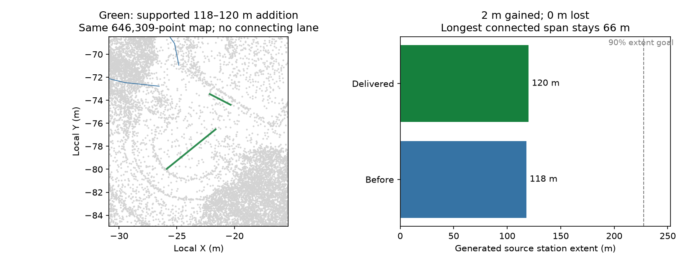

# NCLT: adopt an HD-only gap addition on the exact retained point map

A live MCP session on the bundled `nclt-2012-06-15.mcap` continues the pair retained
by the protected-density experiment, with a new explicit six-attempt budget. It
uses `repair_hd`, keeps the accepted point map and source proposal exact, and
adds an observed 118–120 m lane through the combined gap-patch workflow.

| Measurement | Before | Delivered |
|---|---:|---:|
| Point records | 646,309 | 646,309; identical file |
| Source station extent | 118 m | 120 m |
| Longest connected station span | 66 m | 66 m |
| Connected components | 12 | 13; new fragment is isolated |
| Original station denominator | 252.586338 m | unchanged |

New lane 57 has 26/26 supported center/boundary samples in each of the four audits
(two estimators, editable IR and reopened OSM). Every retained lane, boundary,
ID, metadata field and directed edge is preserved, with no newly failing retained
source samples. Existing quantile-audit height failures remain; the consensus
audit passes. All four delivered audit reports were repeated exactly on the full
point map. There is no supported connector candidate for the new fragment.

The first isolated draft also included 184–188 m and passed all four audits.
The combined-patch preflight rejected it because retained connector 45 already
occupies that interval. Source extent and connector occupancy are different
measurements. The next draft uses only the nonoverlapping 118–120 m interval.
`inspect_gaps` now reports retained-HD occupancy to make that distinction visible.
The rejected overlap spends no HD attempt. Two geometry/lane drafts and one
adopted patch consume five attempts; one remains unspent. Cumulative actual HD
attempts across the retained lineage are 13 (previously 8).



`agent-actions.json` records the live MCP requests and result revisions; full
comparison, frozen source proposal, maps, original/new audits and patch checks are
included. `rejected-patch.json` records the initial validation rejection.
Machine paths are replaced by `run/`, `repo/`, `native/` and `env/`. Descriptor
hashes identify original generated artifacts; `files-sha256.json` covers portable
packet copies. The portable verifier recomputes geometry retention and audit gates.

```sh
PYTHONPATH=cloudanalyzer python benchmarks/vector-map/nclt-hd-only-repair/verify_packet.py
# On the original execution workspace, with its matching native extension:
PYTHONPATH=/workspace/.cloudanalyzer-env/path-refinement-final-native:cloudanalyzer \
python benchmarks/vector-map/nclt-hd-only-repair/verify_packet.py \
  --generated-root /workspace/.cloudanalyzer-env/nclt-hd-only-june
```

The generated-root check verifies all full point descriptors and repeats the four
native audits. The full 20 MB point map is retained in the execution workspace.
This session used prior read-only diagnostic probes and is not an independent
agent benchmark. Full-drive extent, independent accuracy, georeferencing and
legal routing remain unresolved. The output is a review draft.

Derived maps, observations and figure are subject to the NCLT source's ODbL-1.0
and DBCL-1.0. See the [NCLT sample attribution](../../../web/public/samples/ATTRIBUTION.md).
