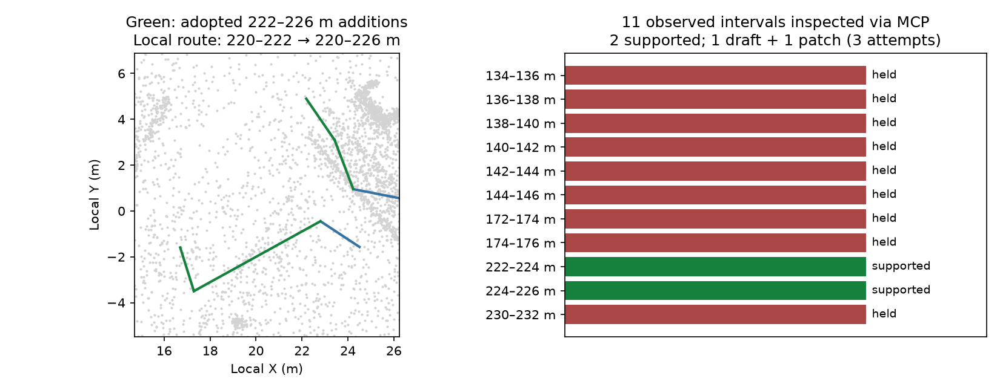

# NCLT: choose HD additions using MCP source preflight

A live MCP session continues the adopted HD-only pair with a new explicit
four-attempt budget. The calling agent pages all 31 source gaps, selects nine
with available observed candidates and unoccupied HD extent, then uses
`inspect_hd_plan` to inspect every interval offered after width/occupancy filtering.

Of 11 adjacent observed intervals, nine have source holds and two have complete
support from both ground estimators. The agent chooses **222–224 and 224–226 m**
from these MCP responses, inspects the frozen child proposal, creates one actual
geometry/lane draft, inspects the coincident endpoint pairs and adopts one combined
patch. No separate offline lane-generation probes inform selection in this session.
Three reinspection calls reuse saved preflight pages without repeating native work;
they record index descriptors in the continuation lineage.

| Measurement | Retained seed | Delivered |
|---|---:|---:|
| Point records | 646,309 | identical file and motion |
| Source station extent | 120 m | 124 m; 0 m lost |
| Local route through lane 36 | 220–222 m | 220–226 m |
| Global longest connected span | 66 m | 66 m |
| Connected components | 13 | 13 |
| New HD generation attempts | 0 | 3 of an explicit budget of 4 |
| Preflight HD generation attempts | 0 | 0 |

New lanes 62 and 63 have 45/45 supported trace samples under each of the four
final audits (both estimators, editable IR and reopened OSM). Their generated trace
statistics match the preflight inspections. The delivered audits were repeated
exactly on the full point map after adoption. Existing geometry, IDs, metadata and
all old directed edges remain exact; explicit links `36→62→63` extend the local
route. Retained quantile height failures remain unchanged; no new retained failure
locations are accepted. Actual cumulative HD generation attempts are 16 (13 prior,
3 here), with one current allocation unspent.



The preflight checks use a transient reference-trace carrier and never call the
lane builder or OSM exporter. They inspect recorded geometry at unchanged width
requirements and ground protocols. Final lane export, OSM reload, four complete
source audits and retention checks are still mandatory. Reference support is not
a guarantee that a final patch will pass, nor ground truth for road identity,
complete width or legal routing.

The packet includes saved index/pages, full reference-source observations, exact
maps, original/new audits, retained checks, route accounting and MCP action history.
The unchanged full source proposal is referenced from the
[HD-only packet](../nclt-hd-only-repair/source-proposal.json) by its packet hash.
`files-sha256.json` hashes portable files; descriptor hashes refer to original
execution artifacts. Machine prefixes are replaced by `run/`, `repo/`, `native/`
and `env/`.

```sh
PYTHONPATH=cloudanalyzer python benchmarks/vector-map/nclt-hd-repair-preflight/verify_packet.py
# Matching original execution workspace and native extension:
PYTHONPATH=/workspace/.cloudanalyzer-env/path-refinement-final-native:cloudanalyzer \
python benchmarks/vector-map/nclt-hd-repair-preflight/verify_packet.py \
  --generated-root /workspace/.cloudanalyzer-env/nclt-hd-preflight-june
```

The portable verifier rebuilds interval indexing from the frozen source and
retained map, recalculates reference-support decisions and retained audit gates,
and checks links and source accounting. The generated-root verifier also checks
full point identity and repeats the four delivered native audits. The full 20 MB
point map remains in the execution workspace.

This is a recorded agent workflow with inherited maps and explicit layout priors,
not an independent model benchmark. Full-drive coverage/continuity, survey accuracy,
georeferencing, traffic rules and semantic road identity remain unresolved. The
output is a draft requiring review. Derived maps, observations and figure retain
ODbL-1.0 and DBCL-1.0 terms; see the
[NCLT sample attribution](../../../web/public/samples/ATTRIBUTION.md).
