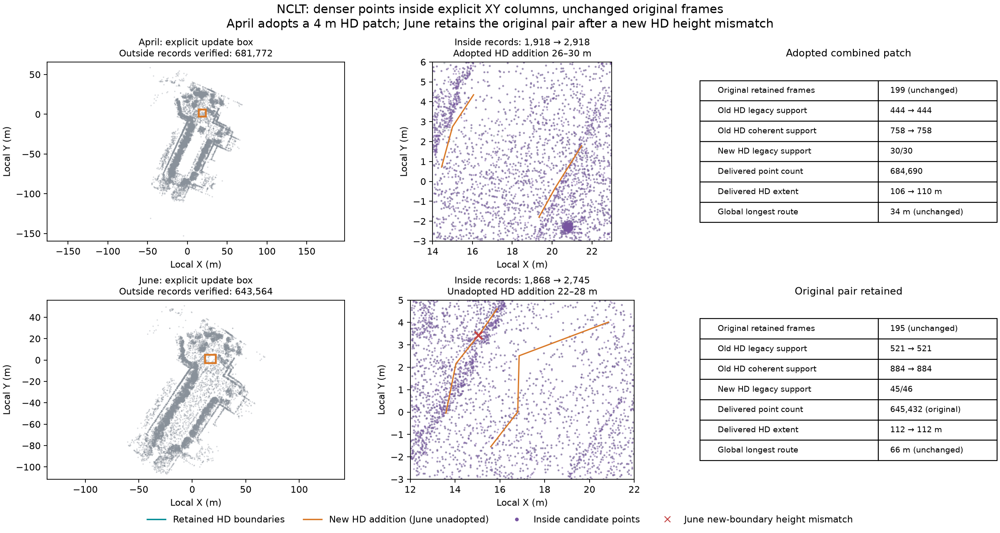

# NCLT local density trials with fixed original frames

Two fresh live MCP runs test local density repair using only the original retained
frames and corrected motion. Both replay previously inspected baseline choices,
use seven-attempt family budgets, inspect all root gaps, explicitly choose a box,
and reduce scan/map voxels from 0.4/0.2 m to 0.2/0.1 m. No unused frames are
inspected or added. These are integration trials, not independent agent benchmarks.



| Result | April 2012-04-29 | June 2012-06-15 |
| --- | --- | --- |
| Effective XY box, all heights | [14, -3, 23, 6] m | [12, -3, 22, 5] m |
| Retained frames, unchanged | 199 | 195 |
| Inside point records, before → candidate | 1,918 → 2,918 | 1,868 → 2,745 |
| Outside records preserved byte for byte | 681,772 | 643,564 |
| Full fusion candidate points | 1,033,824 | 955,898 |
| Local candidate points | 684,690 | 646,309 |
| Retained HD low-quantile support | 444/758 → 444/758 | 521/884 → 521/884 |
| Retained HD coherent support | 758/758 → 758/758 | 884/884 → 884/884 |
| New addition low-quantile support | 30/30 | 45/46 |
| New addition coherent support | 30/30 | 46/46 |
| Explicit outcome | Adopt local points + HD patch | Retain original point/HD pair |
| Delivered point count | 684,690 | 645,432 (original) |
| Delivered HD source station extent | 106 → 110 m | 112 → 112 m |
| Global longest route station span | 34 m, unchanged | 66 m, unchanged |
| Actual HD attempts / family budget | 6/7 | 5/7 |

April's four retained-HD audits pass. After inspecting all fresh child candidates,
the agent drafts only stations 26–30 m, verifies all new traces, previews endpoint
pairs (none offered) and explicitly patches lane 42 into the original HD map.
Every original lane, boundary, metadata field and directed edge remains fixed,
including chain 18 → 39 → 21. All four combined audits pass; the comparison gains
4 m and loses no interval. The new piece is isolated: components increase 11 → 12
and the full-drive extent goal remains unmet. The agent finishes and explicitly
adopts the combined point/HD pair.

June uses a narrower box than the previous
[unused-frame local trial](../nclt-local-points/README.md), excluding that trial's
retained lane39 failure location. This informed scope choice is recorded; it is
not a blind comparison of retry strategies. All four retained-HD audits now pass.
The new 22–28 m lane draft still has one low-quantile right-boundary height mismatch
at approximately (15.043, 3.429, -2.333) m: its source height is -1.997 m,
a discrepancy exceeding the fixed 0.3 m tolerance. Coherent support passes 46/46.
The agent sees this disagreement and stops **before spending a known-held patch
attempt**. No combined patch, root comparison or adoption occurs. The child finishes
with no HD candidate; the root finishes with the exact original point/HD files.
This is an explicit agent rejection of the addition, not a failed retained-HD gate
or an executed failed patch. Both attempts and the local point candidate remain
saved; the two unused child attempts are not returned to the root.

## Evidence and verification

Each scene retains actual before/addition/after HD files and four audits, local
preview/update/checks/audits, point-cloud report, inspected source candidate,
inside-point PLY subsets and compact actual MCP actions. April also saves its
patch preview/checks and root comparison. `verification.json` records original
input/output hashes, native hash, box, counts, frame selection, budgets and routes.
Portable reports replace machine paths with `run/`, `repo/`, `native/` or `env/`.
Original artifact hashes refer to generated files; `files-sha256.json` hashes
committed portable copies.

Checks against full generated maps verified ordered outside-record bytes including
all scalar attributes, candidate inside records, native rereading, unchanged
reference graph/trajectory bytes and the reported original frame IDs. The runner
checks the native fusion graph's actual IDs/poses before restoring reference files.
Four retained-HD native audits were repeated against full local maps; editable IR
and reopened OSM geometry/semantics/edges match for all saved HD candidates.
The figure's context uses the previously saved baseline visualization sample;
audits always use full point maps.

From the repository root with the Python package installed:

```sh
PYTHONPATH=cloudanalyzer python benchmarks/vector-map/nclt-local-density/verify_packet.py
```

To also verify full generated records and repeat four retained-HD native audits:

```sh
PYTHONPATH=cloudanalyzer python benchmarks/vector-map/nclt-local-density/verify_packet.py --generated-root /path/to/generated-runs
```

The supplied directory must contain `nclt-local-density-april` and
`nclt-local-density-june`. Default checks verify the saved packet's consistency;
inside subsets alone cannot independently prove outside equality or re-audit
full maps. Whole PLY headers and global point indices can change. Full fusion
computation is still required; no local speedup is established. More returns do
not establish accuracy, correct traffic semantics, full-drive routing or readiness
for deployment. Original poses/layout and filter policy stay fixed hypotheses,
while filtering outcomes can change with finer returns.

## Data terms

Derived NCLT maps, point subsets, observations and figure retain
[ODbL 1.0](https://opendatacommons.org/licenses/odbl/1-0/) and
[DBCL 1.0](https://opendatacommons.org/licenses/dbcl/1-0/) terms; retain upstream
[sample attribution](../../../web/public/samples/ATTRIBUTION.md).
Verification code is MIT licensed under the repository license.
