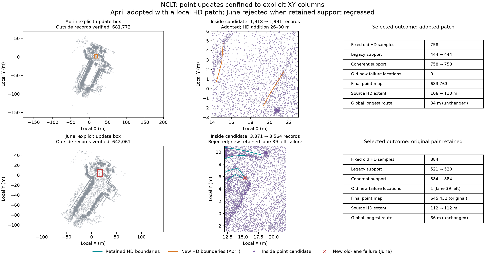

# NCLT local point updates with retained HD maps

Two fresh live MCP runs on the bundled April/June NCLT excerpts test explicit
XY-column point replacement. Both replay inspected baseline refinement, lane and
connection choices, use seven-attempt family budgets, inspect root gaps and unused
frames, and explicitly choose locally observing eligible frames. These are
recorded integration trials, not an independent agent benchmark.



| Result | April 2012-04-29 | June 2012-06-15 |
| --- | --- | --- |
| Effective XY box, all heights | [14, -3, 23, 6] m | [12, -3, 22, 11] m |
| Explicit added frames | 199, 217 | 195, 198, 210, 216 |
| Inside point records, before → candidate | 1,918 → 1,991 | 3,371 → 3,564 |
| Outside records preserved byte for byte | 681,772 | 642,061 |
| Retained HD low-quantile support | 444/758 → 444/758 | 521/884 → 520/884 |
| Retained HD coherent support | 758/758 → 758/758 | 884/884 → 884/884 |
| Explicit outcome | Adopt local points + HD patch | Reject trial; retain original pair |
| Delivered point count | 683,763 | 645,432 (original) |
| Delivered source HD station extent | 106 → 110 m | 112 → 112 m |
| Global longest route station span | 34 m, unchanged | 66 m, unchanged |
| Actual HD attempts / declared family budget | 6/7 | 3/7 |

April's four retained-HD audits pass. After inspecting all fresh child source
candidates, the agent drafts only original stations 26–30 m, previews the patch
and explicitly adds lane 42. Its new traces pass both estimators in editable IR
and reopened OSM. Every original lane, boundary, metadata field and directed edge
is retained, including the 18 → 39 → 21 chain. No old interval is lost. The new
4 m piece remains isolated: components increase 11 → 12 and the full-drive extent
goal remains unmet. The agent compares, finishes the child and explicitly adopts
that point/HD pair at the root.

June's local candidate preserves all outside records but introduces a new failure
at the start of retained lane 39's left boundary: 13/13 supported samples become
12/13. This lane comes from stations 232–238 m, revisiting the same XY column.
Both IR and reopened OSM detect the new failure; coherent totals stay unchanged.
The gate rejects the trial **before child HD proposal/draft processing**. The
agent finishes the root with the exact original point and HD descriptors. The
failed local map, full fusion candidate and all checks/audits remain available;
the transferred four attempts are reserved and never refunded or replayed.

## Evidence and verification

`verification.json` records original generated-file hashes, counts, native hash,
boxes, decisions and route metrics. Each scene retains before/after delivered HD
files and four source audits, local preview/update/checks/audits, selected frame
checks, inside-point PLY subsets and compact actual MCP actions. April also keeps
its inspected addition, patch preview/checks and root comparison. Portable reports
replace machine paths with `run/`, `repo/`, `native/` or `env/`; their original
hashes refer to generated files, while `files-sha256.json` hashes these saved copies.

Verification against **full generated point maps** checked all outside ordered
record bytes (double XYZ plus float intensity/correction), exact candidate inside
records, native rereading, original reference graph/trajectory bytes, retained
corrected poses, four independently repeated native retained-HD audits, editable
and reopened map equality, preserved graph edges and actual explicit outcomes.
Whole PLY headers and global point indices are not unchanged. The figure's overall
context uses the previously saved baseline visualization sample; audits use full
maps, never that sample.

Run the saved-packet checks from the repository root with installed Python package:

```sh
PYTHONPATH=cloudanalyzer python benchmarks/vector-map/nclt-local-points/verify_packet.py
```

To also verify full generated records and repeat four native audits, supply the
parent directory containing `nclt-local-points-april` and `nclt-local-points-june`:

```sh
PYTHONPATH=cloudanalyzer python benchmarks/vector-map/nclt-local-points/verify_packet.py --generated-root /path/to/generated-runs
```

The default check can verify saved evidence consistency, but inside subsets cannot
independently prove full outside equality or repeat full-map source audits.
Full candidate generation is still required; no processing speedup is established.
Added scans are correlated observations, and fixed motion/layout remain hypotheses.
No independent accuracy, verified traffic semantics, full-drive routing or
readiness for deployment is established by these trials.

## Data terms

The source excerpts are the bundled NCLT samples. Derived maps, point subsets,
observations and figure retain [ODbL 1.0](https://opendatacommons.org/licenses/odbl/1-0/)
and [DBCL 1.0](https://opendatacommons.org/licenses/dbcl/1-0/) terms; retain upstream
[sample attribution](../../../web/public/samples/ATTRIBUTION.md).
Verification code is MIT licensed under the repository license.
