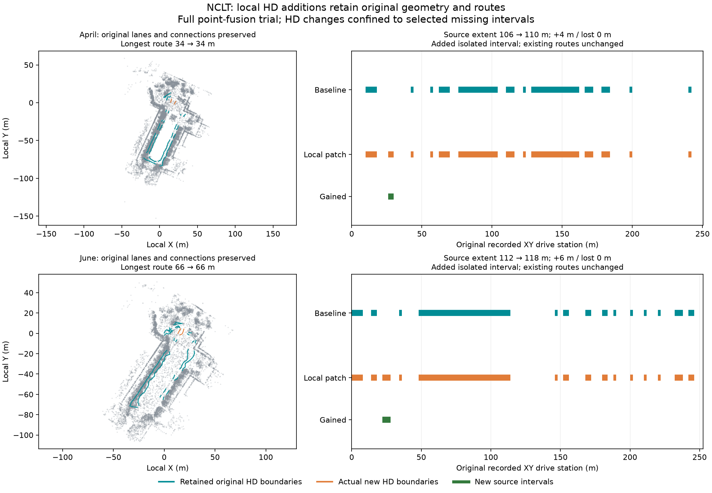

# NCLT: add missing HD intervals while retaining existing routes

Two fresh raw-log runs through live MCP on 2026-10-09 regenerated point maps,
then **patched only explicitly selected missing HD intervals** into the retained
map. Both partial pairs were explicitly adopted. Every original lane, boundary,
ID and directed connection was preserved, with no lost source intervals or new
failure locations on previously supported retained samples.

| Baseline → local HD patch | 2012-04-29 | 2012-06-15 |
| --- | ---: | ---: |
| Explicit added original-station interval | 26–30 m | 22–28 m |
| Original retained → expanded fusion frames | 199 → 212 | 195 → 223 |
| Fused point count | 683,690 → 712,558 | 645,432 → 705,390 |
| Exported original source-corridor extent | 106 → 110 m | 112 → 118 m |
| Gained / lost original source intervals | 4 / 0 m | 6 / 0 m |
| Global longest route station span | 34 → 34 m | 66 → 66 m |
| Graph components, including the new isolated lane | 11 → 12 | 12 → 13 |
| Low-quantile supported / total samples, IR and reopened OSM | 444/758 → 476/788 | 521/884 → 570/926 |
| Lowest-supported-layer samples, IR and reopened OSM | 758/758 → 788/788 | 884/884 → 926/926 |
| New lane supported / total, each of all four audits | 30/30 | 42/42 |
| New retained failure locations | 0 | 0 |
| Family HD attempts / fixed budget | 6/6 | 6/6 |
| Whole-drive 90% source-extent goal met | No → No | No → No |
| Final point/HD pair | Partial patch adopted | Partial patch adopted |

Teal boundaries are the original actual Lanelet2 geometry, including retained
connectors; orange boundaries are the actual added lane. The footprint is the
prior committed baseline cloud sample, identified in `verification.json`, used
only for visualization. All source intervals are shown. The patch adds one
isolated interval in each scene, increasing component counts without splitting
any original route. No new endpoint pairs were offered or adopted. It does not
connect the whole drive or lengthen the longest route.

## What changed and what was checked

Baselines replay previously inspected source and connection choices after fresh
MCP inspection. Original point-map bytes, lane geometry and directed graph match
the [last retained baseline](../nclt-unused-frames/README.md); proposal provenance
hashes differ by output path. This is a comparison replay, not an independent
agent benchmark or a measurement of operator effort. The fixed lane hypothesis
remains one forward one-way driving lane, fraction 1, 40 km/h, minimum width
2.5 m for April and 2 m for June. Traffic semantics remain unverified.

All root gaps and all unused-frame pages were inspected through live MCP. The
agent explicitly repeated the same inspected eligible 13/28 frame IDs as the
prior experiment. Original corrected poses, scan/map voxels (0.4/0.2 m), filter
policy, native extension, source protocols, path association, layout, original
station denominator and 90% goal remained fixed. The complete fused maps and
expanded/reference motion artifacts are **byte-identical to the prior full HD
redraft experiment**. Point generation is still a full fusion trial; this feature
does not preserve point-map bytes outside a spatial repair region.

The agent inspected every fresh child source candidate and explicitly selected
April candidate 2 at 26–30 m and June candidate 3 at 22–28 m, using returned
stations with path-level support, adequate unchanged minimum widths and no
search-limit edge. Source heights and edge observations are retained in
`source-candidate.json`. Height discontinuities and coverage geometry do not
prove road boundaries, lane identity or complete road width. Other missing
intervals were left unresolved, rather than chosen by a hidden production ranking.

The child drafted only these additions, then `inspect_patch` checked them
against root-inspected gap 3. It offered no coincident endpoint pairs in either
scene. The agent explicitly supplied `pairs: []` to `patch_gaps`. New lanes and
boundaries received unused IDs; original geometry, metadata, lane semantics,
turn labels and directed edges remained fixed. Native export and reopened OSM
retained both maps' geometry and expected route graph.

Each patch re-audited **every** retained and added lane against the complete
fusion trial, using both ground estimators for IR and reopened OSM. Protocols
and sample counts on retained curves stayed fixed. Retained traces had no worse
support/failure totals or supported endpoints, and complete failure locations
showed no new failed sample or changed failure reason. All new traces passed
at 100% support in all four audits. Small improvements in old legacy totals
are observations from the changed point source, not independent accuracy evidence.
Original legacy-estimator failures and disagreement with the coherent estimator
remain visible (312 and 356 height mismatches after the patches).

The root spent three original HD attempts. Its remaining three transferred once
to the child: geometry, addition lane export and combined-map patch. Preview
spent none. Each root read the actual gained/lost comparison, both children
finished, and the roots explicitly adopted their patched point/HD pairs. Original artifacts
remain available; neither job's draft selection was mutated.

The prior full HD redraft, using the **same** fused point maps, lost 6/20 m of
original source intervals and changed longest routes to 42/40 m. These local
patches generate fewer additional intervals but retain all original source
geometry and the 34/66 m routes. Different explicit HD choices were tested;
this does not measure an optimal repair strategy or autonomous selection accuracy.

## Retained evidence and reproduction

Each scene contains actual `before/`, `addition/` and `patch/` Lanelet2, editable
IR, projector, reports, geometry and all four audits. It also retains complete
root gaps and unused-frame observations, selected source sections, patch preview
and checks, full comparison intervals/routes, point-processing reports, layout
and compact root/child action traces. Original metadata keeps its baseline
provenance; the patch report records the new point source and complete input
lineage separately. Full point clouds and decoded returns remain generated
outputs; original file hashes and motion invariants are recorded in
[verification.json](verification.json).

Provenance hashes identify original files before portable path normalization.
`files-sha256.json` identifies committed normalized copies. Paths use `repo/`
for inputs, `run/` for generated artifacts and `native/` for the pinned extension.
The previous packet retains the corresponding full-fusion motion/scan evidence.

For a fresh run, start with the bundled log and saved layout; inspect/refine
source association, replay the inspected baseline ranges and connections, then
inspect all root gaps and relevant unused frames. Explicitly fuse eligible IDs,
inspect the child's fresh proposals and draft only chosen missing ranges. Preview
the patch, explicitly choose every offered endpoint pair or `[]`, patch within
the transferred budget and examine its complete checks. Compare the **patched**
candidate from the root, finish the child and explicitly adopt it or retain the
baseline. IDs may change; always use current observations. See the
[local repair contract](../../../docs/commands/mapping-run.md#repair-hd-gaps-while-retaining-the-existing-map).

Functional tests cover ID/geometry preservation, explicit endpoint adoption and
unseen pairs, invalid gaps, whole-drive replacements, overlap with existing
connectors, tampered inputs, new failure locations despite unchanged totals,
incomplete location reports, failed native/source checks, retained baseline
delivery and interrupted completed-stage reuse without another allocation.

Route spans measure original recorded XY stations on explicit directed graph
chains, not physical centreline length or certified legal routes. Independent
pose/map accuracy, unique road identity, traffic rules and deployment readiness
were not established.

## Attribution

University of Michigan NCLT; N. Carlevaris-Bianco, A. K. Ushani and R. M. Eustice,
“University of Michigan North Campus long-term vision and lidar dataset”, IJRR 2016.
Source and derived maps, evidence and figure are offered under
[ODbL 1.0](https://opendatacommons.org/licenses/odbl/1-0/), with database contents
under [DBCL 1.0](https://opendatacommons.org/licenses/dbcl/1-0/). Retain upstream
[sample attribution](../../../web/public/samples/ATTRIBUTION.md). Software remains
under the repository's MIT license.
