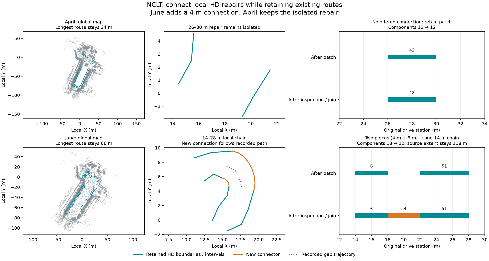

# NCLT: connect local HD repairs without replacing existing routes

Two fresh live MCP runs on 2026-10-09 reproduced the previous local repairs,
then inspected connections on the **combined, already connected maps**. June's
repaired lane joined a retained lane across a 4 m gap. April offered no safe
connection and retained its isolated repair. All existing lane geometry, IDs,
metadata and directed edges remained fixed, with no new failure locations on
retained source samples.

| After partial patch → after connection decision | 2012-04-29 | 2012-06-15 |
| --- | ---: | ---: |
| Offered / explicitly adopted new pairs | 0 / 0 | 1 / 1 |
| New original-station connector interval | None | 18–22 m |
| Affected pieces → connected local chain | 26–30 m stays isolated | 14–18 and 22–28 m → 14–28 m |
| Directed connector links | None | 6 → 54 → 51 |
| Graph components | 12 → 12 | 13 → 12 |
| Global longest original-station route span | 34 → 34 m | 66 → 66 m |
| Original source-corridor extent | 110 → 110 m | 118 → 118 m |
| Low-quantile supported / total samples, IR and reopened OSM | 476/788 → 476/788 | 570/926 → 600/956 |
| Lowest-supported-layer samples, IR and reopened OSM | 788/788 → 788/788 | 926/926 → 956/956 |
| New connector support, each of all four audits | No connector | 30/30 |
| New retained failure locations | 0 | 0 |
| Full fusion point count, unchanged by connection | 712,558 | 705,390 |
| Family HD attempts / fixed budget | 6/7 | 7/7 |
| Whole-drive 90% source-extent goal met | No | No |
| Final point/HD pair | Partial patch retained | Connected patch adopted |



Teal shows retained HD boundaries, including the previous repair and connectors;
orange is June's actual new connector. Purple is the recorded trajectory through
its gap. Grey context uses the prior committed baseline visualization sample,
not an audit input. The final column measures original drive stations, not
physical centreline length. June joins two pieces into a 14 m chain; it does
not lengthen the global 66 m route or make the whole recording routable.

## Validation and limits

The [previous partial-repair experiment](../nclt-partial-repair/README.md)
spent its six-attempt budget. These are **new runs with an explicitly declared
seven-attempt budget in both scenes**: three baseline attempts, then four
transferred to the retry child. The child uses geometry, addition lane export,
combined patch and, in June only, one connection attempt. April leaves its last
attempt unused. Existing finished runs were not reopened or reallocated.

Baseline choices, explicit raw-frame IDs and partial repair ranges were replayed
after fresh MCP inspection. Root point maps, expanded fusion maps and both
reference/fusion motion artifacts are byte-identical to the previous experiment.
Retained lane geometry and graph also match; output provenance paths differ.
This is a comparison replay, not an independent agent benchmark, accuracy
measurement or demonstration of optimal autonomous choices.

The same fixed one-forward-one-way lane hypothesis, 40 km/h, minimum widths
(2.5 m April / 2 m June), source thresholds and original station denominator
were retained. The agent inspected new proposals on patched candidate 3. April
had no offered pairs. June offered only 6 → 51: the full recorded gap path is
inside the candidate boundaries and its minimum interpolated XY width is
3.5 m, above the fixed 2 m minimum. The native end-to-end gap is about 3.82 m;
4 m is its **original drive-station interval**.

June explicitly adopted this pair. The exported editable map and reopened
Lanelet2 preserved all old lanes, semantics, geometric turn labels and directed
edges. Existing chain 24 → 45 → 27 → 48 → 30 remains intact. New lane 54
creates 6 → 54 → 51. All four complete audits use unchanged protocols and
retain old curve sample counts, support, failure classes/locations and supported
endpoints. All 30 connector samples pass each audit. Both roots compared the
actual selected child against the baseline, finished the child, and explicitly
adopted the resulting point/HD pair. Original artifacts remain available.

Source extent does not increase from this connector: it remains 110/118 m over
250.48/252.59 m drives, below the 90% goal. Original low-quantile failures remain
312/356 height mismatches, including holds on June lane 6's left boundary.
The coherent estimator's perfect support does not resolve estimator disagreement
or establish legal routing, full road width, independent map accuracy or
clearance. The new geometric turn label does not certify a permitted manoeuvre.
The point map remains the full fusion trial, not an unchanged-outside-ROI map.

## Retained evidence and reproduction

Each scene includes actual `before/` (combined partial repair) and `after/`
(selected final map) Lanelet2, editable IR, projector, reports and four full
source audits. Connection proposals preserve all inspected curve geometry,
recorded gap samples, frozen lineage and holds; checks preserve per-sample
regression results. Compact action traces, layout, root comparison and
[verification.json](verification.json) retain choices, hashes, motion invariants,
full graph routes and budgets. April's before and after are the same artifact.
Full point clouds remain generated outputs. The previous packet retains the
corresponding point-processing, raw-frame checks and partial repair evidence.

Provenance hashes identify original generated files. `files-sha256.json` hashes
committed portable copies. Run the saved-evidence checks from the repository:

```sh
PYTHONPATH=cloudanalyzer python benchmarks/vector-map/nclt-patch-connections/verify_packet.py
```

This checks packet hashes, old geometry/edge preservation, route accounting,
gap containment/width and all four saved audits. It does not re-audit full point
clouds. For a fresh live MCP run, use the bundled log, saved layout and
`max_attempts: 7`; inspect and reproduce the baseline and partial repair choices,
then inspect connections on the patched candidate. Adopt only seen pairs or
retain the patch if none are offered. Compare the selected child, finish it and
explicitly adopt or reject it from the root. IDs can change; use current
observations. See the [mapping-run contract](../../../docs/commands/mapping-run.md).

## Attribution

University of Michigan NCLT; N. Carlevaris-Bianco, A. K. Ushani and R. M. Eustice,
“University of Michigan North Campus long-term vision and lidar dataset”, IJRR 2016.
Derived maps, evidence and figure are offered under
[ODbL 1.0](https://opendatacommons.org/licenses/odbl/1-0/), with database contents
under [DBCL 1.0](https://opendatacommons.org/licenses/dbcl/1-0/). Retain upstream
[sample attribution](../../../web/public/samples/ATTRIBUTION.md). Software remains
under the repository's MIT license.
