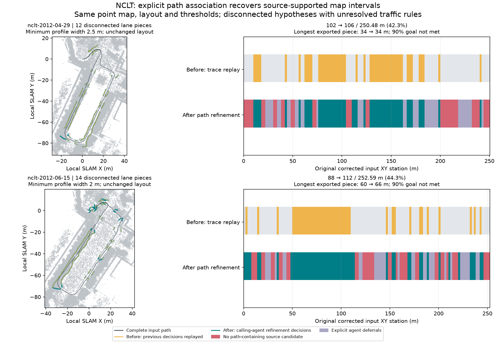

# NCLT: recover missing map intervals through explicit path association

The calling Codex agent tried one source extraction refinement through live MCP
on 2026-10-09. Overlapping off-path bands had fragmented the route's candidate
matches. The new `trajectory_containing` association retains every original
profile, but matches only supported bands containing the recorded path. No
source gap is filled and no physical or legal road branch is identified.

Both fresh runs started from the bundled raw MCAP logs and one fixed layout,
without candidate IDs or per-piece lane specifications. The agent inspected all
original candidates and explicitly replayed the
[previous decision trace](../nclt-agent-run/README.md) for the before comparison.
It then issued `refine`, inspected every new candidate, chose the saved intervals
from those live receipts, generated another geometry/lane pair and finished with
both map artifact sets. The replay is a comparison baseline, not an independent
autonomous-agent evaluation. New choices came from the calling agent; the runner
contains no ranking, widest-band choice or dataset-specific adoption rules.

| Result: before → after | 2012-04-29 | 2012-06-15 |
| --- | ---: | ---: |
| Point map (unchanged) | 683,690 points | 645,432 points |
| Path-containing candidate extent | 142 → 178 m | 110 → 174 m |
| All candidate extent, including off-path bands before | 204 → 178 m | 212 → 174 m |
| Longest source candidate | 48 → 72 m | 60 → 66 m |
| Exported lane-hypothesis extent | **102 → 106 m** | **88 → 112 m** |
| Full original input XY station length | 250.48 m | 252.59 m |
| Exported fraction of original input | 40.72 → 42.32% | 34.84 → 44.34% |
| Longest exported continuous source piece | **34 → 34 m** | **60 → 66 m** |
| Disconnected exported pieces | 12 → 12 | 13 → 14 |
| Original generated station intervals lost | 0 m | 0 m |
| Original 90% whole-drive goal met | No | No |



April's longest 72 m candidate still contains narrow and search-limited profiles;
the agent did not export it as one lane piece. Its longest exported piece remains
34 m. June's existing 50–110 m piece extends to 48–114 m after resolving off-path
matching ambiguity. Other recovered short intervals increase extent, but do not
connect all pieces into a routable whole-drive network. A longer single piece is
not a graph reachability or legal-driving guarantee. All original exported input
intervals remain included; new intervals are listed in [verification.json](verification.json).

## Fixed conditions and remaining holds

Point-map and corrected-trajectory SHA-256 hashes match the previous run. Before
and after in each new job use the **same newly built native binary**. All original
profiles, bands, source heights and level flags are identical between extraction
modes. Search reach, binning, height steps, support spacing, radius, height tolerance
and processing budgets are unchanged. Total candidate coverage decreases because
off-path alternatives are excluded; that is not lost path-associated coverage.

Each exported piece keeps the same one-forward-driving-lane, one-way, fraction-1,
40 km/h hypothesis and `source_span_hypothesis` policy. Minimum observed profile
width remains 2.5 m for April and 2 m for June. All included profiles contain the
recorded path at its supported level and satisfy that minimum; no included profile
has a search-limit edge. Exact outer XYZ curves and vertex counts are preserved,
and Lanelet2 reload preserves geometry and the explicit lane assumptions.
Full-width interior support, complete physical road width and legal semantics
remain unresolved. Profile containment does not certify the intermediate recorded
path or obstacle clearance. Lower source levels can still be physically wrong.

| Source audit: before → after | 2012-04-29 | 2012-06-15 |
| --- | ---: | ---: |
| Low-quantile supported / trace samples | 397/689 → 403/717 | 280/610 → 423/786 |
| Ground-consensus supported / trace samples | 689/689 → 717/717 | 610/610 → 786/786 |
| Low-quantile height mismatches | 292 → 314 | 330 → 363 |
| Ground-consensus height mismatches | 0 → 0 | 0 → 0 |
| Native structural errors | 0 → 0 | 0 → 0 |

All four audits are complete; editable and reopened evidence match for each
estimator. Both estimators remain saved, and their disagreement is unresolved.
Added extent is not independent accuracy or source-quality improvement. Sample
counts are per lane/trace, not unique point counts or percentages of road length.
April's low-quantile support fraction becomes slightly worse despite added extent.
There is no independent ground truth or operator-time comparison.

Both final outputs remain `draft_needs_review`, unselected and
`deployment_ready=false`. Whole-drive selection rejects the unchanged 90% extent
shortfall. The point maps remain `generated_unverified`, in local SLAM coordinates.
These are 190-second NCLT Segway excerpts, thinned to 0.8 m with near-sensor returns
removed; missing source cannot be reconstructed by a matching policy.

## Inspect and reproduce

Each `april` / `june` folder contains the actual IR, Lanelet2 OSM, local projector,
fixed layout, decisions, source geometry sections and lane report, both source
audits, before/after proposal summaries and an action trace. Trace observations
are explicitly omitted from the committed compact action file; its hash identifies
the complete retained `run.json`. Full proposals/point maps remain generated
outputs. Recorded original hashes precede path normalization; committed hashes in
the verification record identify the published normalized artifacts.

For a fresh run, use `start_mapping_run` through MCP with the bundled recording
and saved `layout.json`, page and inspect its original proposals, then issue:

```json
{"type": "refine", "association": "trajectory_containing"}
```

Read the new index and inspect every relevant candidate afresh before choosing
include/defer intervals. Draft a complete replacement and finish with its returned
lane attempt ID. Use the latest inspected revision and a reason on each action.
This explicit geometric association experiment runs once without spending an HD
attempt; original proposals and earlier drafts remain immutable. See the
[mapping-run action contract](../../../docs/commands/mapping-run.md#inputs-and-actions).

To reproduce this comparison **as a trace replay**, also inspect the original
proposal IDs and draft the previous saved decisions before refining. After fresh
inspection of the refined candidates, draft the corresponding `decisions.json`
and finish. Verify IDs/sections against the new source; IDs are not persistent
road identities or startup presets. Two geometry/lane pairs spent four HD attempts,
leaving two. Functional tests separately cover failed refinement retaining the
original proposal and interruption after extraction resuming without replay.

## Attribution

University of Michigan NCLT; N. Carlevaris-Bianco, A. K. Ushani and R. M. Eustice,
“University of Michigan North Campus long-term vision and lidar dataset”, IJRR 2016.
Source and derived maps, evidence and figure are offered under
[ODbL 1.0](https://opendatacommons.org/licenses/odbl/1-0/), with database contents
under [DBCL 1.0](https://opendatacommons.org/licenses/dbcl/1-0/). Retain upstream
[sample attribution](../../../web/public/samples/ATTRIBUTION.md). Software remains
under the repository's MIT license.
