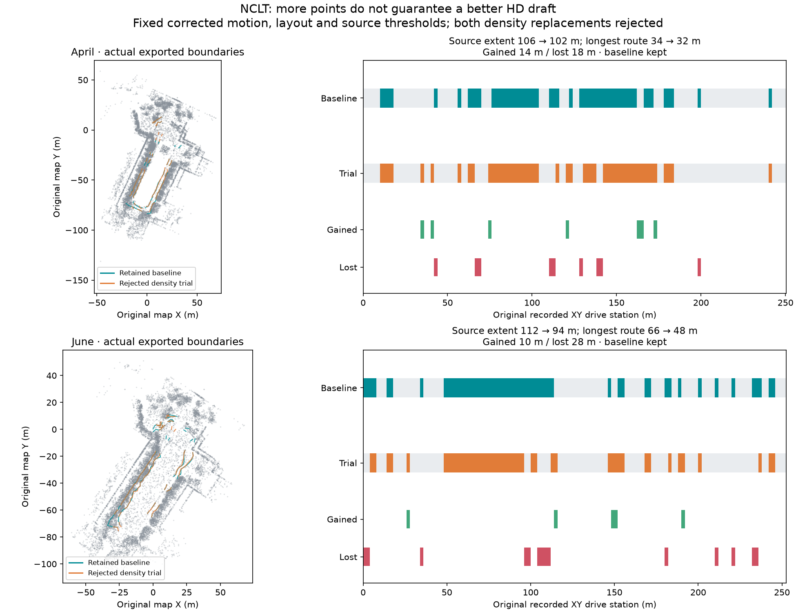

# NCLT: inspect raw gaps, regenerate both maps, reject worse replacements

Two fresh raw-log runs through live MCP on 2026-10-09 exercised a point-map
density trial and actual HD regeneration. The calling Codex agent examined raw
returns around missing source intervals, explicitly reduced thinning, inspected
the child proposals, drafted/audited new maps and compared them with the retained
baseline. **Both replacements were rejected.** More points did not improve these
exported maps; the final output kept the baseline point map and connected HD draft.

| Before → density trial | 2012-04-29 | 2012-06-15 |
| --- | ---: | ---: |
| Fused point count | 683,690 → 1,033,824 | 645,432 → 955,898 |
| Exported original source-corridor extent | 106 → 102 m | 112 → 94 m |
| Newly generated original source intervals | 14 m | 10 m |
| Lost original source intervals | 18 m | 28 m |
| Global longest graph route station span | 34 → 32 m | 66 → 48 m |
| Disconnected graph components | 11 → 12 | 12 → 11 |
| Low-quantile supported samples / total, IR and reopened OSM | 444/758 → 396/688 | 521/884 → 421/742 |
| Lowest-supported-layer samples / total, IR and reopened OSM | 758/758 → 688/688 | 884/884 → 742/742 |
| Family HD attempts spent / fixed budget | 5/6 | 6/6 |
| Original whole-drive 90% source-extent goal met | No → No | No → No |
| Final point/HD pair delivered | Baseline retained | Baseline retained |

Route spans measure original recorded XY drive stations along explicit directed
lane-graph chains, including connector gaps. They are not physical centreline
lengths or certified legal routes. Component counts alone can improve while
source extent and the longest route worsen, as June shows. Audit denominators
also change with geometry; fewer failing samples do not establish improved quality.
Independent ground truth and road semantics were not established.

## What the agent examined and changed

The baseline replays the previously examined
[source/connection choices](../nclt-route-connections/README.md), after fresh
MCP inspection, to reproduce the last merged point map, lane geometry and graph.
Fresh proposal provenance hashes differ by output path; geometry/topology match.
This replay is a comparison baseline, not an independent agent benchmark or a
measurement of operator effort. The source is each bundled MCAP recording and
the original fixed layout: one forward one-way driving-lane hypothesis, fraction
1, 40 km/h, minimum width 2.5 m for April and 2 m for June. Legal use remains
unverified. No proposal IDs or adopted source ranges were supplied at startup.

`inspect_gaps` decoded the original logs again and aligned raw returns at the
original corrected keyframes. April retained 199 of 236 scans with 1,171,934 raw
matched returns; June retained 195 of 238 scans with 1,077,329 returns. Missing
trajectory bands and discontinuous source support remain observations, not proven
causes. Gap 1 has few local raw returns; gap 8 and nearby profiles show many raw
returns reduced by fusion/thinning/filtering. These descriptive neighborhoods
justify testing a thinning hypothesis, not declaring it a repair. Counts include
repeated aligned observations, and local heights are not coherent-ground tests.
Full saved gaps contain bounded nearby profiles and explicit sampling totals.

The agent chose inspected gap IDs 1 and 8 and explicitly reduced scan voxels
0.4 → 0.2 m and fused-map voxels 0.2 → 0.1 m. The runner freshly rebuilt the map
from the decoded original returns, with **no motion reoptimization**. Corrected
poses, retained keyframes, dynamic-filter policy, native binary, path association,
source thresholds/budgets, initial lane layout, original station denominator and
90% extent goal stayed fixed. Pose roundtrip error was below 1.23e-15; exact
original trajectory and graph bytes were retained. The filtering result changed:
removed returns were 36 → 194 and 117 → 222. A fixed policy does not imply an
identical removal mask with denser inputs.

The original connected baseline spent three HD attempts. All three remaining
attempts transferred once to the child; the parent could not spend them again.
The agent inspected every fresh child proposal and explicitly selected observed
ranges, retaining narrow, isolated, broad/varying and search-limited holds.
Choices and reasons are saved, rather than hidden in a production ranking.
April had no eligible trial connections. June had two inspected strict connections
and generated/audited them within the remaining child attempt. They produced a
local 20 m chain, while the global longest route remained 48 m. Actual IR/OSM
geometry, directed edges and geometric turn tags survived reload; both estimators
were checked on all new traces. Unverified turn tags do not prove permitted turns.

The root comparison preserved **both gained and lost** original source intervals,
four complete source-audit totals/protocols and global route spans. Both children
finished as retained trial drafts, then the agent explicitly finished each root
with its earlier baseline. The final output includes its rejection reason and
hashed comparison. No source threshold, lane width or extent goal was relaxed,
and no trial was automatically adopted or selected as deployment-ready.

## Retained evidence and reproduction

Each scene contains actual `before/` and `trial/` Lanelet2, editable IR, projector,
source/geometry reports and all four audits. It also retains complete original
source proposals, comparison intervals/chains, bounded raw gap observations,
decoded-frame hashes, point-processing reports, layout and root/child action
traces. Observation payloads are omitted from the compact action files; their
hashes identify the original full histories. Full fused/raw point clouds remain
generated outputs. `footprint.npz` is a deterministic visualization sample of each
actual fused map, never an input to proposals or audits. The plotted footprint is
the baseline; overlaid boundaries are the actual baseline and trial exports.

[verification.json](verification.json) records original artifact hashes, identical
motion/layout/protocol checks, four audit totals, attempt allocation and explicit
output choices. Provenance hashes refer to original files before portable path
normalization; `files-sha256.json` identifies committed normalized evidence.
Sources use `repo/`, generated artifacts `run/`, and the pinned extension `native/`.

For a fresh run, use the bundled log and saved `layout.json` through MCP. Inspect
and refine the source association, inspect fresh IDs, then explicitly replay the
baseline ranges and examined short connections. Inspect gaps using the actual
audited baseline ID, choose observed gaps with a reason and issue the explicit
density trial. Use the returned child directory/revision to inspect fresh proposals,
draft ranges and examine connection opportunities. Compare the child's actual
audited ID from the root, finish the child, and explicitly deliver the trial or
retain the baseline. IDs can change; always read current receipts. See the
[mapping-run contract](../../../docs/commands/mapping-run.md#investigate-missing-intervals-and-retry-point-generation).

Functional tests cover shared budgets including direct tool calls, seen-gap receipts,
changed evidence/raw frames, unbounded options, pose changes, failed extraction,
nonrecursive retries, interrupted completed-stage reuse, gained/lost intervals,
required comparisons and explicit baseline/trial delivery. This first retry
addresses thinning only; motion, wrong surface levels, excluded non-keyframes and
absent raw returns remain outside its repair scope.

## Attribution

University of Michigan NCLT; N. Carlevaris-Bianco, A. K. Ushani and R. M. Eustice,
“University of Michigan North Campus long-term vision and lidar dataset”, IJRR 2016.
Source and derived maps, evidence and figure are offered under
[ODbL 1.0](https://opendatacommons.org/licenses/odbl/1-0/), with database contents
under [DBCL 1.0](https://opendatacommons.org/licenses/dbcl/1-0/). Retain upstream
[sample attribution](../../../web/public/samples/ATTRIBUTION.md). Software remains
under the repository's MIT license.
