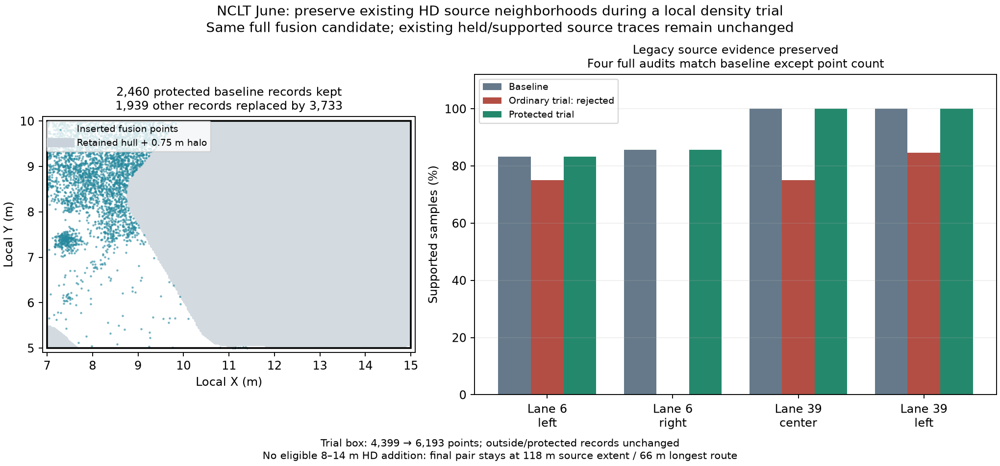

# NCLT: retain existing HD neighborhoods during density repair

The calling MCP agent explicitly chooses `inspect_protected_density` before retrying
the same June box and thinning used by the [rejected ordinary trial](../nclt-repair-continuation/README.md).
**All four retained-HD audits match baseline except the global point count.**
The ordinary trial regressed lanes 6/39; the protected trial retains those source
neighborhoods and changes only the unprotected part of the box.



| Evidence | Result |
| --- | --- |
| Box / scan and map thinning | `[7,5,15,10]` / `.1/.05 m` |
| Full fusion candidate | identical SHA-256 to the rejected ordinary trial |
| Protected records inside box | **2,460**, same bytes/attributes/order at all heights |
| Other records inside box | **1,939** replaced by **3,733** fusion records |
| Box point count | **4,399 → 6,193** |
| Full point trial | **646,309 → 648,103** |
| Outside records | **641,910**, unchanged |
| Previous accepted point box | `[12,-3,22,5]`, unchanged |
| Native source evidence | legacy/spatial consensus × IR/reopened OSM, all unchanged except point count |
| Fresh chosen-gap candidates | stop at station 8 / begin at 14; no candidate inside 8–14 |
| Trial adoption | **No**: no eligible combined HD addition in the chosen gap |
| Final delivery | exact prior point/HD pair: **118 m** source extent, **66 m** global longest route |
| New / cumulative HD attempts | **0 / 8**, explicit new family budget 6 |

The protection region is the union of each lane's convex hull (both boundaries and
any explicit centerline), expanded by the maximum query radius of the complete saved
source audits, **0.75 m + 1 µm margin** here. It covers continuous trace query disks,
including existing source holds. The hull may also protect bend interiors or useful
new evidence. Existing records are kept; candidate points in protected regions are
excluded. Support thresholds, lane geometry, poses, frames and full-input extent stay
fixed. Four native checks still reject newly failing retained source locations.

## Reproduction and limits

`agent-actions.json` records live MCP startup, fresh root gap/box inspection, explicit
retry, child candidate inspections and both finish decisions. This is informed by
previous work, **not an independent agent benchmark**. The full trial audits were
repeated against the actual point map and matched saved reports. Both preceding
and current trial use an identical full-fusion candidate and baseline map, isolating
the point-splicing choice. Native-fixture tests additionally adopt a protected point
update plus a gap patch, verify exact retained records, reject adverse candidate
points near existing lanes and retain the baseline when audit checks fail.

```sh
PYTHONPATH=cloudanalyzer python benchmarks/vector-map/nclt-protected-density/verify_packet.py
PYTHONPATH=cloudanalyzer python benchmarks/vector-map/nclt-protected-density/verify_packet.py --generated-root /absolute/nclt-protected-density-june
```

The checker uses the preceding committed packet's exact HD geometry and ordinary
rejection evidence. The optional check verifies full retained records, original
lineage, excluded candidate points and the entire earlier point box. The inside
subsets alone cannot prove full outside equality. Generated original hashes are
preserved; `files-sha256.json` hashes portable copies (`run/parent/original/repo/native/env`
replace machine paths). Earlier referenced directories must stay accessible.

**This real-log trial adds no adopted point/HD extent or route connectivity.**
A passing retained audit and larger point count do not establish new surface support,
accuracy or road identity. New density settings still have existing `.1/.05 m` floors;
full fusion is still required, without a local speedup. Existing source holds, unknown
traffic semantics and full-drive discontinuities remain. No independent accuracy,
legal routing or deployment-readiness claim is made.

## Data terms

Derived NCLT observations, point subsets and figure retain
[ODbL 1.0](https://opendatacommons.org/licenses/odbl/1-0/) and
[DBCL 1.0](https://opendatacommons.org/licenses/dbcl/1-0/) terms; retain upstream
[sample attribution](../../../web/public/samples/ATTRIBUTION.md).
Verification code is MIT licensed under the repository license.
