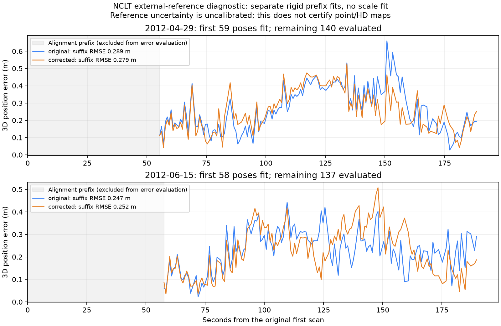

# NCLT external-reference trajectory comparison

This packet compares saved original odometry and corrected reference-graph poses
against the separately distributed NCLT ground-truth CSV, over live MCP calls.
The reference CSV was **not supplied to these mapping jobs**. This evaluates
trajectory shape; it does not certify point-map surfaces, HD geometry or traffic
semantics, or establish statistical independence of the reference sensors.

| Session / alignment | Matched poses | Fit / evaluated | Original ATE RMSE | Corrected ATE RMSE | Change |
|---|---:|---:|---:|---:|---:|
| 2012-04-29 / all matched poses | 199 / 199 | 199 / 199 | 0.165990 m | 0.170946 m | +0.004956 m |
| 2012-04-29 / first 30%, remaining suffix | 199 / 199 | 59 / 140 | 0.289283 m | 0.279199 m | -0.010084 m |
| 2012-06-15 / all matched poses | 195 / 195 | 195 / 195 | 0.160849 m | 0.162709 m | +0.001860 m |
| 2012-06-15 / first 30%, remaining suffix | 195 / 195 | 58 / 137 | 0.246734 m | 0.252191 m | +0.005457 m |

Positive change means a higher error against this reference. In-sample rigid fits
slightly regress for both sessions; prefix-fitted, disjoint suffix evaluation
improves for April and regresses for June. Reference uncertainty is not calibrated,
so these millimetre/centimetre differences are **not** proof of a physical accuracy
change. There is no passing quality gate, automatic map adoption or threshold tuning.



## Exact evaluated inputs and protocol

- April owns the delivered point map of `nclt-unused-frames-april/pointcloud-retry`;
  June owns the baseline delivered by `nclt-unused-frames-june`. These are the two
  finished jobs with saved hashed original `source_motion`, not the newest HD-only
  repair jobs. April's expanded fusion files remain frozen inputs; the evaluated
  corrected trajectory is the **199-node reference graph**, not added-frame poses.
- Original odometry has 236 April / 238 June poses. Sorted original-frame graph
  IDs bind the retained corrected poses to the original scan timestamps. All
  retained poses have reference support. Maximum nearest-reference time deltas
  are 0.007075 s / 0.005574 s; both interpolation brackets are at most 0.05 s away.
- `prepare_nclt_reference.py` reads a bounded recording window of the full CSV,
  retains the original scan timestamps' reference brackets (472 / 476 rows),
  converts body ground truth to the synchronized Velodyne sensor origin, and
  saves the source hashes, calibration and clock convention. NCLT rpy is radians;
  microsecond timestamps are divided by 1e6. Calibration is the same as
  `prepare_nclt.py` / `make_nclt_bag.py`: `FLIP @ body_pose @ BODY_VEL @ FLIP`.
  The synchronized scan axes already apply the devkit yaw; no additional -90.7°
  yaw is applied. Translation to the sensor origin uses the rotating lever arm.
- Reference sensor-frame positions are linearly interpolated at retained scan
  times; optional orientations use SLERP. No extrapolation occurs. Each estimate
  has its own SE(3) rigid fit with **no scale fit**. Full fits evaluate the fitted
  samples. Prefix mode uses `floor(0.3 * matched_poses)` for alignment and evaluates
  only the disjoint chronological suffix. Both estimates use identical fit/test
  IDs. These are two known, bounded recordings, not unseen-session generalization.
- ATE is 3D position RMSE after that alignment. RPE translation compares adjacent
  evaluated retained poses at variable time intervals, not one-second intervals.
  Full reports include rotation metrics, matrices, coverage, matched samples and
  error series. Their inputs preserve job/map/graph/source/native hashes.
- All 240 April-owner files and 760 June-owner files matched pre/post SHA-256
  snapshots. No mapping attempts, odometry/fusion, map generation, HD auditing,
  candidate selection, native/WASM rebuild or finished-job edits occurred.

## Recheck or reproduce

```bash
# Portable verification, no native core or original mapping jobs required:
python benchmarks/vector-map/nclt-reference-accuracy/verify.py

# Also verify the full downloaded CSV hashes and each selected original raw row:
python benchmarks/vector-map/nclt-reference-accuracy/verify.py \
  --ground-truth-root /workspace/.cloudanalyzer-env/nclt-reference-inputs
```

`SHA256SUMS` covers the packet. The standard-library verifier reconstructs the
sensor calibration and timestamp conversion, checks the frozen graph/trajectory
bindings, fit/evaluation partition and alignment-centroid constraints, and
recomputes transformed sample positions, ATE/RPE translation and receipt values.
It does not independently recompute rotation-error metrics or optimize an
alternative alignment. Integrity does not establish source authenticity or accuracy.

With an original frozen job and downloaded NCLT CSV, use new output paths:

```bash
python scripts/prepare_nclt_reference.py \
  --job /data/finished-point-map-owner \
  --ground-truth /data/groundtruth_2012-04-29.csv \
  --source-url https://s3.us-east-2.amazonaws.com/nclt.perl.engin.umich.edu/ground_truth/groundtruth_2012-04-29.csv \
  --out /data/new-reference
ca mapping-trajectory-evaluate /data/finished-point-map-owner \
  --reference /data/new-reference/reference.tum \
  --provenance /data/new-reference/reference-provenance.json \
  --alignment-prefix-fraction 0.3 --out /data/new-comparison.json
```

MCP uses `evaluate_mapping_trajectory` with the same arguments and explicit
`alignment_prefix_fraction: 0.3`. Default `1` retains the original in-sample fit.
Legacy jobs lacking hashed source motion are still refused.

## Reference data and attribution

Source: [University of Michigan North Campus Long-Term dataset](http://robots.engin.umich.edu/nclt/),
N. Carlevaris-Bianco, A. K. Ushani and R. M. Eustice, *University of Michigan North
Campus long-term vision and lidar dataset*, IJRR 2016.

The full source CSVs are external to this packet:

- [2012-04-29](https://s3.us-east-2.amazonaws.com/nclt.perl.engin.umich.edu/ground_truth/groundtruth_2012-04-29.csv):
  53,339,022 bytes, SHA-256 `d60a6fcc62c5c2db789b54cb2d7ff5627ae2035a9e9dcb6da2b0b1aa3141bf96`.
- [2012-06-15](https://s3.us-east-2.amazonaws.com/nclt.perl.engin.umich.edu/ground_truth/groundtruth_2012-06-15.csv):
  67,250,661 bytes, SHA-256 `d480a45855114343d39481d7fe6b24747f958b88cc6f2ecf43df30ff3f2c367e`.

Downloaded over verified TLS from the authoritative source, checked against
Content-Length, and hashed locally. The multipart S3 ETag is recorded but is not
treated as a content checksum. No publisher-signed hash was supplied.

NCLT source and the derived database in this packet are offered under the
[Open Database License 1.0](https://opendatacommons.org/licenses/odbl/1-0/), with
contents under the [Database Contents License 1.0](https://opendatacommons.org/licenses/dbcl/1-0/).
This is transformed/cropped data plus saved diagnostic results, not an endorsement
by the dataset authors. Reference sensor correlations, uncertainty, long-drive
generalization, independent HD surveys and traffic permission remain unverified.
