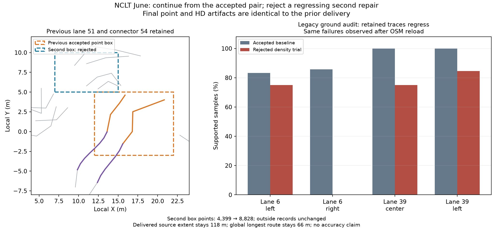

# NCLT: continue repairing the adopted map

A live MCP session starts from the **exact previously delivered June point/HD pair**,
without rerunning odometry, fusion, proposal extraction or HD generation at startup.
It inspects a second region, rejects a density trial that regresses existing source
support, and finishes with the exact prior pair. A native fixture separately checks
that two accepted gap patches accumulate while retaining the first repair.



| Observation | Result |
| --- | --- |
| Previous accepted point box | `[12,-3,22,5]` |
| New inspected point box | `[7,5,15,10]`, disjoint under half-open bounds |
| Fusion thinning | scan `0.2 → 0.1 m`, map `0.1 → 0.05 m` |
| New-box points | `4,399 → 8,828` in the rejected trial |
| Outside point records | `641,910`, same bytes/attributes/order |
| Earlier point-box records | unchanged even in the rejected trial |
| Retained support regression | legacy estimator, lanes 6 left/right and 39 center/left; also after OSM reload |
| Delivery | exact prior point/graph/trajectory/HD pair, **646,309 points** |
| Earlier HD repair | lane 51 and connector 54, edges `51→54→9` retained |
| Original source extent | **118 m**, unchanged; no gained/lost source intervals |
| Route metrics | 12 components, global longest route 66 m, unchanged |
| Explicit new HD budget | 6, transferred once to the failed child |
| New HD attempts spent | 0; the point trial fails before generating HD candidates |
| Previous / cumulative HD attempts | 8 / 8; inherited seed spends no new attempt |

## Method and evidence

The calling agent uses `continue_mapping_run`, fresh `inspect_gaps` and
`inspect_local_density` receipts, explicit `.1/.05` local fusion, and `finish`
candidate 1 after the failed retained-support checks. The startup and final
inspection use the live MCP transport. A transient workspace exec transport
interruption affected the finish response; the saved finished state was recovered
through **live MCP inspection**, without reopening or replaying the finished run.
`agent-actions.json` records this distinction.

The parent is the [previous HD envelope trial](../nclt-hd-connection-region/README.md).
Choices reuse that earlier work; this is **not an independent agent benchmark**.
Four full saved audits (legacy/spatial consensus × IR/reopened OSM) were repeated
against the actual retained and rejected full point maps and matched exactly.
The checker rejects the new failures rather than selecting the more favorable
estimator. The trial identifies a validation regression; it does not establish a
physical root cause or justify lowering support thresholds.

`continuation.json` archives the earlier point-update scope and hashes prior run/job,
map pair, source/native/layout, decisions and audits. Previous artifacts remain
immutable references. `output.json` and `parent-output.json` record identical
original descriptors; `local-update.json` and both full audit files preserve the
failed trial. Original hashes identify generated artifacts; `files-sha256.json`
hashes the committed portable copies (`run/parent/repo/native/env` replace machine
paths). No full point cloud or raw recording is committed. The inside PLY subsets
alone cannot prove outside-byte equality.

```sh
PYTHONPATH=cloudanalyzer python benchmarks/vector-map/nclt-repair-continuation/verify_packet.py
```

For the full generated files and prior directories:

```sh
PYTHONPATH=cloudanalyzer python benchmarks/vector-map/nclt-repair-continuation/verify_packet.py --generated-root /absolute/nclt-continuation-june
```

The optional check verifies immutable original lineage and every outside record,
including the entire first point-update box. A compatible native module is needed
for the OSM roundtrip. The point trial still generates a full fusion candidate;
this introduces no local speedup. Density settings reflect the last fusion, not
uniform resolution of the hybrid map. Existing `.1/.05 m` floors and strictly
reduced settings limit further density trials; the runner never resets them.

No new HD interval or route is adopted in this real-log session. Existing source
holds, full-drive discontinuities, unknown traffic semantics and missing independent
accuracy checks remain. See [the MCP workflow](../../../docs/commands/mapping-run.md#continue-from-a-delivered-map).

## Data terms

Derived NCLT maps, subsets, observations and figure retain
[ODbL 1.0](https://opendatacommons.org/licenses/odbl/1-0/) and
[DBCL 1.0](https://opendatacommons.org/licenses/dbcl/1-0/) terms; retain upstream
[sample attribution](../../../web/public/samples/ATTRIBUTION.md).
Verification code is MIT licensed under the repository license.
