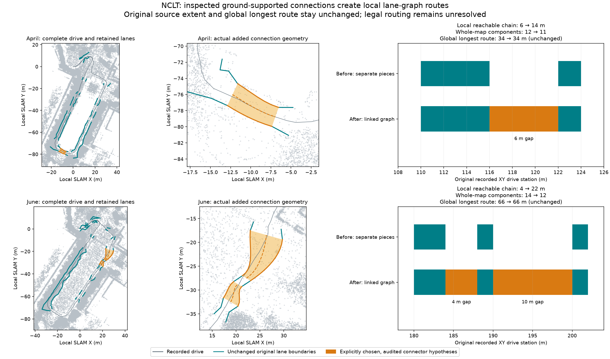

# NCLT: create local routes from inspected source-supported connections

Two fresh raw-log runs through live MCP on 2026-10-09 added three short lane
connections. The calling Codex agent inspected exact connector geometry, source
support and recorded drive order, then explicitly chose each pair with a reason.
The runner preserved the original map, verified both ground estimators and
required Lanelet2 reload to retain the directed route graph.

| Result: before → after | 2012-04-29 | 2012-06-15 |
| --- | ---: | ---: |
| Point map, unchanged from previous run | 683,690 points | 645,432 points |
| Original source-corridor lane extent, unchanged | 106 m | 112 m |
| Affected local chain's longest reachable span | **6 → 14 m** | **4 → 22 m** |
| Affected original drive interval after connection | 110–124 m | 180–202 m |
| Added original drive gaps | 116–122 m | 184–188 m; 190–200 m |
| Whole-map disconnected components | **12 → 11** | **14 → 12** |
| Whole-map longest route span | **34 → 34 m** | **66 → 66 m** |
| Added connectors | 1 | 2 |
| New connector trace samples supported, each of four audits | 41/41 | 98/98 |
| Whole-drive 90% source-extent goal met | No | No |

Route spans above are **original recorded XY drive stations along explicit
lane-graph chains**, including connector gaps. They are not physical centreline
lengths or legal routing certification. The before local metric is the longest
isolated piece in the affected chain; the after metric is the connected chain.
The global longest route does not increase. These useful local connections do
not make either full recording routable.

## What was checked

Both runs started from the bundled raw MCAP logs and the same explicit layout:
one forward driving lane, one-way, fraction 1, 40 km/h, minimum geometric width
2.5 m for April and 2 m for June. No corridor or lane IDs were supplied at startup.
The agent refined path association once, inspected every current source candidate,
and replayed the verified [previous source-piece decisions](../nclt-path-refinement/README.md)
to reproduce a disconnected baseline. Original lane and boundary XYZ values match
the previous exports exactly. This baseline replay is not an independent agent
benchmark or an operator-time measurement.

The agent then called `inspect_connections`, read the returned geometry and
explicitly adopted April's 18 → 21 pair and June's 24 → 27 and 27 → 30 pairs.
Those IDs came from the observations, rather than a production dataset preset.
The production runner contains no candidate ranking or automatic adoption.
One connection attempt added all explicitly chosen pairs for each run.

Each pair connects consecutive source pieces in original station order. Both
endpoint distance and original drive gap are at most 10 m. Native heading,
grade and endpoint checks remain active; ambiguous branches are withheld.
Recorded XY path samples at no more than 0.5 m spacing, including endpoints,
lie inside the exact inspected polygon. Distance between equal normalized XY-arc
positions on the piecewise-linear boundaries meets the fixed minimum width.
The native connector's actual boundaries must match the inspected geometry.
No source threshold, lane layout or point-map coordinate was changed.

All existing lanes, boundaries and metadata remain unchanged. IR and reopened
OSM preserve lane membership, shared boundary references, orientation, speed
hypotheses and XYZ coordinates. Directed predecessor/successor edges and full
route chains match after OSM reload. All four complete source audits have zero
structural/import errors. Every new centre/left/right trace sample and endpoint
is supported by both the low-quantile and spatial-layer ground estimators.
Full source audits are retained; original lanes' estimator disagreement remains
unresolved. The new connections do not repair those lanes.

Original extraction length, full station dispositions and 90% extent goal are
unchanged. The connector intervals remain unresolved in the original source
corridor extraction; graph reachability is measured separately. Whole-drive
selection still rejects the shortfall. Previous draft hashes are intact.
Both outputs remain `draft_needs_review`, unselected and `deployment_ready=false`.

## Remaining limits

This first connection loop supports a single forward one-way driving lane per
piece. Multi-lane and backward-lane matching, ambiguous junctions and larger gaps
are not resolved. Source support and recorded XY containment do not establish
physical road identity, complete road width, obstacle clearance or permitted
turns, direction or speed. Native `turn_direction` tags are geometric heading
labels, not proof of permitted manoeuvres. Path containment is sampled; intermediate clearance
and independent map accuracy are unverified. Point maps are still
`generated_unverified` in local SLAM coordinates. The NCLT inputs are 190-second
Segway excerpts, thinned to 0.8 m with near-sensor returns removed.

## Inspect and reproduce

Each dataset folder contains actual before/after IR, Lanelet2 and projector
files, the full new source audits, source geometry, fixed layout, decisions,
connection proposals and a compact action trace. [verification.json](verification.json)
records original source/native/artifact hashes, all route chains, audit totals,
unchanged extent and checks. Trace observations are explicitly omitted from the
compact action file; its hash identifies the complete retained `run.json`.
Recorded hashes precede path normalization; committed hashes identify the
published portable evidence. Raw point maps remain generated outputs.

For a fresh MCP run, call `start_mapping_run` with the bundled log, the saved
`layout.json` and a six-attempt budget. Refine with
`{"type":"refine","association":"trajectory_containing"}`, inspect current
proposals, verify source sections against the saved decisions and draft those
pieces as an explicit trace replay. Inspect connections using the actual lane
attempt ID, then choose the observed pairs with individual reasons. Use the
current returned revision on every action. Finish with the audited connected
candidate. Source geometry and lane export spend two HD attempts; connection
spends one, leaving three. Inspection/refinement/finish spend none.
See the [mapping-run contract](../../../docs/commands/mapping-run.md#connect-short-inspected-source-gaps).

Functional tests also cover uninspected or duplicate pairs, stale receipts,
unsupported traces from either estimator, incomplete audits, lost OSM topology,
path shortcuts, narrow/ambiguous geometry, interrupted processing without replay,
and finishing with a retained earlier draft after a failed connection.

## Attribution

University of Michigan NCLT; N. Carlevaris-Bianco, A. K. Ushani and R. M. Eustice,
“University of Michigan North Campus long-term vision and lidar dataset”, IJRR 2016.
Source and derived maps, evidence and figure are offered under
[ODbL 1.0](https://opendatacommons.org/licenses/odbl/1-0/), with database contents
under [DBCL 1.0](https://opendatacommons.org/licenses/dbcl/1-0/). Retain upstream
[sample attribution](../../../web/public/samples/ATTRIBUTION.md). Software remains
under the repository's MIT license.
