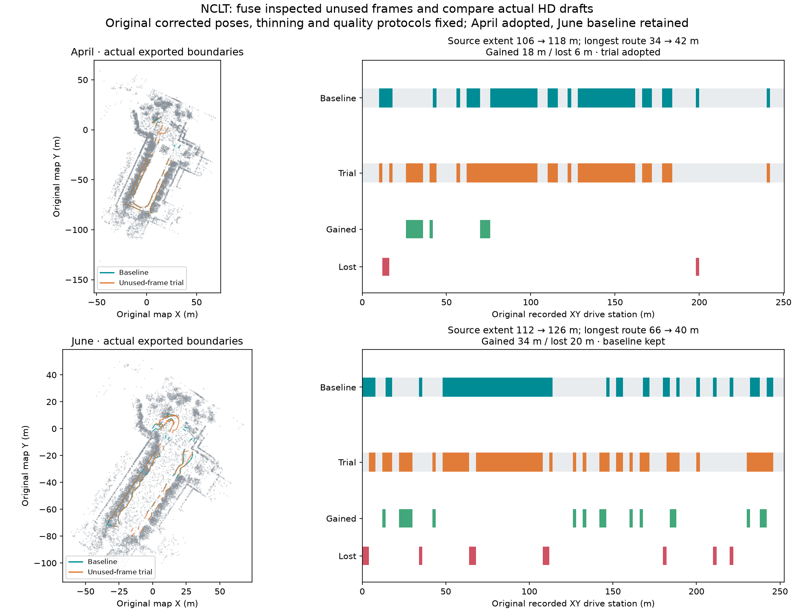

# NCLT: inspect unused frames, regenerate both maps, compare before delivery

Two fresh raw-log runs through live MCP on 2026-10-09 tested observations excluded
from the original corrected keyframe set. The calling Codex agent inspected every
unused frame, explicitly selected eligible IDs, regenerated the point map and HD
draft, and compared the actual exports. **April's partial replacement was adopted;
June's baseline was retained** because the trial shortened its longest route and
increased fragmentation despite generating more source intervals.

| Before → unused-frame trial | 2012-04-29 | 2012-06-15 |
| --- | ---: | ---: |
| Recorded raw frames | 236 | 238 |
| Originally retained → expanded fusion frames | 199 → 212 | 195 → 223 |
| Inspected unused / explicitly selected frames | 37 / 13 | 43 / 28 |
| Fused point count | 683,690 → 712,558 | 645,432 → 705,390 |
| Exported original source-corridor extent | 106 → 118 m | 112 → 126 m |
| Newly generated original source intervals | 18 m | 34 m |
| Lost original source intervals | 6 m | 20 m |
| Global longest graph route station span | 34 → 42 m | 66 → 40 m |
| Disconnected graph components | 11 → 11 | 12 → 14 |
| Low-quantile supported samples / total, IR and reopened OSM | 444/758 → 508/839 | 521/884 → 612/975 |
| Lowest-supported-layer samples / total, IR and reopened OSM | 758/758 → 839/839 | 884/884 → 975/975 |
| Family HD attempts spent / fixed budget | 6/6 | 6/6 |
| Original whole-drive 90% source-extent goal met | No → No | No → No |
| Final point/HD pair delivered | Trial partial draft | Baseline retained |

The plotted footprint is a deterministic sample of the baseline fused cloud;
overlaid boundaries are actual before/trial Lanelet2 exports. All source intervals,
including losses, are shown. Route spans measure recorded XY drive stations along
explicit directed lane-graph chains, including connector gaps. They are not
physical centreline lengths or certified legal routes. Audit denominators change
with geometry; totals alone do not establish improved accuracy. The coherent
estimator supports every exported sample, but disagreement with the legacy
estimator remains visible. No independent accuracy truth or traffic semantics
were established.

## What was inspected and changed

Baselines replay the previously inspected
[source and connection choices](../nclt-route-connections/README.md) after fresh MCP
inspection. Original point-map bytes, lane geometry and graph topology reproduce
the last merged maps; fresh proposal provenance differs by output path. This is
a comparison baseline, not an independent agent benchmark or an operator-effort
measurement. Inputs are the bundled MCAP logs and saved `layout.json`: one forward
one-way driving-lane hypothesis, fraction 1, 40 km/h, minimum width 2.5 m for April
and 2 m for June. Their legal use remains unverified.

The runner hashes original odometry before correction. For each excluded frame
between two original corrected keyframes, it interpolates their correction to
original odometry. Brackets longer than 4 s or 3 m are held; there is no endpoint
extrapolation. At least three raw returns must lie within 0.75 m of a saved
missing-interval profile. Both bracket scans must then pass bounded registration
checks: at least 65% overlap before and after ICP, convergence, RMS at most 0.5 m
without worsening, and suggested motion at most 0.25 m and 1.5 degrees. The ICP
correction is **not applied**. These checks test consistency with correlated log
observations, not independent pose accuracy or coherent ground at the gap.

All 37/43 unused frames were inspected in recording order through MCP pages.
The agent explicitly chose all 13/28 eligible IDs, retained in `unused-frames.json`
and `pointcloud-processing.json`. Remaining 24/15 frames retain their reasons:
insufficient overlap, residual or pose disagreement, absent missing-interval
returns, or absent two-sided brackets. Production code does not rank frames or
automatically select replacements.

Fusion receives exactly the original retained frames plus those selected IDs,
with original names and return-byte hashes. Original corrected poses, scan/map
voxels (0.4/0.2 m), dynamic-filter policy, native extension, path association,
source protocols, initial lane layout, original station denominator and 90% goal
remain fixed. All original and added poses survived actual native graph/trajectory
roundtrips with maximum difference 6.67e-16. `trial-fusion_graph.g2o` and
`trial-fusion_trajectory.txt` describe the expanded set. `trial-graph.g2o` and
`trial-trajectory.txt` are the byte-identical original reference used for HD
extraction. Filtering outcomes changed: removed returns were 36 → 71 and
117 → 138; a fixed policy does not imply the same mask with added observations.

The original connected baseline spent three HD attempts. All three remaining
attempts transferred once to the child. The agent inspected fresh source ranges,
explicitly drafted the fixed layout and examined short connection opportunities.
April connected a checked 6 m gap at original stations 116–122 m, yielding a local
14 m chain. June connected checked gaps at 18–22 m and 190–200 m; unsupported
gaps in its longer route stayed held. Actual IR and reopened OSM geometry,
directed edges and geometric turn tags were checked, with all four source audits
complete and protocols fixed. Turn tags do not prove permitted turns.

Both children finished as retained drafts. April's comparison reported 18 m gained,
6 m lost (12–16 m and 198–200 m), and a longer global route; the root explicitly
delivered that partial point/HD pair, retaining losses, legacy-estimator mismatch
and the unmet extent goal. June gained 34 m but lost 20 m and 26 m of longest-route
span; the root explicitly delivered the baseline pair. No thresholds or extent
goal were relaxed. Both baseline and trial remain available for review.

## Evidence and reproduction

Each scene retains actual before/trial Lanelet2, editable IR, projector, geometry
reports, proposals and all four audits; complete comparison intervals/chains;
raw-gap and unused-frame observations; original odometry; raw and fusion scan
manifests; point-processing reports; layout; and compact root/child action traces.
Full observation payloads are omitted from action traces and identified by hashes.
Full raw/fused clouds remain generated outputs; `footprint.npz` is a visualization
sample only, never an input to proposals or audits.

[verification.json](verification.json) records original artifact hashes, fixed
motion/layout/protocol checks, expanded pose checks, budget allocation and explicit
delivery decisions. Original provenance hashes precede portable path normalization;
`files-sha256.json` hashes the committed normalized copies. Paths use `repo/` for
inputs, `run/` for generated artifacts, and `native/` for the pinned extension.

For a fresh run, use the bundled log and saved layout through MCP. Inspect and
refine source association, inspect actual current IDs, and replay the baseline
ranges and examined connections. Inspect gaps on the audited baseline, then page
through unused frames. Explicitly choose eligible observed IDs with `retry_frames`.
Inspect the child's fresh proposals and connections, draft and audit within the
transferred budget, compare the actual candidate from the root, finish the child,
and explicitly deliver it or retain the baseline. IDs may change; read current
receipts. See the [mapping-run contract](../../../docs/commands/mapping-run.md#reuse-inspected-non-keyframe-observations).

Functional tests cover two-sided holds, unseen or invalid IDs, cached inspection,
tampered raw frames/motion/evidence, sparse keyframe matching, changed fusion
poses, shared allocations, interrupted stage reuse and explicit delivery.

## Attribution

University of Michigan NCLT; N. Carlevaris-Bianco, A. K. Ushani and R. M. Eustice,
“University of Michigan North Campus long-term vision and lidar dataset”, IJRR 2016.
Source and derived maps, evidence and figure are offered under
[ODbL 1.0](https://opendatacommons.org/licenses/odbl/1-0/), with database contents
under [DBCL 1.0](https://opendatacommons.org/licenses/dbcl/1-0/). Retain upstream
[sample attribution](../../../web/public/samples/ATTRIBUTION.md). Software remains
under the repository's MIT license.
