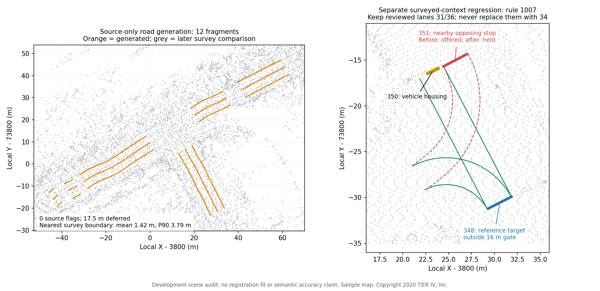

# Audit a second intersection without hiding failures

The cached Autoware planning sample exposed a vehicle-target bug: connected
topology reached a different approach, and a proposal replaced the signal's
reviewed movement with that stop marking's lanes. Four such candidate pairs are
now held. Stop proposals retain all current controlled lanes and require the
marking's reviewed context to cover every one; they cannot replace or drop lanes.
The manual relationship editor remains available for deliberate lane changes.



The left panel is source-only road generation with three previously reviewed
operator traces. Grey surveyed boundaries are added **after** generation for
comparison. The right panel is a separate component regression using surveyed
geometry: signal 350 / rule 1007 controls lanes 31 and 36. The formerly suggested
nearby stop 351 belongs to a different movement; its adoption is blocked. The
reference stop 348 lies outside the unchanged 16 m gate, so this signal remains
unresolved by suggestions instead of choosing another movement.

## Fixed before/after association audit

Ten original signal rules contain six vehicle-only groups and four mixed
vehicle/pedestrian groups. No group splitting or legal targets are invented.

| Existing surveyed context | Before | After |
|---|---:|---:|
| Candidate pairs matching reference stop **and** complete movement | 3 | 3 |
| Candidate pairs targeting a different reference stop | 4 | 0 |
| Candidate pairs replacing/dropping reviewed lanes | 4 | 0 |
| Rules without an eligible candidate | 4 / 10 | 7 / 10 |
| Mixed-kind groups held | 4 | 4 |

The changed candidates are rule/stop pairs `1007/351`, `1008/348`, `1024/414`
and `1025/411`. This measures a **surveyed-context component**, not signal
detection from the cloud. Existing physical geometry and reviewed lanes are
inputs; reference stop IDs are compared only after each read-only preview.

A second mode masks only each query rule's stop/crosswalk target. Other surveyed
marking contexts remain; it is not a globally blinded end-to-end map test. Masking
also removes that rule's sole reviewed stop-marking association. No answer-derived
marking rule is injected to replace it. Before the fix there were four proposals
for other movements; after it all ten rules are held. **Zero expected candidates
are recovered in this masked mode.** Missing marking context, mixed groups and
distant targets remain limitations, not successful target inference.

The actual production browser loads all 1,757,841 original source points and the
surveyed map, inspects these four rejected alternatives, retains the legitimate
351 candidate for rule 1008 and requires explicit selection. Export is unchanged,
Undo stays empty and there are no page errors. This browser proof demonstrates
component review, not source-only generation.

## Source-only generation, frozen before reference reads

The evaluator separately generates roads from original XYZRGB points and three
explicit two-point traces. Lane counts, directions and 3.5 m width priors are
operator inputs. There is no surveyed map, feature location or target relationship
in these generation calls. Road maps, full-source coverage audits, whole-ground
equipment discovery and strict junction previews are saved and hashed before the
reference map is opened. The query previews do not modify either input map.

Default roads cover 128.51 m in six lanes; source-footprint fitting retains
111.01 m in twelve fragments and **defers 17.50 m (13.6%)**. Both have zero
source-review lanes; the fitted draft checks 1,398 samples, without omitted or
malformed lanes. Twelve fragments are not twelve inferred traffic lanes. Ten
strict junction candidates have complete centre/boundary support, but remain
ambiguous geometric previews: no legal connections or gap repairs are adopted.

Zero source flags do not establish accurate boundaries. For 837 evenly sampled
generated-boundary points, the nearest sampled surveyed driving boundary has
**mean XY distance 1.42 m, P90 3.79 m, maximum 5.80 m**; only 35.6% fall within
0.5 m. This is an unpaired, one-way proximity measure in the original metre frame,
without fitted registration. It does not establish lane identity, survey accuracy
or whole-scene completeness. Ground-like returns can support a width assumption
that is far from a surveyed boundary.

Whole-ground discovery finds 798 geometric proposals, retaining 130 under the
per-family cap. It has 71 unsupported windows and remains limited.

| Evidence family | Retained | Reference objects | One-to-one nearby pairs |
|---|---:|---:|---:|
| Repeated paint | 2 | 4 crossing footprints | 2 |
| Bright bar | 64 | 95 stop markings | 19 |
| Elevated panel | 64 | 34 housings | 2 |

The fixed gate is 2 m XY plus 0.75 m Z for surface objects, or 2 m 3D for panels.
These are geometric correspondences, not automatic semantic labels. Paint extent
and mapped pedestrian footprints differ; signs can resemble housings. Unmatched
proposals are not proven negatives and capped/incomplete annotations prevent a
semantic precision/recall claim. This scene also informed earlier development;
it is a second-scene audit, **not held-out generalization evidence**.

Generation geometry, source coverage, junction previews and detector proposals
are byte-identical before/after the movement fix. Only runtime provenance and
association proposals change. The original Tokyo generated scene still adopts
169→stop 164 and 173→crosswalk 156, holds the closer wrong-axis crossing 152 and
leaves rules 167/171 unresolved. Its physical map and full-source coverage stay
unchanged; existing GIFs and historical evaluations are preserved.

## Reproduce from cached inputs

Build/install the native core from the checkout being tested, then use a new
proof directory. The captured fix runtime is
`9e4f615` (the complete hash and installed native/WASM hashes are recorded in
[verification.json](../benchmarks/vector-map/cross-scene/verification.json)).
The source commit is declared provenance, not embedded binary attestation.

```powershell
python scripts/vector_map_cross_scene_evaluate.py demo_data/autoware/sample-map-planning/pointcloud_map.pcd benchmarks/vector-map/cross-scene/planning-inputs.json demo_data/autoware/sample-map-planning/lanelet2_map.osm notes/new-cross-scene --source-commit (git rev-parse HEAD)
python scripts/plot_vector_map_cross_scene.py demo_data/autoware/sample-map-planning/pointcloud_map.pcd demo_data/autoware/sample-map-planning/lanelet2_map.osm notes/new-cross-scene notes/new-cross-scene.png
python scripts/preview_vector_map_relations.py --out notes/new-original-scene-regression
```

Production-browser proof (after building WASM and the Web app):

```powershell
cd web
$env:PW_PORT='4174'
$env:VECTOR_MAP_CROSS_SCENE_SOURCE='../demo_data/autoware/sample-map-planning/pointcloud_map.pcd'
$env:VECTOR_MAP_CROSS_SCENE_REFERENCE='../demo_data/autoware/sample-map-planning/lanelet2_map.osm'
npx playwright test --config playwright.media.config.ts vector-map-cross-scene.spec.ts
```

[Editable generated roads, frozen reports and before/after proposals](../benchmarks/vector-map/cross-scene/)
exclude the raw cloud and copied surveyed map. Cached files are read in place;
no new source download or cloud copy was required.

Sample map: Copyright 2020 TIER IV, Inc., as documented by the
[official planning simulation guide](https://docs.autoware.org/main/demos/planning-sim/).
The [official artifact configuration](https://github.com/autowarefoundation/autoware/blob/main/ansible/roles/demo_artifacts/tasks/main.yaml)
provides the archive URL/hash; the report also hashes the actual cached source
and reference files. The data license is not inferred from the software license.
CloudAnalyzer supplies the derived drafts, measurements and plot annotations.
