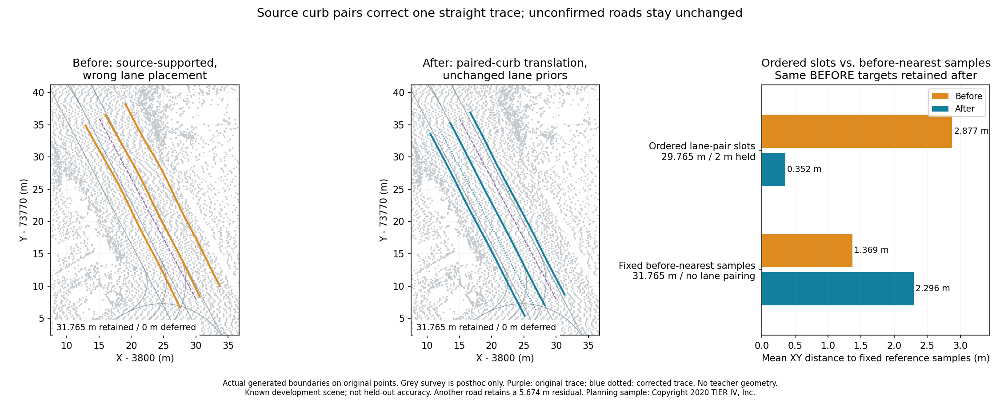

# Correct a straight trace using paired source curbs

A draft can have nearby ground under every boundary while occupying the wrong
part of the road. On planning path 2, the reviewed trace and outside-forward-lane
assumption placed inferred lane lines beside, rather than inside, the curb pair.
The optional `align_trace_to_curbs` stage uses the **original point cloud** to
translate a straight trace before boundary extraction. It does not read a map,
change lane counts or infer legal travel direction. It is **off by default**.



The figure overlays actual generated boundaries on original planning points.
Surveyed boundaries in grey are added after generation. This is a measured fix
on a known development road, not held-out accuracy or a complete intersection.
The earlier [width-anchor comparison](vector-map-physical-anchors.md), its frozen
artifacts and existing GIFs retain their original runtimes and measurements.

## Source gates and explicit assumptions

The stage checks the unsmoothed resampled trace against its end-to-end heading.
Any section deviating by more than five degrees holds the trace unchanged.
Wide cross-sections extend twice the configured total lane width to either side;
they use the existing slice length, bin spacing, minimum returns and P20 height
quantile. No intensity, RGB labels, reference geometry or sensor pose Z enters
the translation estimate.

A contiguous low band must have confirmed curbs on **both** physical sides,
independent of which side of the trace contains an edge. Each edge needs two
raised outside bins between `curb_height` and `curb_height + 0.3 m`, plus flat
inside support. Missing outside returns and tall walls cannot close a band.
Adjacent low bins differ by at most `min(curb_height, 0.08 m)`; the band's height
must be within 0.3 m of the source surface under the trace. Its width must contain
the entire configured lane width and be no wider than that width plus twice
`search_margin`. It must touch the trace's half-lane neighbourhood.

Each confirmed section proposes the **minimum translation** that fits the
unchanged nominal lane layout inside the pair. More than half of all sections,
at least three consecutive observations and no ambiguous sections are required.
The median shift must have an interquartile range of at most two bin widths and
be no larger than the configured road width. Shifts smaller than one bin hold
the trace as already fitting. Otherwise one constant XY translation is applied;
the original trajectory file and sensor heights remain unchanged. Subsequent
road elevations come from source points at the corrected location.

`trace_alignment` reports applied/held, reason, observed/ambiguous section counts,
longest run, median, interquartile range and actual `shift_xy`. The boundary-fit
report's 0.5 m cap applies to the later local curve fit; this separate, reported
trace translation can be larger. Source-footprint trimming still checks the
result and reports missing extent. This does not establish lane identity or
make interior inferred lines into observed markings.

## Compare boundaries with their roles retained

Both modes enable physical width anchors and source-footprint fitting. They use
the same original clouds, unmodified traces, lane counts, traffic side and 3.5 m
width prior. Before has trace alignment off; after has it on. The source-only
Rust diagnostic writes every actual cumulative map, Lanelet2 export, profile,
audit and trajectory, then hashes **all generation outputs before any surveyed
map is opened**. Profile polylines must exist in the actual editable map.

Common source intervals use original operator coordinates: corrected profiles
are translated back by the reported shift solely for interval matching. The
evaluator verifies this inverse; it measures the actual corrected boundaries.
The earlier fixed-before-nearest-target diagnostic is retained unchanged in
meaning. A second diagnostic jointly selects adjacent opposite-direction
surveyed lane pairs **using before geometry only**, ordered physically left to
right, with a shared middle boundary and the configured traffic side. All three
slots keep those same curves and interpolated longitudinal samples after.
Targets are never selected again using after geometry.

Reference curves must be monotone and within 15 degrees of the source axis,
cover the whole interval, and keep their boundary order. A candidate more than
one configured road width from any before slot is rejected. Nearly tied pairs
within 0.05 m joint mean distance are held. Reference junction gaps and
unsupported lane-count configurations are also held, with their extent reported.
This correspondence is a development diagnostic, not certified lane identity.

| Planning path | Source translation | Fixed lane-pair cohort | Mean XY before → after | Maximum before → after |
|---|---:|---:|---:|---:|
| 0 | Held: no pair, 0/27 sections | 36.606 m | 3.357 → 3.357 m | 5.674 → 5.674 m |
| 1 | Held: layout already fits, 13/25 | 38.141 m | 0.695 → 0.695 m | 1.531 → 1.531 m |
| 2 | +3.550 m laterally, 9/17 | 29.765 m; **2.000 m reference gap held** | **2.877 → 0.352 m** | **3.569 → 0.581 m** |

Path 2 keeps all **31.765 m** of generated road, defers zero and preserves its
two explicit lanes. On the fixed lane-pair cohort, P90 changes 3.411 → 0.566 m
and the fraction within 0.5 m changes 0 → 59.5%. Source-derived elevations change
by up to 0.428 m; the corrected draft samples different source positions.

The old before-nearest targets tell a different story on the full common path:
mean **1.369 → 2.296 m**, a regression. Before's displaced interior line was close
to another boundary role; moving into the correct ordered lane pair moves away
from that frozen wrong-role target. Independently choosing nearest boundaries
after gives a much smaller distance, but cannot prove correspondence. Both
diagnostics are published; do not substitute one for the other silently.

The whole planning draft retains 106.512 m, defers 22.000 m and has ten lane
fragments in either mode. Unpaired nearest-boundary mean changes 1.238 → 0.951 m;
the maximum remains **5.674 m**. Zero source-review flags mean nearby low ground
exists, not accurate lane geometry. All six Tokyo traces are held and their maps
remain byte-identical with this new stage; the earlier width-anchor regression
there remains. The ordered-lane evaluator holds all 88.078 m of Tokyo
reference correspondence (unsupported counts or missing suitable covered pairs);
it does not report zero error for those held intervals. Curved traces, median-separated carriageways and unconfirmed
curbs need other evidence. Counts, directions, controls and equipment remain
review inputs. There is no reference parameter tuning or fitted registration.

## Use and reproduce

```sh
ca vectormap-build map.pcd drive.csv --out new-curb-draft --physical-anchors-only --align-trace-to-curbs --fit-source-surface
```

Python/MCP use `align_trace_to_curbs=True`; Web's **Build from a trajectory** has
**Align straight traces using paired curbs**, initially unchecked. Review the
reported shift and the generated lane layout before export.

Generation runtime: `4cac998b54eec995c18b0ab5b2c1e7072c192d1c`. Build and install
the matching native core for coordinate import and build WASM for the browser.
Source commits are declared provenance, not embedded binary attestation. Exact
hashes, native reproduction and browser results are in
[verification.json](../benchmarks/vector-map/curb-trace-alignment/verification.json).

```powershell
cargo build --manifest-path rust/Cargo.toml -p ca-wasm --example vector_map_anchor_compare
python scripts/vector_map_anchor_evaluate.py demo_data/autoware/sample-map-planning/pointcloud_map.pcd benchmarks/vector-map/curb-trace-alignment/planning/inputs.json demo_data/autoware/sample-map-planning/lanelet2_map.osm notes/new-curb-planning rust/target/debug/examples/vector_map_anchor_compare.exe --source-commit (git rev-parse HEAD)
python scripts/vector_map_anchor_evaluate.py notes/hard-intersection-prepared-v2/geometry.las benchmarks/vector-map/curb-trace-alignment/tokyo/inputs.json demo_data/hard-intersection/maps/lanelet2/jp_tokyo_takanawadai.osm notes/new-curb-tokyo rust/target/debug/examples/vector_map_anchor_compare.exe --source-commit (git rev-parse HEAD) --reference-epsg EPSG:6677
python scripts/plot_vector_map_curb_alignment.py demo_data/autoware/sample-map-planning/pointcloud_map.pcd demo_data/autoware/sample-map-planning/lanelet2_map.osm notes/new-curb-planning notes/new-curb-comparison.png
```

Tokyo survey lon/lat is projected to EPSG:6677; planning uses native MGRS metres.
The [small frozen artifacts](../benchmarks/vector-map/curb-trace-alignment/README.md)
include every case and negative result, with inline trajectory CSVs. They contain
neither raw source clouds nor surveyed maps. The original planning source has
1,757,841 points; the production browser uses this source without an input map,
checks the applied shift, compares exported boundary vertices to the independent
native draft, runs a full-source audit and removes the build with one Undo.
That check does not claim complete topology or OSM byte equality.

Planning sample: Copyright 2020 TIER IV, Inc.; [official instructions](https://docs.autoware.org/main/demos/planning-sim/).
Tokyo source: Dynamic Map Platform Co., Ltd. (2026), [pinned Hard Intersection sample](https://huggingface.co/datasets/dynamic-maps/hard-intersection-multimodal-sample/tree/e8e8d2a5d49a8b9cb63b5b5ecef9b260ff48f39c),
[CC BY 4.0](https://creativecommons.org/licenses/by/4.0/). Derived drafts and
measurements were added by CloudAnalyzer. The code's MIT license does not change
the data licenses.
