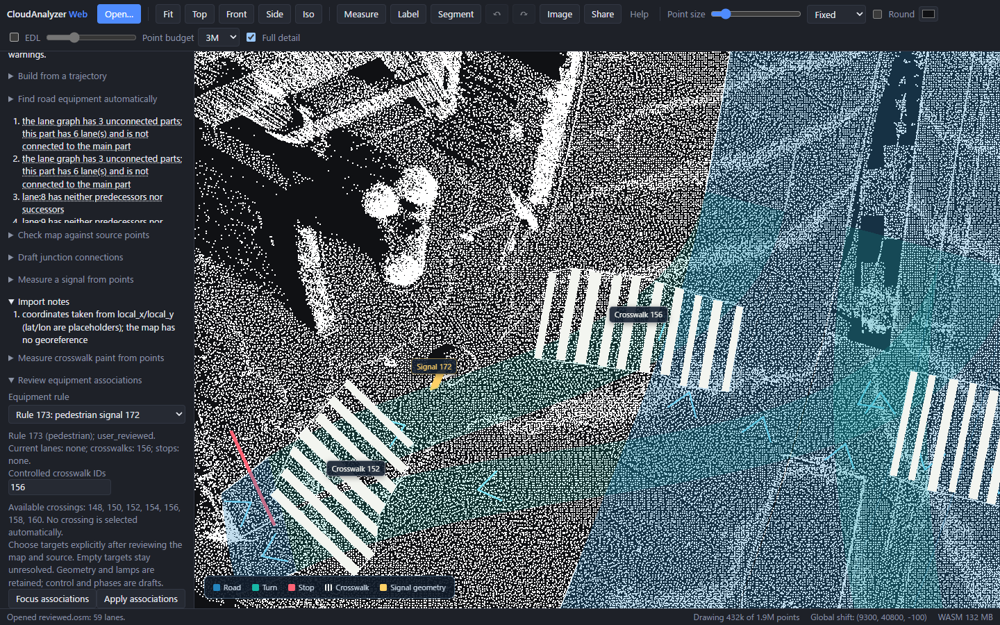
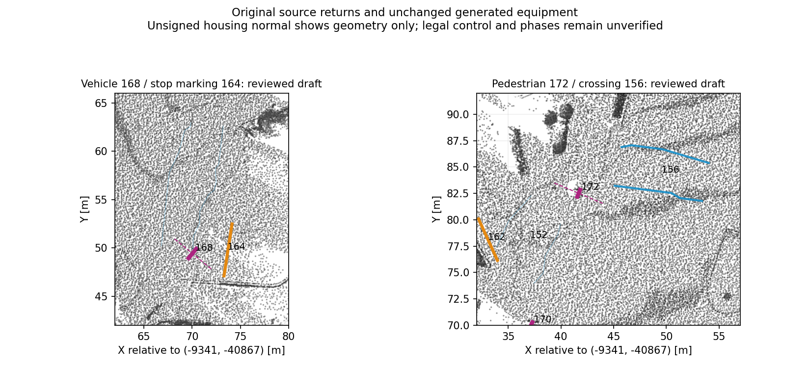

# Review signal, stop-line and crosswalk associations

In the Web Lanelet2 panel, open **Review equipment associations**, select an
existing rule and choose target IDs explicitly. **Focus associations** frames the
signal and its current targets. Vehicle signals accept vehicle lane IDs and at
most one existing stop line. Pedestrian signals accept controlled crosswalk IDs,
separately from the vehicle lanes crossed by a crosswalk. No target is selected
from proximity automatically. Existing crossings and stop markings also expose
their crossing/controlled lane assignments.

[Suggest targets](vector-map-relation-proposals.md) previews geometric candidates
and held alternatives with map highlights, then requires explicit reviewed adoption.

Applying changed targets adds one Undo step. Repeating identical targets adds
none. Missing IDs, duplicate IDs, mixed participants and inappropriate target
kinds reject the whole edit. A vehicle stop must already have a marking/rule
association with every selected lane and be transverse to every lane. Review
that marking first when changing its road context. The checks are consistency
guards; they do not establish legal control.

The edit preserves IDs, physical road/equipment geometry, source attributes,
lamps and topology. Modified rules gain `cloudanalyzer_relationships_source=user_reviewed`
and `cloudanalyzer_review_required=yes`. Geometry changes keep the target IDs but
mark related controls `needs_rereview_after_geometry_edit`, including pedestrian
rules on edited crossings. Empty targets keep the observed object and an
unresolved rule. Legacy pedestrian rules with vehicle-lane references show those
references explicitly; Apply replaces them with the selected crosswalk targets
or clears them to an unresolved state.

JSON stores `controlled_crosswalks` separately from vehicle `lanes`. Lanelet2
stores membership of the traffic-light regulatory element on each controlled
crosswalk lanelet, as in the [official Autoware format](https://github.com/autowarefoundation/autoware_lanelet2_extension/blob/main/autoware_lanelet2_extension/docs/lanelet2_format_extension.md).
JSON and Lanelet2 reload retain those targets and their review provenance. A
correctly associated pedestrian signal requires no vehicle stop line; unresolved
and malformed control stays reported. No lamp states or opposite signal phases
are inferred.



## Native, CLI and MCP

```powershell
# Read-only inspection: no point cloud or output directory required.
ca vectormap-relate existing.json
# Explicit vehicle control into a new directory.
ca vectormap-relate existing.json --rule 169 --lane 76 --lane 77 --stop 164 --out reviewed-vehicle
# Explicit pedestrian control.
ca vectormap-relate reviewed-vehicle/vector_map.json --rule 173 --crosswalk 156 --out reviewed-pedestrian
```

Python and MCP expose `edit_vector_map_relations`. Omit `rule_id` and `out_dir`
for inspection; editing requires both and accepts `lanes`,
`controlled_crosswalks`, and `stop_lines` lists. Targets replace the complete
existing association, including empty lists. Files are published together in a
new directory; failed edits leave the input and output paths untouched.

## Actual generated intersection

The reviewed input is the 59-road draft generated from original Tokyo point-cloud
returns and explicit operator paths/connections, documented in the
[draft source-supported intersection workflow](https://github.com/rsasaki0109/CloudAnalyzer/pull/198).
This stage edits that generated map; it is not another automatic-generation demo.
It uses no reference/teacher geometry or control relations.

Two geometric draft associations are reviewed: vehicle head 168 to stop marking
164 on lanes 76/77, and pedestrian head 172 to crossing 156. For the latter, the
nearest crossing alone is misleading: crossing 152 is close but has a very
different walking axis from the housing's unsigned normal. Crossing 156 is also
near and more aligned. This is a geometric rationale for an operator draft,
not independent evidence of the signal's legal target or its front face.

Vehicle head 166 lacks a compatible observed stop. Pedestrian head 170 has
competing nearby crossings and ambiguous orientation. Both remain unresolved;
the latter's old vehicle-lane assignment is explicitly cleared rather than
retained as pedestrian control. That produces an orphan-rule warning. The UI
validation warnings change from 19 to 18: 15 existing connectivity warnings,
one unresolved pedestrian rule and two missing-control/stop warnings remain.
The Local-coordinate export also reports missing geographic reference metadata;
no geographic origin is invented. All 59 roads, seven crossings, two stops and
four housings retain their exact physical geometry. Full-source coverage still
checks 6,752 samples with no source-review lanes, as before; this shared source
gate is not semantic or survey accuracy and the 34.3 m deferred road extent
remains deferred.



The [operator inputs and verified artifacts](../benchmarks/vector-map/hard-intersection/equipment-relations/)
include exact relationship choices, native/Web checks, retained warnings and source
hashes. The actual production browser exports the same Lanelet2 bytes as native,
undoes all three association edits exactly, and reloads the same target IDs and
18 warning messages. The source-only audit leaves exports and Undo unchanged.
The optional Web proof is `web/media/vector-map-relations.spec.ts`; it uses
`VECTOR_MAP_RELATIONS_SOURCE`, `VECTOR_MAP_RELATIONS_INPUT` and
`VECTOR_MAP_RELATIONS_PROOF` (the native helper output), with `PW_PORT=4174`.
With the cached original prepared source and frozen generated input:

```powershell
python scripts/review_vector_map_relations.py --map notes/supported-intersection-proof/reviewed.json --cloud notes/hard-intersection-prepared-v2/geometry.las --out notes/new-equipment-review --plot notes/new-equipment-review/source-review.png
```

Original source: DynamicMapPlatform Co., Ltd. (2026),
[hard-intersection multimodal sample](https://huggingface.co/datasets/dynamic-maps/hard-intersection-multimodal-sample/tree/e8e8d2a5d49a8b9cb63b5b5ecef9b260ff48f39c),
CC BY 4.0. The source returns were subsampled/attributes cleared during the earlier
preparation; this review changes only regulatory targets. Signal types and
control choices are manual. This development scene provides no held-out accuracy
result. The README GIF PR198 remains draft and its historical capture is unchanged.
