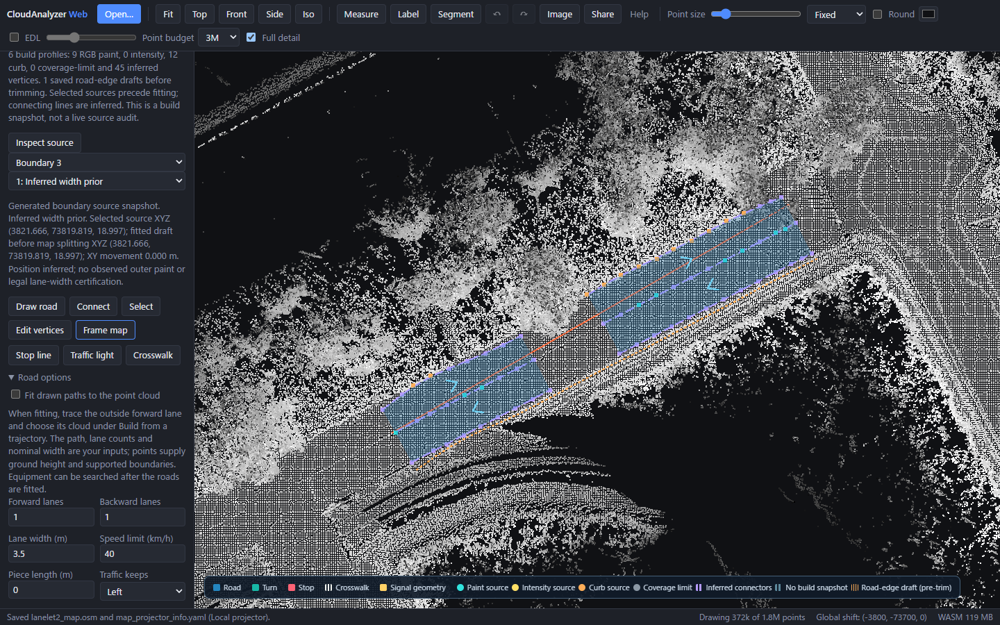

# Inspect the evidence behind generated boundaries

After **Build from a trajectory**, open **Vector map → Map display** and enable
**Build evidence: source dots & inferred connectors**. It is off by default.



The screenshot uses the cached official Autoware planning cloud, an operator trace
and configured 3.5 m lanes. No input map was loaded. It shows four generated lane
fragments: 9 selected RGB-paint vertices, 12 curb-source vertices and 45 inferred
vertices. These are labels from construction, not new semantic detections.

| Display | Meaning |
| --- | --- |
| Cyan dots | Selected RGB paint source positions before fitting |
| Yellow dots | Selected intensity source positions before fitting |
| Orange dots | Selected curb candidates before fitting, possibly aggregated |
| Grey dots | Source coverage-limit candidates; not observed road edges |
| Purple dots and short dashed lines | Width-prior vertices and inferred connectors |
| Muted dashed lines | Geometry without a current build snapshot |
| Orange stippled curves | Saved road-edge drafts before footprint trimming |

Every connector is inferred, even between two paint-source points. A paint dot
does not establish continuously observed paint along the connecting segment.
Width-prior dots use fitted draft positions; other dots show the selected sources.
The connectors follow actual current map geometry without visual smoothing.

Enable **Saved road-edge drafts (before trimming)** separately to compare a retained
outer road-edge candidate with an inferred lane edge. These curves are not exported
lane boundaries or certified curbs/shoulders and can extend through deferred areas.

Choose **Inspect source** and click a visible dot or connector, or choose a boundary
and source vertex from the lists. The inspector gives source XYZ, fitted draft XYZ
before map splitting, displacement in metres and the evidence category. Clicking a
connector reports its nearest profile endpoint; it does not invent a new observation.

Display switches and inspection do not change geometry, exports or Undo. Editing
boundary geometry hides its old source profile; Undo restores it. Saved road-edge
curves are hidden when any associated boundary profile changes. Imported and manual
maps have no invented observations. This history belongs to the current session:
IR/Lanelet2 exports do not contain it, and reopening a map clears it. Changing the
source cloud does not recompute or certify this build snapshot.

Capture is bounded: 100,000 profile vertices and 10,000 profiles per build; the
session allows 100,000 vertex records including retained edges and actual boundary
geometry. Dashes allow 20,000 visible segments per material. A limit shows a partial
snapshot/display warning and leaves map geometry unchanged.

[Verification record](../benchmarks/vector-map/evidence-overlay/verification.json)
contains source/build hashes, the independent native vertex comparison, unchanged
OSM exports and exact regression of all 18 existing source-only generation runs.
It does not establish improved accuracy or a held-out result. The inferred outside
edge still depends on configured width; see [the measured lane-edge limitations](vector-map-lane-edges.md).

To reproduce the screenshot, use the original cached planning source. Create an
isolated case-1 native proof from the published operator input (no surveyed map):

```sh
python - <<'PY'
import json
from pathlib import Path
path = Path("benchmarks/vector-map/lane-edge-inference/planning/inputs.json")
config = json.loads(path.read_text(encoding="utf-8"))
config["cases"] = [config["cases"][1]]
Path("notes").mkdir(exist_ok=True)
Path("notes/evidence-ui-inputs.json").write_text(json.dumps(config), encoding="utf-8")
PY
cargo run --manifest-path rust/Cargo.toml -p ca-wasm --example vector_map_anchor_compare -- demo_data/autoware/sample-map-planning/pointcloud_map.pcd notes/evidence-ui-inputs.json notes/evidence-ui-proof
```

The Python block is shown for a POSIX shell; run its contents as Python on Windows.
Choose a fresh output directory; the example refuses to overwrite existing proofs.
In `web`, set `VECTOR_MAP_ANCHOR_SOURCE` to the original
PCD and `VECTOR_MAP_ANCHOR_PROOF` to that proof directory (containing `after-0.json`,
`after-0-audit.json` and `trajectory-0.csv`). Set `VECTOR_MAP_CURB_ALIGNMENT`,
`VECTOR_MAP_PAINT_CORRIDOR`, `VECTOR_MAP_PAINT_DIVIDER`, `VECTOR_MAP_LANE_EDGES` and
`VECTOR_MAP_EVIDENCE_OVERLAY` to `1`. Build WASM and the Web app, then run:

```sh
npx playwright test --config playwright.media.config.ts vector-map-physical-anchors.spec.ts
```

The output is `web/media-frames/vector-map-evidence/`. The harness checks source
counts, source inspection, export equality, native vertices, source support and Undo.

Planning source: Copyright 2020 TIER IV, Inc.; the cached official Autoware
`sample-map-planning` point cloud. Original source instructions and prior accuracy
evaluation are in the [lane-edge study](vector-map-lane-edges.md).
The screenshot is adapted from this source; no additional survey download was made.
