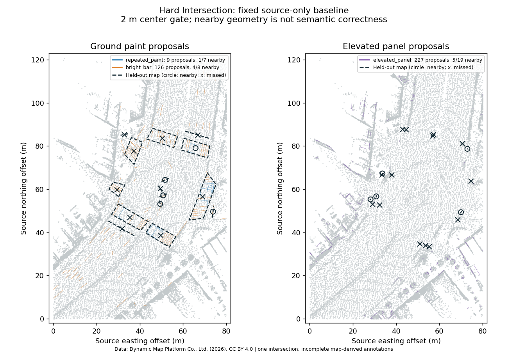
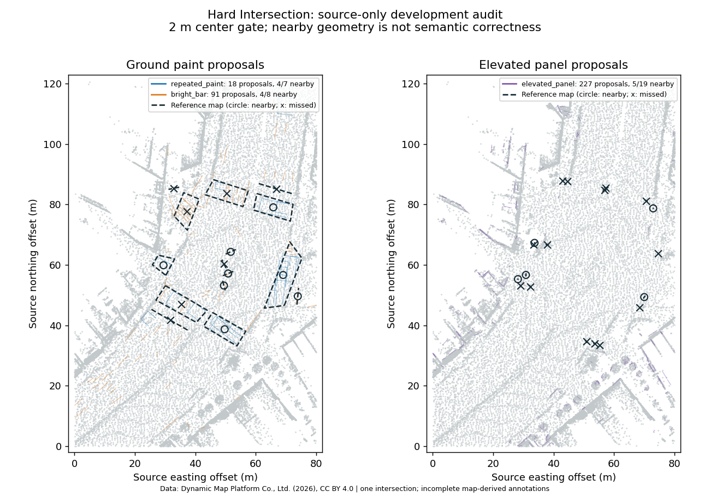

# Hard Intersection: source-only baseline

The fixed baseline generates road drafts and equipment proposals from the source
point cloud and four recorded drives. It then opens the annotated LAS and Lanelet2
map in a separate evaluation command. This establishes a repeatable failure audit;
it does not train a model or establish automatic semantic mapping accuracy.

The original baseline below is preserved. See the
[local paint development comparison](#local-paint-development-comparison)
for the subsequent detector change and its remaining failures.



Solid colored outlines are generated proposals. Dark dashed outlines are held-out
mapped objects. Circles indicate a nearby proposal under the fixed center gate;
crosses indicate no nearby proposal. A nearby outline can still have the wrong shape
or object type. This is an audit figure, not an application screenshot.

## Data, licensing and coordinates

Source: [Hard Intersection Multimodal Samples](https://huggingface.co/datasets/dynamic-maps/hard-intersection-multimodal-sample),
Dynamic Map Platform Co., Ltd. (2026), [CC BY 4.0](https://creativecommons.org/licenses/by/4.0/).
Revision: `e8e8d2a5d49a8b9cb63b5b5ecef9b260ff48f39c`.
The provider describes annotations as derived from its HDMap; objects absent from
that map may be unannotated. UserData zero is not a reliable negative class.
The plotted figure and metrics are derived evaluations, not original survey products.

The fetcher retrieves 2,427,866,302 bytes: the raw and separately annotated LAS,
map, trajectories, calibration and annotation metadata. It excludes image pixels,
3DGS, reconstruction and simulator assets. The small semantic-image metadata is
reserved for future inspection and is not read by generation or this evaluation.
Requests are bounded to 16 MiB, resumable and hash checked. Existing files are
rechecked; a wrong hash fails without overwriting the file. A 6 GiB free-space
reserve is enforced before each download and before preparation.

| LAS input | Points | SHA256 |
|---|---:|---|
| Raw | 35,668,990 | `6be552eb9a6fa147be70680de18dca0075cd479084a3b416c5ef0cb22545040a` |
| Annotated | 35,598,100 | `7d4e3dce5c3558b0ccb9859b55c4699b4d465492b6b7cb9113b626f154c3a1fc` |

The LAS files differ by 70,890 points. Labels are sampled spatially from LAS
**UserData**, not the standard Classification field, and never joined by point
number. Source LAS and recorded trajectories use **EPSG:6677**, with orthometric
heights. Generation retains these original coordinates and uses a Local map frame;
the exported Local OSM is a draft, not a geographic datum conversion.

The supplied OSM `local_x/local_y` instead match UTM54 coordinates modulo 100 km.
This inference was checked for all 5,396 tagged nodes: maximum discrepancy
0.000063 m. Evaluation projects OSM longitude/latitude to EPSG:6677 with explicit
longitude-first axis order. It preserves supplied heights and performs no fitted
registration or reference-guided alignment. For example, node 46 becomes
(-9315.562347, -40821.714275, 28.5), inside the raw cloud; its local XY is
(85048.9657, 43876.1014), which must not be fed directly to the raw-cloud generator.

## Fixed processing and results

The intended native source baseline is `3c93d90996b071c78518d54ec21cb6d570484778`.
The checked-in [machine-readable audit](../benchmarks/vector-map/hard-intersection/baseline.json)
records the actual native binary SHA256, environment, source-file hashes, failed
tiles, proposal limits, every reference miss and every match. A binary version
alone does not prove it was built from that commit; reproduce with that source.

Preparation streams 300,000-point chunks and keeps the **first original point**
per 10 cm voxel, retaining XYZ/RGB/intensity without averaging. It clears
Classification and UserData before writing generation inputs. It retains 1,883,866
points. The occupancy bitset uses 82,208,433 bytes; this is not a measured total
process-memory peak. Twenty-metre ownership tiles have 12 m halos; 28 tiles and
the compact cloud occupy 324,264,606 bytes including trajectory CSVs. No raw-cloud
copies or per-image downloads are needed. Original files are unchanged.

Ground-surface discovery uses the existing defaults: 12 m corridor radius,
0.65 brightness fraction, no input map, no confirmations. Proposal centers belong
to exactly one half-open tile core, removing halo copies; shape variations can
still yield multiple proposals around one object. One sparse tile is unsupported,
four tiles reach preview limits, and individual unsupported windows are reported.
No threshold, tile size, lane count or geometry was tuned against the annotations.

Matching maximizes gated one-to-one correspondence before minimizing center
distance. The gate is 2 m in XY plus 0.75 m in Z for ground features, and 2 m in
3D for panel centers. These thresholds were fixed before opening the labels.
All 7 crossing footprints, 8 stop lines and 19 signal housings have centers inside
source XY coverage. Signal evaluation includes vehicle and pedestrian housings,
not light bulbs or inferred traffic rules.

| Proposal family / reference | Owned proposals | Nearby mapped objects | Mapped objects missed | Unmatched proposals |
|---|---:|---:|---:|---:|
| Repeated paint / crossing footprint | 9 | 1 / 7 | 6 | 8 |
| Bright bar / stop line | 126 | 4 / 8 | 4 | 122 |
| Elevated panel / signal housing | 227 | 5 / 19 | 14 | 222 |

These are **proposal coverage counts**, not semantic precision/recall. Unmatched
proposals include other paint, building surfaces, duplicate shapes and possibly
unannotated objects. They cannot all be called false positives. A center match
alone is also not proof of correct detection: the matched crossing has 2.106 m
symmetric mean outline error and 6.254 m Hausdorff error, comparing observed paint
extent with a mapped crossing footprint. Matched stop-line symmetric mean errors
range from 0.182 to 0.593 m; panel bottom-edge errors range from 0.042 to 0.331 m.
The JSON additionally records signal height error and proximity to class-labelled
points. Outline/bottom-edge proximity is not a footprint-area IoU score.

Each recorded drive separately produces six lane sections, using default one
forward/one backward lane, left-hand traffic, 3.5 m widths and 50 m segmentation.
The four trajectories are not merged. Travel direction, lane counts and widths
remain priors; inferred inner boundaries are not measured white lines. Scoring
uses 17 explicitly white tagged reference ways, sampled every 0.1 m and clipped
to the source XY extent (2,677 of 7,150 samples). Other thin lines are not assigned
a white color by inference. Distances use XYZ with unchanged source heights.

| Recorded drive | Boundary distance median / P90 | White reference sample coverage within 0.35 m |
|---|---:|---:|
| 26047 Record004 | 3.260 / 21.114 m | 45.65% |
| 26047 Record050 | 7.107 / 21.052 m | 5.16% |
| 26047a Record004 | 3.264 / 20.356 m | 17.03% |
| 26047a Record084 | 3.735 / 20.300 m | 30.15% |

These whole-draft geometry scores include outer boundaries and width priors, as
well as reference branches not visited by an individual drive. They are not
white-line classification accuracy or comparable to a route-specific lane metric.

## Reproduction

Install the Python development dependencies (including pyproj) and a native core
built from the baseline commit. Run from the repository root; use NEW output
directories. The first command resumes existing downloads and verifies their hashes.
Large inputs and intermediate outputs remain in ignored `demo_data` and `notes`.

```powershell
python -m pip install -e ./cloudanalyzer[dev]
python scripts/hard_intersection_fetch.py demo_data/hard-intersection --clouds
python scripts/hard_intersection_prepare.py demo_data/hard-intersection/pointcloud/jp_tokyo_takanawadai.las demo_data/hard-intersection/trajectory notes/hard-intersection-prepared
python scripts/hard_intersection_generate.py notes/hard-intersection-prepared notes/hard-intersection-generated
python scripts/hard_intersection_evaluate.py demo_data/hard-intersection notes/hard-intersection-generated notes/hard-intersection-evaluation
python scripts/hard_intersection_plot.py demo_data/hard-intersection notes/hard-intersection-prepared notes/hard-intersection-generated notes/hard-intersection-evaluation notes/hard-intersection-audit.png
```

Generation writes road-map hashes and a JSON SHA256 before evaluation opens the
held-out references; evaluation refuses modified road maps or generation JSON.
This freezes the proposals and road drafts but does not attest arbitrary runtime
binaries or original source files; the fetch manifest verifies the latter separately.
Regression tests cover chunk-independent original-point selection, semantic-field
removal, preserving input files and attributes, trajectory splitting, tile-edge
ownership, gated one-to-one matching, CRS axis order, spatial UserData sampling,
resumed-download integrity and disk/range failures. No network or real dataset is
required for those tests.

The next detector work should address repeated-paint footprint failures, excessive
bright-bar and panel proposals, preview truncation and width-prior boundaries,
then rerun the same baseline protocol. This one intersection is useful for
development; adjacent patches or frames are not independent held-out scenes.
Learning or generalization claims require additional independently annotated scenes.

## Local paint development comparison

Source commit `81a4353cfa4dff9d707328de95464d0e56ed6f56` adds connected bright-ground
components as orientation and transverse-profile seeds. It preserves full-window
angle hypotheses and the requirements for continuous bright bands and observed
contrasting dark gaps. A source-only seed does not assign a semantic object type.
Local profiles prevent distant road paint and background from diluting a smaller
pattern. The brightness upper-tail reference changes from P95 to P99.5 so sparse
paint is not discarded simply because it occupies less than 5% of a window.

The measured crossing span can reach 35 m rather than the previous 8 m limit.
Near-exact 10 cm profile bin boundaries are stabilized for floating-point origin
subtraction; this does not interpolate or bridge unobserved bins. Ranking includes
measured stripe length to favor full supported stripes over clipped local slices.
Localized profiles are capped at 64 source-supported seeds per window; manual
measurement and scene discovery both report omitted seeds when the cap is reached.
Neither generation options nor the fixed evaluation gates were changed.



The new [machine-readable development audit](../benchmarks/vector-map/hard-intersection/local-paint-development.json)
contains the rebuilt native binary hash, frozen generation hash and all misses and
shape/proximity errors. The same prepared geometry, ownership tiles and four
recorded drives were reused. All four generated road JSONs are unchanged compared
with the original baseline. No raw-cloud copies or additional downloads were made.

| Proposal family | Original nearby / total | Updated nearby / total | Original / updated owned proposals | Original / updated unmatched |
|---|---:|---:|---:|---:|
| Repeated paint / crossing footprint | 1 / 7 | 4 / 7 | 9 / 18 | 8 / 14 |
| Bright bar / stop line | 4 / 8 | 4 / 8 | 126 / 91 | 122 / 87 |
| Elevated panel / signal housing | 5 / 19 | 5 / 19 | 227 / 227 | 222 / 222 |

This reduces mapped crossing misses from six to three, with IDs `11670`, `12630`
and `12662` still missed. The three new center correspondences (`12664`, `12637`,
`12599`) have center distances 0.254–0.572 m, symmetric mean outline errors
0.871–1.210 m and outline samples within 0.25 m of crossing-labelled points for
100% of their sampled outlines. That annotation proximity is spatial agreement,
not an independent test of correct object classification.

There are also **six more unmatched crossing proposals**, and the previously
matched crossing `12772` has **worse** outline agreement: symmetric mean error
2.106 → 2.513 m and Hausdorff error 6.254 → 8.267 m. Its updated outline annotation
proximity is 81.77%. Observed paint extents and the mapped pedestrian footprint
differ, and the detector still outputs rectangular, sometimes partial extents.
This change improves candidate correspondence; it does not establish better
complete footprints or lower false-positive rates. As before, unmatched proposals
cannot all be treated as false positives under incomplete map-derived annotations.

Native generation took 21.7 s versus 23.3 s for the original recorded run on the
same PC. These are individual timings, not a repeated performance benchmark.
The sparse unsupported tile, four preview-limited tiles and eight unsupported
windows remain. No localized-profile seed limit was reached in this scene.

This intersection was inspected to develop the detector and is now a
**development scene**, not an independent held-out generalization test. The map
and UserData still remain outside generation. The original baseline files and
figure remain unchanged for comparisons. Synthetic regressions separately cover
a 16-band long crossing, four short bands in a broad window, rejection after dark
gap returns are removed, and the source-profile budget.

To reproduce, build/install the native core from the source commit above and reuse
the prepared input from the earlier recipe. The explicit source-commit argument
records which native source was used; the installed binary hash is also recorded.

```powershell
python scripts/hard_intersection_generate.py notes/hard-intersection-prepared notes/hard-intersection-local-generated --source-commit 81a4353cfa4dff9d707328de95464d0e56ed6f56
python scripts/hard_intersection_evaluate.py demo_data/hard-intersection notes/hard-intersection-local-generated notes/hard-intersection-local-evaluation --development
python scripts/hard_intersection_plot.py demo_data/hard-intersection notes/hard-intersection-prepared notes/hard-intersection-local-generated notes/hard-intersection-local-evaluation notes/hard-intersection-local-audit.png --development
```
