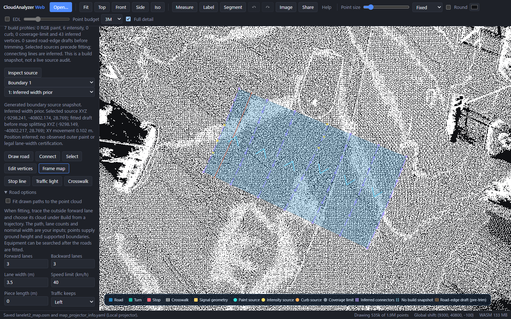

# Fit paint from retained intensity

Straight-corridor and guarded interior-divider fitting can explicitly use the
cloud's retained intensity instead of RGB. The default remains RGB. Selecting a
channel does not enable either fit, and missing RGB never silently switches to
intensity. Missing or unsuitable evidence holds the correction.

In **Vector map → Build from a trajectory**, choose **Paint-fit source → Retained
intensity**, then enable **Fit straight lanes using paint candidates** and/or
**Correct the interior line using paint and paired curbs**. Python and MCP accept
`paint_channel="intensity"`; CLI uses `--paint-channel intensity`:

```sh
ca vectormap-build survey.las drive.csv --out NEW-intensity-draft \
  --paint-channel intensity --physical-anchors-only --align-trace-to-curbs \
  --fit-paint-corridor --fit-paint-divider --fit-source-surface
```

Inputs must already share a metre coordinate frame. Counts, directions, initial
widths and marking roles remain operator inputs. High intensity alone does not
identify a lane boundary, a stop line or a crossing.

The selected ROI's finite intensity values define P10 and P99.9. Values are
temporarily mapped to 0–255, clamped, and passed through the existing thin-paint
guards: brightness at least 180, dark ground on both sides with a contrast of
40, nearby low-ground support and narrow longitudinal components. Raw intensity,
RGB, XYZ and the input file are unchanged. A missing attribute, a flat range or
ambiguous support holds the fit. `paint_corridor.intensity_range` reports the
raw normalization endpoints; intensity-mode reports include `source_channel`.
The default RGB report retains its existing serialized form.

Corridor fitting still needs a straight trace within 5°, a unique complete
parallel bundle and supported spacing/residuals. Interior-divider fitting still
needs an explicitly configured two-lane road and a majority of paired curb
observations. ROI points are capped at 250,000, bright candidates at 50,000,
contrasted paint points at 10,000 and each neighbourhood query at 4,096. Exceeding
a budget holds the fit; a partial scan does not select a corridor. These limits
are not an out-of-core paint extraction algorithm.

Nearby selected paint positions receive **intensity** evidence in this mode.
Interpolated gaps and extensions retain **width-prior** labels. The optional
[evidence display](vector-map-evidence.md) distinguishes source dots from inferred
connectors. It is a construction snapshot, not a continuously verified marking.

## What the checks demonstrate

Known synthetic fixtures recover 3.0 m spacing and the expected approximately
−2.29° heading with uniform RGB and retained intensity. Positive affine changes
to intensity scale/offset give the same boundaries. Separate divider fixtures
check that outside geometry stays intact and that unobserved intervals remain
inferred. Missing, uniform, invalid and wide-band intensity cases hold.

The existing six Tokyo development courses were frozen and generated again
without a reference map: RGB and intensity modes produced **12 maps**, with
identical IR and OSM geometry between channels. All six intensity corridor fits
and all six divider fits were **held**:

| Course | Corridor hold | Divider hold |
| --- | --- | --- |
| arterial-south | Trace not straight within 5° | Requires an explicitly configured two-lane road |
| arterial-middle | Paint scan/query budget | Requires an explicitly configured two-lane road |
| arterial-north | Paint scan/query budget | Requires an explicitly configured two-lane road |
| west-south | Paint scan/query budget | Paint scan/query budget |
| east-south | Paint scan/query budget | Requires an explicitly configured two-lane road |
| west-north | Trace not straight within 5° | Trace not straight within 5° |

The retained reports contain each exact reason and counters. A second cached
official Autoware source contains XYZ only; its manually placed trace produced
no source-supported road intervals in either mode. Those **two rejected builds**
are recorded separately. They are not two generated maps or a successful test
of intensity fitting at another location. No reference geometry was inspected
or used for this iteration, and no new geometric accuracy gain is claimed.



This production-browser screenshot loads all 1,883,866 prepared Tokyo points
without an input map, using an isolated arterial-middle trace and manually
configured three lanes in each direction at 3.5 m. It produces six lane fragments.
The six intensity vertices are existing cross-section selections; **the new paint
fits did not apply**. The other 43 profile vertices remain inferred. The 49 native
boundary vertices match exported nodes; toggling evidence leaves OSM bytes
unchanged, list inspection works and one Undo removes the build. Native agreement
is an implementation check, not a zero-error survey result.

The default RGB pipeline also reproduces all 83 outputs from 18 existing generation
runs byte for byte. The 455 historical proof files, prior evidence verification
and published GIF remain unchanged. Existing real-map boundary errors and manual
outside-width assumptions still apply; see [the lane-edge evaluation](vector-map-lane-edges.md).

[Frozen maps, reports, failed attempts and verification](../benchmarks/vector-map/intensity-paint/README.md)
bind the runtime, source, native module and production WASM hashes. No source
cloud is copied into the repository.

Tokyo source: Dynamic Map Platform Co., Ltd. (2026),
[pinned Hard Intersection sample](https://huggingface.co/datasets/dynamic-maps/hard-intersection-multimodal-sample/tree/e8e8d2a5d49a8b9cb63b5b5ecef9b260ff48f39c),
CC BY 4.0. The previously prepared XYZRGBI file has classifications cleared and
uniform RGB; source coordinates/heights and reviewed traces are retained. These
are reused development inputs, not untouched raw data or a held-out scene.
Official Autoware sample sources: TIER IV, Inc.; the earlier
[physical-anchor source record](../benchmarks/vector-map/physical-anchors/README.md)
documents the cached planning source. The additional XYZ-only cloud is the cached
Autoware ROS-bag sample; its hash and fields are recorded with the rejected builds.
