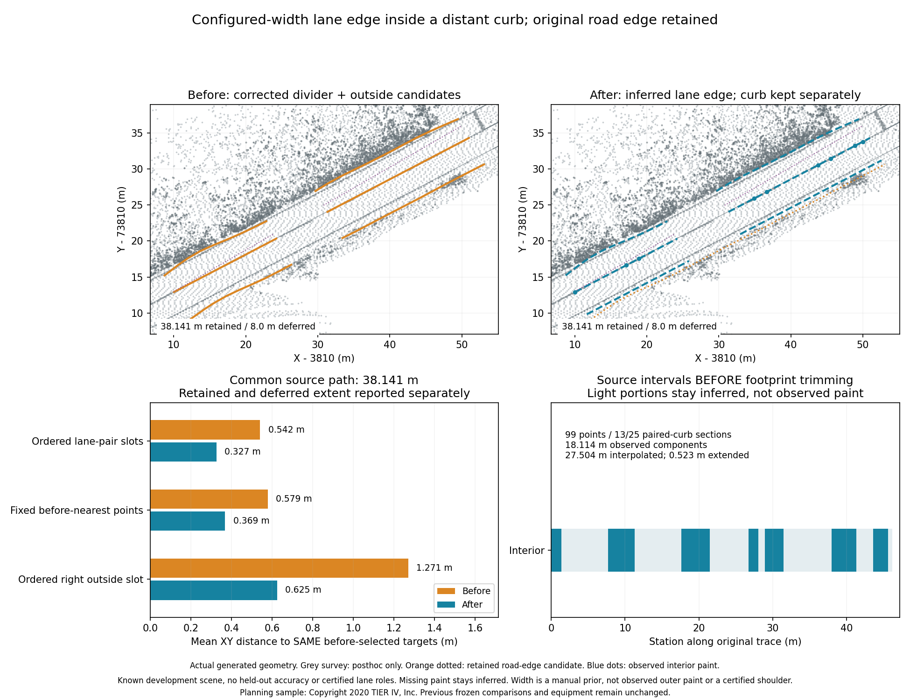
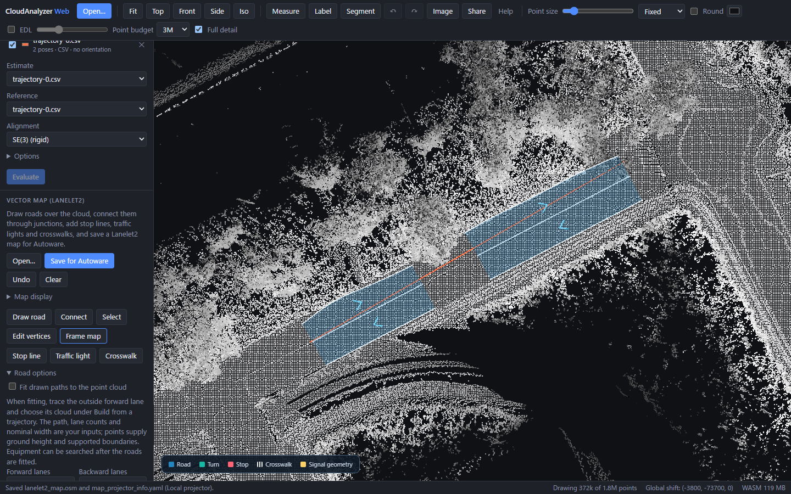

# Infer lane edges inside distant curb candidates

A curb bounds a road surface; it does not necessarily mark a driving lane.
Planning path 1 still has a misplaced right outside boundary after its
[interior paint correction](vector-map-paint-divider.md). Original source points
contain a strong divider but only short, weak outer paint components. The new
**default-off** `infer_lane_edges` mode uses an explicitly configured lane width
relative to that divider when selected verified curbs lie farther away.
This is a **manual width prior**, not detected outer paint, automatic shoulder
classification or a surveyed lane edge. Lane roles and directions need review.

Both scene generations were frozen before opening reference geometry. Grey
survey curves enter only in post-generation comparison and this figure. Orange
dotted curves retain the incoming road-edge candidate separately; blue outer
geometry is inferred from the configured width, even where source ground exists.
These are known development scenes, not held-out accuracy or learned semantics.

## Source gates and evidence

The mode requires an applied two-lane `fit_paint_divider` correction and enabled
`verify_curb_profiles`. A complete applied paint corridor takes precedence through
that prerequisite. The RGB detector, source-ground/curb-pair checks and budgets
are unchanged. The new option does not automatically enable its prerequisites.

Each outside side is checked independently. Selected curb candidates before
local fitting must exceed `lane_width + max(0.5 m, 2 * bin_width)` from the fitted
interior paint line in a strict majority of incoming vertices, including three
consecutive vertices. Any existing outside RGB paint or intensity observation
holds that side. Close curbs, missing verification or unavailable divider fits
keep the existing geometry.

Every proposed vertex must move inward without expanding beyond the incoming
outside candidate. It is offset by the configured horizontal lane width normal
to the fitted paint heading. Source ground under the new position must agree
with interior ground within 0.3 m. Failure holds the whole side before mutation;
a query limit restores all original sides. Source-footprint checks then inspect
the actual new lane centres and boundaries, trim unsupported intervals, and
report deferred extent. Ground support is not proof of a legal driving edge.

All new outside vertices are `width_prior`; none becomes observed paint or
curb evidence. `lane_edge_inference.retained_road_edges` retains incoming geometry,
evidence, reference stations and selected sources **before footprint trimming**.
Selected curb sources are cross-section candidates, not necessarily individual
raw points. These report curves are not extra Lanelet2 boundaries or certified
shoulder entities. Per-side incoming counts and movement also precede trimming.
The corrected interior and the other outside side retain their geometry/evidence.

## Fixed targets and remaining error

On planning path 1, the right side has **19/25 distant curb candidates** with a
19-vertex run before trimming. The selected far-curb median distance is **4.188 m**, with **0.927 m**
maximum edge movement before trimming. The left side fails the majority guard and is unchanged. The manual
configured width is **3.5 m**; it was fixed before reference evaluation. We do
not replace it with a width fitted to the reference map.

Both modes retain **38.141 m**, defer **8 m**, and generate four lane fragments.
Common source extent is the same, with zero before-only/after-only path and no
held reference intervals. Before-selected adjacent lane pairs yield **312 samples**
across three ordered slots, 104 per slot:

| Boundary / measure | Before mean | After mean | Before max | After max |
|---|---:|---:|---:|---:|
| Left outside, unchanged | 0.310 m | 0.310 m | 0.551 m | 0.551 m |
| Interior paint, unchanged | 0.044 m | 0.044 m | 0.046 m | 0.046 m |
| Right outside, inferred | 1.271 m | 0.625 m | 1.531 m | 0.631 m |
| Three ordered slots | 0.542 m | 0.327 m | 1.531 m | 0.631 m |
| Independent fixed-before-nearest targets | 0.579 m | 0.369 m | 1.530 m | 0.743 m |

The right slot has **zero samples within 0.5 m in both modes**; its reduction
in distance is not survey-level accuracy or proof that 3.5 m is the correct
legal lane width. Ordered three-slot P90 changes **1.328 → 0.629 m**. The separate
nearest diagnostic retains different targets and its larger maximum. Source
support and extent are generation gates; they are not independent ground truth.

Final path-1 evidence is **9 RGB, 12 curb and 45 width-prior vertices**. Original
right curb/road-edge candidates remain in the pre-trim report, not exported as
additional lanes. Only the inferred right side moves; left/interior reference,
geometry and evidence are exact. Planning paths 0 and 2 hold this stage and keep
the earlier fits, including the path-2 reference-pair seam hold. Full-planning
unpaired nearest mean changes **0.351 → 0.279 m**, maximum **1.530 → 0.666 m**,
with the same 876 samples, **116.512 m generated / 12 m deferred / ten fragments**.

All six Tokyo cases hold because no guarded divider correction is applied.
Editable JSON and OSM are byte-identical, **88.078 m generated / 34.259 m deferred**,
38 fragments. Ordered comparison remains held, not a zero-error result. The
unpaired nearest maximum remains **5.064 m**. This stage does not solve complex
intersection topology or infer signals/crosswalks from a lane-width prior.

## Production browser check

The production browser loads all original **1,757,841 planning points**, with no
input map. The isolated path-1 build has four lane fragments and **66 native
boundary vertices**, matching exported nodes with zero discrepancy. Full-source
audit passes; one Undo removes the draft without page errors. This verifies
boundary vertices and lane counts, not complete topology or byte-identical OSM.
Processing retains full source independently of display LOD.

Local validation passes 84 Rust vector-map tests, all 12 WASM tests, 37 native
API/CLI/metric/MCP tests, 21 production vector-map browser tests and one actual
source browser proof. Native/WASM release, fmt, workspace/binding clippy,
TypeScript/Vite and Linux mypy (143 files) pass. Scoped ruff excludes existing
F401/F541/E701/E702; the new plot passes with the existing Agg-import convention.
Eighteen independent native builds reproduce every JSON/OSM, extraction report
and source audit exactly. Inference-off maps reproduce the previous divider
stage byte-for-byte. SHA256 ties configurations, frozen outputs, current binaries,
browser proof and source declarations together; declarations are not embedded
binary attestations.

## Use and reproduction

Enable CLI `--infer-lane-edges --fit-paint-divider --fit-source-surface
--physical-anchors-only`, Python/MCP `infer_lane_edges=True` with the equivalent
options, or Web's “Infer lane edges inside distant curbs (width assumption)”.
Explicitly review the width first. The generation harness additionally keeps
previous paired-curb alignment and complete paint fitting enabled in both modes.

[Editable JSON/OSM, source configurations, profiles and both diagnostics](../benchmarks/vector-map/lane-edge-inference/README.md)
record the current comparison. Earlier [divider](vector-map-paint-divider.md),
[paint](vector-map-paint-corridor.md), [curb](vector-map-curb-alignment.md) and
[physical-anchor](vector-map-physical-anchors.md) proofs retain their original bytes.

Planning sample: Copyright 2020 TIER IV, Inc.; original cached
[Autoware sample-map instructions](https://autowarefoundation.github.io/autoware-documentation/main/demos/planning-simulation/).
Tokyo uses the cached DMP sample described in the
[previous paint proof](vector-map-paint-corridor.md), CC BY 4.0, pinned revision
`e8e8d2a5d49a8b9cb63b5b5ecef9b260ff48f39c`. No new source downloads/copies.
