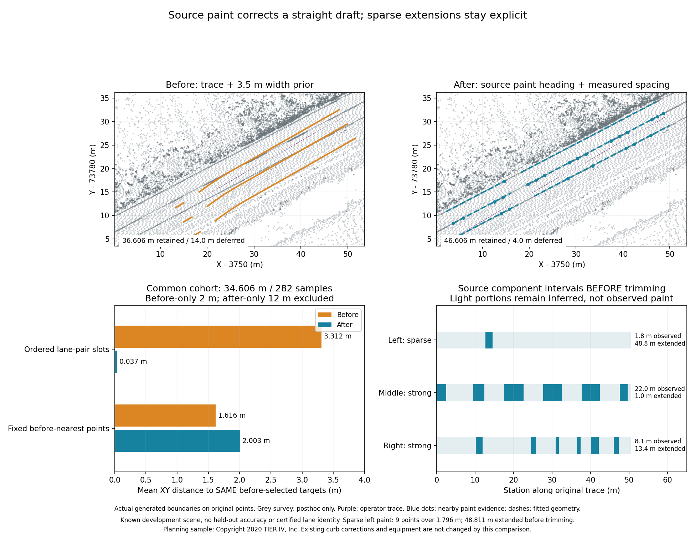
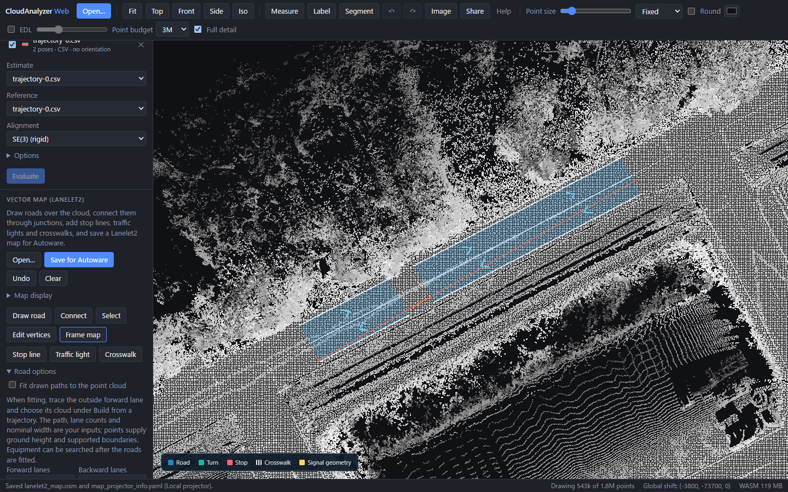

# Fit straight draft lanes to source paint

The previous curb correction left a 5.674 m residual on planning path 0:
its source road has narrow paint, but no stable pair of raised curbs. The optional
`fit_paint_corridor` stage groups **original RGB points** along the road and fits
parallel boundary heading and spacing. It is **off by default**. Lane counts,
travel directions and boundary roles remain operator inputs, requiring review.



These are actual generated drafts, not traced reference lines. Grey survey curves
enter only after both scenes' generation outputs are frozen. The planning sample
is a known development scene; the small error below is not held-out accuracy,
certified lane identity or proof that every fitted line was observed.
The [earlier curb comparison](vector-map-curb-alignment.md), width-anchor proofs
and existing GIFs retain their original outputs and runtime declarations.

## What the source establishes

Only straight traces whose sections remain within five degrees of the overall
heading are considered. The source ROI extends three metres beyond each end
and twice the configured total width to either side. RGB minimum-channel
brightness must reach 180/255. Each candidate needs at least three nearby
returns within 0.3 m and must lie within 0.12 m of their P20 ground height.
It must also be within 0.3 m of source ground under the trace; sensor pose Z is
never used. Each lateral side needs at least three same-height background
returns in the 0.3–0.8 m annulus, beyond 0.15 m laterally, with median brightness
at least 40/255 darker. Uniform bright RGB, bright roofs and missing flanks do
not supply paint evidence.

Connected paint components use a 0.3 m neighbour radius. A component needs five
points, at least 0.75 m robust longitudinal extent, at most 0.3 m robust transverse
extent and heading within 15 degrees of the trace. Components cluster into lines
within 0.3 m of a shared preliminary heading. One unique bundle must contain
`configured lanes + 1` lines, with adjacent spacing between 1.5 m and
`min(6 m, lane_width + search_margin)`, agreeing within 20% of mean spacing.
At least one line per configured lane must have strong longitudinal support:
15 points, component span covering half the trace and summed component intervals
covering one tenth of it. Remaining lines can have only sparse confirmation.
Multiple plausible bundles are held rather than automatically assigned roles.

The final shared heading uses within-line point variation; sparse outer paint
cannot independently set heading. Per-line offsets use medians, P90 lateral
residual must stay below 0.2 m and the refitted spacing is checked again.
Fits are straight and parallel; tapering, curves, yellow paint, legal marking
patterns and automatic lane-count inference are outside this stage.

Scan limits are explicit: 250,000 ROI points, 50,000 white candidates, 10,000
contrasted paint points and 4,096 inspected neighbours per query. Reaching any
limit holds the optional fit with `limited=true`; a partial scan cannot establish
an unambiguous corridor. Held fits use the previous extractor. Color-count
mismatches fail before modifying the map.

## Observations and extensions are different

`paint_corridor` reports applied/held, reason, limits, source/component counts,
measured widths, heading correction, residual and per-line observation intervals.
Each line separates summed observed component intervals, interpolation between
components and extrapolation beyond the observed span. These describe the fit
**before source-footprint trimming**, not a continuous survey of the output.

On planning path 0 the measured widths are **2.900 and 2.894 m**, versus the
operator's 3.5 m starting prior; heading changes **−2.041°**. The middle and right
lines have strong source support, but the left line has **only nine points over
1.796 m**, with **48.811 m extrapolated before trimming**. Its long fitted boundary
remains an assumption requiring review. The strong tracks also contain gaps:

| Source line, left to right | Observed component length | Interpolated | Extrapolated |
|---|---:|---:|---:|
| Left, sparse | 1.796 m | 0.000 m | 48.811 m |
| Middle, strong | 22.024 m | 27.610 m | 0.972 m |
| Right, strong | 8.081 m | 29.111 m | 13.414 m |

Only output vertices within 0.5 m of selected original paint points receive
`rgb_paint` evidence; gaps and extensions keep `width_prior`, even though their
spacing now comes from measured paint. Final retained geometry has **24 RGB
vertices and 54 inferred vertices**, with actual source positions kept for
observed vertices. Source-supported elevations are measured anew. The local
0.5 m curve-fit movement cap does not constrain this separate source paint fit:
its heading and spacing can relocate previously misplaced boundaries farther.

With `fit_source_surface`, every actual lane centre and boundary is checked
against original ground along each interval at at most 0.5 m spacing. Missing
intervals are split/deferred. Paint spacing is preserved even when little of
the candidate is supported; it is never silently replaced by width priors while
still reporting an applied paint fit. No unobserved ground is filled.

## Accuracy and retained extent

Both comparison modes start from the previous physical-anchor **and paired-curb**
stage. Only after enables paint fitting. Counts, directions, source traces and
starting width remain fixed. Both complete scene generations, editable JSON,
Lanelet2, profiles, audits and CSV inputs are hashed **before any survey is opened**.
Profiles must occur in their actual generated maps. Original operator coordinates
match source intervals; curb translations are inverted solely for matching.

| Planning path 0 | Before | After |
|---|---:|---:|
| Generated path | 36.606 m | 46.606 m |
| Deferred path | 14.000 m | 4.000 m |
| Common source interval cohort | 34.606 m | 34.606 m |
| Before-only / after-only extent, excluded from paired accuracy | 2.000 m | 12.000 m |
| Ordered lane-pair mean XY | 3.312 m | **0.037 m** |
| Ordered lane-pair P90 / maximum XY | 4.166 / 5.674 m | 0.062 / 0.064 m |
| Fixed before-nearest-point mean XY | 1.616 m | **2.003 m, regression** |
| Fixed before-nearest-point maximum XY | 5.674 m | 5.797 m |

Ordered correspondence selects the adjacent opposite-direction survey lane pair
and its three ordered boundaries using **before only**; the same longitudinal
targets stay fixed after. This cohort contains 282 samples and no held reference
interval. The earlier nearest-point diagnostic also keeps before-selected targets,
but those targets can represent other boundary roles when the initial draft is
misplaced. Both diagnostics are published; neither establishes legal lane identity.
An extra 12 m is not mixed into the common-cohort error, and the removed 2 m is
not silently omitted. Full-planning unpaired mean changes 0.951 → 0.395 m and
maximum 5.674 → 1.530 m while retained extent increases 106.512 → 116.512 m;
those full-map populations differ and are not the paired accuracy result.

Planning paths 1 and 2 hold paint fitting and keep their own boundary geometry unchanged. Path 2 keeps its
earlier curb correction, including the 2 m reference-pair seam held by the
correspondence method. All six prepared Tokyo traces hold: two curved traces,
three with unusable uniform RGB and one ROI budget limit. Their maps and OSM
stay byte-identical, with 88.078 m retained and 34.259 m deferred. All 88.078 m
are held by the ordered lane-pair diagnostic, not assigned zero error. This RGB
fit does not address the remaining Tokyo geometry problems.

## Use and reproduce

In the Web viewer, load the original cloud and trace, expand **Build from a
trajectory**, enable **Fit straight lanes using observed white paint**, and
optionally source-footprint checks. Review measured widths and each line's
observed/interpolated/extended lengths in the report. Build and Undo are atomic.
Python/MCP expose `fit_paint_corridor`; CLI:

```sh
ca vectormap-build points.pcd drive.csv --out NEW-draft \
  --physical-anchors-only --align-trace-to-curbs \
  --fit-paint-corridor --fit-source-surface
```



The actual browser build loads all 1,757,841 source points with no input map;
display LOD is separate. Two retained road stretches produce four lane fragments.
All 78 native boundary vertices match exported nodes with zero discrepancy;
full-source audit passes and one Undo removes the build. The small break remains
deferred rather than filled. This screenshot is a generated-map proof, not
an editing replay or a complete-intersection demo.

See [frozen inputs, actual maps and verification](../benchmarks/vector-map/paint-corridor/README.md).
Runtime hashes bind independent native reproductions and the actual-source
production browser proof. The browser checks boundary vertices against exported
nodes and lane counts, not complete topology or byte-identical OSM.
No source clouds are copied into the repository.

Planning source: Copyright 2020 TIER IV, Inc., [official sample instructions](https://docs.autoware.org/main/demos/planning-sim/).
Tokyo source: Dynamic Map Platform Co., Ltd. (2026), [pinned Hard Intersection sample](https://huggingface.co/datasets/dynamic-maps/hard-intersection-multimodal-sample/tree/e8e8d2a5d49a8b9cb63b5b5ecef9b260ff48f39c),
CC BY 4.0. Tokyo proof uses the previously prepared XYZRGBI file (classifications
cleared and RGB uniform), original coordinates/heights and reviewed trace inputs;
it is not an untouched raw tile or a held-out scene.
