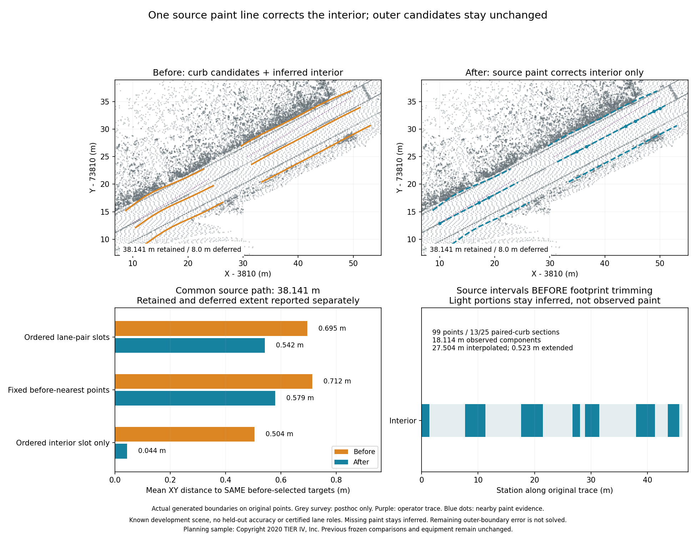
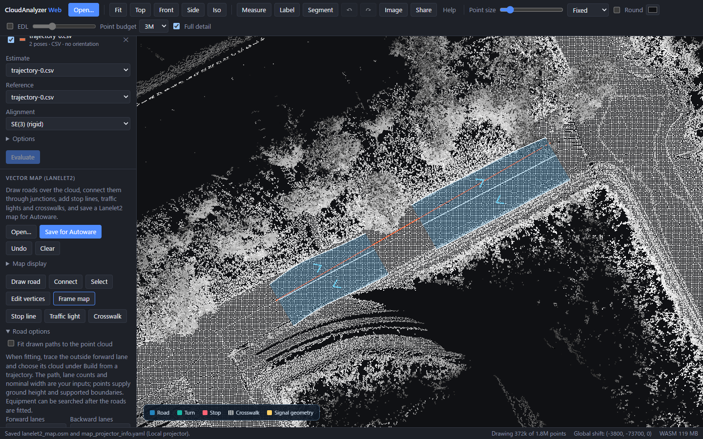

# Correct an interior draft boundary using source paint

Planning path 1 has a strong central white line but insufficient outer paint for
the [complete paint-corridor fit](vector-map-paint-corridor.md). The new optional
`fit_paint_divider` stage corrects only its interior boundary using original RGB
points, with paired physical curbs guarding the assignment. It is **off by
default**. Counts, boundary semantics and travel directions remain manual inputs.



Both complete scene generations were frozen before any reference geometry was
opened. Grey survey curves enter only in post-generation evaluation and this
figure. These are actual generated maps on a known development scene, not
held-out accuracy or certified lane identities. Earlier frozen proofs and both
existing GIFs retain their original bytes and runtime declarations.

## Source guards and retained evidence

The stage requires an explicitly configured **two-lane** road. A complete applied
paint-corridor fit takes precedence. Straightness, white-paint contrast, local
ground, dark flanks, component width/length and scan limits use the same
[source paint detector](vector-map-paint-corridor.md#what-the-source-establishes).
A strong track needs 15 points, component span covering half the trace and
observed component intervals covering a tenth of it. Exactly one strong track
must remain within `lane_width / 2 + search_margin` of every existing interior
vertex. Multiple eligible tracks are held, without selecting the closest one.

The selected track uses longitudinal least squares for heading and median
lateral intercept. Heading must stay within 15 degrees and P90 lateral residual
within 0.2 m. Source cross-sections independently check coherent low-ground bands
enclosed by **two bounded raised outside bins on each side**, with flat ground
inside. Sensor pose Z is ignored. Each side of the paint needs at least 1.5 m
and at most `min(6 m, lane_width + search_margin)`. Total band width must contain
the configured road width and be no more than that width plus twice the search
margin. Ground must agree with source ground under the trace within 0.3 m.

The paint must lie inside a unique physical curb pair in a **strict majority**
of sampled sections, including three consecutive sections; ambiguous sections
hold the correction. This is a source plausibility guard, not proof that curbs
are legal driving-lane boundaries. Walls, coverage limits and missing returns
cannot supply these curb pairs.

Every output replacement is validated before any mutation. It needs source
ground and must leave each existing lane between 1.5 m and the same maximum
width, in the original left/right order. Failure holds the whole correction.
Only the interior candidate changes; outside geometry, evidence and reference
vertices remain unchanged. With source-footprint mode, actual corrected lane
centres and boundaries are subsequently checked at intervals of at most 0.5 m.
Unsupported intervals are trimmed/split, with deferred length reported. An
applied paint correction cannot silently fall back to an unrelated width prior.

`paint_divider` reports applied/held reason, scan limits, source counts, eligible
tracks, curb sections, heading, residual and maximum interior movement. Source
observation intervals, interpolation and extrapolation describe the fit **before
footprint trimming**, not continuous paint coverage. Vertices within 0.5 m of
selected original paint points receive `rgb_paint`; gaps/extensions retain
`width_prior`. Actual source positions remain available for observed vertices.
The separate divider correction is not limited by the 0.5 m local jitter-fit cap.

On planning path 1, **99 source points** form one strong track. Physical curb
pairs guard **13/25 sections**, with eight consecutive pairs. Heading correction
is **−2.320°**, P90 source-fit residual **0.061 m**, and maximum divider movement
**0.923 m**. Source component lengths are **18.114 m observed**, **27.504 m
interpolated** and **0.523 m extended**. Final retained geometry has **9 RGB,
28 curb and 29 inferred vertices**; only nine vertices directly refer to nearby
paint, despite the long fitted interior line.

## Fixed targets, separate boundary errors

Both modes enable previous physical anchors, curb alignment, complete paint
fitting and source-footprint checks. Only after enables the divider correction.
Traces, counts, directions and the 3.5 m starting prior remain fixed.

| Planning path 1 | Before | After |
|---|---:|---:|
| Generated path | 38.141 m | 38.141 m |
| Deferred path | 8.000 m | 8.000 m |
| Common source cohort | 38.141 m / 312 samples | Same |
| Before-only / after-only extent | 0 m | 0 m |
| Ordered three-boundary mean XY | 0.695 m | **0.542 m** |
| Ordered P90 / maximum XY | 1.328 / 1.531 m | **Unchanged** |
| Fixed before-nearest-point mean XY | 0.712 m | **0.579 m** |
| Fixed before-nearest-point maximum XY | 1.530 m | **Unchanged** |

Ordered correspondence selects adjacent opposite-direction survey lanes using
before only, then keeps the same station samples and three boundary slots after.
All 38.141 m are covered by that diagnostic, with no held reference interval.
The independent nearest-point diagnostic also keeps its before-selected targets.
Neither establishes legal lane identity. Endpoint samples repeat across intervals.

| Ordered boundary slot, 104 samples each | Mean before → after | Maximum before → after |
|---|---:|---:|
| Left outside | 0.310 → 0.310 m | 0.551 → 0.551 m |
| Interior | **0.504 → 0.044 m** | **0.969 → 0.046 m** |
| Right outside | **1.271 → 1.271 m** | **1.531 → 1.531 m** |

The remaining worst error is in the **right outside boundary**, which this stage
does not correct. A physical road/curb edge is not necessarily a driving-lane
edge. The figure and full aggregate retain that discrepancy rather than reporting
only the successful interior line.

Full-planning unpaired nearest-boundary mean changes **0.395 → 0.351 m**, while
maximum stays **1.530 m**. Both populations contain 876 samples, 116.512 m
generated, 12 m deferred and ten lane fragments. Source audits flag no unsupported
lanes; passing source support is not survey accuracy. Planning path 0 keeps its
previous complete paint fit; path 2 holds divider correction with only 4/17
guarding curb sections and keeps the earlier curb fix/reference-pair seam.

All six Tokyo traces hold and keep maps/OSM byte-identical: four are configured
with more than two lanes, one lacks usable RGB contrast and one is curved.
Retained/deferred extent stays 88.078/34.259 m. All Tokyo ordered-corridor extent
is held by the correspondence diagnostic, not assigned zero error. This stage
does not solve curved roads, outer lane-edge semantics or whole-intersection
topology.

## Use and reproduction

In Web, load points and a trace, open **Build from a trajectory**, and enable
**Correct the interior line using paint and paired curbs**. Inspect the applied/
held reason, guarding curb counts and paint observation lengths. Build/Undo
remain atomic. Python/MCP expose `fit_paint_divider`; CLI:

```sh
ca vectormap-build points.pcd drive.csv --out NEW-draft \
  --physical-anchors-only --align-trace-to-curbs \
  --fit-paint-corridor --fit-paint-divider --fit-source-surface
```



The production browser loads all original **1,757,841 points**, with no input map,
and builds path 1 as four lane fragments. Display LOD is independent of processing.
Its exported nodes match every native boundary vertex, full-source audit passes
and one Undo removes the build without page errors. This checks vertices and lane
counts, not complete topology or byte-identical OSM.

[Frozen source inputs, actual JSON/OSM and verification](../benchmarks/vector-map/paint-divider/README.md)
include all nine cases and eighteen independent native reproductions. Generation
and native/Web source declarations share runtime commit `a591694925af9fdb278ffc1e96c2b086597b3a6d`;
later posthoc evaluation adds per-slot metrics without regenerating source maps.
SHA256 values bind outputs, source/binary hashes and the browser proof. Declared
source commits are not embedded binary attestations. No raw clouds are copied.

Planning source: Copyright 2020 TIER IV, Inc., [official sample instructions](https://docs.autoware.org/main/demos/planning-sim/).
Tokyo source: Dynamic Map Platform Co., Ltd. (2026), [pinned Hard Intersection sample](https://huggingface.co/datasets/dynamic-maps/hard-intersection-multimodal-sample/tree/e8e8d2a5d49a8b9cb63b5b5ecef9b260ff48f39c),
CC BY 4.0. Tokyo uses the previously prepared XYZRGBI file with classifications
cleared and uniform RGB, original coordinates/heights and reviewed traces;
it is a known development scene, not an untouched raw tile or held-out evaluation.
