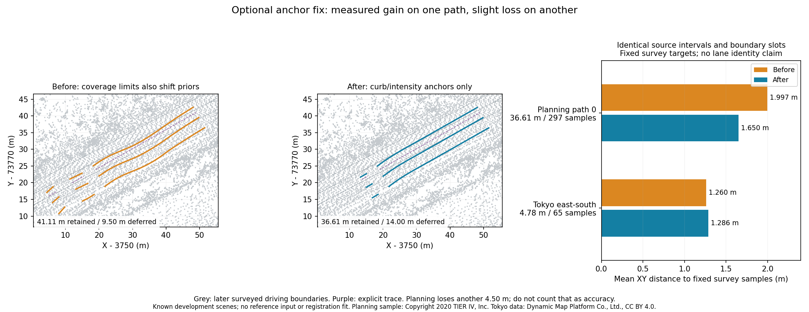

# Keep scan limits out of inferred width anchors

An end of point coverage is not necessarily a road edge. Previously, a selected
coverage limit near an outside boundary could shift every inferred lane-width
line, even when the limit was an occlusion or the edge of a scan. The optional
`physical_anchors_only` mode excludes these candidates from the existing robust
offset median. Curb and intensity observations remain eligible anchors; direct
coverage-edge candidates remain selectable and require review.



This is an opt-in fix, **off by default**, with a measurable gain on one known
planning path and a slight regression on another scene. It is not a generally
validated accuracy upgrade. Existing GIFs and frozen evaluations are unchanged.
The left two panels show actual generated boundaries on original planning points;
grey surveyed driving boundaries are overlaid only after generation.

## Compare the same source intervals

Both modes use the same cached XYZRGB/intensity source, recorded or source-reviewed
operator traces, explicit lane counts/directions/width priors, candidate thresholds,
tracking, curve fitting and source-footprint fitting. There is no reference-map
input, registration fit, teacher geometry or surveyed parameter tuning.

The Rust diagnostic writes both modes' actual cumulative editable maps, Lanelet2,
source audits and extracted profiles. It rejects reused intervals for this protocol.
Each measured profile polyline must be present, forward or reversed, in the actual
built map. Every generation file is hashed **before** the evaluator opens the
surveyed reference. Input/source/executable hashes are checked again at the end.

For the primary comparison, match consecutive reference-path XY coordinates
rounded to six decimals **from the source-only extraction**, separately within
each case. Retain identical source intervals and configured boundary slots. Reject
ambiguous repeated intervals or changed slot counts. Sample each slot at at most
0.5 m along the source interval; endpoints repeat across intervals. For every
before point, select its nearest surveyed driving-boundary sample once; measure
the corresponding after point against **that same sample**, without retargeting.
Reference boundaries are sampled at at most 0.5 m. This improves comparability but
**does not establish semantic lane correspondence**; discretization affects distances.

| Shared-source comparison | Path / samples | Mean XY before → after | P90 before → after |
|---|---:|---:|---:|
| Planning path 0 | 36.606 m / 297 | 1.997 → 1.650 m | 4.778 → 4.064 m |
| Planning path 1 | 38.141 m / 312 | 0.712 → 0.712 m | 1.335 → 1.335 m |
| Planning path 2 | 31.765 m / 255 | 1.369 → 1.369 m | 3.396 → 3.396 m |
| Tokyo arterial south | 34.839 m / 623 | 0.62890 → 0.62867 m | 1.31935 → 1.31861 m |
| Tokyo arterial middle | 10.605 m / 196 | 0.394 → 0.394 m | 0.748 → 0.748 m |
| Tokyo arterial north | 27.526 m / 490 | 0.487 → 0.487 m | 1.285 → 1.285 m |
| Tokyo west south | 8.000 m / 66 | 2.001 → 2.001 m | 4.241 → 4.241 m |
| Tokyo east south | 4.783 m / 65 | **1.260 → 1.286 m** | 2.395 → 2.341 m |
| Tokyo west north | 2.326 m / 24 | 1.578 → 1.578 m | 2.875 → 2.875 m |

Planning path 0 improves by 0.348 m in mean distance on the same 36.606 m;
the fraction within 0.5 m rises from 19.5% to 40.1%. But another **4.500 m is
newly deferred**, and the common-cohort maximum still reaches 5.674 m. Do not
count dropped extent as an accuracy improvement. Changed candidate selection
also changes heights by up to 0.215 m on this path, or 0.022 m on Tokyo east south.
The curve-fitting stage preserves heights within each mode; the two complete
generation modes do not necessarily retain the same candidate heights.

## Retained extent and full-map proximity

| Entire generated draft | Planning before → after | Tokyo before → after |
|---|---:|---:|
| Retained source-path length | 111.012 → 106.512 m | 88.078 → 88.078 m |
| Deferred source-path length | 17.500 → 22.000 m | 34.259 → 34.259 m |
| Lane fragments | 12 → 10 | 38 → 38 |
| Source-review lanes | 0 → 0 | 0 → 0 |
| Audit samples | 1,398 → 1,332 | 3,154 → 3,154 |
| Full-map unpaired nearest-boundary mean | 1.418 → 1.238 m | **0.659917 → 0.660722 m** |
| Full-map unpaired P90 | 3.793 → 3.524 m | 1.400 → 1.406 m |
| Full-map unpaired maximum | 5.802 → 5.674 m | 5.064 → 5.064 m |

The full-map statistic independently selects nearest survey samples in each mode;
it changes cohort when extent changes and is secondary to the shared-interval
comparison. Tokyo is approximately flat overall and slightly worse in the mean,
including a 2.6 cm mean regression on east south. These are known development
scenes, not held-out validation or certified survey accuracy. Zero source flags
mean nearby low-surface returns exist; support is also a generation gate.

Both scenes exclude eight outside coverage candidates from offset estimation,
counted **before tracking and surface deferral**. This is not eight removed vertices,
false detections or recovered markings. Later source-footprint fallback can still
infer geometry from low-surface coverage; this option changes only the width-anchor
stage. Lane identities/counts, travel direction, legal controls and equipment types
remain explicit reviewed inputs. This road-only comparison does not include the
21 reviewed Tokyo connection drafts or equipment shown in the separate GIF.

The production browser also opens the original 1,757,841 planning points with no
input map, enables the option and builds path 0. All 63 native boundary vertices
have zero distance to exported UI nodes; four lane fragments pass the full-source
audit and one Undo removes the build. There are no page errors. This checks
vertices-to-nodes and lane counts, not complete topology or OSM byte equality.
All 18 native source-only builds across both scenes independently reproduce the
Rust diagnostic JSON, Lanelet2, extraction reports and source audits byte-for-byte
(or exactly as decoded reports). Both legacy final maps remain byte-identical to
the earlier frozen source-footprint baselines.

## Use and reproduce

```sh
ca vectormap-build cloud.las trajectory.csv --out new-anchor-draft --physical-anchors-only --fit-source-surface
```

Python/MCP use `physical_anchors_only=True`. Web's **Build from a trajectory** contains
**Anchor inferred lane widths to paint and curbs only**. With
`anchor_width_prior=False` / `--no-anchor-width-prior`, the option has no effect.

The generation core/example runtime is `47ea65a6e5e033238fadd3fbdfb35688bf036565`.
Build/install the native core for reference-coordinate import; build the source-only
diagnostic from the checkout under test. Source commits are declared provenance,
not embedded binary attestation. Exact executable/native/WASM hashes and actual
source-only browser results are in [verification.json](../benchmarks/vector-map/physical-anchors/verification.json).

```powershell
cargo build --manifest-path rust/Cargo.toml -p ca-wasm --example vector_map_anchor_compare
python scripts/vector_map_anchor_evaluate.py demo_data/autoware/sample-map-planning/pointcloud_map.pcd benchmarks/vector-map/physical-anchors/planning/inputs.json demo_data/autoware/sample-map-planning/lanelet2_map.osm notes/new-anchor-planning rust/target/debug/examples/vector_map_anchor_compare.exe --source-commit (git rev-parse HEAD)
python scripts/vector_map_anchor_evaluate.py notes/hard-intersection-prepared-v2/geometry.las benchmarks/vector-map/physical-anchors/tokyo/inputs.json demo_data/hard-intersection/maps/lanelet2/jp_tokyo_takanawadai.osm notes/new-anchor-tokyo rust/target/debug/examples/vector_map_anchor_compare.exe --source-commit (git rev-parse HEAD) --reference-epsg EPSG:6677
python scripts/plot_vector_map_anchors.py demo_data/autoware/sample-map-planning/pointcloud_map.pcd demo_data/autoware/sample-map-planning/lanelet2_map.osm notes/new-anchor-planning notes/new-anchor-tokyo notes/new-anchor-comparison.png
```

Tokyo surveyed lon/lat is projected to EPSG:6677 to match the prepared source;
planning uses its native MGRS metre frame. No fitted transform is applied. Public
[artifacts](../benchmarks/vector-map/physical-anchors/README.md) contain inline small
CSV inputs, every generation output, profiles, full-source audits, freezes and
comparisons; they contain neither raw source clouds nor surveyed maps.

After building WASM and the app, reproduce the actual planning-source UI check:

```powershell
cd web
$env:PW_PORT='4174'
$env:VECTOR_MAP_ANCHOR_SOURCE='../demo_data/autoware/sample-map-planning/pointcloud_map.pcd'
$env:VECTOR_MAP_ANCHOR_PROOF='../notes/new-anchor-planning'
npx playwright test --config playwright.media.config.ts vector-map-physical-anchors.spec.ts
```

Sample map: Copyright 2020 TIER IV, Inc.; [official planning instructions](https://docs.autoware.org/main/demos/planning-sim/).
Tokyo source: Dynamic Map Platform Co., Ltd. (2026), [pinned Hard Intersection sample](https://huggingface.co/datasets/dynamic-maps/hard-intersection-multimodal-sample/tree/e8e8d2a5d49a8b9cb63b5b5ecef9b260ff48f39c),
[CC BY 4.0](https://creativecommons.org/licenses/by/4.0/). CloudAnalyzer adds derived
drafts and measurements. These credits do not transfer the code's MIT license to data.
