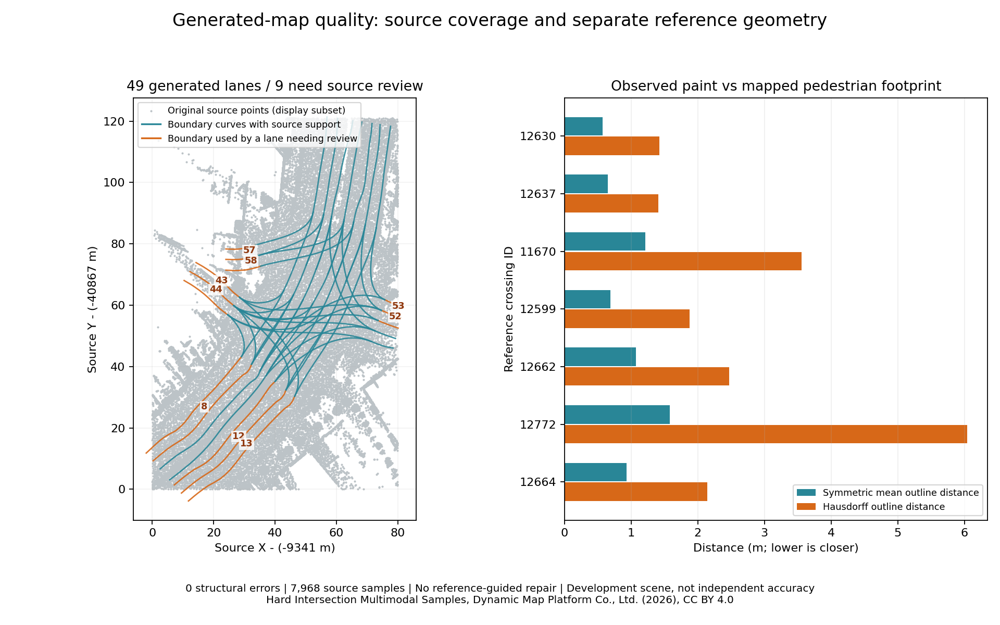

# Check a generated vector map against its source

For an opt-in way to improve weak incoming road candidates, see
[source-footprint drafting and its before/after coverage losses](vector-map-source-footprint.md).
The audit below describes the frozen published map; that map and its GIF are unchanged.

The README map is an editable draft. Its structural validation has zero errors,
but that does not establish accurate lanes, complete paint or correct equipment
types. Source coverage and reference geometry are checked separately.



Orange boundaries belong to the nine lanes requiring source review. The right-hand
plot evaluates crossing outlines separately, after the source-only check. Display
points are decimated; the coverage measurements use the full retained source.
Data: Dynamic Map Platform Co., Ltd. (2026), CC BY 4.0; see
[image attribution](images/ATTRIBUTION.md#hard-intersection-vector-map-audit).

## Source coverage in the app

Open the original retained cloud and the generated map in the same metre frame.
Expand **Check map against source points**, select the cloud and run **Check source
coverage**. The check examines each driving lane's centreline and both boundaries.
Click a reported lane to select and frame it over the points. Map geometry,
attributes, topology and Undo history remain unchanged.

Samples are evenly spaced by 3D arc length at no more than 0.5 m. A sample requires
at least three original returns within 0.75 m in XY, whose 15th-percentile height
differs by at most 0.3 m. A lane needs review when any of its three curves has less
than 90% support, or any curve endpoint is unsupported. The report distinguishes
insufficient returns from height disagreement. The 100,000-sample budget is checked
before resampling; omitted/malformed lanes are explicitly reported as unchecked.
Changing the map, cloud list, points or source selection invalidates the result.

Sparse or occluded returns can reduce coverage even on a real road. A height
disagreement can indicate another surface or a poor draft. Conversely, ground-like
returns beneath a line do not establish road semantics, lane counts, boundary
accuracy, obstacle clearance or legal turns. These are review cues, not automatic
repairs or a survey-accuracy score. Full-width interiors are not certified by
checking the centreline and two boundary curves.

The frozen README map has **49 lanes, zero structural errors and nine lanes needing
source review**, with 7,968 samples and no omitted/malformed lanes. IDs `8`, `12`,
`13` and `52` have endpoint failures while retaining at least 90% curve support;
`43`, `44`, `53`, `57` and `58` have at least one curve below 90%.

| Lane | Centre support | Left boundary | Right boundary |
|---|---:|---:|---:|
| 43 | 57.9% | 21.1% | 100% |
| 44 | 100% | 63.2% | 100% |
| 53 | 86.7% | 80.0% | 93.3% |
| 57 | 56.5% | 65.2% | 45.8% |
| 58 | 37.5% | 36.0% | 45.8% |

These low-support branches need inspection of original density, road extent,
operator traces and width assumptions. Simply moving Z to nearby returns does
not recover missing road evidence. No point cloud or map was repaired using the
reference geometry.

## Equipment geometry and stop confirmations

The seven reviewed paint objects have nearby correspondence to the seven mapped
crossing footprints under the existing 2 m XY / 0.75 m Z gate. Their symmetric
mean outline errors are **0.57–1.58 m**, with Hausdorff errors **1.41–6.05 m**.
The long crossing remains partial. Observed paint extent differs from a mapped
pedestrian footprint; nearby centres do not establish a complete, accurate shape.

Of two reviewed stop-marking drafts, one corresponds to a mapped stop line.
Of four reviewed housing drafts, two correspond to mapped signal housings.
Unmatched objects require further review; incomplete references do not establish
that they are all false positives. The source and this intersection have already
informed development, so this is **not independent generalization evidence**.

Stop confirmation now checks the local direction of **every explicitly selected
lane**, rather than using a nearest-lane suggestion from another branch. A marking
less than 45 degrees from a selected lane's direction is rejected before any
batch mutation. This prevents longitudinal lane paint from becoming a stop line.
An oblique transverse bar still requires human identification; this check does
not establish legal stop obligations or lane association correctness.

On the original frozen source, both former longitudinal choices (`44` for lane
`8`, `110` for lanes `24` and `25`) are rejected. All 13 corrected equipment
confirmations still produce exactly the frozen map. The
[stop-confirmation regression](../benchmarks/vector-map/hard-intersection/generated-map-stop-confirmation-regression.json)
records the source and installed binary hashes.

## Reproduction and audit artifacts

Reuse the existing prepared source and frozen media proof. Build/install the native
core from the same checkout, then choose a new report file:

```powershell
python scripts/vector_map_quality_audit.py notes/hard-intersection-prepared-v2/geometry.las notes/hard-intersection-media-proof-final notes/generated-map-quality.json --dataset demo_data/hard-intersection --source-commit (git rev-parse HEAD)
python scripts/check_vector_map_stop_confirmations.py notes/hard-intersection-prepared-v2/geometry.las notes/hard-intersection-media-proof-final notes/generated-map-stops.json --source-commit (git rev-parse HEAD)
python scripts/plot_vector_map_quality.py notes/hard-intersection-prepared-v2/geometry.las notes/hard-intersection-media-proof-final notes/generated-map-quality.json notes/generated-map-quality.png
```

Omit `--dataset` for a source-only check. The script verifies the frozen generated
OSM and source-cloud hashes, runs the native check and hashes its result before
opening any reference map. Reference longitude/latitude is projected to EPSG:6677
without fitted registration; generated Local OSM uses original metre coordinates.
It does not read semantic LAS labels or supply reference geometry to generation.

The production WebAssembly check was also run against these original points and
the frozen 49-lane map. All nine reported lane IDs and rounded centre/left/right
percentages agree with the native report, including endpoint failures. Export
before/after checking is identical; checking adds no Undo step. A lane attribute
edit invalidates the report, and Undo restores the exact map. To repeat after
building the WebAssembly module and production web app:

```powershell
Set-Location web
$env:PW_PORT = '4174'
$env:VECTOR_MAP_QUALITY_SOURCE = '../notes/hard-intersection-prepared-v2/geometry.las'
$env:VECTOR_MAP_QUALITY_PROOF = '../notes/hard-intersection-media-proof-final'
$env:VECTOR_MAP_QUALITY_AUDIT = '../notes/generated-map-quality.json'
npx playwright test --config playwright.media.config.ts vector-map-quality.spec.ts
```

The optional workflow saves its screenshot and verification JSON under ignored
`web/media-frames/vector-map-quality/`. Display height clipping affects only the
view; it does not filter the source audit or edit the map.

The [checked-in audit](../benchmarks/vector-map/hard-intersection/generated-map-quality-development.json) records all lanes, equipment correspondences, failures,
protocol settings and input/binary hashes. The original baseline and fixed 28-tile
evaluation remain unchanged; this report concerns the actual operator-reviewed
README map, not all unconfirmed detector proposals. See the
[fixed development comparison](vector-map-hard-intersection.md) and
[media inputs and licensing](vector-map-media.md).
