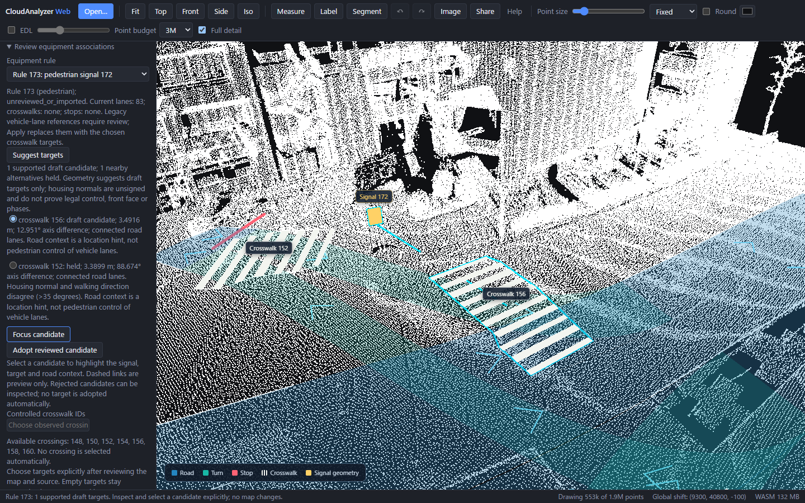
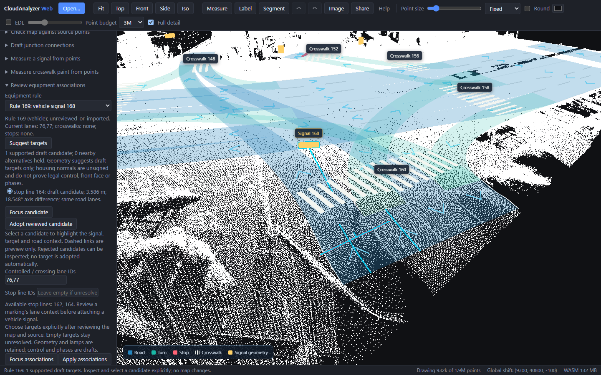

# Suggest and review signal targets

In the Web **Review equipment associations** panel, choose an existing vehicle or
pedestrian signal rule and press **Suggest targets**. The preview lists supported
draft candidates and nearby alternatives held for review. Nothing is selected or
changed automatically. Select a row to highlight the source housing, target and
vehicle road context, then inspect the original points and press **Adopt reviewed
candidate**. Held rows can be inspected but cannot be adopted. Cyan dashed links
are view-only evidence, not new map geometry.

Changed adoption adds one Undo step; repeating unchanged targets adds none.
Changing the map or selected rule clears the preview. The backend recomputes the
candidate against the complete map and rejects stale snapshots, unavailable keys
and incomplete previews before editing. JSON and Lanelet2 retain the resulting
associations. The manual [association editor](vector-map-equipment-relations.md)
remains available for unsupported cases and explicit clearing of legacy targets.



## Geometric evidence and limits

Pedestrian candidates require crossing endpoints within 8 m, housing normals
within 35 degrees of both walking edges, compatible endpoint elevation and shared
or connected road context. Existing legacy vehicle-lane references are location
hints only; adoption replaces them with controlled crosswalk IDs. A crossing's
vehicle lanes never become pedestrian control targets.

Vehicle candidates require an observed stop within 16 m, existing reviewed vehicle
lanes, compatible stop-marking lane context, matching housing-normal/road axes and
compatible elevation. The stop must be within 8 m of the road centre and within
0.75 m of its road elevation, so a nearby marking on another deck is held. The existing atomic editor also checks transverse markings
and participant/reference consistency. Road context is limited to two topology
hops. Search budgets limit targets, heads and geometry; incomplete searches offer
no adoptable partial list.

Normals are unsigned. Point-cloud housing geometry does not prove front face,
legal target or signal phases. Multiple compatible candidates remain ambiguous;
the user chooses explicitly. A missing candidate leaves the rule unresolved.
These fixed geometric gates were exercised on a development scene, not a held-out
semantic accuracy benchmark.



## Native, CLI and MCP

```powershell
# Read-only, without point-cloud copies or an output directory.
ca vectormap-suggest existing.json --rule 173
# Copy the key and snapshot from the CURRENT preview after inspection.
ca vectormap-suggest existing.json --rule 173 --candidate crosswalk:156 --snapshot CURRENT_SNAPSHOT --out reviewed
```

Python/MCP expose `propose_vector_map_relations(vector_map, rule_id)`. Adoption
requires `candidate_key`, `map_snapshot` and `out_dir` together. Snapshots are opaque
edit-staleness tokens, not authenticity/file digests. They belong to the current
loaded map/runtime, and a reload requires a new preview. New output directories
receive the editable map, Lanelet2, projector metadata and review report together;
failed adoption never overwrites inputs or publishes a partial map.

## Actual generated intersection

The frozen [source-generated 59-road intersection](https://github.com/rsasaki0109/CloudAnalyzer/pull/198)
produces a vehicle draft target from head 168 to stop 164 (3.59 m, 18.55 degree axis
difference), and a pedestrian draft from head 172 to crossing 156 (3.49 m, worst
edge-axis difference 12.95 degrees). Crossing 152 is slightly closer (3.39 m) but
held because its axis differs by 88.67 degrees. Two other signals remain unresolved.
Clearing the unsupported legacy pedestrian assignment is a separate explicit edit.

The source returns, physical geometry and unresolved road gaps remain unchanged.
Full-source quality still checks 6,752 samples with no source-review lanes; this
shared gate is not independent accuracy. The 34.3 m deferred road extent and all
18 remaining UI warnings are retained. Local-coordinate export still reports
missing geographic reference metadata.

The [recorded previews and browser verification](../benchmarks/vector-map/hard-intersection/relation-proposals/)
use no teacher geometry or control relationships. Reproduce them with the cached
original source and frozen generated map:

```powershell
python scripts/preview_vector_map_relations.py --out notes/new-proposal-review
```

The optional production-browser proof is
`web/media/vector-map-relation-proposals.spec.ts`, using `VECTOR_MAP_RELATIONS_SOURCE`,
`VECTOR_MAP_RELATIONS_INPUT`, `VECTOR_MAP_RELATIONS_PROOF` (helper output) and
`PW_PORT=4174`. It verifies read-only previews, explicit selection, held nearest
crossing, exact native/browser Lanelet2, all-edit Undo, full-source quality and
reload of target IDs/warnings.

Original source: DynamicMapPlatform Co., Ltd. (2026),
[hard-intersection sample](https://huggingface.co/datasets/dynamic-maps/hard-intersection-multimodal-sample/tree/e8e8d2a5d49a8b9cb63b5b5ecef9b260ff48f39c),
CC BY 4.0. Earlier source preparation thinned/cleared attributes; this review stage
changes only explicitly adopted draft relationships. Source and control choices
remain development evidence, with no legal or phase inference.
