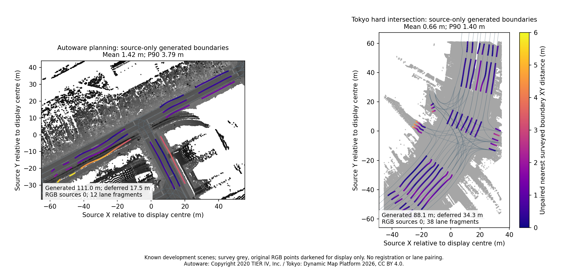

# RGB boundary observation experiment

This experiment adds opt-in longitudinal white-paint observations to road drafting.
**It does not improve the two existing real-scene maps.** All regenerated map JSON
and OSM files are byte-identical between the prior and RGB modes. Keep this work
as a draft until useful real-scene observations and accuracy improvements are demonstrated.



The coloured lines are generated boundaries; grey lines are surveyed comparison
geometry opened after generation was frozen. Points retain their original source
coordinates and RGB; colours are darkened only for this display. Junction/equipment
geometry is not generated or transferred in this road-only comparison.

| Known development scene | Generated / deferred path | Lane fragments | Mean / P90 / maximum XY distance | Within 0.5 m | Retained RGB vertices |
|---|---:|---:|---:|---:|---:|
| Autoware planning, 1,757,841 points | 111.01 / 17.50 m | 12 | 1.418 / 3.793 / 5.802 m | 35.6% | 0 |
| Tokyo hard intersection, 1,883,866 retained original points | 88.08 / 34.26 m | 38 | 0.660 / 1.400 / 5.064 m | 54.5% | 0 |

These values are the same in both modes. They measure generated samples to the
nearest sampled surveyed **driving boundary**, without registration or lane pairing.
They are not a survey accuracy certification, precision/recall or full-map completeness.
Nearby unrelated boundaries can lower this distance. Samples are spaced at most
0.5 m; reference discretization also affects the values. Path length measures
operator/recorded routes, not total boundary length. Lane fragments do not imply
that the number of lanes was detected. Lane counts, directions, width priors and
traces remain explicit inputs.

Both modes have zero source-support flags: planning checks 1,398 centre/edge samples
and Tokyo 3,154. This is the generation gate evaluated again, not independent
accuracy. The figure exposes metres of boundary displacement even where point
support passes. The 38-fragment Tokyo result excludes the 21 reviewed connectors
and all equipment in the 59-road media map; their quality totals are different.

A read-only RGB audit of the original prepared Tokyo source found exactly one
colour triplet: `[65535, 65535, 65535]` for every retained point. That retained RGB
has no paint contrast; geometry and existing intensity remain separate inputs.
No colour was synthesized to make this experiment succeed. Planning contains
contrast, but its candidates do not survive the stated continuity/support stages.

## Observation and rejection

`observe_rgb_boundaries` defaults to false. RGB candidates use the minimum colour
channel, requiring local P10-to-P99.5 contrast of at least 40/255. A white band must
be at most 0.6 m wide, with supported ground and dark flanks in every quarter of
the longitudinal slice. Each quarter needs actual observations; an empty flank is
not treated as darkness. This can miss short/dashed marks and sparse/occluded paint.
Brightness and these heuristic gates do not establish a legal lane boundary.

Existing continuity tracking decides whether candidates are retained. A candidate
rejected there cannot pre-shift inferred width anchors. `rgb_paint_vertices` counts
retained source vertices separately from intensity, before geometric fitting.
Fitting can move a selected source by at most 0.5 m; fitted positions are inferred.
The source-footprint mode can discard further unsupported candidates and intervals.

Controlled synthetic white-line tests demonstrate that the optional observation
can move an inferred internal line toward the observed stripe. Negative tests
cover transverse bars, repeated crossing stripes, broad bright surfaces, saturated
colour, weak contrast, missing flanks and isolated candidates rejected by tracking.
Invalid RGB lengths fail atomically. These controlled cases are not real-scene
accuracy evidence. Native Python and actual browser tests exercise the option,
export and Undo.

## Frozen generation and reproduction

[Published artifacts](../benchmarks/vector-map/rgb-boundaries/README.md) include
both complete generation passes, all source audits, final editable IR/OSM, small
trajectory inputs and SHA-256 manifests. Every generated artifact is hashed before
the reference map is opened. The source clouds and full surveyed maps are not copied
into the repository. References never become generation inputs, inferred controls
or curve-fitting targets.

Run from the repository root with the updated native core and existing cached data:

```sh
python scripts/vector_map_boundary_evaluate.py demo_data/autoware/sample-map-planning/pointcloud_map.pcd benchmarks/vector-map/rgb-boundaries/planning-inputs.json demo_data/autoware/sample-map-planning/lanelet2_map.osm notes/new-rgb-planning --source-commit YOUR_RUNTIME_COMMIT
python scripts/vector_map_boundary_evaluate.py notes/hard-intersection-prepared-v2/geometry.las benchmarks/vector-map/rgb-boundaries/tokyo-inputs.json demo_data/hard-intersection/maps/lanelet2/jp_tokyo_takanawadai.osm notes/new-rgb-tokyo --source-commit YOUR_RUNTIME_COMMIT --reference-epsg EPSG:6677
```

Use new output directories. Configurations embed the small original CSV traces;
both modes use identical traces and options except the RGB flag. Source-footprint
mode is enabled in both. Tokyo references are transformed from longitude/latitude
to source EPSG:6677, retaining elevations; no fitted registration is performed.

The runtime commit is `e8a2697256a1e698abf4ec64846669c70416d11f`.
See `verification.json` for native/WASM/artifact hashes and browser evidence.
Web's **Use RGB white paint for boundaries**, CLI `--observe-rgb-boundaries` and
Python/MCP `observe_rgb_boundaries=True` expose the same opt-in option.

Autoware sample map: Copyright 2020 TIER IV, Inc.; source and acquisition context
in the [official planning guide](https://docs.autoware.org/main/demos/planning-sim/).
Tokyo: DynamicMapPlatform Co., Ltd. (2026),
[pinned hard-intersection sample](https://huggingface.co/datasets/dynamic-maps/hard-intersection-multimodal-sample/tree/e8e8d2a5d49a8b9cb63b5b5ecef9b260ff48f39c),
[CC BY 4.0](https://creativecommons.org/licenses/by/4.0/).
Point retention, label clearing and source-height treatment follow the
[existing preparation protocol](vector-map-source-footprint.md).

The next geometry investigation needs better source observations or explicit
review of trace placement and lane priors, with correspondence-aware evaluation.
Loosening the gates merely to improve a nearest-boundary number would not establish
accurate lane geometry. Signal detection coverage remains separate follow-on work.
