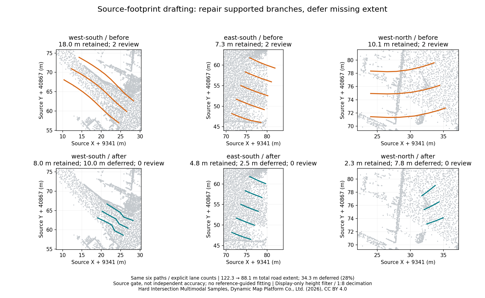

# Road drafting with source-footprint checks

`--fit-source-surface` is an opt-in road generation mode. It repairs inferred
widths and heights where the original points support a narrower low surface, and
defers missing or occluded intervals. Existing generation remains the default.
Lane counts, directions, speed limits and the width prior are operator inputs.



These are actual regenerated boundary curves, not a schematic or reference-map
repair. Both rows use the same paths and points. The display alone filters heights
below 32 m and decimates 1:8; generation and audits use all 1,883,866 prepared points.
The missing geometry in the second row is intentional and counted below.

## Fixed-input development comparison

The six paths are exactly those used in the
[published complex-intersection workflow](vector-map-media.md): three recorded
arterial clips and three explicitly operator-traced branches. Both runs retain
the same lane counts, nominal 3.5 m width, default repeated-pass matching and zero
piece length. No reference geometry, correspondence, alignment or teacher labels
enter generation. The existing prepared source is reused without new downloads.

| Road stretches | Default generated length | New retained length | Deferred length | Source-review lanes, before → after |
| --- | ---: | ---: | ---: | ---: |
| Arterial south | 44.839 m | 34.839 m | 10.000 m | 3 → 0 |
| Arterial middle | 10.605 m | 10.605 m | 0 m | 0 → 0 |
| Arterial north | 31.525 m | 27.526 m | 4.000 m | 0 → 0 |
| West south | 18.000 m | 8.000 m | 10.000 m | 2 → 0 |
| East south | 7.282 m | 4.783 m | 2.499 m | 2 → 0 |
| West north | 10.086 m | 2.326 m | 7.760 m | 2 → 0 |
| **Total** | **122.337 m** | **88.078 m** | **34.259 m (28%)** | **9 → 0** |

Lengths describe road stretches, not lane-kilometres. Gaps split lanes: the
cumulative road-only map changes from 26 lanes to **38 lane fragments**, not 38
independently inferred traffic lanes. Independent per-path builds produce 42
fragments; repeated-pass matching in the actual cumulative workflow accounts for
the difference. The before map reproduces the frozen 26-road IR exactly.

The western branches needed footprint fitting: retained per-lane widths are
1.90–2.38 m in west south and 2.12–2.54 m in west north. These are geometric
estimates, not confirmation that those widths are suitable traffic lanes.
The arterial and east-south candidates keep their original supported geometry,
including existing widths that can exceed the nominal prior. Unsupported ends
and gaps are removed rather than moving good curves across the raised median.

The source audit uses the
[same 0.5 m / 0.75 m / 0.3 m protocol](vector-map-quality.md#source-coverage-in-the-app):
the default map has nine review lanes across 3,890 samples; the new map has zero
across 3,154 samples. Neither run omits lanes or exceeds the audit budget, and both
have zero structural validation errors. **Zero flags is partly the result of
deleting unsupported extent, and is not an independent accuracy score.** The
generation gate and audit share ground evidence. Survey accuracy, lane semantics,
road interiors, parking versus road, multilevel surfaces and lawful turns remain
unverified. Sparse returns can cause excessive deferral.

The new [editable road draft](../benchmarks/vector-map/hard-intersection/source-footprint/after-road-5.json)
and [Lanelet2 OSM](../benchmarks/vector-map/hard-intersection/source-footprint/after-road-5.osm)
are a separate, partial result. They do not replace the published 49-lane map:
its 23 reviewed junction connections, 13 equipment additions and associations
have not been transferred to these new road IDs. The original GIF, frozen map,
reference-based evaluations and fixed 28-tile equipment baseline remain unchanged.
Full maps still need review and supported connectors/equipment associations.
The [projector metadata](../benchmarks/vector-map/hard-intersection/source-footprint/after-projector-info.yaml)
uses Autoware Local; save it as `map_projector_info.yaml` beside a renamed
`lanelet2_map.osm` when using this draft outside the editor. Input source
coordinates are EPSG:6677 with the supplied orthometric heights; this workflow
does not add a geodetic transformation or vertical-datum correction.

## How the mode works

1. Generate ordinary candidates. If at least 60% of their total road-stretch
   length has source-backed lane centres and boundaries, preserve the candidate
   geometry and clip or split unsupported intervals.
2. Otherwise fit the configured lane count inside a nearby coherent low-surface
   band. Cross-section bins require at least three returns and use their 20th
   percentile height. Adjacent bin heights must differ by at most
   `min(curb_height, 0.08 m)`. Choose the lowest sufficiently wide band within
   half a configured lane width of the path. This is a heuristic, not semantic
   road or ground-layer classification.
3. Infer each lane width between 1.5 m and the configured prior, limiting width
   change to 0.15 m per metre along the path. Fit XY with the existing bounded
   fitter; reject a fit that violates those widths. Height comes from low-surface
   returns, not the sensor pose or tall objects beside the path.
4. Require ground support at centres and shared boundaries along every interval
   at no more than 0.5 m spacing, including endpoints. Split gaps and defer
   fragments shorter than 2 m. If nothing remains, fail before modifying an
   existing map. No ground or continuation is invented.

Coverage limits retain `support_edge` labels; inferred interior boundaries retain
`width_prior` labels. A coverage edge can be occlusion rather than a curb. The
`surface_fit` report exposes candidate preservation, evaluated path length,
rejected intervals, short fragments, deferred length and retained width range.
Width caps apply to footprint fitting, not the preserved-candidate branch.
`--existing-map` continues to retain existing geometry and rules; the option only
affects incoming road candidates and does not refit existing maps automatically.

## Additional cached development scenes

These reuse existing project inputs, so they are not held-out generalization
tests. Both modes use one forward and one backward lane, 3.5 m prior and 50 m piece
length; PandaSet uses right-hand traffic, Autoware left-hand traffic. Only XYZ and
available intensity are used; neither reference map is read.

| Scene | Default length | New retained length | Evaluated path | Deferred length | Source-review lanes | Lane fragments |
| --- | ---: | ---: | ---: | ---: | ---: | ---: |
| PandaSet 019 | 87.199 m | 68.800 m | 87.199 m | 18.400 m (21%) | 1 → 0 | 4 → 10 |
| Autoware sample rosbag | 122.134 m | 41.258 m | 126.134 m | 84.876 m (67%) | 6 → 0 | 6 → 8 |

Autoware's default run already excluded 4 m: the new deferred distance is measured
against the evaluated, resampled path, so it is larger than the before/after length
loss. Both final audits have zero omissions, malformed lanes or budget limitations.
These substantial coverage losses are a reason to keep the mode opt-in.
Source hashes, explicit options and reports are saved in
[PandaSet](../benchmarks/vector-map/source-footprint-pandaset-development.json) and
[Autoware](../benchmarks/vector-map/source-footprint-autoware-development.json) artifacts.

## Reproduction and actual UI verification

Use a native core containing source commit
`fd6b1e15b55ac4a2240eed1ca1302535474e11f3` or later. The local release native binary
used for these measurements has SHA256
`ab05393836f49c3d9f55dbf9351162734de41a55c92bf785f5344ed3b0f3a818`.
[The comparison](../benchmarks/vector-map/hard-intersection/source-footprint/comparison.json)
records source, trajectory, generated-map and binary hashes. The supplied
`--source-commit` is operator-declared build provenance; it is not inferred from
the installed binary. Use the same source tree when rebuilding native and WASM.

After the [source preparation and frozen native workflow](vector-map-media.md#source-only-hard-intersection):

```sh
python scripts/vector_map_surface_evaluate.py frozen \
  prepared-source frozen-proof results/source-footprint --source-commit BUILD_COMMIT
python scripts/plot_vector_map_surface.py prepared-source/geometry.las \
  results/source-footprint docs/images/vector-map-source-footprint.png

python scripts/vector_map_surface_evaluate.py scene map.pcd trajectory.csv \
  results/pandaset-footprint --name pandaset --right-hand --source-commit BUILD_COMMIT
python scripts/vector_map_surface_evaluate.py scene pointcloud_map.pcd trajectory.csv \
  results/autoware-footprint --name autoware --source-commit BUILD_COMMIT
```

Each output directory must be new. The evaluator generates both modes before
opening the frozen road IR for a regression-identity check; that IR is never
passed to the fitter. Entirely deferred cases are explicitly reported without
inventing an output map or measured evaluated length.

```sh
cd web
npm run wasm
npm run build
PW_PORT=4174 npx playwright test --grep 'vector map' --workers=1
VECTOR_MAP_SURFACE_SOURCE=/path/to/geometry.las \
VECTOR_MAP_SURFACE_PROOF=/path/to/frozen-proof \
VECTOR_MAP_SURFACE_EVALUATION=/path/to/results/source-footprint \
PW_PORT=4174 npx playwright test --config playwright.media.config.ts vector-map-surface.spec.ts
```

The optional real-source test loads the original cloud and west-south CSV into
the production app, builds both modes, compares every exported boundary XYZ
coordinate with native generation, checks the same source-review counts, verifies
audits leave exports unchanged and undoes each generation to an empty map. It
does not open the expected vector map as an input. Screenshots and verification
JSON stay in ignored `web/media-frames/vector-map-surface/`.
The actual local run passed: before and after exported coordinates both matched
native with zero maximum coordinate difference; review counts changed from two
to zero and both Undo operations restored the empty map. All 12 vector-map Web
tests also passed, alongside 55 core vector-map tests, eight WASM session tests,
19 native vector-map tests, 18 offline data/audit tests and three MCP tests.

Hard Intersection Multimodal Samples: Dynamic Map Platform Co., Ltd. (2026),
[pinned source](https://huggingface.co/datasets/dynamic-maps/hard-intersection-multimodal-sample/tree/e8e8d2a5d49a8b9cb63b5b5ecef9b260ff48f39c),
[CC BY 4.0](https://creativecommons.org/licenses/by/4.0/).
CloudAnalyzer adds generated curves, filtering and comparison plots; no survey
authorship or endorsement is claimed. See [image attribution](images/ATTRIBUTION.md).
