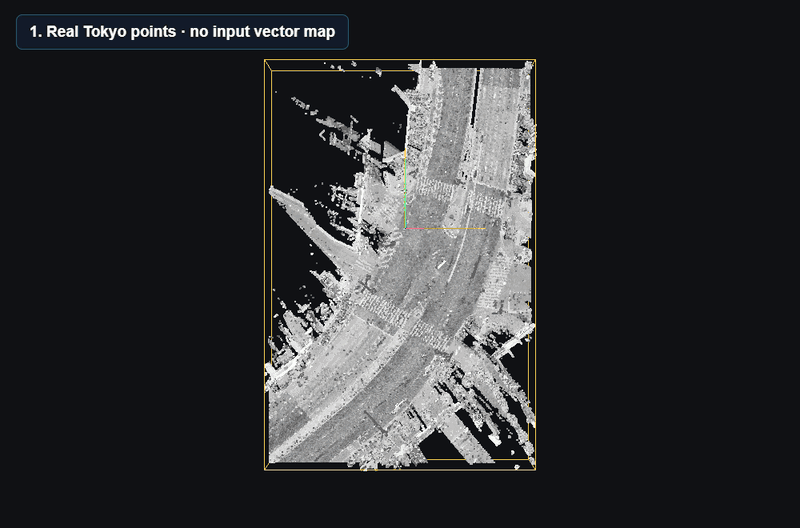

# A source-supported intersection draft

This comparison regenerates the roads, junctions and equipment from the same
1,883,866 original retained Tokyo points. It starts without an input vector map.
The generated draft contains **38 approach fragments, 21 reviewed connections,
seven paint crossings, two transverse stop-marking drafts and four signal housings**.
The [editable result and native proof](../benchmarks/vector-map/hard-intersection/supported-intersection/README.md)
retain missing road extent and connectivity warnings.



## What changed

| Same source and six paths | Default drafting | Source-footprint drafting |
| --- | ---: | ---: |
| Approach lane records | 26 | 38 fragments |
| Lanes needing source review | 9 | 0 |
| Audit samples | 3,890 | 3,154 |
| Generated path extent | 122.337 m | 88.078 m |
| Deferred path extent | — | 34.259 m (28%) |

The extra records are fragments separated by unsupported intervals, not inferred
extra lanes. Extent measures input-road stretches, not summed lane kilometres.
The [road comparison](vector-map-source-footprint.md) explains preserved arterial
geometry, narrower weak branch drafts and deferred intervals. Those roads are
retained exactly when connections and equipment are added.

The new opt-in [junction boundary check](commands/vectormap-connect.md) tests
the centre and both boundaries, including endpoints, at intervals of at most
0.5 m. This capture requires 100% support on all three curves. Each sample needs
at least three returns within 0.75 m and a 15th-percentile ground height within
0.3 m. With a 50 m connection limit, the legacy 90%-centre preview has 141
candidates; the strict preview has 115. Of the excluded 26, 22 have boundary
support gaps and four have only centre support gaps.

The operator selects 21 connections between different input paths. Connections
within one split path are excluded even if another curve could bridge its
deferred interval. Two requested branch-to-south connections also lack sufficient
support and remain deferred. Selected connections establish geometry, not
permission to turn. The final 59 driving-lane records have zero source-review
flags across 6,752 samples, no omitted/malformed lanes and no audit-budget limit.
The road graph has zero structural errors and **15 connectivity warnings**:
two disconnected components and 13 isolated lane records. Equipment review later
adds the unresolved pedestrian rule warning. Missing intervals are not filled to
remove these warnings.

The app initially reports **19 warnings**, including four unresolved signal rules.
After explicit target review it reports **18 warnings**: the same 15 connectivity
warnings, one orphan pedestrian rule and two unresolved control/stop warnings.
The source's Local export separately reports missing geographic reference
metadata. Two informational notices describe stop-marking drafts as road_marking
rules. The final capture verifies identical target IDs and warning messages
through reload.

## Equipment is reviewed against the new lane IDs

Whole-ground search detects 328 proposals and shows 145: the preview is capped
at 64 per evidence type. It scans 148 windows with one unsupported window; the
four paint-refinement windows are supported. This is partial equipment discovery,
not a complete inventory or an accuracy score.

Seven observed paint outlines retain measured stripe bands and opposing edges,
including partial footprints. Their lane associations were reviewed against
the new road and connector footprints; some overlaps are partial edge overlaps.
Two transverse branch markings replace doubtful longitudinal bars. Four elevated
housing candidates are explicitly identified as two vehicle and two pedestrian
types. Types and controlled lanes are operator choices. No signal lamp, state,
priority or permitted turn is inferred. Geometric target suggestions are reviewed
explicitly after generation: vehicle rule 169 adopts stop 164 on lanes 76/77, and
pedestrian rule 173 adopts crossing 156. The slightly closer crossing 152 is held
for an incompatible walking axis. Two signals remain unresolved, with legacy
pedestrian rule 171 explicitly cleared. Unsigned housing normals do not prove
front face or legal control. See [target evidence and limits](vector-map-relation-proposals.md).
The [operator manifest](../web/media/vector-map-supported-intersection-inputs.json)
records selected/deferred connections, discarded proposals, type/lane confirmations,
explicit target adoptions and the unresolved-rule edit.
The older 49-lane map's equipment rules are not copied into this result.

## What the actual UI capture checks

The production app loads the original retained points and frozen source CSVs,
builds the default six paths, checks their source coverage, then undoes all six
builds to an empty map. It repeats generation with source-footprint fitting,
reviews strict junction proposals and confirms the 13 equipment objects. It then
previews signal targets without selecting any automatically, inspects the held
nearest crossing and explicitly adopts two geometric drafts.
Native/Web comparison checks all generated boundary, marking, housing and
crosswalk-edge coordinates, allowing whole-way reversal. Regulatory lane
associations and controlled crosswalk targets must match the newly generated native
map both before and after Lanelet2 reload.

The capture edits a housing vertex by 0.08 m, undoes to the byte-identical map,
undoes all three association edits to the exact generated map and all 13 equipment
additions to the exact road-only result, then opens its own exported Lanelet2 file. Read-only source audits and display operations also
leave exports unchanged. The compact [capture verification](vector-map-supported-intersection-media.json)
records actual errors, hashes and checks. Captions, screenshot crop/scale and GIF
palette conversion are the only changes to the real screen frames.

The captured default and fitted road coordinates match native generation exactly;
the final map's maximum coordinate difference is 7.28 × 10⁻¹² m. The GIF is
800 × 528 pixels, 37.44 seconds and 2,213,661 bytes, with 18 encoded frames
from 17 actual screen captures. The final repeat is created by the concat/GIF
conversion. These checks establish consistency, not independent map accuracy.

All generation, discovery and source audits use the full retained source.
Clipping at approximately 35.53 m Z only changes the display. After generation,
the app makes a working-cloud crop in browser memory to remove the clipping-box
wire; it does not write another point cloud to disk or change map geometry.
Local projector export preserves EPSG:6677 metre coordinates in local_x/local_y
and the source's orthometric Z, without fitted alignment or a vertical-datum change.

Zero coverage flags partly result from deferring 28% of the input extent and
using a shared support gate. They do not independently establish survey accuracy,
full-width road clearance, semantic correctness or lawful traffic rules. This
scene informed development; it is not a held-out performance test. Previous
[fixed equipment evaluations](vector-map-hard-intersection.md) and the
[old generated-map quality audit](vector-map-quality.md) remain unchanged.

## Reproduce without duplicating the cloud

Use the existing prepared source and original frozen CSV proof in place; see
[preparation and licensing](vector-map-hard-intersection.md). Build the native
core and production WASM from the same checkout. The captured runtime is
`a4aa3d7c97e6bada6277289a2a096dabfe14d8c4`, reflected on main by
[PR #200](https://github.com/rsasaki0109/CloudAnalyzer/pull/200).
The supplied commit is a declaration, not embedded binary attestation;
the proof separately hashes the installed native module, source and outputs.

```powershell
python scripts/prepare_supported_intersection_media.py notes/hard-intersection-prepared-v2 notes/hard-intersection-media-proof-final notes/supported-intersection-new-proof --source-commit (git rev-parse HEAD)
cd web
npm run wasm
npm run build
$env:VECTOR_MAP_SUPPORTED_SOURCE='../notes/hard-intersection-prepared-v2'
$env:VECTOR_MAP_SUPPORTED_PATH_PROOF='../notes/hard-intersection-media-proof-final'
$env:VECTOR_MAP_SUPPORTED_PROOF='../notes/supported-intersection-new-proof'
$env:PW_PORT='4174'
npm run media:supported-intersection
```

Choose a new native proof directory. The helper generates roads first; previous
generated maps are opened afterwards only for regression identity checks, never
as fitting inputs. It rejects changed roads or stale selections that require
fresh source review. Native Lanelet2 import and confirmation replay must reuse
all 13 objects without duplication. Signal targets are proposed against each
current generated map, then adopted only after explicit configured review. Target
adoption retains physical geometry and full-source coverage. Optional media captures skip without the
configured cached source; normal CI does not download this dataset.

Data and derived map/GIF attribution: [Hard Intersection Multimodal Samples](https://huggingface.co/datasets/dynamic-maps/hard-intersection-multimodal-sample/tree/e8e8d2a5d49a8b9cb63b5b5ecef9b260ff48f39c),
Dynamic Map Platform Co., Ltd. (2026), [CC BY 4.0](https://creativecommons.org/licenses/by/4.0/).
CloudAnalyzer adds derived geometry, operator review and screen captions; no
original survey authorship or endorsement is claimed.
